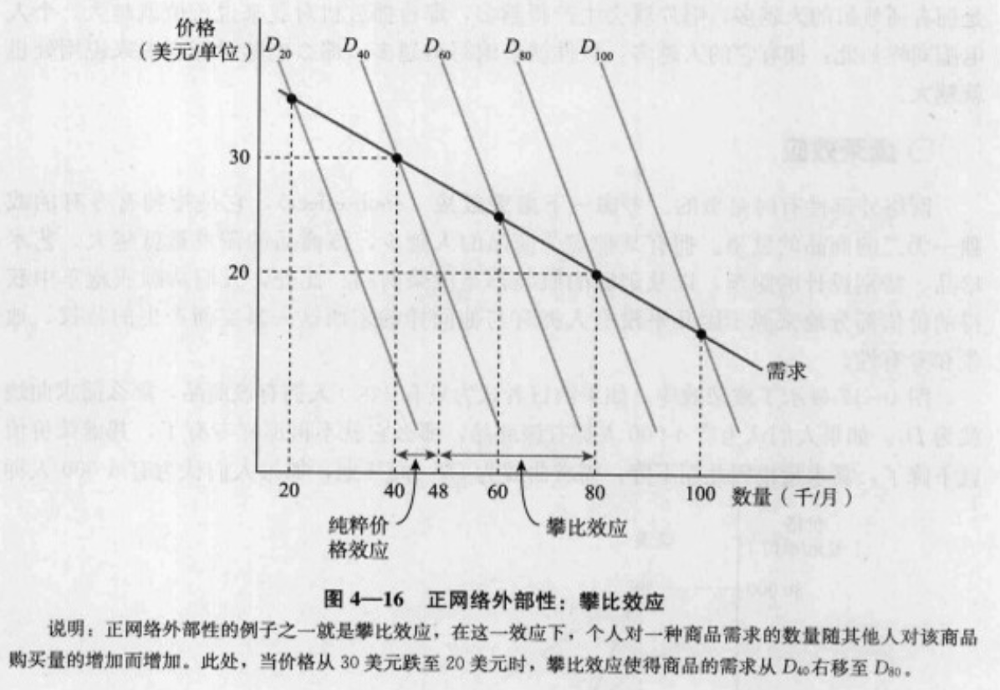
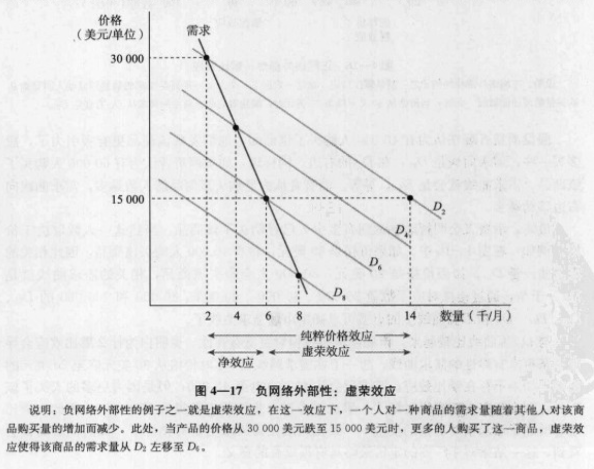

# 第 1 篇 导论：市场和价格

## 1. 绪论

微观经济学研究单个经济单位（如消费者、工人、投资者、资源所有者和厂商）的行为，以及经济个体之间相互作用形成的整体性经济单位——市场和行业。

### 微观经济学研究的主题

权衡取舍：微观经济学研究稀缺资源的配置，消费者、工人和企业所面临的权衡取舍，并解释这些取舍决策是如何做出的。

价格和市场

理论和模型

实证分析和规范分析

## 2. 供给和需求的基本原理

### 2.1 供给和需求

### 2.2 市场机制

### 2.3 市场均衡的变动

### 2.4 供给和需求的弹性

### 2.5 短期弹性和长期弹性

### 2.6 理解并预测市场状况改变所造成的结果

### 2.7 政府干预——价格控制的效应

# 第 2 篇 生产者、消费者以及竞争性市场

## 3. 消费者行为

### 3.1 消费者偏好

### 3.2 预算约束

### 3.3 消费者选择

### 3.4 显示偏好

### 3.5 边际效用与消费者选择

### 3.6 生活成本指数

## 4. 个人需求和市场需求

### 4.1 个人需求

### 4.2 收入效应和替代效应

### 4.3 市场需求

### 4.4 消费者剩余

### 4.5 网络外部性

前述的分析假设人们对于一种商品的需求是彼此独立的，这一假设使得将个人需求加总得到市场需求曲线。但对于某些商品而言，一个人的需求也取决于其他人的需求，特别是一个人对一种商品的需求受其他人已经购买的该商品数量的影响，此即网络外部性。网络外部性可以为正也可以为负。

#### 攀比效应

#### 虚荣效应

### 4.6 需求的经验估计

---

【附录】需求理论——一种数学的处理方法

1.效用最大化

拉格朗日乘数法

边际相等原则

2.边际替代率

3.收入的边际效用

4.消费理论中的对偶性

效用最大化问题也可以看成最小预算开支问题（一个选择与既定的无差异曲线相切的最低预算线）

5.收入效应和替代效应

---

## 5. 不确定性与消费者行为

### 5.1 描述风险

概率

期望值

可变性

决策

### 5.2 风险偏好

对风险的不同偏好

### 5.3 降低风险

多样化

保险

信息的价值

### 5.4 对风险资产的需求

资产

风险资产与无风险资产

资产的报酬

风险与报酬之间的权衡

投资者的选择问题

### 5.5 行为经济学

更复杂的偏好

简单法则和决策中的偏差

概率和不确定性

## 6. 生产

### 6.1 生产技术

生产函数

短期和长期

### 6.2 一种可变投入要素（劳动）的生产

平均产量和边际产量

生产曲线的斜率

劳动的平均产量曲线

劳动的边际产量曲线

边际报酬递减规律

劳动生产率

### 6.3 两种可变投入要素的生产

等产量线

投入要素的灵活性

边际报酬递减

投入要素间的替代

生产函数——两个特例

### 6.4 规模报酬

描述规模报酬

## 7. 生产成本

### 7.1 成本的测度：哪些成本重要？

经济成本和会计成本

机会成本

沉淀成本

固定成本和可变成本

固定成本和沉淀成本

边际成本和平均成本

### 7.2 短期成本

短期成本的决定因素

成本曲线的形状

### 7.3 长期成本

资本的使用者成本

成本最小化的投入选择

等成本线

选择投入要素

不同产出水平下的成本最小化

扩张路径和长期成本

### 7.4 长期和短期成本曲线

短期生产的固定性

长期平均成本

规模经济与规模不经济

短期成本与长期成本的关系

### 7.5 两种产品的生产——范围经济

产品转换曲线

范围经济和范围不经济

范围经济的程度

### 7.6 成本的动态变化——学习曲线

学习曲线的画法

学习效应与规模经济

### 7.7 估计和预测成本

成本函数和规模经济的度量

---

【附录】生产与成本理论——一种数学方法

1.成本最小化

2.边际技术替代率

3.生产和成本理论的对偶性

4.柯布-道格拉斯成本函数和生产函数

---

## 8. 利润最大化和竞争性供给

### 8.1 完全竞争市场

### 8.2 利润最大化

### 8.3 边际收益、边际成本和利润最大化

### 8.4 选择短期产量

竞争性厂商的短期利润最大化

竞争性厂商的短期利润

### 8.5 竞争性厂商的短期供给曲线

厂商对投入要素价格变动的反应

### 8.6 短期市场供给曲线

### 8.7 长期产量选择

长期利润最大化

长期竞争性均衡

### 8.8 行业的长期供给曲线

成本不变行业

成本递增的行业

成本递减的行业

税收效应

长期供给曲线

## 9. 竞争性市场分析

### 9.1 政府政策的损益评价——消费者剩余和生产者剩余

### 9.2 竞争性市场的效率

### 9.3 最低价格

### 9.4 价格支持和生产配额

### 9.5 进口配额与关税

### 9.6 征税或补贴的影响

# 第 3 篇 市场结构和竞争策略

## 10. 市场势力：垄断与买方垄断

### 10.1 垄断

平均收益和边际收益

垄断者的产量决策

定价的一个经验法则

需求的变动

税收的效果

多工厂厂商

### 10.2 垄断势力

垄断势力的测定

定价的经验法则

### 10.3 垄断势力的来源

市场需求弹性

厂商的数目

厂商间相互作用

### 10.4 垄断势力的社会成本

寻租

价格管制

自然垄断

管制的实践

### 10.5 买方垄断

买方垄断与垄断的比较

### 10.6 买方垄断势力

买方垄断势力的来源

买方垄断势力的社会成本

双边垄断

### 10.7 限制市场势力：反托拉斯法

## 11. 有市场势力的定价

### 11.1  攫取消费者剩余

### 11.2 价格歧视

一级价格歧视

二级价格歧视

三级价格歧视

### 11.3 跨期价格歧视和高峰负荷定价

跨期价格歧视

高峰负荷定价

### 11.4 两部收费制

### 11.5 捆绑销售

相对估值

混合捆绑销售

捆绑销售实践

搭售

### 11.6 广告

---

【附录】联合厂商的内部转移定价

联合厂商的内部转移定价

不存在外部市场时的转移定价

有一个竞争性外部市场时的转移定价

有非竞争性外部市场的转移定价

---

## 12. 垄断竞争和寡头垄断

### 12.1 垄断竞争

垄断竞争的产生

短期和长期均衡

垄断竞争和经济效率

### 12.2 寡头垄断

寡头垄断市场的均衡

古诺模型

线性需求曲线——一个例子

先发优势——斯塔克伯格模型

### 12.3 价格竞争

相同产品的价格竞争——伯特兰模型

差别产品的价格竞争

### 12.4 竞争和共谋：囚徒困境

### 12.5 囚徒困境对寡头定价的意义

价格刚性

价格信号和价格领导

主导厂商模型

### 12.6 卡特尔

卡特尔定价分析

## 13. 博弈论和竞争策略

### 13.1 博弈和策略性决策

非合作和合作博弈

### 13.2 占优策略

### 13.3 纳什均衡回顾

极大化极小策略

混合策略

### 13.4 重复博弈

### 13.5 序贯博弈

博弈的扩展形

先行者优势

### 13.6 威胁、承诺和可信性

空头威胁

承诺和可信性

讨价还价策略

### 13.7 对进入的阻止

策略性贸易政策和国际竞争

### 13.8 拍卖

拍卖形式

估价和信息

私人价值拍卖

共同价值拍卖

最大化拍卖收入

竞标与共谋

## 14. 投入要素市场

### 14.1 竞争性要素市场

只有一种投入可变时对投入要素的需求

几种投入要素可变时对一种投入要素的需求

市场需求曲线

对厂商投入要素供给

投入要素的市场供给

### 14.2 竞争性要素市场的均衡

经济租

### 14.3 买方垄断势力的要素市场

买方垄断势力：边际支出和平均支出

有买方垄断势力时的购买决策

讨价还价能力

### 14.4 有垄断势力时的要素市场

工资率的垄断势力

工会化与非工会化

## 15. 投资、时间及资本市场

### 15.1 存量与流量

### 15.2 贴现值

### 15.3 债券的价值

永久债券

债券的有效收益率

### 15.4 资本投资决策的净现值标准

实际贴现率与名义贴现率

### 15.5 对风险的调整

可分散风险与不可分散风险

资本市场定价模型

### 15.6 消费者的投资决策

### 15.7 人力资本投资

### 15.8 跨时的生产决策——可耗竭资源

### 15.9 利率是如何决定的

# 第 4 篇 信息、市场失灵以及政府的角色

## 16. 一般均衡与经济效率

### 16.1 一般均衡分析

两个相互依赖的市场——向一般均衡移动

一般均衡的实现

## 16.2 交换的效率

贸易的好处

埃奇沃斯盒形图

有效配置

契约曲线

竞争性市场中的消费者均衡

竞争性市场的经济效率

### 16.3 公平和效率

效应可能性边界

公平和完全竞争

### 16.4 生产的效率

投入效率

生产的可能性边界

产出效率

产出市场的效率

### 16.5 自由贸易的利益

比较优势

生产可能性边界的扩张

### 16.6 总结——竞争性市场的效率

### 16.7 市场为什么会失灵

市场势力

不完全信息

外部性

公共品

## 17. 信息不对称市场

### 17.1 质量不确定性和“柠檬”市场

旧车市场

不对称信息的含义

声誉和标准化的重要性

### 17.2 市场信号传递

一个劳动市场信号的简单模型

保证和保证书

### 17.3 道德风险

### 17.4 委托-代理问题

私人企业的委托—代理问题

公共企业的委托—代理问题

委托—代理框架中的激励

### 17.5 一体化企业内的管理激励

一体化企业里的不对称信息与激励设计

### 17.6 劳动市场的不对称信息：效率工资理论

## 18. 外部性与公共品

### 18.1 外部性

负外部性和无效率

正的外部性和无效率

### 18.2 纠正市场失灵的办法

排污标准

排污费

排污标准与排污费的比较

可转让排污许可证

回收

### 18.3 存量外部性

存量积累及其影响

### 18.4 外部性和产权

产权

讨价还价和经济效率

成本高昂的讨价还价——战略行为的作用

法律解决途径——对损害的起诉

### 18.5 公共资源

### 18.6 公共品

效率和公共品

公共品和市场失灵

### 18.7 对公共品的私人偏好

