# 第 1 篇 导论：市场和价格

## 1. 绪论

微观经济学研究单个经济单位（如消费者、工人、投资者、资源所有者和厂商）的行为，以及经济个体之间相互作用形成的整体性经济单位——市场和行业。

### 1.1 微观经济学研究的主题

权衡取舍：微观经济学研究稀缺资源的配置，消费者、工人和企业所面临的权衡取舍，并解释这些取舍决策是如何做出的。

价格和市场

理论和模型

实证分析和规范分析

### 1.2 什么是市场？

市场是买方和卖方的集合，通过他们实际或潜在的相互作用来决定一种或多种商品的价格。

市场界定：确定一个具体的市场应包括哪些买者、卖者以及产品范围。

竞争性与非竞争性市场

市场价格

市场界定——市场范围

市场范围：市场的边界，既包括地理的边界，又包括就产品范围而言的边界。

### 1.3 名义价格和实际价格

名义价格：未经通货膨胀调整的绝对价格。

实际价格：一种按照总体价格指标衡量的价格，经过通货膨胀调整后的价格。

消费者价格指数（CPI）：衡量总体价格水平的指标。

生产者价格指数：衡量半成品和批发品的总体价格水平的指标。

### 1.4 为什么学习微观经济学

公司决策

公共政策制定

## 2. 供给和需求的基本原理

供给和需求如何描述市场机制；供给和需求的特征，以及在不同市场中的差异；运用供给和需求曲线来理解各种现象。

### 2.1 供给和需求

供给曲线

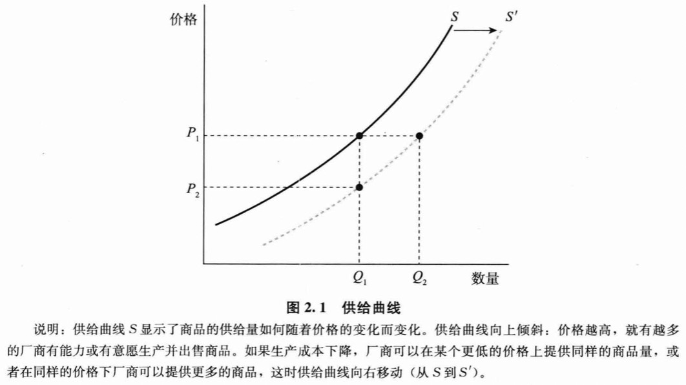

需求曲线

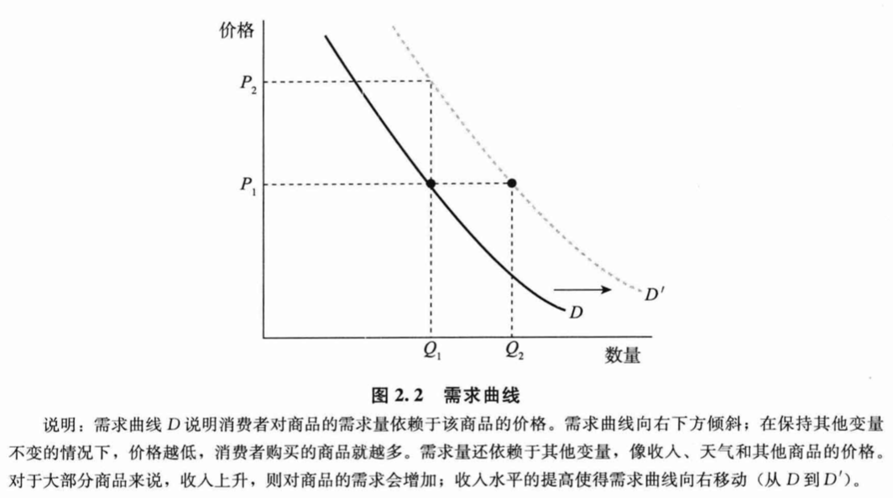

---

【问题】需求曲线如何推导出来的？

需求曲线：消费者愿意购买的商品**数量**和该商品**价格**之间的关系。

由价格-消费曲线推导（高鸿业：第三章第四节）

---

### 2.2 市场机制

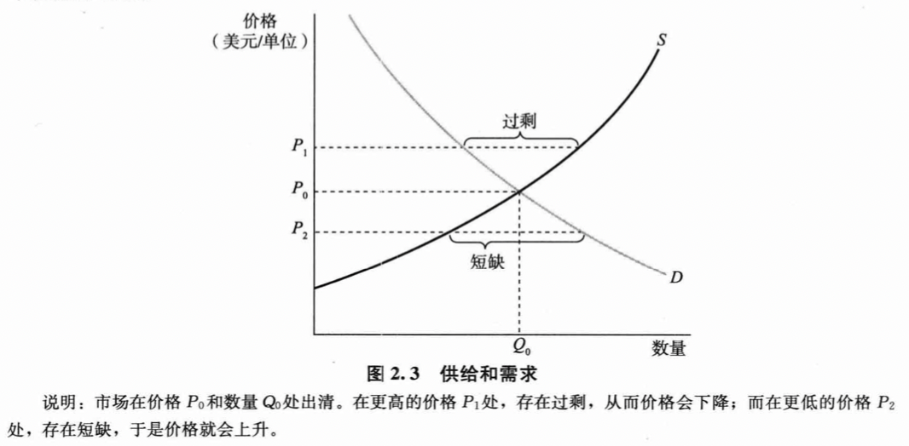

均衡或市场出清价格：供给和需求相等时的价格。

市场机制：自由市场中价格不断变动直到市场出清的趋势。

**什么情况下可以运用供给-需求模型？**

当描述供给和需求曲线时，假定了在任一给定的价格下，一个给定的商品数量被生产和出售。**这一假设在市场至少大体上是竞争的情况下才能满足。**

### 2.3 市场均衡的变动

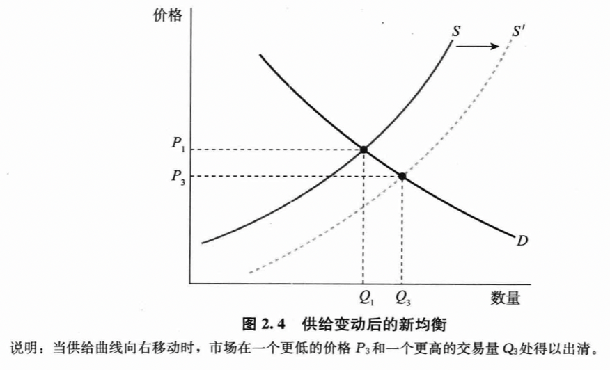

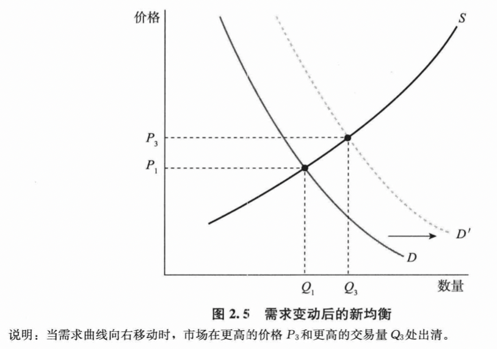

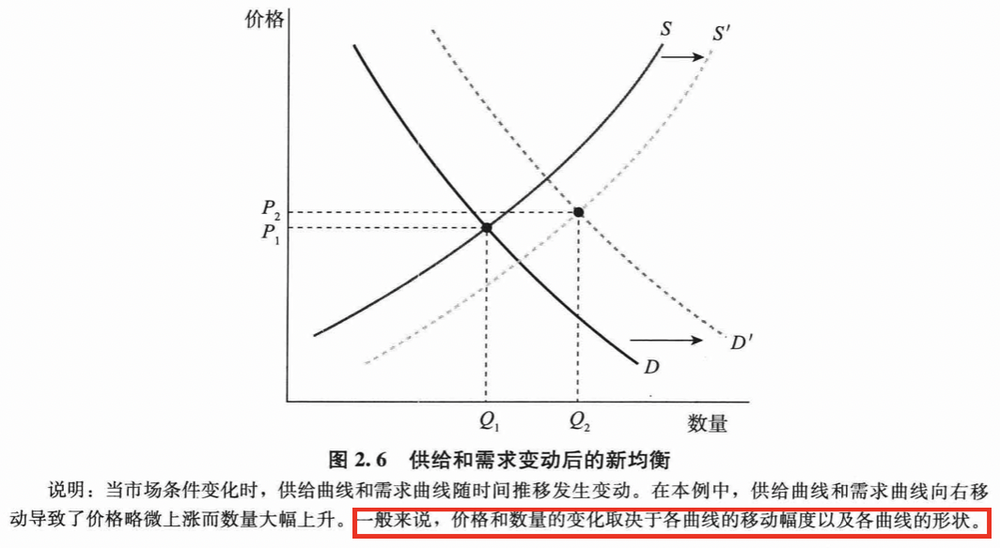

### 2.4 供给和需求的弹性

弹性：某一变量变动 1% 所引起的另一变量变动的百分比。

---

【补充】对数-水平值模型系数的解释（伍德里奇《计量经济学导论：现代观点》（第五版）P41；Angrist）

取对数后：
$$
\ln{\frac{P_i}{P_{i-1}}} = \ln{(1+\frac{P_i - P_{i-1}}{P_i})} \approx \frac{P_i - P_{i-1}}{P_i}
$$

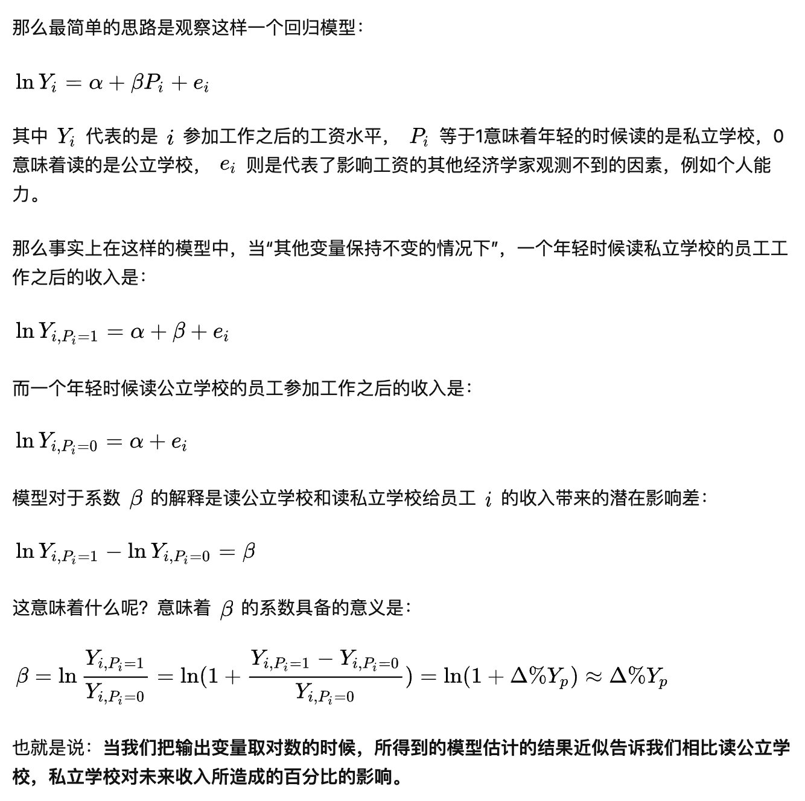

---

### 2.5 短期弹性和长期弹性

需求：需求与耐用性、收入弹性、周期性行业

周期性行业：销售量波动会放大国内生产总值（GDP）与国民收入的周期性变化的行业。

供给：供给与耐用性

### 2.6 理解并预测市场状况改变所造成的结果

> 巴西咖啡的供给减少 5% 会对世界咖啡价格造成多大影响？

### 2.7 政府干预的后果——价格控制

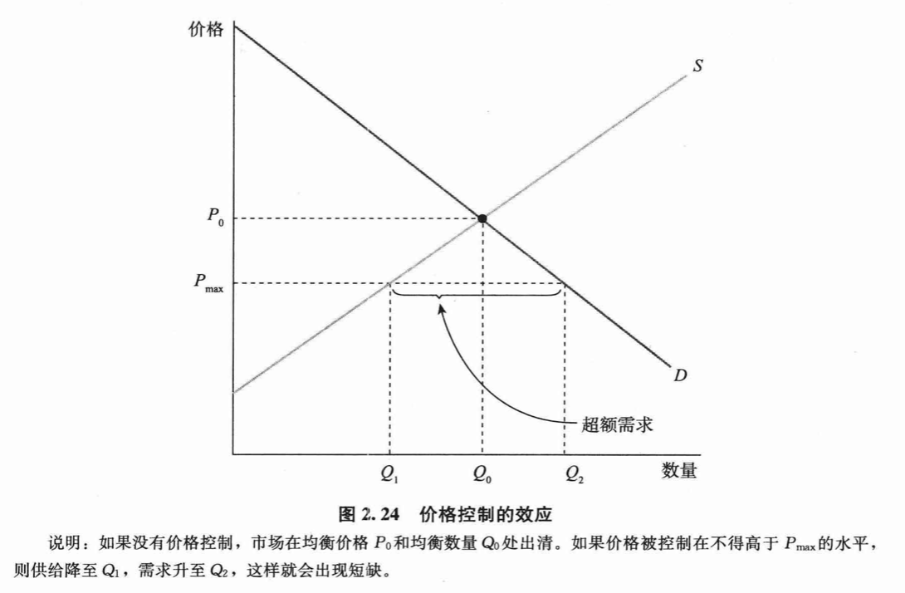

# 第 2 篇 生产者、消费者以及竞争性市场

## 3. 消费者行为

消费者行为理论：说明消费者如何在不同的商品和服务之间分配收入以最大化其效用水平的理论。

消费者行为：

- 消费者偏好
- 预算约束
- 消费者选择

### 3.1 消费者偏好

市场篮子

有关偏好的一些基本假设：完备性、传递性、越多越好

无差异曲线

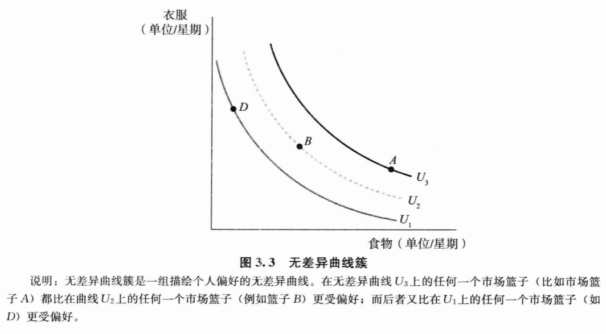

无差异曲线簇：一组描述消费者在不同商品组合之间偏好的无差异曲线的集合。

---

【补充】无差异曲线的推导

---

无差异曲线的形状

边际替代率

完全替代品和完全互补品

**效用**

### 3.2 预算约束

预算线

收入和价格变化的效应

### 3.3 消费者选择

角点解

角点解：被选择的市场篮子中某件商品的边际替代率并不等于预算线的斜率的情形。

---

【补充】最优选择不是无差异曲线和预算线相切的特殊情况

---

### 3.4 显示偏好

### 3.5 边际效用与消费者选择

### 3.6 生活成本指数

## 4. 个人需求和市场需求

### 4.1 个人需求

### 4.2 收入效应和替代效应

### 4.3 市场需求

### 4.4 消费者剩余

### 4.5 网络外部性

前述的分析假设人们对于一种商品的需求是彼此独立的，这一假设使得将个人需求加总得到市场需求曲线。但对于某些商品而言，一个人的需求也取决于其他人的需求，特别是一个人对一种商品的需求受其他人已经购买的该商品数量的影响，此即网络外部性。网络外部性可以为正也可以为负。

#### 攀比效应

#### 虚荣效应

### 4.6 需求的经验估计

---

## 【附录】需求理论——一种数学的处理方法

1.效用最大化

拉格朗日乘数法

边际相等原则

2.边际替代率

3.收入的边际效用

4.消费理论中的对偶性

效用最大化问题也可以看成最小预算开支问题（一个选择与既定的无差异曲线相切的最低预算线）

5.收入效应和替代效应

---

## 5. 不确定性与消费者行为

### 5.1 描述风险

概率

概率是某种既定结果发生的可能性。

期望值

所有可能结果相对应的加权平均值或者支付，而权数为每种结果发生的概率。
$$
E(X) = P_{r1}X_1 + P_{r2}X_2 + ... + P_{rn}X_n
$$
可变性

可变性是不确定情形下各种可能结果彼此差异的程度。

用标准差度量可变性：每个结果相对应的支付与他们的期望的离差的平方和，再甲醛平均后所得的方差的算术平方根。

决策

计算出期望和标准差之后，人们对待风险的态度会影响其决策。

### 5.2 风险偏好

对风险的不同偏好

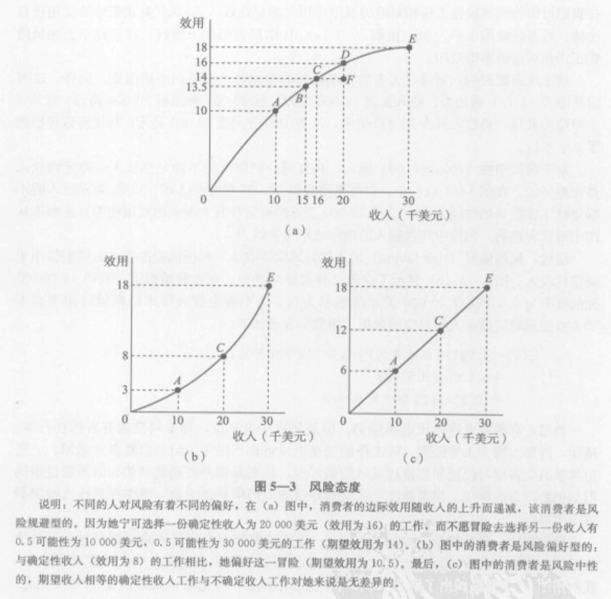

风险规避：对于给定的确定性收入和具有同一期望值的风险收入，更偏好确定性收入（他们的收入的边际效用递减）。

风险中性：具有同一期望值的不确定性收入与确定性收入是无差异的。

风险偏好：即使风险收入的期望值小于确定性收入，依旧偏好风险性收入。

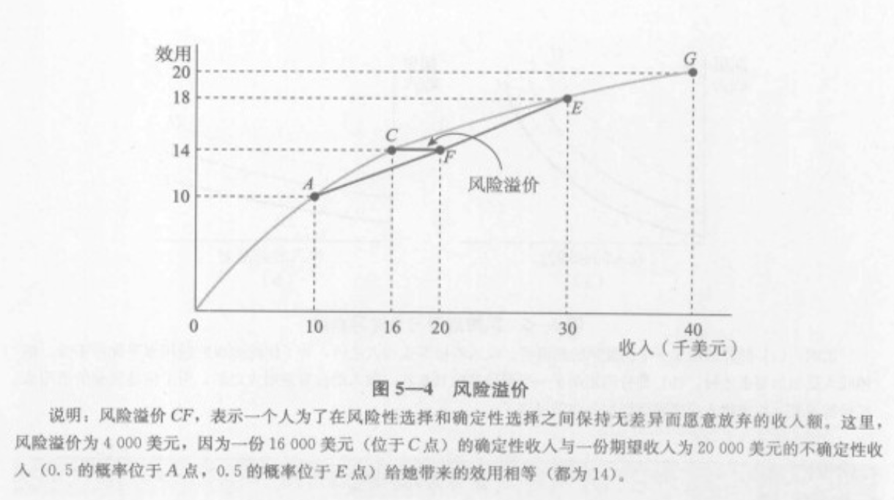

风险溢价：是风险规避者为规避风险而愿意付出的最大货币额。

风险规避与无差异曲线

### 5.3 降低风险

多样化：将资源分配在结果不是密切相关的一系列活动上。

保险

大数定律：尽管孤立的事件可能是偶发的、而且大多数是不可预计的，但许多相似事件的平均结果是可预计的。

信息的价值

完全信息的价值是完全信息时进行选择的期望收益与不完全信息时进行选择的期望收益的差额。

### 5.4 对风险资产的需求

资产：能给所有者带来收入流或服务流的东西。资产所有权带来的货币流可以分为显性和隐性两种方式。

风险资产与无风险资产

风险资产：带来的货币流至少具有一定的随机性。

无风险资产：能产生确定货币流的资产。

资产的报酬

报酬：资产带来的总货币收入（包括资本的收益和损失），与它的价值的比值。

期望报酬：资产报酬的期望值，即平均意义上的报酬。

实际报酬可能高于或低于期望报酬，不过从长期来看，平均报酬会接近于期望报酬。

风险与报酬之间的权衡

投资组合：要确定投资者在每种资产上应该投入多少钱，令 $b$ 等于其储蓄中投放在股票市场上的比例，$(1-b)$ 则为购买国库券（无风险资产）的比例。则整个投资组合的期望报酬 $R_p$ 为这两种资产期望报酬的加权平均：$R_p = bR_m + (1-b)R_f$ 。

这一投资组合报酬的标准差 $\sigma_p$ （包括一种风险资产和另一种无风险资产）等于在风险资产上的投资比例乘以该资产的标准差：$\sigma_p=b\sigma_m$ 。

投资者的选择问题
$$
R_p = R_f + b(R_m - R_f) \\
b = \frac{\sigma_p}{\sigma_m} \\
=>  R_p= R_f+ \frac{(R_m -R_f)}{\sigma_m} \sigma_p
$$

**上述等式为预算线，描述了风险（$\sigma_p$）与期望报酬（$R_p$）之间的权衡关系。**该等式表明投资组合的期望收益 $R_p$ 随着报酬的标准差 $\sigma_p$ 的增加而增加。通常也将预算线的斜率 $(R_m - R_f)/\sigma_m$ 称为风险价格，因为其表示投资者为了获得更高的报酬必须承担的额外的风险。

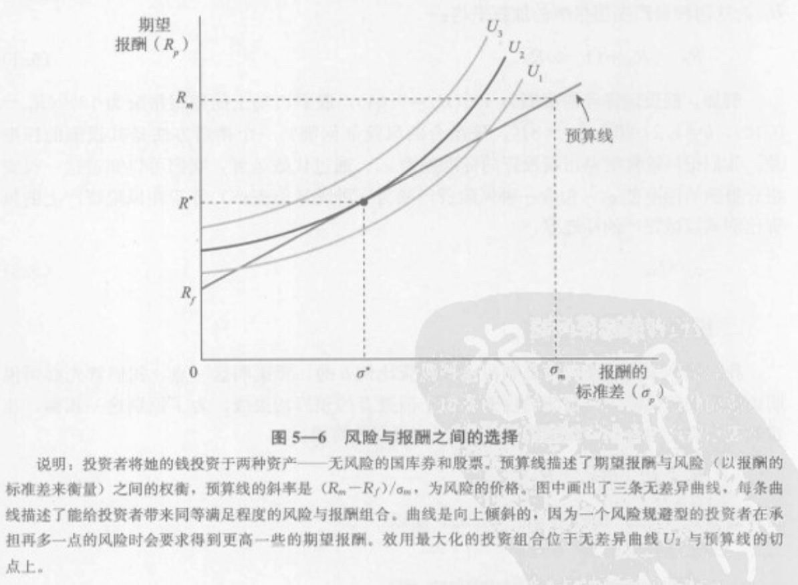

风险与无差异曲线

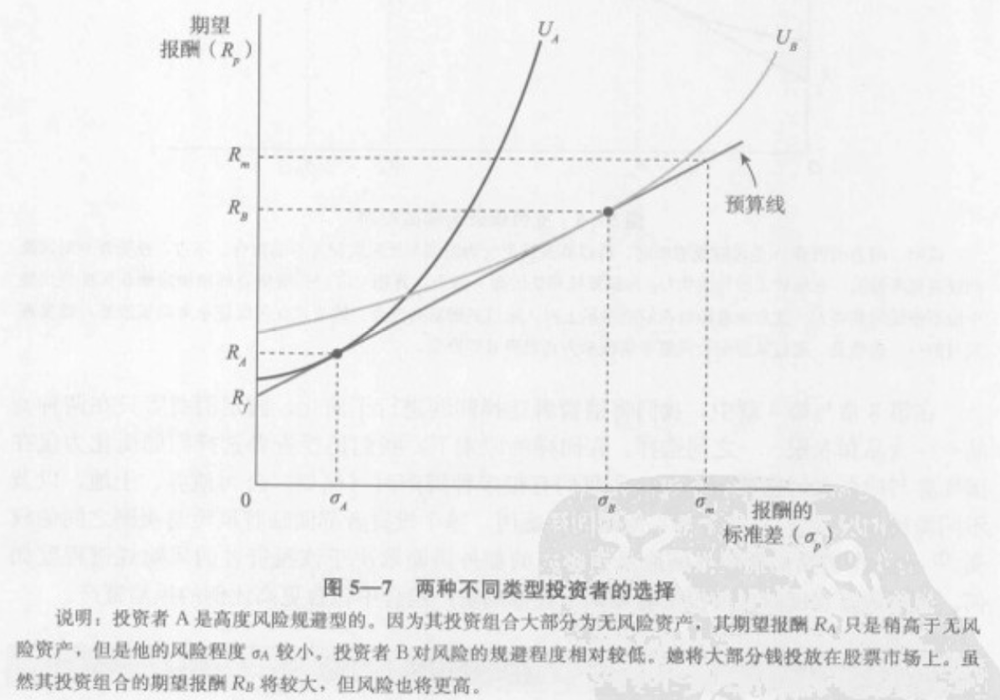

### 5.5 行为经济学

消费者需求的基本理论基于下述三个基本假定：

- 消费者对于各类商品具有确切的偏好；
- 消费者面临预算约束；
- 给定其偏好、优先收入和不同商品的价格，消费者选择购买能使其满足程度（或效用）最大化的商品组合。

但是坐地起价、打赏消费、比价忽略运输成本等是上述假定无法解释的。**需要吸收心理学和社会学的成果来完善有关消费者行为的基本假定。**

更复杂的偏好

参考点：消费者用来做决策的点。

禀赋效应：对于某样东西，人们在拥有它时常常比没有时更看重它。比如：某人为获得商品愿意支付的价格和他愿意将该商品出售给其他人价格的差额，这一差额被称为损失厌恶。

简单法则和决策中的偏差

锚定效应：一些建议的信息片段（也许是不相关的）对最终决策可能具有的效应。

概率和不确定性

不确定情形下，决策过程中的一个重要部分是计算期望效用，但这需要：每个结果的效用值，以及各个结果对应的概率，使得实际计算麻烦。

在实际中，人们有时倾向于偏信所谓的“小数定律”：当他们从过去的经验中获得有关特定事件的信息相对较少时，他们往往会夸大这些特定事件发生的概率。例如：人们常会夸大第一次坐飞机遇见空难、某次抽奖中奖的可能性。

研究发现，股票市场上投资常会被小数定律的偏差带来误导，导致“羊群效应”。

构造客观概率是件难事，在构造过程中常常存在偏误。当评估一件事件的可能性时，该评估所处的环境非常重要。比如如果某类悲剧（空难）最近时常发生，人们倾向于高估此类事件发生的可能性。

## 6. 生产

### 6.1 厂商及其生产决策

企业为什么存在？

企业提供了独立工人条件下所欠缺的至关重要的协调方法。企业消除了每个工人进行每项任务所需的协调过程，以及对任务费用的讨价还价。

生产技术

厂商运行的中心：将生产要素（生产过程中的投入品，如劳动、资本和原料）转化为产出的生产过程。

生产函数

生产函数描述的是每一特定的投入要素组合下的企业最大产出 $q$ 。假定有两种投入要素劳动 $L$ 和资本 $K$ ，生产函数可写为：
$$
q = F(K, L)
$$
短期和长期

短期：一种或多种生产要素的数量是不可变的时间段。

固定投入：不可变的生产要素。

长期：使得所有投入均可变所需的时期。

### 6.2 一种可变投入（劳动）下的生产

1.平均产量和边际产量

生产曲线的斜率

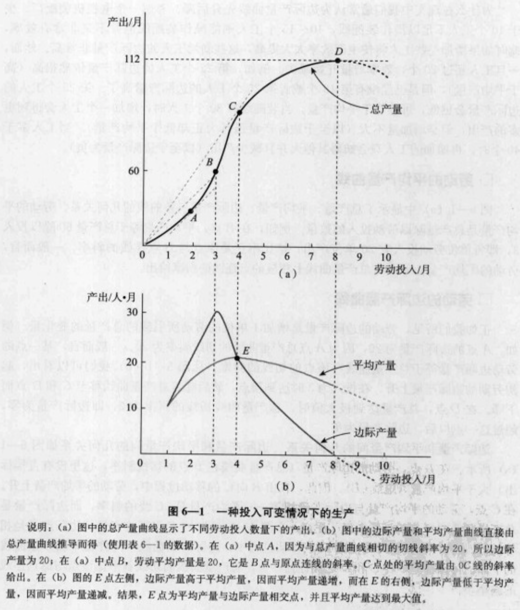

劳动的平均产量曲线

劳动的边际产量曲线

2.边际报酬递减规律

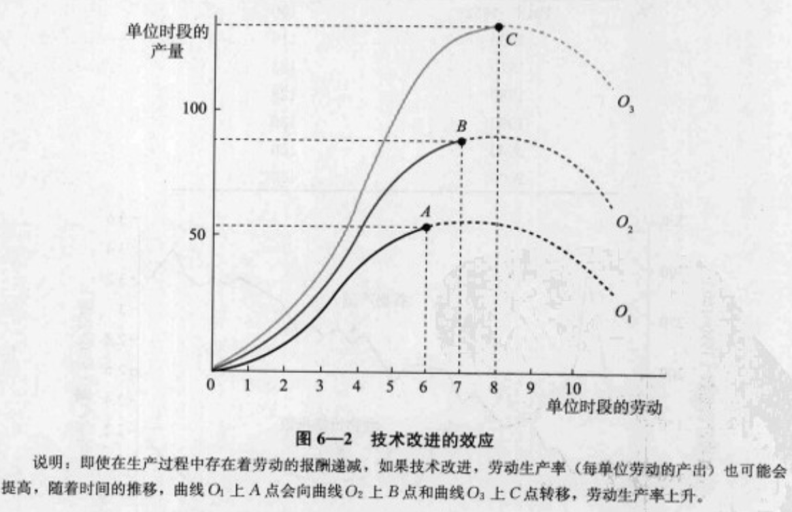

当使用的某种投入要素（其他要素固定）增加时，最终必然会出现一点，在它以后产出下降。

3.劳动生产率

劳动生产率：从某个行业或整个经济体系度量的劳动平均产量。

### 6.3 两种可变投入下的生产

1.等产量线

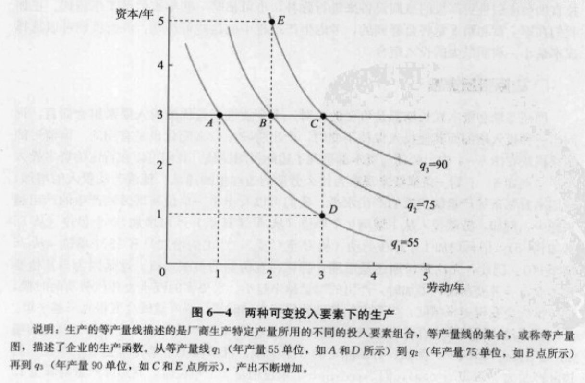

等产量线是由同一产量的所有可能的投入要素组合形成的曲线。

投入要素的灵活性

等产量线显示了企业生产决策中的灵活性：它能通过一种投入要素对另一种投入要素的替代来获得特定的产出。

2.边际报酬递减

在长期生产过程中，劳动与资本都是可变的，生产的两种要素都呈现出边际报酬递减规律。

3.投入要素间的替代
$$
MRTS = - 资本投入的变化量/劳动投入的变化量 \\
= - \Delta K / \Delta L  (q 保持不变)
$$

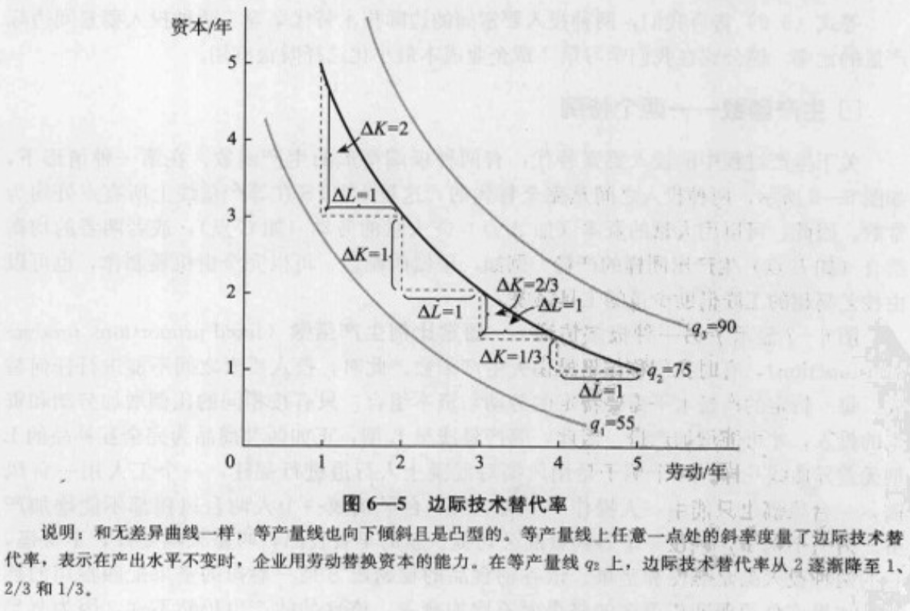

4.边际技术替代率递规律

在维持产量不变的前提下，当一种生产要素的投入量不断增加时，每一单位的这种生产要素所能替代的另一种生产要素的数量是递减的。

5.生产函数的两个特例

- 投入可完全替代的生产函数
- 固定比例生产函数（里昂惕夫生产函数）

### 6.4 规模报酬

描述规模报酬

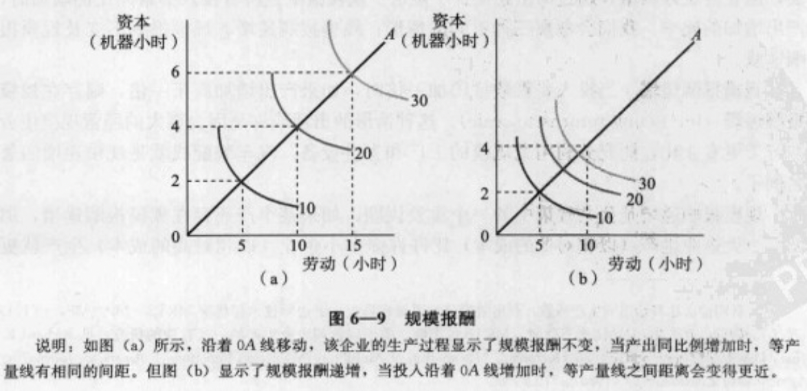

## 7. 生产成本

### 7.1 成本的测度：哪些成本重要？

经济成本、会计成本和机会成本

沉没成本

### 7.2 短期成本

1.总成本

2.固定成本和可变成本

3.固定成本和沉没成本

4.边际成本和平均成本

5.短期成本的决定因素

假定企业生产过程中只有劳动是可变的生产要素，企业能以固定的工资率 $w$ 雇佣所需的劳动，则有 $MC = w /MP_L$ 。

该式表明，在短期内边际成本等于变化的投入要素的价格除以其边际产品。当劳动的边际产出下降时，边际成本就相应上升，反之亦然。

由于工资率是固定的，从而平均可变成本与劳动的平均产出之间存在反向关系。较低的劳动平均产出意味着企业生产需要大量劳动，从而导致较高的平均可变成本。

6.短期成本曲线的形状

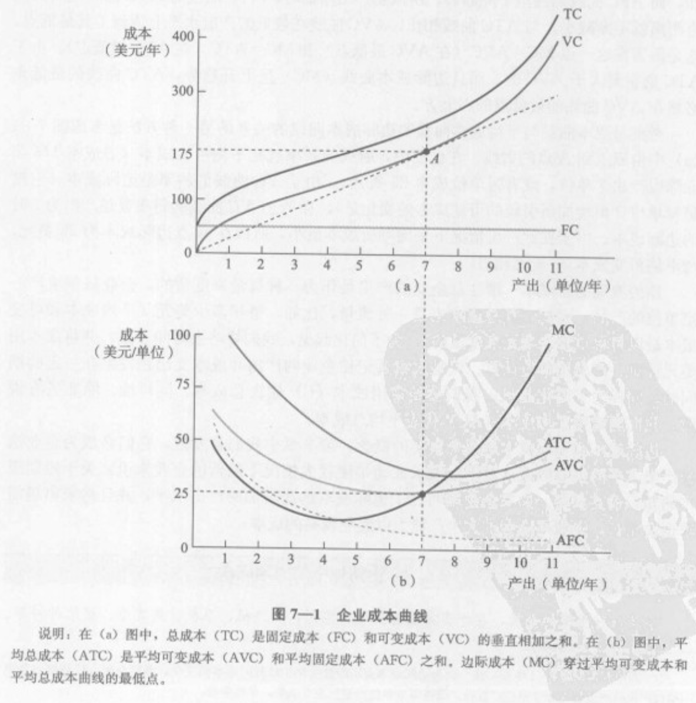

当 $ATC = MC$ 时，$ATC$ 达到最小，

当 $MC = AVC$ 时，$AVC$ 达到最小，

$MC$ 先于 $AVC$ 相交，再于 $ATC$ 相交。

### 7.3 长期成本

资本的使用者成本

资本的使用者成本：指每年拥有并使用商品而不是出售或干脆一开始就不购买的成本。可以用每年的经济折旧与将钱投资到其他方面获得的利息（财务回报）之和来计算。即：
$$
资本的使用者成本 = 经济折旧 + 利率 \times 资产价值
$$
1.成本最小化的投入选择

如何选择生产要素的投入来最小化生产成本以生产出一定量的产出，用数学语言表述：
$$
\begin{cases}
\min_{L,K} \quad (wL+rK) \\
s.t. \quad f(L,k) = q^*
\end{cases}
$$
2.等成本线

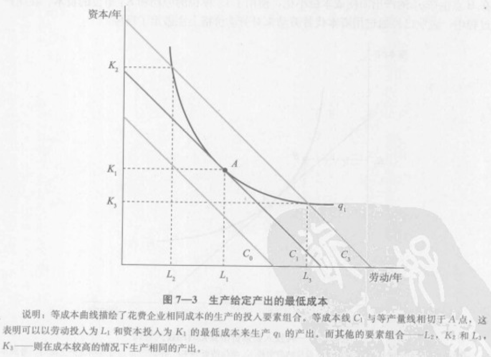
$$
C = wL + rK  \\
=> K= C/r- (w/r)L
$$
等成本线是一条以 $-w/r$ 为斜率，$C/r$ 为纵截距的直线。

3.选择投入要素

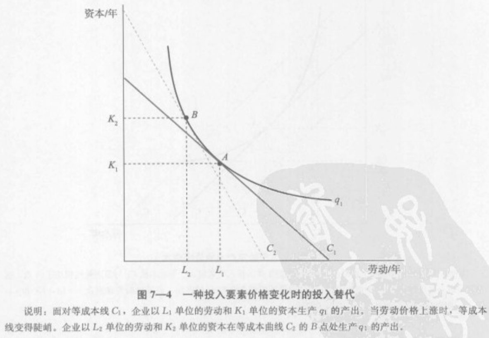

4.不同产出水平下的成本最小化

5.扩张路径和长期成本

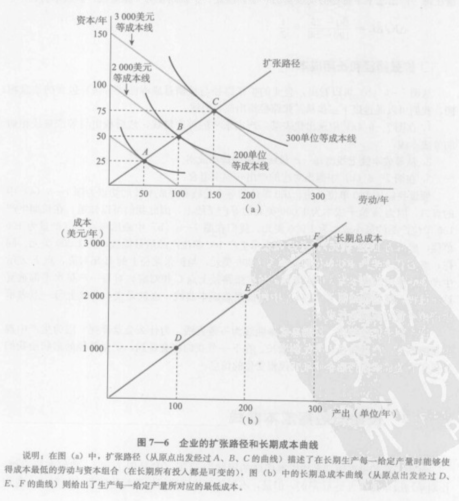

### 7.4 长期和短期成本曲线

1.短期生产的固定性

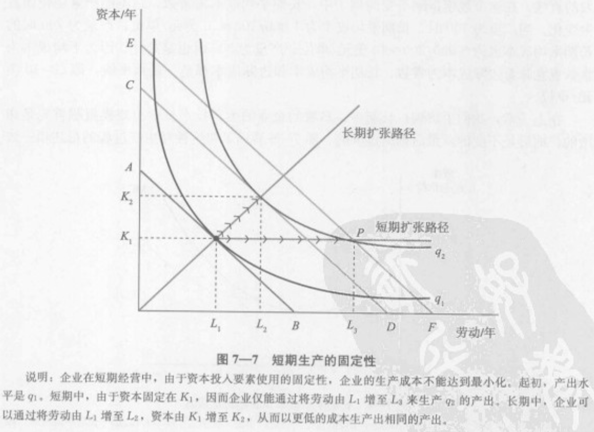

短期中，由于资本固定在 $K_1$ ，因而企业仅能通过劳动由 $L_1$ 增至 $L_3$ 来生产 $q_2$ 的产出。长期中，企业以通过将劳动由 $L_1$ 增至 $L_2$ ，资本由 $K_1$ 增至 $K_2$ ，从而以更低的成本生产出相同的产出。

在企业短期生产中，由于存在资本要素固定的情况，所以企业的生产成本要比长期成本高。

2.长期平均成本曲线

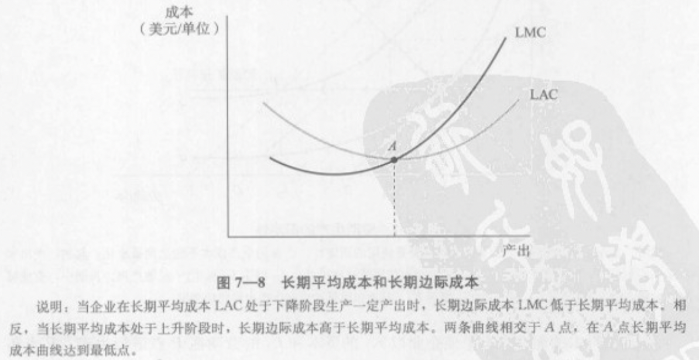

长期平均成本曲线是企业短期平均成本曲线的包络线，它反映了规模报酬存在或不存在。决定长期平均成本曲线和长期边际成本曲线的形状的最重要因素是长期生产中的规模报酬问题。如果规模报酬不变，且有许多种规模报酬可供选择，长期成本曲线是一条水平线，它由若干个短期平均成本曲线的最低点构成。然而，如果规模报酬递增或规模报酬递减，那么长期平均成本曲线是 U 形的，这条包络线并不包括所有短期平均成本曲线的最低点。

3.规模经济与规模不经济

规模经济通常以成本-产出弹性（$E_c$）来计量。$E_c$ 表示单位产出变动百分率所引起的平均生产成本变动的百分率：
$$
E_c = \frac{\Delta C/C}{\Delta Q/Q} = \frac{MC}{AC}
$$
当 $E_c$ 小于 1 时，存在规模经济；当 $E_c$ 大于 1 时，不存在规模经济。

4.短期成本与长期成本的关系

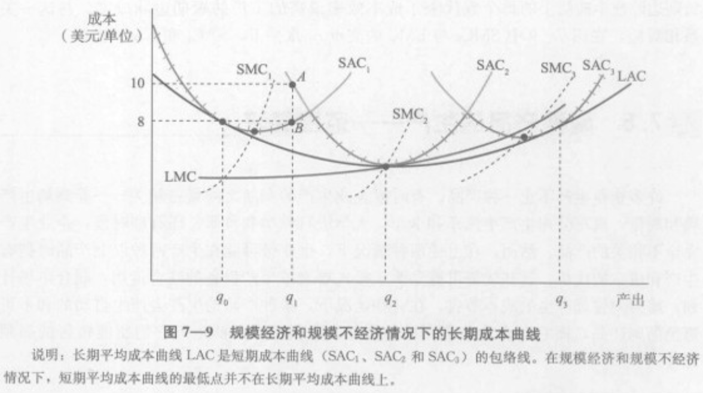

长期平均成本曲线是短期平均成本曲线的包络线。在规模报酬不变的条件下，长期平均成本曲线由短期平均成本曲线的最低点构成。在规模经济和规模不经济情况下，短期平均成本曲线的最低点并步都在长期平均成本曲线上。

长期边际成本曲线（LMC）并非是短期边际成本曲线的包络线。短期边际成本曲线适用于特定的工厂；长期边际成本期限则适用于各种规模的的所有工厂。长期边际成本曲线上的每个点代表了成本效率最高的工厂的短期边际成本。

### 7.5 两种产品的生产——范围经济

1.产品转换曲线

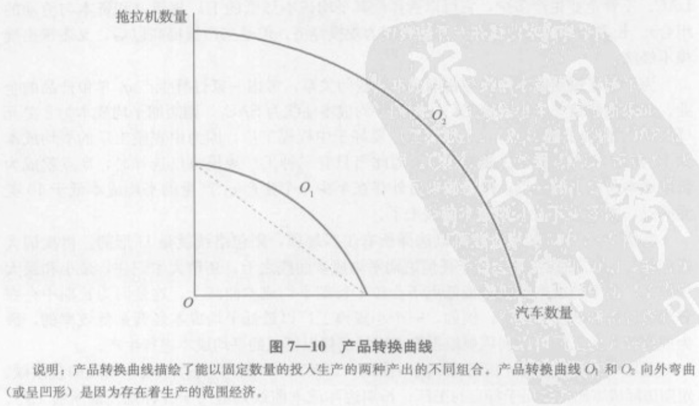

产品转换曲线描绘了以固定数量的投入生产的两种产出的不同组合。产品转换曲线向外弯曲是因为存在着范围经济。

2.范围经济和范围不经济

范围经济：当单个企业的联合产出超过各生产一种产品的两个企业所能达到的总产量时（两个企业分配到相等的投入要素）。

范围不经济：企业的联合产出低于独立企业所能达到的总产量。

3.范围经济的程度

当两种（或更多）产品被联合生产出来时，而不是各自独立生产，节约生产成本的百分比时多少？
$$
SC = \frac{C(q_1)+C(q_2)-C(q_1,q_2)}{C(q_1,q_2)}
$$
式中，$C(q_1)$ 表示生产 $q_1$ 的产出所耗费的成本；$C(q_2)$ 表示生产 $q_2$ 的产出所耗费的成本；$C(q_1,q_2)$ 表示生产两种产出所耗费的联合生产成本。若 $SC > 0$ ，存在范围经济；若 $SC < 0$ ，存在范围不经济。$SC$的值越大，范围经济的程度就越高。

### 7.6 成本的动态变化——学习曲线

1.学习曲线的画法

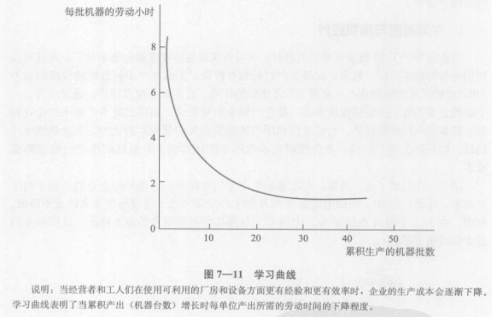

如果企业“学会”如何更有效地生产，企业的平均生产成本就会逐渐下降。学习曲线描绘了当企业的累积产出增加时，企业生产既定产出所需投入的减少数量。

2.学习效应与规模经济

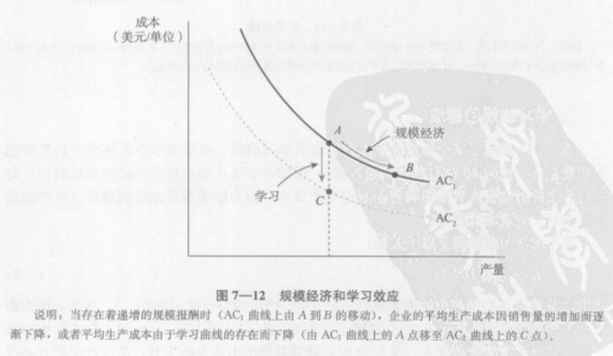

### 7.7 成本的估计和预测

1.成本方程与成本函数

成本函数使生产成本和企业的产出水平联系起来。成本函数可以通过用某一时期某行业中企业的数据资料或某一段时期行业的数据资料来计量，既包括长期的也包括短期的。有许多函数关系可以用来表示成本函数，其中包括线性的、二次的三次的。

2.成本函数和规模经济的度量

规模经济指数（scale economies index, SCI）用来衡量是否存在规模经济，其定义如下：
$$
SCI = 1- E_c
$$
当 $E_c=1$时，$SCI=0$，这时不存在规模经济和规模不经济。当 $E_c > 1$ 时，$SCI$ 为负数，这时不存在规模不经济；当 $E_c < 1$ 时，$SCI$ 为正数，这时存在着规模经济。 

---

## 【附录】生产与成本理论——一种数学方法

1.成本最小化

拉格朗日乘数法

2.边际技术替代率

3.生产和成本理论的对偶性

4.柯布-道格拉斯成本函数和生产函数

---

## 8. 利润最大化和竞争性供给

### 8.1 完全竞争市场

完全竞争又称为纯粹竞争，指不存在阻碍和干扰因素的市场情况，亦即没有任何垄断因素的市场结构。

完全竞争市场的三个基本假定：价格接受者、产品同质、自由进入与退出。

### 8.2 利润最大化

### 8.3 边际收益、边际成本和利润最大化

### 8.4 选择短期产量

竞争性厂商的短期利润最大化

竞争性厂商的短期利润

### 8.5 竞争性厂商的短期供给曲线

厂商对投入要素价格变动的反应

### 8.6 短期市场供给曲线

### 8.7 长期产量选择

长期利润最大化

长期竞争性均衡

### 8.8 行业的长期供给曲线

成本不变行业

成本递增的行业

成本递减的行业

税收效应

长期供给曲线

## 9. 竞争性市场分析

### 9.1 政府政策的损益评价——消费者剩余和生产者剩余

### 9.2 竞争性市场的效率

### 9.3 最低限价

### 9.4 价格支持和生产配额

### 9.5 进口配额与关税

### 9.6 征税或补贴的影响

# 第 3 篇 市场结构和竞争策略

## 10. 市场势力：垄断与买方垄断

### 10.1 垄断

平均收益和边际收益

垄断者的产量决策

定价的一个经验法则

需求的变动

税收的效果

多工厂厂商

### 10.2 垄断势力

垄断势力的测定

定价的经验法则

### 10.3 垄断势力的来源

市场需求弹性

厂商的数目

厂商间相互作用

### 10.4 垄断势力的社会成本

寻租

价格管制

自然垄断

管制的实践

### 10.5 买方垄断

买方垄断与垄断的比较

### 10.6 买方垄断势力

买方垄断势力的来源

买方垄断势力的社会成本

双边垄断

### 10.7 限制市场势力：反托拉斯法

## 11. 有市场势力的定价

### 11.1  攫取消费者剩余

### 11.2 价格歧视

一级价格歧视

二级价格歧视

三级价格歧视

### 11.3 跨期价格歧视和高峰负荷定价

跨期价格歧视

高峰负荷定价

### 11.4 两部收费制

### 11.5 捆绑销售

相对估值

混合捆绑销售

捆绑销售实践

搭售

### 11.6 广告

---

【附录】联合厂商的内部转移定价

联合厂商的内部转移定价

不存在外部市场时的转移定价

有一个竞争性外部市场时的转移定价

有非竞争性外部市场的转移定价

---

## 12. 垄断竞争和寡头垄断

### 12.1 垄断竞争

垄断竞争的产生

短期和长期均衡

垄断竞争和经济效率

### 12.2 寡头垄断

寡头垄断市场的均衡

古诺模型

线性需求曲线——一个例子

先发优势——斯塔克伯格模型

### 12.3 价格竞争

相同产品的价格竞争——伯特兰模型

差别产品的价格竞争

### 12.4 竞争和共谋：囚徒困境

### 12.5 囚徒困境对寡头定价的意义

价格刚性

价格信号和价格领导

主导厂商模型

### 12.6 卡特尔

卡特尔定价分析

## 13. 博弈论和竞争策略

### 13.1 博弈和策略性决策

非合作和合作博弈

### 13.2 占优策略

### 13.3 纳什均衡回顾

极大化极小策略

混合策略

### 13.4 重复博弈

### 13.5 序贯博弈

博弈的扩展形

先行者优势

### 13.6 威胁、承诺和可信性

空头威胁

承诺和可信性

讨价还价策略

### 13.7 对进入的阻止

策略性贸易政策和国际竞争

### 13.8 拍卖

拍卖形式

估价和信息

私人价值拍卖

共同价值拍卖

最大化拍卖收入

竞标与共谋

## 14. 投入要素市场

### 14.1 竞争性要素市场

只有一种投入可变时对投入要素的需求

几种投入要素可变时对一种投入要素的需求

市场需求曲线

对厂商投入要素供给

投入要素的市场供给

### 14.2 竞争性要素市场的均衡

经济租

### 14.3 买方垄断势力的要素市场

买方垄断势力：边际支出和平均支出

有买方垄断势力时的购买决策

讨价还价能力

### 14.4 有垄断势力时的要素市场

工资率的垄断势力

工会化与非工会化

## 15. 投资、时间及资本市场

### 15.1 存量与流量

### 15.2 贴现值

### 15.3 债券的价值

永久债券

债券的有效收益率

### 15.4 资本投资决策的净现值标准

实际贴现率与名义贴现率

### 15.5 对风险的调整

可分散风险与不可分散风险

资本市场定价模型

### 15.6 消费者的投资决策

### 15.7 人力资本投资

### 15.8 跨时的生产决策——可耗竭资源

### 15.9 利率是如何决定的

# 第 4 篇 信息、市场失灵以及政府的角色

## 16. 一般均衡与经济效率

### 16.1 一般均衡分析

两个相互依赖的市场——向一般均衡移动

一般均衡的实现

## 16.2 交换的效率

贸易的好处

埃奇沃斯盒形图

有效配置

契约曲线

竞争性市场中的消费者均衡

竞争性市场的经济效率

### 16.3 公平和效率

效应可能性边界

公平和完全竞争

### 16.4 生产的效率

投入效率

生产的可能性边界

产出效率

产出市场的效率

### 16.5 自由贸易的利益

比较优势

生产可能性边界的扩张

### 16.6 总结——竞争性市场的效率

### 16.7 市场为什么会失灵

市场势力

不完全信息

外部性

公共品

## 17. 信息不对称市场

### 17.1 质量不确定性和“柠檬”市场

旧车市场

不对称信息的含义

声誉和标准化的重要性

### 17.2 市场信号传递

一个劳动市场信号的简单模型

保证和保证书

### 17.3 道德风险

### 17.4 委托-代理问题

私人企业的委托—代理问题

公共企业的委托—代理问题

委托—代理框架中的激励

### 17.5 一体化企业内的管理激励

一体化企业里的不对称信息与激励设计

### 17.6 劳动市场的不对称信息：效率工资理论

## 18. 外部性与公共品

### 18.1 外部性

负外部性和无效率

正的外部性和无效率

### 18.2 纠正市场失灵的办法

排污标准

排污费

排污标准与排污费的比较

可转让排污许可证

回收

### 18.3 存量外部性

存量积累及其影响

### 18.4 外部性和产权

产权

讨价还价和经济效率

成本高昂的讨价还价——战略行为的作用

法律解决途径——对损害的起诉

### 18.5 公共资源

### 18.6 公共品

效率和公共品

公共品和市场失灵

### 18.7 对公共品的私人偏好

