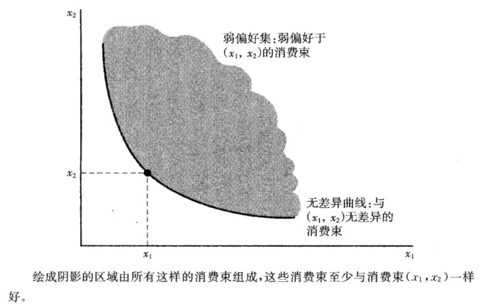
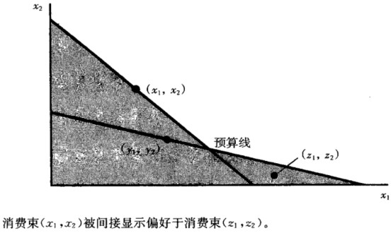

>20200928 16:43

## 2. 预算约束

### 2.1 复合商品假说

两种商品的模型虽然简化，但具有合理性，我们可以把 $x_1$ 作为要研究的商品，$x_2$ 代表除了 $x_1$ 之外的消费者要消费的其他一切商品。 用商品 2 代表除商品 1 之外的消费者要消费的其他一切东西的假设就是复合商品假说。

好处：复合商品假说使消费者行为的分析框架更加简洁而清晰，如在预算线和无差异曲线等的分析中，复合商品假说使所分析的商品只有两种，即要分析的一种商品 1 和其他复合商品 2。一个最经常的假设就是把商品 2 看作是消费者可以用来购买其他商品的货币，货币的价格当然为 1，此时预算约束为：$p_1x_1+p_2x_2 \leq m$ 。

### 2.2 预算线的含义及其变动

#### 2.2.1 预算线的含义

消费者在收入 $m$、商品价格 $p$ 既定时，能购买到的商品的不同数量的组合。假设有两种商品中，有一种商品是复合商品。（$x_1$ 是特定商品，$x_2$ 是复合商品），那么预算线公式为：$p_1x_1+p_2x_2\leq m$，斜率为 $-p_1/p_2$。

预算线的斜率衡量了市场中商品 1 替代商品 2 的比率。说明如下：

问题：假设消费者增加商品 1 的消费量为 $\Delta x_1$，此时，商品 2 的消费量如何变化才能恰好满足预算约束？

令 $\Delta x_2$ 表示商品 2 消费量的变化，由于消费量变动前后都需要满足预算约束，则有：

$$
p_1x_1+p_2x_2 = m  \\
p_1(x_1+ \Delta x_1) + p_2(x_2 + \Delta x_2) = m
$$

由第二个式子减去第一个式子可得：

$$
p_1 \Delta x_1 + p_2 \Delta x_2 = 0
$$

即消费变动的价值之和等于 0。由上式解出 $\Delta x_2 / \Delta x_1$ 可得：

$$
\frac{\Delta x_2}{\Delta x_1} = - \frac{p_1}{p_2}
$$

上式说明要重新满足预算约束的条件，用商品 1 替代商品 2 的比率，而这正好是预算线的斜率。

### 2.2.2 计价物

若用两个商品价格和一个价格来确定预算线，其中有一个变量是多余的，可以将其中一个价格或者收入看成是固定不变的，然后调整另外两个变量，这样可以描绘出同样的预算线。而**其中价格被限定为 1 的商品就是计价物（numeraire）价格**，这么做的好处在于可以少考虑一种价格。

#### 2.2.3 预算线的变动

完全平衡的通货膨胀：价格和收入以同样比率上涨——不会影响预算约束，不改变最佳选择

收入：平移。

价格：转动。

经济政策：

- 税收（作用：提高价格）

  - 从量税：消费者按照购买商品的数量支付的税收。若对商品 1 征收 $t$ 单位的从量税，则预算线变动为 $(p_1+t)x_1+p_2x_2$，使得预算线变陡。
  - 从价税：消费者按照购买商品的价格支付的税收，常用 % 表示。若对商品 1 征收 $\tau$ 的从价税，则预算线为 $(1+\tau)x_1+p_2x_2$，同样使得预算线变得陡峭。
  - 总额税：使预算线内移。

- 补贴（作用：降低价格）

  - 从量补贴：政府按照消费者购买商品数量进行的补贴。若对消费者购买商品 1 给予 $s$ 单位的补贴，则有 $(p_1-s)x_1+p_2x_2$，使得预算约束线变平缓。
  - 从价补贴：政府按照消费者购买价格给予的补贴，常用%表示。若政府对商品 1 给予 $\sigma$ 单位补贴，则有 $(1-\sigma)p_1x_1+p_2x_2$，使得预算约束线变平缓。
  - 总额补贴：预算线外移。

- 配给（政府控制供给数量）

  

  原来的预算集，砍去了“超过部分”--消费者买得起但超过控制数量的部分。

- 税收和配给的混用

  假设：消费者按照价格 $p_1$ 消费最多为 $\bar x_1$ 数量的商品 1，接着对超过 $\bar x_1$ 的所有消费支付税收 $t$。则其预算线为：

  

  在 $\bar x_1$ 左侧的斜率为 $-p_1/p_2$，右侧为 $-(p_1+t)/p_2$。

### 2.3 例子：食品券计划

从价补贴：家庭每月可得 153 元的食品券。

- 家庭月收入 300 元，购买 153 元食品券，要 83 元；
  - 补贴率=1-83/153=46%；预算线斜率=-83/153；
- 家庭月收入 100 元，购买 153 元食品券，要 25 元。
  - 补贴率=1-25/153=84%；预算线斜率=-25/153。

效果：**随收入的增加，**预算线斜率越陡。

总额补贴：把 200 元食品券发给符合要求的家庭，用于购买食品。实质是一种总额补贴。

### 2.4 练习题

1.假设预算线方程 $p_1x_1+p_2x_2 =m$；现在政府决定：对消费者征收定额税 $u$；对每单位商品 1 征收 $t$ 元从量税；对每单位商品 2 补贴 $s$ 元。求新预算线的表达式。

答案：$(p_1+t)x_1+(p_2-s)x_2=m-u$

2.如果消费者的收入增加，同时其中一种商品价格下降，消费者的状况至少与原来一样好吗？

答案：预算线变动后，新的预算集包含原来的预算集，而且，新的预算集还增加了新的消费选择，因此消费者的状况至少与原来一样好。
## 3.偏好

### 3.1 偏好关系及其公理

#### 3.1.1 偏好关系

- 严格偏好：$(x_1,x_2)\succ(y_1,y_2)$
- 无差异：$(x_1,x_2)\sim(y_1,y_2)$
- 弱偏好：$(x_1,x_2)\succeq(y_1,y_2)$

#### 3.1.2 公理

完备性：指任何两个消费束都是可比较的。
反身性：任何消费束至少与本身同样好。
传递性：指假如消费者认为 $(x_1,x_2) \succeq (y_1,y_2)$，并且 $(y_1,y_2) \succeq (z_1,z_2)$，那么可以认为 $(x_1,x_2) \succeq (z_1,z_2)$。

这三条公理形成所谓的“理性”。一个有理性的当事人能作出选择，而且他的选择是一致的。(平新乔《微观经济学十八讲》)

### 3.2 无差异曲线

无差异曲线和偏好之间什么关系？

无差异曲线是描述偏好的工具。根据偏好的三条公理，使用无差异曲线来描述偏好。

弱偏好集：弱偏好于 $(x_1,x_2)$ 的消费束。如上图所示，至少和消费束 $(x_1,x_2)$ 一样好的所有消费束组成的集合。

无差异曲线：与 $(x_1,x_2)$ 无差异的消费束。

无差异曲线的特点：

- 任意两条曲线不能相交（违背传递性）；
- 无差异曲线上的箭头：标示更受偏好的消费束的方向。

### 3.3 特殊偏好的无差异曲线

#### 3.3.1 完全替代品

完全替代品：消费者愿意以**固定比率**将一种商品**替换**为另一种。完全替代品的重要特征：

- 无差异曲线有固定的斜率，但不一定是-1；
- 偏好方向朝向右上方。

#### 3.3.2 完全互补品

完全互补品：指几种商品按固定的比例被一起消费的商品。完全互补品的重要特征：

- 无差异曲线呈 L 型，L 的顶点为左鞋和右鞋数量相等的地方；
- 以固定的比例被消费，但比例不一定是 1: 1；
- 偏好方向朝向右上方。

#### 3.3.3 厌恶品

厌恶品：指消费者不喜欢的商品。于是设计一种方案：消费一种厌恶品，给予消费者喜欢的商品进行补偿。书中的例子：凤尾鱼是消费者的厌恶品，香肠是嗜好品，消费凤尾鱼的时候给予香肠进行补偿。厌恶品的特征：

- 无差异曲线正斜率；
- 偏好方向朝右下方。

#### 3.3.4 中性商品

中性商品：指某种商品消费者可有可无。假设凤尾鱼是中性商品，那么：

- 无差异曲线是垂线：消费者只关心得到多少香肠，不关心得到多少凤尾鱼；
- 偏好增加的方向：右方，即增加香肠的消费；
- 凤尾鱼对香肠的边际替代率为 0。

#### 3.3.5 餍足

餍足：对于消费者而言，消费束越接近饱和点，消费者越喜欢。有最佳的消费束 $(x_1,x_2)$，越接近 $(x_1,x_2)$ 越好，则 $(x_1,x_2)$ 是餍足点或最佳点。餍足的特征：

- 当两种物品都“太少”或“太多”时，无差异线的斜率为负：
- 当一种物品“太多”时，无差异线的斜率为正。这物品是厌恶品——减少厌恶品，更接近“最佳点”。
- 当两种物品都太多，那么两种物品都是厌恶品，减少对两种物品，更接近最佳点。

#### 3.3.6 离散商品

离散商品：商品的消费数量只能是整数。假设商品 1 是离散商品，与给定消费束无差异的消费束是离散点集，与给定消费束至少一样好的消费束集是一组线段。

### 3.4 良好性状偏好

良好性状偏好：单调的、凸的。

- 单调的：如果 $y_1 \geq  x_1$ 且 $y_2 > x_2$ 或者 $y_1 > x_1$ 或者 $y_2 \geq  x_2$，则必有 $(y_1,y_2) \succ (x_1,x_2)$。这意味着：
  - 只能是正常商品，而非厌恶品，在达到餍足点之前“越多越好”；
  - 无差异曲线的单调性：斜率为负。
- 凸的：如果 $(x_1,x_2) \sim (y_1,y_2)$，则对于任意 $t，0 \leq t \leq 1$，$(tx_1+(1-t)y_1,tx_2+(1-t)y_2) \succeq (x_1,x_2)$ 都成立。这意味着：
  - “平均消费束”至少与“端点消费束”一样好，或者受偏爱；
  - 为什么要假设良好性状的偏好是凸的？现实情况中，消费者会消费多种商品。

凹状偏好：“端点消费束”比“平均消费束”受偏爱。比如白酒和啤酒的偏好，如果把白酒和啤酒各一半混用，消费者的偏好不如分别消费白酒和啤酒。

严格凸偏好：“加权平均消费束**严格好于**“端点消费束”。完全替代品的偏好是凸的，但不是严格凸的。凸偏好的无差异曲线可能包含直线，但严格凸偏好的无差异曲线必须是弧形的，不能包含直线。

_拟线性偏好：**$k = v(x_1)+x_2$**，消费者的无差异曲线是由无差异曲线互相垂直移动得到。_

---

【补充】凸函数：$f [\lambda x_1+(1-\lambda)x_2] ≤ \lambda f(x_1) + (1-\lambda)f(x_2), \lambda \in (0,1)$
判别：求二阶导数

- $f''(x) \geq 0$ $\rightarrow$ 凸函数；
- $f''(x) ＞ 0$ $\rightarrow$ 严格凸函数。

性质：

- 凸 $\rightarrow$ $f '(x)$ 在该区间上单调递减 $[x_1>x_2→f(x_1)<f(x_2)]$；
- 凸 $\rightarrow$ 函数，在它的切线的上方： $f(y) \geq  f(x) + f '(x) (y − x)$。
- 凸 $\rightarrow$ 如果 $f '(c) = 0$， $c$ 是 $f(x)$ 的最小值。

---

### 3.5 边际替代率

边际替代率（Marginal Rate of Substitution, MRS）:消费者在保持相同满足程度时，愿意用一种商品替代另一种商品的比率。边际替代率等于无差异曲线在该点的斜率。偏好的单调性，决定无差异曲线斜率为负，所以，边际替代率为负。

边际替代率可以描述无差异曲线的形状：

- 不变的边际替代率：完全替代品；
- 边际替代率无穷大：中性物品；
- 边际替代率为 0，或无穷大：完全互补品

#### 3.5.1 边际替代率的其他解释

边际替代率衡量边际支付意愿。即，消费者处于交换与不交换的边际支付意愿上。边际替代率衡量一种意愿，即为多消费商品 1，而愿意放弃商品 2 的数量，就如同为多消费商品 1 而支付。为了得到某一个额外消费数量，实际付出的数量与愿意付出的数量也许不同。获得少量的额外商品，实际付出的数量取决于商品的价格，愿意付出的数量取决于偏好。获得大量的商品，实际付出的数量取决于偏好、价格。

#### 3.5.2 边际替代率递减规律

偏好的凸性假设使得，对于严格凸的无差异曲线来说，随着 $x_1$ 逐渐增加，无差异曲线的斜率的绝对值 $|MRS_{12}|$ 会逐渐减少。因此，无差异曲线展现出边际替代率递减（diminishing marginal rate of substitution）的规律。

### 3.6 练习题

1.某大学橄榄球教练说，任意给定两个前锋比如 A 和 B ，他永远偏好身材更高大和速度更快的那个。他的这种偏好关系是传递的吗？是完备的吗？

**完备性**是指任何两个消费束都是可比较的，即假定有任意消费束 Y 和 X，若有 $(x_1, x_2) \geq (y_1, y_2)$ ，或者 $(y_1, y_2) \geq  (x_1, x_2)$ ，或者两种情况都有，在最后这种情况下，消费者对两个消费束无差异。

**传递性**是指假如消费者认为 X 至少和 Y 一样好，Y 至少和 Z 一样好，那么就可以认为 X 至少和 Y 一样好。

回到上例，显然不满完备性，但是满足传递性。理由如下：

- 非完备。可以通过反证法证明：令下标 1 和 2 分别表示身材和速度，假设是完备的，则有 $A_{1} \geq B_{1}$ 并且 $A_{2} \geq B_{2}$ （或者 $B_{1} \geq A_{1}$ 并且 $B_{2} \geq A_{2}$）。但是当 $A_{1} > B_{1}$ 但 $A_{2} > B_{2}$，即 A 身材更高但速度更慢，而 B 的身材更矮但速度更快，这种情形下选择谁？
- 是传递的。假设有 $A_{1} \geq B_{1}$ 并且 $A_{2} \geq B_{2}$ ，若 $B_{1} \geq C_{1}$ 并且 $B_{2} \geq C_{2}$ ，则必然有 $A_{1} \geq C_{1}$ 并且 $A_{2} \geq C_{2}$ 。

  2.面值 1 元的钞票与面值 5 元的钞票，计算它们之间的边际替代率。

边际替代率（marginal rate of substitution, MRS）为 无差异曲线的斜率，$MRS_{12} = \Delta x_1 /  \Delta x_2$，即消费者愿意用商品 2 去替代商品 1 的比率。

因此，本题的 $MRS_{12} = \Delta x_1 /  \Delta x_2 = 1 / -5 = - 1/5$，即减少 5 张 1 元的钞票，要增加 1 张 5 元的钞票才能使消费者还在原来的无差异曲线上。

## 4. 效用

效用是一种描述偏好的方法。

效用函数：是为**偏好排序**的一种简便方法。为每个可能的消费束指定一个数字，使具有较多偏好的消费束大于具有具有较少偏好的消费束。

效用函数的存在使得我们对消费者行为的偏好分析转换成函数的分析，从而发现消费者行为的规律。（平新乔《微观经济学十八讲》）

### 4.1 基数效用和序数效用

基数效用认为效用水平的数字有意义，两个消费束之间的效用差额有意义；

序数效用认为效用水平的数字没有意义，两个消费束之间的效用差额没有意义，而重在将不同的商品束进行排序。

### 4.2 效用函数的单调变换

单调变化（monotonic transformation）是将一组数字转换为另一组数字的方法，并保留转换前后的数字顺序不变。效用函数单调变换后，不改变原来效应函数的排序。常见的单调变化有：

- 乘以一个正数；
- 加上任一常数
- 变为自身的奇数次幂；
- 对数函数与指数函数互为单调变换函数。

如果 $f(u)$ 是表示某种偏好的效用函数的任一单调变换，那么 $f(u(x_1,x_2))$ 代表的偏好与原效用函数的偏好相同。证明如下：

1. $u(x_1,x_2)$ 代表特定的偏好意味着：当且仅当 $(x_1,x_2) \succ (y_1,y_2)$ 时，$u(x_1,x_2) > u(y_1,y_2)$;
2. 但如果 $f(u)$ 是一个单调变换，那么当且仅当 $f(u(x_1,x_2))>f(u(y_1,y_2))$ 时，$u(x_1,x_2)>u(y_1,y_2)$;
3. 因此，当且仅当 $(x_1,x_2) \succ (y_1,y_2)$ 时，$f(u(x_1,x_2))>f(u(y_1,y_2))$，因此，函数 $f(u)$ 同原效用函数 $u(x_1,x_2)$ 以一样方式代表偏好。

### 4.3 效用函数的构造

**已知无差异曲线，构造效用函数**：画出一条对顶线，测量对角线与每条无差异曲线交点到原点的距离，将这些距离标记在无差异曲线上。

**已知效用函数，画无差异曲线**：令 $u(x_1,x_2) = k$，画出水平集（level set），对于不同的常数值，将得到不同的无差异曲线。

### 4.4 特殊偏好的效用函数

完全替代：$u(x_1, x_2) = ax_{1}+bx_{2}$。$a$ 和 $b$ 是衡量商品 1 和商品 2 对消费者“价值”的正数；

完全互补：$u(x_1, x_2) = min\{ax_1, bx_2\}$。$a$ 和 $b$ 是描述商品消费比例的正数。

拟线性偏好：$u(x_1, x_2) = k = v(x_1) + x_2$。$k$ 是常数，表示无差异曲线的高度。

柯布道格拉斯偏好：$u(x_1, x_2) = x_1^cx_2^d$。

### 4.4 边际效用

假设某消费者的商品束为 $(x_1, x_2)$，若多给他一点商品 1，他的效用变化比率称为商品 1 的边际效用（marginal utility）。用公式表示为：

$$
MU_1 = \frac{\Delta U}{\Delta x_1} = \frac{u(x_1+ \Delta x_1, x_2)}{\Delta x_1}
$$

### 4.5 边际效用和边际替代率

假设两种商品的消费量 $(\Delta x_1,\Delta x_2)$ 恰好使效用不变，即消费量沿着一条无差异曲线移动。则有：

$$
MU_1 \Delta x_1 + MU_2 \Delta x_2 = \Delta U = 0
$$

解出无差异曲线的效率：

$$
MR_{12} = \frac{\Delta x_2}{\Delta x_1} = - \frac{MU_1}{MU_2}
$$

### 4.6 练习题

1.计算柯布-道格拉斯偏好（Cobb-Douglas Preferences）的边际替代率。

柯布-道格拉斯偏好的形式为：

$$
u(x_1,x_2) = x_{1}^{c}x_{2}^{d}
$$

其中，$c$ 和 $d$ 都是表示消费者偏好的正数。

若选择上述指数形式，则有：

$$
MRS = - \frac{\delta_u(x_1,x_2)/\delta x_1}{\delta_u(x_1,x_2)/\delta x_2} = \frac{cx_{1}^{c-1}x_{2}^{d}}{dx_{1}^{c}x_{2}^{d-1}}=- \frac{cx_2}{dx_1}
$$

若将柯布-道格拉斯偏好转换为对数形式，则有：

$$
u(x_1,x_2) = c\ln x_{1} + d \ln x_2
$$

求得边际替代率为：

$$
MRS = - \frac{\delta_u(x_1,x_2)/\delta x_1}{\delta_u(x_1,x_2)/\delta x_2} = \frac{c/x_1}{d/x_2}=-\frac{cx_2}{dx_1}
$$

2.效用函数 $u(x_1,x_2)=x_1+\sqrt{x_2}$ 表示什么类型的偏好？ 效用函数 $v(x_1,x_2)=x_{1}^2+2x_1\sqrt{x_2}+x_2$ 是的单调变换吗？

$u(x_1,x_2)=x_1+\sqrt{x_2}$ 表示拟线性偏好。因为 $x_1 \geq 0, x_2 \geq 0$（消费数量不能为负），所以 $u(x_1,x_2)=x_1+\sqrt{x_2} \geq 0$，对效用函数 $u(x_1,x_2)$ 做单调变换 $f(u)=u^2$ 可得 $f(u) = x_{1}^2+2x_1\sqrt{x_2}+x_2$，而这正是效用函数 $v(x_1,x_2)$，因此 $v(x_1,x_2)$ 是 $u(x_1,x_2)$ 的单调变换。

## 5. 选择

### 5.1 最优选择

**对于良好性状的偏好，**最优消费选择是无差异曲线和预算线的切点处的商品束。也存在特殊情况，最优选择的地方，无差异曲线与预算线的切点并不相切。比如：

- （1）拐折。在最优选择处，无差异曲线无切点，如完全互补品；
  
- （2）边界最优。最优选择处，无差异曲线与预算线不相切，如完全替代品、中性商品、厌恶商品、凹偏好商品；
  
- （3）多个切点的情况。相切是最优选择的必要条件而非充分条件。
  

最优选择的条件：

- 最优必相切，但相切不一定最优。只有在凸偏好的情况下，才是充分条件；
- 最优选择的充分必要条件：边际替代率等于价格比率，即$MRS=-\frac{p_1}{p_2}$。

### 5.2 消费者需求函数

在某组价格和消费者收入水平下，商品 1 和商品 2 的最优选择称为消费者的需求束。通常价格和收入改变时，消费者的最优选择也会发生改变。**需求函数是将最优选择（即商品的需求数量）与不同价格和收入水平关联起来的函数**。

### 5.3 特殊偏好的消费者选择

#### 5.3.1 完全替代

完全替代：比较预算线和无差异曲线谁更平坦。 

$$
x_1 = 

\begin{cases}

m/p_1 & p_1 < p_2; \\

x_1 \in [0, m/p_1] & p_1 = p_2; \\

0 & p_1>p_2

\end{cases}
$$

若两商品完全替代，则消费者只会购买便宜的那一种；若两商品价格相同，则消费者不会在意购买哪一种。

#### 5.3.2 完全互补

完全互补：最优选择必然位于对角线上。即：
$$
x_1 = x_2 = x = \frac{m}{p_1+p_2}
$$

消费者购买两种商品的数量都相同。

#### 5.3.3 中性商品和厌恶商品

中性商品和厌恶商品：在中性商品和厌恶品情况下，消费者把所有的钱都花费在喜欢的商品上，而不会去购买中性商品或厌恶品。如果商品1是喜欢品，而如果商品2是中性或厌恶品。则有：$x_1 = \frac{m}{p_1}, x_2 = 0$。

#### 5.3.4 离散商品

假设商品1是离散商品，商品2是货币。如果商品1的价格非常高，消费者选择0单位。随着商品1价格的下降，消费者选择更多的商品1。

#### 5.3.5 凹偏好

$x$是否为最优选择? 

不是。对凹偏好，最优选择永远是边界选择，不是切点X，而是Z点。因为，凹偏好意味着“端点消费束”比“平均消费束”受偏好。所以，消费者永远不会同时消费两种商品。

#### 5.3.6 柯布道格拉斯偏好

柯布道格拉斯偏好的最优选择：

$$
x_1 = \frac{c}{c+d} \frac{m}{p_1} \\

x_2 = \frac{d}{c+d} \frac{m}{p_2}
$$

柯布道格拉斯偏好有一个特性：花费在商品的开支占总收入的份额，只与c和d有关。**即消费者花费在每种商品上的资金，占收入的比例是固定的，这一比例的大小取决于柯布道格拉斯函数中变量的指数**。因此，使用变量指数和为1的柯布道格拉斯函数比较方便（事实上，$u(x_1,x_2)=x_1^ax_2^{1-a}$是$v(x_1,x_2)=x_1^cx_2^d$的单调变换，这两个函数代表相同的偏好。（曹乾《中级微观经济学：现代方法（第8 版）》）），如果$u(x_1,x_2)=x_1^ax_2^{1-a}$，可以将$a$解释为花费在商品1上的收入比例。

### 5.4 估计效用函数

现实中，我们看到的往往是需求行为，我们需要知道产生这些行为的偏好效用函数。因为知道了效用函数，我们就能预测新情况下的行为。在范里安的教材中的例子，观察数据发现支出比例在不同年份之间存在较小的变动，因此选择使用柯布道格拉斯偏好拟合。

*这也是经济学中很重要的思想：给定选择行为的某项观测值，试图确定最大化的是什么东西。一旦模拟出上述用于最大化的东西，就可以用它预测新形势下的选择，或者用它评估经济环境变化导致的影响。*

### 5.5 MRS条件的意义

价格衡量商品之间的交换率，反映人们在边际上如何评价商品。

### 5.6 税种选择

初始预算约束：$p_1x_1+ p_2x_2 =m$ 

从量税的预算线：$(1+t)p_1x_1 + p_2x_2 = m$

所得税的预算线：$p_1x_1+x_2p_x = m – t$

$(x_1’, x_2’)$位于含从量税的预算约束线上，也位于含所得税的预算约束线上。$(x_1’, x_2’)$是消费者的最优选择吗？否。

因为在$(x_1’, x_2’)$上：

- 从量税的预算线：$MRS= -\frac{(p_1+t)}{p2}$；
- 所得税的预算线：$MRS= - \frac{p_1}{p_2}$。

所以，

- 含所得税的预算线与无差异曲线（与从量税预算线相切）相交于$(x_1’, x_2’)$。
- 所以， 含所得税的预算线上也许有比$(x_1’, x_2’)$更高的消费者偏好的点。

**所以，对消费者，所得税优于从量税**。

**但是，上述结论的局限：**

- （1）它适用于**一个消费者**。对全体消费者来说，所得税不一定比数量税更好（因为：不消费商品的消费者，肯定偏好数量税）；
- （2）所得税，挫伤消费者工作的**积极性**导致的税后收入下降的幅度大于征税的数量。所得税仅改变消费者的货币数量，不影响选择；
- （3）完全忽略了**供给**对税收的反应。已经说明了需求对税收的反应，但是供给对税收也有反应。

## 6. 需求

一种商品的需求量，是所有商品价格、收入的函数，记作：$x_1 = x_1(p_1, p_2, m)$。

###  6.1 正常商品和劣等商品

正常商品：收入增加需求增加，收入下降需求下降；

劣等商品：收入增加需求下降。

---

奢侈品：当收入增加，某种商品的需求增加的速度比收入增加的速度快；

必需品：当收入增加，某种商品的需求增加速度比收入增加的速度慢。

普通商品：普通商品的价格下降，需求量上升；

吉芬商品：价格下降，其需求量反而下降。（这是因为价格的变化在某种程度上类似收入的变化，即使货币收入不变，某商品的价格变化也会改变购买力，因此改变需求）

---

### 6.2 收入提供曲线和恩格尔曲线

**收入提供曲线**：也叫收入扩展线。是价格保持不变时，不同收入上的最优选择。是由**收入增加时预算线向外平移产生的一系列需求束**，将这些需求束连接起来就得到收入提供曲线（income offer curve）。如果两种商品都是正常商品，那么收入提供曲线的斜率为正。

**恩格尔曲线**：价格不变时，不同收入水平下对应的商品最优选择。在所有商品价格不变的情况下，将某种商品的需求视作收入的函数而得到的曲线。（横轴为$x_1$，纵轴为$m$）

### 6.3 特殊偏好的收入提供曲线和恩格尔曲线

#### 6.3.1 完全替代

收入提供曲线：如果$p_1＜p_2$，消费者专门消费商品1，那么收入增加，商品1的消费增加。因此，收入提供曲线就是横轴。
恩格尔曲线：对商品1的需求：$x_1＝\frac{m}{p_1}$，恩格尔曲线是一条斜率等于$p_1$的直线。

#### 6.3.2 完全互补

收入提供曲线：消费者对每种商品消费相同的数量，所以收入提供曲线总是一条经过原点的对角线。

恩格尔曲线：商品l的需求是$x_1＝\frac{m}{(p_1+p_2)}$，恩格尔曲线是—条斜率为$(p_1+p_2)$的直线。

#### 6.3.3 柯布道格拉斯偏好

如果$u(x_1,x_2)=x_1^ax_2^(1-a)$，商品1的柯布道格拉斯需求函数为$x_1=\frac{am}{p_1}$，商品2的柯布道格拉斯需求函数为$x_2=\frac{(1-a)m}{p_2}$。

#### 6.3.4 位似偏好

如果存在消费束$(x_1,x_2)$和$(y_1,y_2)$，消费者偏好$(x_1,x_2) \succ (y_1,y_2)$，那么：

对于任意$t>0$，消费者都将偏好$(tx_1, tx_2)$胜过$(ty_1, ty_2)$。

完全替代、完全互补和柯布道格拉斯偏好都是位似偏好。

如果消费者具有位似偏好，那么收入提供曲线是经过原点的直线。相似偏好要求商品的需求同收入同比例递增或者递减，所以位似偏好的恩格尔曲线是直线。

#### 6.3.5 拟线性偏好

拟线性偏好：收入增加根本不影响商品1的需求，所有多余的收入都用于消费商品2。生活中，拟线性偏好的商品如牙膏和食盐。

### 6.4 普通商品和吉芬商品

普通商品：普通商品的价格下降，需求量上升；

吉芬商品：价格下降，其需求量反而下降。（这是因为价格的变化在某种程度上类似收入的变化，即使货币收入不变，某商品的价格变化也会改变购买力，因此改变需求）

**启示：效用最大化模型需要对消费行为作出某些假设限制。**

### 6.5价格提供曲线和需求曲线

价格提供曲线：当一种商品价格变化，而另一种商品价格和收入不变时，需求与价格的关系。每一条无差异曲线与相应的预算线相切，把最优点（即切点）连接起来即为价格提供曲线（price offer curve）。

**需求曲线：假设商品2的价格和收入不变，对每个不同$p_1$值画出商品1的最优消费水平，就得到需求曲线。**一般商品的需求曲线负斜率，吉芬商品的需求曲线为正斜率。

### 6.6 特殊偏好的需求曲线

#### 6.6.1 完全替代

当$p_1>p_2$时，商品1的需求为0；当$p_1=p_2$时，商品1的需求是预算线上的任一数量；当$p_1<p_2$时，商品1的需求等于$m/p_1$。

#### 6.6.2 完全互补

价格提供曲线：对角线。因为无论价格如何，商品1和商品2的需求量总是相同的。

需求曲线：商品1的需求曲线$x_1=\frac{m}{p_1+p_2}$，令$m$和$p_2$固定，得到如图所示的需求曲线。

#### 6.6.3 离散商品

保留价格：使得消费者消费或不消费，刚好无差异的那个价格。

### 6.7 替代和互补

替代品：如果$P_{x_2}$上升，$x_1$上升，即$\frac{\Delta x_1}{\Delta x_2} > 0$；

互补品：如果$P_{x_2}$上升，$x_1$下降，即$\frac{\Delta x_1}{\Delta x_2} < 0$。

### 6.8 反需求函数

需求曲线：保持$p_2$和$m$不变，画出$p_1$和$x_1$的关系，即为需求曲线；

反需求曲线：将价格视为需求量的函数$p_1 = f(x_1)$。

## 7.显示偏好

### 7.1 显示偏好

如何利用消费者的需求信息去发现其偏好情况？
假设：在观察消费者的选择行为期间（月度或季度），他的消费偏好保持不变。

假设：偏好严格凸，即每个预算约束有且只有一个需求束。
显示偏好：消费者选择了商品束$(x_1,x_2)$，这表明$(x_1,x_2)$被显示偏好于$(y_1,y_2)$，因为他原本可以选择$(y_1，y_2)$但是没有选择。这些消费束可以买得起但是没有买，因此实际购买的消费束一定更好。

显示偏好原理：令$(x_1, x_2)$是价格水平为$(p_1, p_2)$时消费者选择的商品束，$(y_1, y_2)$满足条件$p_1x_1 + p_2x_2 \geq p_1y_1 + p_2y_2$的其他商品束，则如果消费者在他能买得起的商品束中选择最好的，必有$(x_1,x_2) \succ (y_1, y_2)$。

显示偏好和偏好有啥区别？
- 显示偏好表示能够选择Y时实际选择的X，是对消费者行为的描述；
- 偏好是将X排在Y前面，是对喜欢程度的排序。

#### 7.1.1 直接显示偏好

若消费者需求束为$(x_1,x_2)$，预算线内的商品束为$(y_1,y_2)$：

因为$p_1x_1+p_2x_2 = m$，而$p_1y_1+p_1y_2 \leq m$，所以$p_1x_1+p_2x_2\geq p_1y_1+p_2y_2$，即$(x_1,x_2)$是$(y_1,y_2)$的直接显示偏好。

#### 7.1.2 间接显示偏好

间接显示偏好：利用偏好的传递性原理

若$(x_1,x_2) \succ (y_1,y_2)$，$(y_1,y_2) \succ (z_1,z_2)$，则称$(x_1,x_2)$被间接显示偏好于$(z_1,z_2)$。

### 7.2 复原偏好

在理性假设下，通过观察消费者的选择行为，可以估计偏好，观察到的行为越多，估计越准确。

### 7.3 显示偏好弱公理

**显示偏好弱公理（WARP）**：如果$(x_1,x_2)$被直接显示偏好于$(y_1,y_2)$，且$(x_1,x_2)$和$(y_1,y_2)$不同，那么$(y_1,y_2)$就不可能直接显示偏好于$(x_1,x_2)$。用文字表述就是：消费者有能力购买却没有购买的东西，一定比他最终选择的东西差。所以上图的情况不会出现。

### 7.4 显示偏好强公理

显示偏好强公理（SARP）：如果$(x_1,x_2)$被直接或间接显示偏好于$(y_1,y_2)$，且$(x_1,x_2)$与$(y_1,y_2)$不同，则$(y_1,y_2)$不可能被直接或间接显示偏好于$(x_1,x_2)$。

### 7.5 指数

- 假设在 $t$ 期，价格是 $(p_{1}^t, p_{2}^t)$ ，消费者的选择是 $(x_{1}^t, x_{2}^t)$ 。

- 在基期 $b$ ，价格是 $(p_{1}^b, p_{2}^b)$ ，消费者的选择是 $(x_{1}^b, x_{2}^b)$ 。

**如何知道消费者“平均”消费发生了怎样的变动？**

如果令 $w_1$ 和 $w_2$ 为某种计算平均数的“权数”，那么就可以得到如下数量指数：
$$
I_{q} = \frac{w_{1}x_{1}^t+w_{2}x_{2}^t}{w_{1}x_{1}^b+w_{2}x_{2}^b}
$$

- 如果 $I_{q}$ 大于 1 ，表示从时期 $b$ 到时期 $t$ ，“平均”消费是上升的；
- 如果 $I_{q}$ 小于 1 ，表示从时期 $b$ 到时期 $t$ ，“平均”消费是下降的。

**该使用什么做“权数”呢？**

最自然的选择是商品的价格，因为价格度量的是商品的相对重要性。

根据选择价格的时期不同，数量指数可以划分为：

- **拉氏指数（Laspeyres index）：使用基期 $b$ 的价格作为权数**；
- **帕氏指数（Paasche index）：使用时期 $t$ 的价格作为权数**。

把时期 $t$ 的价格代入数量指数，帕氏指数可以表示为：

$$
P_{q} = \frac{p_{1}^tx_{1}^t+p_{2}^tx_{2}^t}{p_{1}^tx_{1}^b+p_{2}^tx_{2}^b}
$$

把时期 $b$ 的价格代入数量指数，拉氏指数可以表示为：

$$
L_{q} = \frac{p_{1}^bx_{1}^t+p_{2}^bx_{2}^t}{p_{1}^bx_{1}^b+p_{2}^bx_{2}^b}
$$

## 8.斯勒茨基方程

消费者的选择如何随价格的变化而变化？

当商品的价格发生改变时，将产生两种效应：

- 一是用一种商品交换另一种商品的比率发生了改变**（替代效应）**；
- 二是收入的总购买力也发生了改变**（收入效应）**。

比如商品1的价格下降：

- 一是购买商品 1 需要放弃的商品 2 变少，改变用商品 2 替代商品 1 的比率；
- 二是商品 1 变得便宜，同样的货币收入可以购买更多的商品 1 。

### 8.1 替代效应和收入效应

**替代效应**：购买力不变，由两种商品之间的交换比率变化所导致的需求变化。当商品价格变化但购买力不变时，消费者如何用一种商品“替代”另一种商品。$\Delta x_1^s = x_1(p_1’, m’) – x_1(p_1,m)$。（回答：当商品1价格变化，为恰好买得起原来的消费束，货币收入的调整数额为多大？）

**收入效应**：相对价格不变，由购买力的变化所导致的需求变化。$\Delta x_1^n = x_1(p_1’, m)-x_1(p_1’,m’)$。

将价格的变化分为两部分：首先，令**相对**价格改变，相应调整货币收入，以保持购买力不变；其次，保持相对价格不变，调整购买力。用图形表示为：

- 第一步：“转动”（替代效应）
  - 购买力不变，**相对价格**变化，预算线斜率变化
- 第二步：“移动”（收入效应）
  - **购买力**变化，相对价格不变，预算线斜率不变

替代效应的符号：替代效应总为负，因为由替代效应引起的需求变动和价格变动的方向相反。如果价格上升，商品的需求因替代效应而下降；

收入效应的符号：正常商品的收入效应为负；劣等商品的收入效应为负。

### 8.2 需求总变动的分解

$$
\Delta x_1 = 

\begin{cases}

\Delta X_1^s + \Delta x_1^n \\

= x_1(p_1’, m) – x_1(p_1, m) \\

= [x_1(p_1’,m’) – x_1(p_1, m)] + [x_1(p_1’, m0) – x_1(p_1’, m’)]

\end{cases}
$$

 

对于正常品来说，替代效应和收入效用符号都为负，因此总效应符号也为负；而对于劣等商品还不好确定。

### 8.3 需求定律

需求定律：如果收入增加时某种商品的需求上升，那么价格上升时，该商品的需求必然下降。

推导：收入增加—>需求上升：正常商品。对于正常商品，替代效应和收入效应互相加强，因此价格上升需求必然下降。

### 8.4 特殊偏好的收入效应和替代效应

#### 8.4.1 完全互补

#### 8.4.2 完全替代

#### 8.4.3 拟线性偏好

### 8.5 例子：退税

### 8.6 希克斯替代效应

## 9.修正的斯勒茨基方程

### 9.1 总需求和净需求

总需求 = 净需求 + 商品禀赋 = 商品购买/销售量

### 9.2 修正的斯勒茨基方程

原有的斯勒茨基方程：价格变动，货币收入不变；

修正的斯勒茨基方程：价格变动 $\rarr$ 禀赋价值变动 $\rarr$ 货币收入变化。

购买力变动有两个方面的原因：

- 普通的收入效应：当价格下降时，仍只购买以前的消费数量，把剩余的货币储存。
- 禀赋的收入效应：价格变动 $\rarr$ 禀赋价值变化 $\rarr$ 货币收入变化。例如，商品价格下降 $\rarr$ 净供给者收入下降。

修正的斯勒茨基方程：

总需求变动 = 替代效应引起的需求变化 + 普通收入效应引起的需求变化 + 禀赋收入效应引起的需求变化

## 10.跨时期选择

### 10.1 预算约束

## 19.技术

### 19.1 描述技术约束

### 19.2 技术的例子

#### 19.2.1 固定比例

#### 19.2.2 完全替代

#### 19.2.3 柯布道格拉斯生产函数

### 19.3 技术的特征

### 19.4 边际产品

### 19.5 技术替代率

### 19.6 边际产品递减

### 19.7 技术替代率递减

### 19.8 长期和短期

### 19.9 规模报酬

