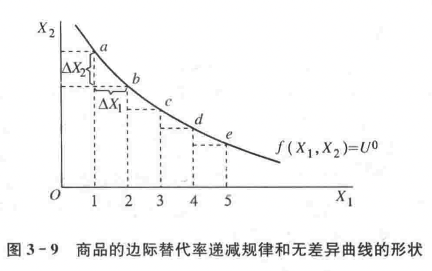

[TOC]

## 第二章 需求、供给和均衡价格

### 第一节 微观经济学的特点

微观经济学的研究对象：

- 稀缺性与选择
- 理性选择与权衡取舍
- 市场经济：个人利益与社会利益
- 政府的作用
- 微观经济学对个体经济单位考察的三个层次

### 第二节 需求

需求与需求曲线

影响需求的因素：

- 商品的自身价格；
- 消费者的收入水平；
- 相关商品的价格；
- 消费者的偏好；
- 消费者对商品的价格预期；
- 消费人数的变化。

需求定理：在其他因素保持不变的条件下，一种商品的价格上升，则对该商品的需求量减少；一种商品的价格下降，则对该商品的需求量增加。简言之，**商品的价格和需求量呈反方向变动**。

需求的变动与需求量的变动（徐高《宏观经济学二十五讲》“苹果悖论”）

- 需求的变动：需求曲线位置的移动
- 需求量的变动：沿着需求曲线的移动

### 第三节 供给

供给与供给曲线

影响供给的因素：

- 商品的自身价格；
- 生产的成本；
- 生产的技术水平；
- 相关商品的价格；
- 生产者对未来的预期；
- 生产者的人数。

供给定理：在其他因素保持不变的条件下，一种商品的价格上升，则对该商品的供给量增加；一种商品的价格下降，则该商品的供给量减少。简言之，商品的价格和供给量呈同方向变动。

供给的变动与供给量的变动：

- 供给的变动：供给曲线位置的移动
- 供给量的变动：沿着供给曲线的移动

### 第四节 均衡价格

均衡：指经济事物中有关的变量在一定条件的相互作用下所达到的一种相对静止的状态。

均衡价格的决定

均衡价格的变动：

- 需求变动的影响
  - 

- 供给变动的影响
  - 
- 需求和供给同时变动的影响
  - 

供求定理：在其他条件不变的情况下，需求变动分别引起均衡价格和均衡数量的同方向变动；供给变动引起均衡价格的反方向变动，引起均衡数量的同方向变动。

> 需求引发的市场波动中价量同向变化，供给引发的市场波动中价量反向变化。据此分析房地产调控和通货膨胀应对。（徐高《宏观经济学二十五讲》） 

均衡价格变动的分析方式：文字语言、几何图形、数学方程组。

### 第五节 需求弹性和供给弹性

弹性的含义：$弹性系数 = \frac{因变量的变动比例}{自变量的变动比例}$

设两个经济变量之间的函数关系为$Y=f(x)$，则弹性的一般公式可以表示为：
$$
e = \frac{\frac{\Delta Y}{Y}}{\frac{\Delta X}{X}} = \frac{\Delta Y}{\Delta X} \cdot\frac{X}{Y}\tag{5-1}
$$
式（5-1）中，$e$为弹性系数；$\Delta X$、$\Delta Y$分别为变量$X$、$Y$的变量。该式表示：当自变量$X$变化百分之一时，因变量$Y$变化百分之几。

若经济变量的变化量趋于无穷小，即当$\Delta X \rarr 0$且$\Delta Y \rarr 0$时，弹性的公式为：
$$
e = \lim_{\Delta X \rarr 0} \frac{\frac{\Delta Y}{Y}}{\frac{\Delta X}{X}}=\frac{\frac{dY}{Y}}{\frac{dX}{X}}=\frac{dY}{dX}\cdot\frac{X}{Y}\tag{5-2}
$$
通常将式 5-1 称为弧弹性；将式 5-2 称为点弹性。

#### 需求的价格弹性
$$
e_d = \frac{\frac{\Delta Q}{Q}}{\frac{\Delta P}{P}} = - \frac{\Delta Q}{\Delta P}\cdot\frac{P}{Q}
$$
影响需求的价格弹性的因素：

- 商品用途的广泛性；
- 商品对消费者生活的重要程度；
- 商品的消费支出在消费者预算总支出中所占的比重；
- 所考察的消费者调节需求量的时间。

需求的价格弹性与商品销售总收益有密切的关系，如果商品价格弹性大于1，即富有弹性的，其销售总收益与价格是反方向变动的。

#### 供给的价格弹性

#### 需求的交叉价格弹性

表示在一定的时期内一种商品的需求量的变动对于它的相关商品的价格的变动的反应程度。或者说，它表示在一定时期内一种商品的价格变化百分之一时所引起的另一种商品需求量变动的百分比。

可以用来判断两种商品是互为替代品还是互补品。

#### 需求的收入弹性

在影响需求的其他因素既定的前提下，可以通过需求收入弹性来判断商品时必需品、奢侈品还是劣等品。

### 第六节 运用需求、供给和均衡价格的事例

#### 易腐商品的售卖

销售者如果能够准确了解商品的需求曲线，可以以合理的价格出售全部商品，使得利润最大化。

#### 价格放开

需要结合商品的供给的价格弹性作具体分析：

- 供给的弹性大于零：限价取消 $\rarr$ 供给量提高 $\rarr$ 市场实际价格上升 $\rarr$ 需求逐渐减少 $\rarr$ 新均衡点
- 供给价格弹性为零：限价取消 $\rarr$ 供给量不变 $\rarr$ 商品的市场价格上涨

#### 最高限价和最低限价

- 最高限价：导致供不应求
- 最低限价：导致供给过剩

#### 谷贱伤农

缺乏弹性的商品，商品的价格与厂商的销售收入呈同方向变化。

蛛网模型：

商品的本期产量$Q^s$决定于前一期的价格$P_t$，即供给函数为$Q^s = f(P_{t-1})$。

商品本期的需求量$Q^d=f(P_t)$。

三个联立方程：
$$
Q_{t}^d = \alpha - \beta \cdot P_t \\
Q_{t}^s = - \delta + \gamma \cdot P_{t-1} \\
Q_{t}^d = Q_{t}^s
$$

## 第三章 消费者选择

章节提要：分析需求曲线背后的消费者选择行为，并从消费者选择行为中推导出需求曲线。

### 第一节 效用论概述

效用：指对商品满足人的欲望的能力评价，或者说，效用指消费者在消费商品时所感受到的满足程度。

基数效用：边际效用分析方法。基数效用论基于边际效用递减规律，推导出消费者需求曲线。

序数效用：无差异曲线分析方法。

#### 基数效用论

**边际效用递减规律**：在一定时间内，在其他商品的消费数量保持不变的条件下，随着消费者对某种商品消费量的增加，消费者从该商品连续增加的每一消费单位中所得到的效用增量即边际效用是递减的。

为什么边际效用递减？

- 消费者生理和心理角度，每一单位的满足程度和刺激的反应程度不同
- 商品用途的主次
- 任何一种商品的消费都有饱足点

#### 消费者均衡

研究单个消费者如何把有限的货币收入分配在各种商品的购买中以获得最大效用。也就是说，它研究单个消费者在既定收入下实现效用最大化的均衡条件。基数效用论认为，消费者实现效用最大化的均衡条件是消费者使自己花费在各种商品购买上的最后一元钱所带来的边际效用相等，且等于货币的边际效用。

#### 消费者剩余

消费者在购买一定数量的某种商品时愿意支付的最高总价格和~~实际支付的总价格~~（市场价格）之间的差额。

令反需求函数为$P^d=f(Q)$，价格$P_0$时的消费者需求量为$Q_0$,则消费者剩余为：$CS = \int_{0}^{Q_0}f(Q)dQ - P_0Q_o$。

消费者剩余的变化：

如上图所示，当价格由$P_1$上升为$P_2$时，消费者对商品的需求量由$Q_1$减少为$Q_2$，图中两个三角形的面积之差即近似梯形的阴影部分面积，便表示由于价格上升而导致的消费者剩余的损失。

### 第二节 无差异曲线

#### 偏好

偏好：消费者对任意两个商品组合所做的一个排序。

偏好的假定：

- 完全性；
- 可传递性；
- 非饱和性。

#### 无差异曲线

无差异曲线：用来表示消费者偏好相同的两种商品的所有组合。或者说，**它是表示能够给消费者带来相同的效用水平或满足程度的两种商品的所有组合**。

**效用函数**：表示某一商品组合给消费者所带来的效用水平。用公式表示为：$U=f(X_1, X_2)=U^0$，其中$U^0$为常数，表示一个不变的效用水平，该效用函数也被称为等效用函数。

无差异曲线的三个基本特征：

- 特征一：由于通常假设效用函数是连续的，所以，在同一坐标平面上的任何两条无差异曲线之间，可以有无数条无差异曲线；
- 特征二：在同一坐标平面上的任何两条无差异曲线均不会相交；
- 特征三：凸向原点。（取决于边际替代率递减规律）

#### 边际替代率

在维持效用水平不变的前提下，消费者增加一单位某种商品的消费数量时所需要放弃的另一种商品的消费数量，被称为商品的边际替代率。商品 1 对商品 2 的边际替代率（用商品1替代商品2）的定义公式为：
$$
MRS_{12} = - \frac{\Delta X_2}{\Delta X_1}
$$
当商品数量的变化趋于无穷小时，则商品的边际替代率公式为：
$$
MRS_{12} = \lim_{\Delta X_1 \rarr 0} - \frac{\Delta X_2}{\Delta X_1} = - \frac{dX_2}{dX_1}
$$
由上式可知，无差异曲线上某一点的边际替代率就是无差异曲线在该点的斜率的绝对值。

**边际替代率递减规律**：在维持效用水平不变的前提下，随着一种商品的消费数量连续增加，消费者为得到每一单位的这种商品所需要放弃的另一种商品的消费数量是递减的。

无差异曲线的特殊形状：

- 完全替代品：两种商品之间的替代比例固定不变，$U(x_1,x_2)=ax_1+bx_2$
- 完全互补品：两种商品必须按固定不变的比例同时被使用，$U(x_1,x_2)=min\{ax_1,bx_2\}$

### 第三节 效用最大化与消费者选择（消费者的均衡）

#### 预算线

预算线表示消费者的收入和商品的价格给定的条件下，消费者的全部收入所能购买到的两种商品的各种组合。

预算线的变动：

- 第一种情况：两商品的价格$P_1$和$P_2$不变，消费者的收入$I$发生变化；
- 第二种情况：消费者的收入$I$不变，两种商品的价格$P_1$和$P_2$同比例同方向发生变化；
- 第三种情况：消费者的收入$I$不变，商品 1 的价格$P_1$发生变化而商品2的价格$P_2$保持不变。
- 第四种情况：消费者收入$I$与两种商品价格$P_1$和$P_2$都同比例同方向发生变化。

#### 效用最大化和消费者选择

在已知消费者偏好和预算约束的前提下，就可以将消费者无差异曲线和预算线结合在一起，分析消费者追求效用最大化的购买选择行为。

消费者最优购买选择行为必须满足：

- 第一，最优的商品购买组合必须是消费者最偏好的商品组合；
- 第二，最优的商品购买组合必须位于给定的预算线上。

消费者效用最大化的均衡条件：在一定的预算约束下，为了实现最大化的效用，消费者应该选择最优的商品组合，使得两商品的边际替代率等于两商品的价格之比。

也可以理解为：在消费者的均衡点上，消费者愿意用一单位的某种商品域交换另一种商品的数量（即$MRS_{12}$），应该等于该消费者能够在市场上用一单位的这种商品去交换得到的另一种商品的数量（即$\frac{P_1}{P_2}$）。

### 第四节 **价格变化**和**收入变化**对消费者均衡的影响

提要：本节属于比较静态分析，先后考察商品价格变化和消费者收入变化对消费者均衡的影响，并在此基础上分别推导出消费者的需求曲线和恩格尔曲线。

#### 价格变化：价格-消费曲线

在其他条件均保持不变时，一种商品价格的变化会使消费者效用最大化的均衡点的位置发生移动，并由此得到价格-消费曲线。**价格消费曲线是在消费者的偏好、收入以及其他商品价格不变的条件下，与某一种商品的不同价格水平相联系的消费者效用最大化的均衡点的轨迹**。

#### 消费者的需求曲线

由价格-消费曲线可以推导出消费者的需求曲线：分析上图中价格-消费曲线的三个均衡点$E_1,E_2$和$E_3$，可以看出，在每一个均衡点上都存在着商品 1 和价格 1 需求量之间一一对应的关系。根据商品 1 价格和需求量之间这种对应关系，把每一个$P_1$的数值和相应的均衡数量$X_1$绘制在商品的价格-数量坐标图上，便可得到单个消费者的需求曲线。

#### 收入变化：收入-消费曲线

在其他条件不变而仅有消费者的收入水平发生变化时，也会改变消费者效用最大化的均衡量的变化，并由此可以得到收入-消费曲线。**收入-消费曲线是在消费者的偏好和商品的价格不变的条件下，与消费者的不同收入水平相联系的消费者效用最大化的均衡点的轨迹。**

#### 恩格尔曲线

由消费者的收入-消费曲线可以推导出消费者的恩格尔曲线

恩格尔曲线表示消费者在每一收入水平对某商品的需求量。上图中，图 1 是正常品，商品 1 的需求量 $X_1$ 随着收入水平 $I$ 的上升而增加；恩格尔曲线中图（b）和收入-消费曲线图（b）是相对应的，在一定的收入水平上，图中的商品 1 由正常品转为劣等品。

### 第五节 替代效应和收入效应

一种**商品价格的变化**，会对消费产生两种影响：

- 一是消费者实际收入水平发生变化，实际收入水平的变化被定义为效用水平的变化；
- 二是使商品的相对价格发生变化。

这两种影响都会引起商品的需求量的变化，这种变化可以分解为替代效应和收入效应。即**总效应 = 替代效应 + 收入效应**。其中：

- 替代效应：由商品的价格变动所引起的**商品相对价格**的变动，进而由商品的**相对价格**所引起的商品需求量的变动；
- 收入效应：由商品的价格变动所引起的**实际收入水平**的变动，进而由**实际收入水平**变动所引起的商品的需求量的变动。

#### 正常品的替代效应和收入效应

利用**补偿预算线**来辅助分析

补偿预算线是指：当商品的价格发生变化导致消费者的实际收入水平发生变化时，设想给予消费者一定数量的**货币补偿**以使消费者回到原有的实际收入水平即原有的效用水平。（例如下图中的FG线）

对于正常品来说，替代效应与价格呈反方向变动，收入效应也与价格呈反方向变动，在它们的共同作用下，总效应必定与价格呈反方向的变动。正因为如此，正常品的需求曲线向右下方倾斜的。

#### 劣等品的替代效应和收入效应

对于劣等品来说，替代效应与价格呈反方向的变动，收入效应与价格呈同方向的变动，而且，在大多数的场合，替代效应的作用大于收入效应的作用。所以，总效应与价格呈反方向的变动，相应的需求曲线是向右下方倾斜的。

#### 吉芬品的替代效应和收入效应

吉芬品是一种特殊的劣等品。作为劣等品，吉芬品的替代效应与价格呈现反方向的变动，收入效应则与价格呈现同方向的变动。吉芬品的特殊性就在于：它的收入效应的作用很大，以至超过了替代效应的作用，从而使得总效应与价格呈现同方向的变动。这也就是吉芬品的需求曲线呈现出向右上方倾斜的特殊形状的原因。

### 第六节 市场需求曲线

商品的市场需求曲线是指在一定时期内在各个不同的价格水平上市场中所有消费者对某种商品的需求量。商品市场的需求数量是每一个价格水平上所有消费者对该商品需求数量的**加总**。

假定某商品市场上有$n$个消费者，他们各自具有不同的个人需求函数，则根据以上分析，可得该商品的市场需求函数为：
$$
D(P) = \sum_{i=1}^n D_i(P) 
$$
其中，$i = 1,2,...,n$，$D_i(P)$为单个消费者$i$的需求函数，$D(P)$为市场需求函数。

### 第七节 不确定性和选择

## 第四章 生产技术

### 第一节 厂商和生产的基本概念

#### 厂商

在微观经济学中，生产者亦称为厂商或企业，指能够作出统一的生产决策的单个经济单位。

厂商主要有个人企业、合伙制企业和公司制企业三种组织形式。

#### 生产

#### 生产函数

厂商的生产过程可以被看成是从投入生产要素到生产出产品的过程。生产要素一般划分为四个类型：劳动、土地、资本和企业家才能。

生产函数表示在一定时期内在给定的技术条件下，生产中所使用的各种生产要素的数量与所能生产的最大产量之间的关系。**任何生产函数都是以给定的生产技术为前提的**。

假定$X_1,X_2,...,X_n$顺次表示某产品生产过程中所使用的$n$种生产要素的投入数量，$Q$表示所能生产的最大产量，则生产函数为：
$$
Q = f(X_1, X_2, ... , X_n)
$$

该生产函数表示一定时期内在既定的生产技术下的生产要素组合：$(X_1,X_2,...,X_3)$，所能生产的最大产量$Q$。

为了简化分析，通常假定生产中只使用劳动（$L$）和资本（$K$）两种生产要素，则生产函数为：
$$
Q = f(L, K)
$$

#### 生产的短期与长期

生产的短期是指生产者来不及调整全部生产要素的数量，至少有一种生产要素的数量是固定不变的生产周期。

生产的长期指生产者可以调整全部生产要素的生产周期。

### 第二节 短期生产函数

假定资本投入量是固定的，以$\bar K$表示，劳动投入量是可变的，以$L$表示，则生产函数可以写成：
$$
Q = f(L, \bar K)
$$
短期生产函数表示，在生产技术和资本投入量给定的条件下，由可变要素劳动投入量变化所导致的最大产量的变化。

#### 总产量、平均产量和边际产量的概念

劳动的总产量$TP_L$表示与可变要素劳动的每一投入数量相对应的最大总产量。其定义公式为：$TP_L=f(L, \bar K)$

劳动平均产量$AP_L$表示平均每一单位可变要素劳动的投入量所生产的产量。其定义公式为：$AP_L=\frac{TP_L(L, \bar K)}{L}$。

劳动的边际产量$MP_L$表示增加一单位可变要素劳动的投入量所增加的产量。其定义公式为：$MP_L = \frac{\Delta TP_L(L,\bar K)}{\Delta L}$。

#### 边际报酬递减规律

边际报酬递减规律：在**技术水平**和**其他因素不变**的条件下，在连续等量地将某一种可变生产要素投入增加到其他一种或几种数量固定不变的生产要素上去的过程中，该可变要素的边际产量先是递增的，在这种可变要素的投入量增加到一定数量之后，其边际产量便是递减的了。

边际报酬递减规律成立的原因在于：在任何产品的短期生产中，一种可变要素和其他固定要素之间均存在一个最佳的投入数量组合。

**边际报酬递减规律发生作用有前提条件：一是生产技术给定；二是其他因素保持不变。**因此，任何前提条件的变化都会导致边际产量曲线的变动。

技术进步：以农业生产为例，在技术进步的作用下，农业劳动的边际产量会带来总产量变化，即总产量曲线通常会上移。

其他因素的变化：其他因素的变化也会使边际曲线位置移动，如工人操作技能的提高，会使得边际曲线位置上移。

#### 总产量、平均产量和边际产量的相互关系

劳动边际产量$MP_L$曲线先上升，并在$B'$点达到最高点，之后便呈下降趋势，这体现了边际报酬递减规律。

边际产量和总产量的关系：

在劳动的边际产量为正值的生产阶段，每增加一单位劳动投入量都能使总产量得到增加。但劳动的边际产量一旦递减，就意味着固定资本量实现了充分利用，从而使得总产量达到最大值。之后，在劳动的边际产量继续递减为负值的生产阶段，则每增加一单位劳动投入量都会使得总产量下降。

**只要边际产量是正的，则总产量总是增加的；只要边际产量是负的，则总产量是减少的；当边际产量为零时，则总产量达到最大值点。**

边际产量和平均产量的关系：

当边际产量大于平均产量时，平均产量是上升的；当边际产量小于平均产量时，平均产量是下降的；当边际产量等于平均产量时，平均产量达到最大值。

平均产量和总产量的关系：

连接坐标原点与总产量曲线上任何一点的连线的斜率，均可表示为相应的平均产量值。

#### 短期生产的三个阶段

在第 I 阶段，任何厂商都会连续增加劳动投入量，直至将生产扩展到第 II 阶段，由此得到产量增加的全部好处；

在第 III 阶段即使劳动要素是免费供给的，理性的生产者也不会增加劳动投入量，而是通过减少劳动投入量将生产收缩退回到第 II 阶段，由此扭转不利的生产局面。

由此可见，在短期生产中，厂商既不会将生产停留在第 I 阶段，也不会将生产扩展到第 III 阶段。事实上，厂商都是在第 II 阶段进行生产，这样不仅可以得到在第 I 阶段持续增加劳动投入所带来的全部好处，而且可以避免将劳动投入增加到第 III 阶段所带来的不利影响。总之，**第 II 阶段是理性厂商短期生产的决策区间，或称生产要素合理的投入区间**。

### 第三节 长期生产函数

假定厂商使用两种可变要素劳动和资本来生产一种产品，则生产函数可以写为：
$$
Q =f(L, K)
$$
长期生产函数中劳动和资本两种要素都可变，可能呈现出无数多的要素和产量之间的复杂关系。如何描述长期生产的要素投入组合和产出之间的基本联系呢？一是等产量曲线；二是规模报酬。

#### 等产量曲线

假定给定的产量为$Q^0$，则长期生产函数可写为：
$$
Q = f(L, K) = Q^0
$$
表示如果产量给定，那么厂商在长期可以灵活地选择要素投入组合。

**等产量曲线**是在技术水平不变的条件下，生产同一产量水平的两种生产要素投入量的所有不同组合的轨迹。

#### 边际技术替代率

在维持产量水平不变的条件下，增加一单位某种生产要素的投入量时所需要减少的另一要素的投入量，被称为两要素的边际技术替代率。**劳动**对**资本**的边际技术替代率为：
$$
MRTS_{LK} = - \frac{\Delta K}{\Delta L}
$$
边际技术替代率递减规律：在维持产量不变的前提下，在一种可变要素的投入量不断增加的过程中，每一单位这种可变要素所能替代的另一种可变要素的数量是递减的。

等产量曲线凸向原点的特征，也是由边际技术替代率递减规律所决定的。等产量曲线上每一点的边际技术替代率就是等产量曲线在该点的斜率的绝对值，所以在边际替代率递减规律的作用下，等产量曲线的斜率的绝对值是递减的，即等产量曲线展现出凸向原点的一般特征。

#### 不同形状的等产量曲线

- 固定替代比率的生产函数：表示每一产量水平上的任何两种生产要素之间的替代比率都是固定的。$Q = aL+bK$，式中，常数$a, b > 0$。

- 固定投入比例的生产函数（里昂惕夫生产函数）：表示每一产量水平上任何一对要素投入量之间的比例都是固定的。$Q=\min \{\frac{L}{u}, \frac{K}{v}\}$

- 柯布-道格拉斯生产函数：$Q=AL^\alpha K^\beta$

#### 规模报酬

令生产函数为$Q=f(L,K)$，且常数$\lambda > 1$，于是有：

- 如果$f(\lambda L, \lambda K)= \lambda f(L, K)$，则为规模报酬不变；
- 如果$f(\lambda L, \lambda K) > \lambda f(L, K)$，则为规模报酬递增；
- 如果$f(\lambda L, \lambda K) < \lambda f(L, K)$，则为规模报酬递减。

## 第五章 成本

### 第一节 成本的基本概念

机会成本是指生产者所放弃的使用相同的生产要素在其他用途中所能获得的最高收入。

显成本指厂商在生产要素市场上购买或租用他人所拥有的生产要素的实际支出。

隐成本指厂商自己所拥有的且被用于自己企业生产过程中的那些生产要素的总价格。

会计成本：显成本

经济成本：显成本+隐成本

会计利润：总收益-显成本

经济利润：会计利润-隐成本

沉没成本：已经支付且无法回收的成本。

### 第二节 成本最小化

#### 等成本线

等成本线和预算约束线非常类似

等成份线是在既定的成本和生产要素价格条件下，生产者可以购买的两种生产要素的各种不同数量组合的轨迹。假定生产要素市场上既定的劳动的价格即工资率为$w$，既定的资本的价格即利息率为$r$，厂商既定的成本支出为$C$，则成本方程为：
$$
C = wL + rK
$$

#### 成本最小化

成本最小化的均衡点事等产量线和等成本线的切点，其中等产量线代表一定的技术水平，等成本线的斜率表示要素的相对价格。

厂商应该选择的最优生产要素组合为：使得两要素的边际技术替代率等于两要素的价格之比，从而实现既定产量条件下的最小成本。

#### 产量最大化

#### 扩展线和生产总成本

在生产要素的价格、生产技术和其他条件不变时，如果企业改变成本，等成本线就会发生平移；如果企业改变产量，等产量曲线就会发生平移。这些不同的等产量线将与不同的等成本线相切，形成一系列不同的生产均衡点，这些生产均衡点的轨迹就是扩展线。

扩展线表示：在生产要素价格、生产技术和其他条件不变的情况下，当生产的成本或产量变化时，厂商必然会沿着扩展线来选择最优的生产要素组合，从而时间既定产量条件下的最小成本，或实现既定成本条件下的最大产量。扩展线是厂商在长期扩张或收缩生产时所必须遵循的最优路径。

#### 扩展线与长期总成本

长期总成本表示在每一个产量水平上的最小生产成本。

#### 扩展线与短期总成本

短期总成本表示每一产量水平上的最小生产成本。

### 第三节 短期成本曲线

随着产量的变化，各类短期成本去洗哦安所呈现的特征及其相互之间的关系。本节将会看到短期生产的边际报酬递减规律对于理解短期陈本曲线的特征的作用。

#### 由短期生产函数到短期总成本函数

$$
STC(Q) = w \cdot L(Q) + r \cdot \bar K\\
STC(Q) = \phi(Q) + b
$$

#### 短期成本的分类

在短期，厂商的成本有不变成本和可变成本之分。具体的讲，厂商的短期成本有一下七种：总不变成本、总可变成本、总成本、平均不变成本、平均可变成本、平均总成本和边际成本。

总不变成本（TFC）：厂商在短期内为生产一定数量的产品对不变生产要素所支付的总成本。

总可变成本（TVC）：厂商在短期内为生产一定数量的产品对可变生产要素支付的总成本。

总成本（TC）：厂商在短期内为生产一定数量的产品对全部生产要素所支付的总成本。$TC = TFC + TVC(Q)$

平均不变成本（AFC）：厂商在短期内平均每生产一单位产品所支付的不变成本。$AFC = \frac{TFC}{Q}$

平均可变成本（AVC）：厂商在短期内平均每生产一单位所支付的可变成本。$AVC = \frac{TVC(Q)}{Q}$

平均总成本（AC）：厂商在短期内平均每一单位所支付的全部成本。

边际成本（MC）厂商在短期内增加一单位产量时所增加的总成本。

#### 短期成本变动的决定因素：边际报酬递减规律

在短期生产中，边际产量的递增阶段对应的是边际成本的递减阶段，边际产量的递减阶段对应的是边际成本递增阶段，与边际产量的最大值相对应的是边际成本的最小值。正因为如此，在边际报酬递减规律作用下边际成本 MC 曲线表现出先降后升的 U 型特征。

#### 由总成本曲线到平均成本曲线和边际成本曲线

#### 短期产量曲线与短期成本曲线之间的关系

### 第四节 长期成本曲线

厂商的长期成本曲线可以分为长期总成本（LTC）、长期平均成本（LAC）和长期边际成本（LMC）。

#### 长期总成本函数和长期总成本曲线

长期总成本（LTC）：厂商在长期中在每一产量水平上通过选择最优的生产规模所能达到的最低总成本。

**长期总成本曲线是无数条短期总成本曲线的包络线。**

#### 长期平均成本函数和长期平均成本曲线

长期平均成本LAC表示厂商在长期内按产量平均计算的最低总成本。$LAC(Q)=\frac{LTC(Q)}{Q}$

长期平均成本曲线是无数条短期平均成本曲线的包络线。

长期平均成本曲线的形状：长期生产的规模经济和规模不经济的作用，决定了长期平均成本曲线 LAC 表现出先下降后上升的 U 型特征。

长期平均成本曲线的位置移动：企业的外在经济是由于厂商的生产活动所依赖的外界环境得到改善而产生的；如果厂商的生产活动所依赖的外界环境恶化了，则为企业的外在不经济。**外在经济和外在不经济是由企业以外的因素引起的，它影响厂商的长期平均成本 LAC 曲线的位置。**

#### 长期边际成本函数和长期边际成本曲线

长期边际成本 LMC 表示厂商在长期内增加一单位所引起的最低总成本的增量。$LMC = \frac{\Delta LTC(Q)}{\Delta Q}$

长期边际成本曲线的形状：长期边际成本曲线呈 U 型，它与长期平均成本曲线相交于长期平均成本曲线的最低点。其原因在于：根据边际量和平均量之间的关系，当 LAC 处于下降段时，LMC 曲线一定处于 LAC 曲线的下方，也就是说，此时 LMC < LAC，LMC 将 LAC 拉下；相反，当 LAC 曲线处于上升段时，LMC 曲线一定位于 LAC 曲线的上方，也就是说，此时LMC > LAC，LMC 将 LAC 拉上。

#### 干中学：降低长期成本

干中学和学习曲线

学习效应和规模经济

## 第六章 完全竞争市场

### 第一节 厂商和市场的类型

市场是物品买卖双方相互作用并得以决定其交易价格和交易数量的一种组织形式或制度安排。

在经济分析中，根据不同的市场结构的特征，将市场划分为完全竞争市场、垄断竞争市场、寡头市场和垄断市场。决定市场类型划分的主要因素有以下四个：

- 市场上厂商的数目；
- 厂商所生产的产品的差别程度；
- 单个厂商对市场价格的控制程度；
- 厂商进入或者退出一个行业的难易程度。

### 第二节 利润最大化

完全竞争市场的条件：

- 市场上有大量的买者和卖者；
- 市场上每一个厂商提供的商品都是完全同质的；
- 所有的资源都具有完全的流动性；
- 信息是完全的。

#### 完全竞争厂商的需求曲线

在完全竞争市场上，由于厂商是既定市场价格的接受者，所以，**完全竞争厂商的需求曲线是一条由既定市场价格水平出发的水平线**。

#### 完全竞争厂商的收益曲线

厂商的收益就是厂商的销售收入。厂商的收益可以分为总收益（TR）、平均收益（AR）和边际收益（MR）。

**总收益**：指厂商按一定价格出售的一定数量产品所获得的全部收入。在完全竞争市场上，以 $P$ 表示既定的市场价格，以 $Q$ 表示销售总量，总收益的定义公式为：$TR(Q) = P \cdot Q$。

**平均收益**：指厂商平均每销售一单位产品所获得的收入。平均收益的定义公式为：$AR(Q) = \frac{TR(Q)}{Q}$。

**边际收益**：指厂商每增加一单位产品销售所获得的总收入的增量。边际收益的定义公式为：$MR(Q) = \frac{\Delta TR(Q)}{\Delta Q}$。

#### 完全竞争厂商的收益曲线

**完全竞争厂商的平均收益曲线 AR 曲线、边际收益曲线 MR 曲线和需求曲线 d 三条线重叠，它们都用同一条由既定价格水平出发的水平线来表示**。其理由是：在厂商的每一销售水平都有 AR=MR=P，且厂商的需求曲线本身就是一条由既定价格水平出发的水平线。

此外，完全竞争厂商的总收益 TR 曲线是一条由原点出发的斜率不变的上升直线。其理由在于，在每一个销售水平，MR 值都是 TR 曲线的斜率，且 MR 值等于固定不变的价格水平。用公式表示为：
$$
MR = \frac{d TR}{d Q}=\frac{d(P \cdot Q)}{dQ}=P
$$

#### 利润最大化的均衡条件

边际收益 MR 等于边际成本 MC 是厂商实现利润最大化的均衡条件。

### 第三节 完全竞争厂商的短期均衡和短期供给曲线

#### 完全竞争厂商的短期均衡

在短期，厂商是在给定的生产规模下，通过对产量的调整来实现 MR = SMC 的利润最大化的均衡条件。

厂商短期生产与否的决策与固定成本无关，它只取决于市场价格 P 和平均可变成本 AVC 的比较。

综上，完全竞争厂商的短期均衡条件是：
$$
MR = SMC
$$
式中，$MR=AR=P$。在短期均衡时，厂商的利润可以大于零，也可以等于零，或者小于零。

#### 完全竞争厂商的短期供给曲线

厂商的短期供给曲线应该用 SMC 曲线上大于和等于 AVC 曲线最低点的部分来表示，即用 SMC 曲线上大于和等于停止营业点的部分来表示。

完全竞争厂商的短期供给曲线是向右上方倾斜的，它表示了商品的价格和供给量之间同方向变化的关系。更重要的是，完全竞争厂商的短期供给曲线表示厂商在每一个价格水平的供给量都是能够给它带来最大利润或最小亏损的最优产量。

### 第四节 完全竞争行业的短期供给曲线

一个行业的短期供给曲线由该行业内所有厂商的短期供给曲线的水平加总得到。

行业的短期供给曲线是向右上方倾斜的，它表示市场的产品价格和市场的短期供给量呈同方向的变动。而且，行业的短期供给曲线上与每一价格水平相对应的供给量都是可以使全体厂商在该价格水平获得最大利润或实现最小亏损的最优产量。

#### 短期生产者剩余

在短期，厂商的生产者剩余指厂商在提供一定数量的某种产品时实际接受的总支付和愿意接受的最小总支付之间的差额。用数学公式表示为：

令厂商的短期饭供给函数为$P^s = f(Q)$，且市场价格为$P_0$时厂商的供给量为$Q_0$，则厂商的短期生产者剩余为：
$$
PS = P_0Q_0 - \int _{0}^{Q_0} f(Q)dQ
$$
此外，在短期内，由于所有产量的边际成本之和就等于总可变成本，因此，厂商的短期生产者剩余也可以用厂商的总收益和总可变成本之间的差额来表示，即$PS = TR - TVC$。

市场的短期生产者剩余

### 第五节 完全竞争厂商的长期均衡

在完全竞争厂商的长期生产中，所有的生产要素都是可变的，厂商是通过对全部生产要素的调整，来实现 MR = LMC 的利润最大化的均衡原则的。**在完全竞争厂商的市场价格给定的条件下，厂商在长期生产中对全部生产要素的调整可以表现为两个方面：一方面是对最优的生产规模的选择，另一方面表现为进入或退出一个行业的决策**。

 #### 厂商对最优生产规模的选择

在长期，厂商通过对最优生产规模的选择，使自己的状况得到改善，从而获得了比在短期内所能获得的更大的利润。

#### 厂商进出一个行业

## 第七章 不完全竞争市场

### 第一节 垄断

#### 垄断市场的条件

垄断市场是指行业中只有唯一的一个厂商的市场组织。垄断市场具有三点条件：

- 市场上只有唯一的一个厂商生产和销售商品；
- 该厂商生产和销售的商品没有任何相近的替代品；
- 其他任何厂商进入该行业都极为困难或不可能。

因此，垄断厂商可以**控制**和**操纵**市场价格。

形成垄断的原因主要以下四点：

- 独家厂商控制了生产某种商品的全部资源或基本资源的供给；
- 独家厂商拥有生产某种商品的专利权；
- 政府的特许；
- 自然垄断。

#### 垄断厂商的需求曲线和收益曲线

需求曲线：由于垄断市场中只有一个厂商，因此市场的需求曲线就是垄断厂商所面临的需求曲线，它是一条向右下方倾斜的曲线。

收益曲线：厂商的需求曲线特征将决定厂商的收益曲线的特征。

边际收益、商品价格和需求的价格弹性

#### 垄断厂商的短期均衡

### 第二节 垄断竞争

### 第三节 寡头

### 第四节 不同市场的比较

