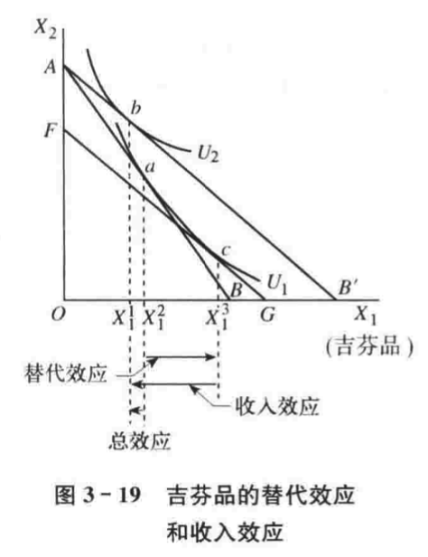

## 第二章 需求、供给和均衡价格

### 第一节 微观经济学的特点

微观经济学的研究对象：

- 稀缺性与选择
- 理性选择与权衡取舍
- 市场经济：个人利益与社会利益
- 政府的作用
- 微观经济学对个体经济单位考察的三个层次

### 第二节 需求

需求与需求曲线

影响需求的因素：

- 商品的自身价格；
- 消费者的收入水平；
- 相关商品的价格；
- 消费者的偏好；
- 消费者对商品的价格预期；
- 消费人数的变化。

需求定理：在其他因素保持不变的条件下，一种商品的价格上升，则对该商品的需求量减少；一种商品的价格下降，则对该商品的需求量增加。简言之，**商品的价格和需求量呈反方向变动**。

需求的变动与需求量的变动（徐高《宏观经济学二十五讲》“苹果悖论”）

- 需求的变动：需求曲线位置的移动
- 需求量的变动：沿着需求曲线的移动

### 第三节 供给

供给与供给曲线

影响供给的因素：

- 商品的自身价格；
- 生产的成本；
- 生产的技术水平；
- 相关商品的价格；
- 生产者对未来的预期；
- 生产者的人数。

供给定理：在其他因素保持不变的条件下，一种商品的价格上升，则对该商品的供给量增加；一种商品的价格下降，则该商品的供给量减少。简言之，商品的价格和供给量呈同方向变动。

供给的变动与供给量的变动：

- 供给的变动：供给曲线位置的移动
- 供给量的变动：沿着供给曲线的移动

### 第四节 均衡价格

均衡：指经济事物中有关的变量在一定条件的相互作用下所达到的一种相对静止的状态。

均衡价格的决定

均衡价格的变动：

- 需求变动的影响
  - 

- 供给变动的影响
  - 
- 需求和供给同时变动的影响：看谁变动的效果占主导地位。
  - 

供求定理：在其他条件不变的情况下，需求变动分别引起均衡价格和均衡数量的同方向变动；供给变动引起均衡价格的反方向变动，引起均衡数量的同方向变动。

> 需求引发的市场波动中价量同向变化，供给引发的市场波动中价量反向变化。
>
> 据此分析房地产调控目标”价跌量涨”和通货膨胀应对。（徐高《宏观经济学二十五讲》） 

均衡价格变动的分析方式：文字语言、几何图形、数学方程组。

### 第五节 需求弹性和供给弹性

弹性的含义：$弹性系数 = \frac{因变量的变动比例}{自变量的变动比例}$

因变量对自变量的反应程度：自变量变动 1%，会导致因变量变动 n% 。

设两个经济变量之间的函数关系为$Y=f(x)$ ，则弹性的一般公式可以表示为：
$$
e = \frac{\frac{\Delta Y}{Y}}{\frac{\Delta X}{X}} = \frac{\Delta Y}{\Delta X} \cdot\frac{X}{Y}\tag{5-1}
$$
式（5-1）中，$e$为弹性系数；$\Delta X$、$\Delta Y$分别为变量$X$、$Y$的变量。该式表示：**当自变量 $X$ 变化百分之一时，因变量 $Y$ 变化百分之几**。

若经济变量的变化量趋于无穷小，即当 $\Delta X \rarr 0$ 且 $\Delta Y \rarr 0$ 时，弹性的公式为：
$$
e = \lim_{\Delta X \rarr 0} \frac{\frac{\Delta Y}{Y}}{\frac{\Delta X}{X}}=\frac{\frac{dY}{Y}}{\frac{dX}{X}}=\frac{dY}{dX}\cdot\frac{X}{Y}\tag{5-2}
$$
通常将式 5-1 称为弧弹性；将式 5-2 称为点弹性。

---

【补充】弹性和斜率的关系

经济学中，横坐标往往表示因变量，纵坐标表示自变量。

越陡峭斜率越大，越平坦斜率越小。

【练习题】假定需求函数为$Q_d = 500-100P$，计算：

- （1）价格在 2 元和 4 元之间需求的价格弧弹性；
- （2）价格在 2 元和 4 元时需求的价格点弹性。

答案：（1）$\frac{3}{2}$；（2）4 。

---

#### 需求的价格弹性
$$
e_d = \frac{\frac{\Delta Q}{Q}}{\frac{\Delta P}{P}} = - \frac{\Delta Q}{\Delta P}\cdot\frac{P}{Q}
$$
影响需求的价格弹性的因素：

- 商品用途的广泛性；
- 商品对消费者生活的重要程度；
- 商品的消费支出在消费者预算总支出中所占的比重；
- 所考察的消费者调节需求量的时间。

需求的价格弹性与商品销售总收益有密切的关系，如果商品价格弹性大于1，即富有弹性的，其销售总收益与价格是反方向变动的。

#### 供给的价格弹性

#### 需求的交叉价格弹性

表示在一定的时期内一种商品的需求量的变动对于它的相关商品的价格的变动的反应程度。或者说，它表示在一定时期内一种商品的价格变化百分之一时所引起的另一种商品需求量变动的百分比。

可以用来判断两种商品是互为替代品还是互补品。

- $E_{xy} > 0$，替代品；
- $ E_{xy} < 0$，互补品；
- $E_{xy} = 0$，不相关。

#### 需求的收入弹性

在影响需求的其他因素既定的前提下，可以通过需求收入弹性来判断商品时必需品、奢侈品还是劣等品。

- 需求收入弹性大于 1 ，收入增加需求增加，为奢侈品；
- 需求收入弹性介于 0～1 之间，为必需品；
- 需求收入弹性小于 1 ，收入增加需求下降，为劣等品。

### 第六节 运用需求、供给和均衡价格的事例

#### 易腐商品的售卖

销售者如果能够准确了解商品的需求曲线，可以以合理的价格出售全部商品，使得利润最大化。

#### 价格放开

需要结合商品的供给的价格弹性作具体分析：

- 供给的弹性大于零：限价取消 $\rarr$ 供给量提高 $\rarr$ 市场实际价格上升 $\rarr$ 需求逐渐减少 $\rarr$ 新均衡点
- 供给价格弹性为零：限价取消 $\rarr$ 供给量不变 $\rarr$ 商品的市场价格上涨

#### 最高限价和最低限价

- 最高限价：导致供不应求
- 最低限价：导致供给过剩

#### 谷贱伤农

缺乏弹性的商品，商品的价格与厂商的销售收入呈同方向变化。

蛛网模型：

商品的本期产量 $Q^s$ 决定于前一期的价格 $P_t$ ，即供给函数为 $Q^s = f(P_{t-1})$ 。

商品本期的需求量 $Q^d=f(P_t)$ 。

三个联立方程：
$$
Q_{t}^d = \alpha - \beta \cdot P_t \\
Q_{t}^s = - \delta + \gamma \cdot P_{t-1} \\
Q_{t}^d = Q_{t}^s
$$

## 第三章 消费者选择

章节提要：分析需求曲线背后的消费者选择行为，并从消费者选择行为中推导出需求曲线。

### 第一节 效用论概述

效用：指对商品满足人的欲望的能力评价。或者说，效用指消费者在消费商品时所感受到的满足程度。

基数效用：边际效用分析方法。基数效用论基于边际效用递减规律，推导出消费者需求曲线。

序数效用：无差异曲线分析方法。

#### 基数效用论

**边际效用递减规律**：在一定时间内，在其他商品的消费数量保持不变的条件下，随着消费者对某种商品消费量的增加，消费者从该商品连续增加的每一消费单位中所得到的效用增量即边际效用是递减的。

为什么边际效用递减？

- 消费者生理和心理角度，每一单位的满足程度和刺激的反应程度不同
- 商品用途的主次
- 任何一种商品的消费都有饱足点

#### 消费者均衡

研究单个消费者如何把有限的货币收入分配在各种商品的购买中以获得最大效用。也就是说，**它研究单个消费者在既定收入下实现效用最大化的均衡条件**。基数效用论认为，消费者实现效用最大化的均衡条件是消费者使自己花费在各种商品购买上的最后一元钱所带来的边际效用相等，且等于货币的边际效用。

#### 消费者剩余

消费者在购买一定数量的某种商品时愿意支付的最高总价格和~~实际支付的总价格~~（市场价格）之间的差额。令反需求函数为 $P^d=f(Q)$ ，价格 $P_0$ 时的消费者需求量为 $Q_0$ ，则消费者剩余为：$CS = \int_{0}^{Q_0}f(Q)dQ - P_0Q_o$ 。

消费者剩余的变化：

如上图所示，当价格由 $P_1$ 上升为 $P_2$ 时，消费者对商品的需求量由 $Q_1$ 减少为 $Q_2$ ，图中两个三角形的面积之差即近似梯形的阴影部分面积，便表示由于价格上升而导致的消费者剩余的损失。

### 第二节 无差异曲线

#### 偏好

偏好：消费者对任意两个商品组合所做的一个排序。

偏好的假定：

- 完全性；
- 可传递性；
- 非饱和性。

#### 无差异曲线

无差异曲线：用来表示消费者偏好相同的两种商品的所有组合。或者说，**它是表示能够给消费者带来相同的效用水平或满足程度的两种商品的所有组合**。

**效用函数**：表示某一商品组合给消费者所带来的效用水平。用公式表示为：$U=f(X_1, X_2)=U^0$ ，其中 $U^0$ 为常数，表示一个不变的效用水平，该效用函数也被称为等效用函数。

无差异曲线的三个基本特征：

- 特征一：由于通常假设效用函数是连续的，所以，在同一坐标平面上的任何两条无差异曲线之间，可以有无数条无差异曲线；
- 特征二：在同一坐标平面上的任何两条无差异曲线均不会相交；
- 特征三：凸向原点。（取决于边际替代率递减规律）

#### **边际替代率**

**在维持效用水平不变的前提下，消费者增加一单位某种商品的消费数量时所需要放弃的另一种商品的消费数量，被称为商品的边际替代率。**商品 1 对商品 2 的边际替代率（用商品 1 替代商品 2 ，需要放弃商品 1 的数量）的定义公式为：
$$
MRS_{12} = - \frac{\Delta X_2}{\Delta X_1}
$$

---

【举例】边际替代率的计算

apple 效用为 1；banana 效用为 2。apple 对 banana 的边际替代率为？

~~MRS_ab = apple/banana = 1/2~~

$MRS_{apple, banana} = - \frac{banana}{apple} = - 2$

apple 对 banana 的边际替代率为 2 ，即要增加一单位 banana 需要放弃 2 单位 apple 。

【推导】边际替代率的推导
$$
\Delta X_1\cdot MU_1 + \Delta X_2 \cdot MU_2 = 0 \\
\Delta X_1 \cdot MU_1 = - \Delta X_2 MU_2 \\
- \frac{\Delta X_2}{\Delta X_1} = \frac{MU_1}{MU_2} = MRS_{12}
$$

---

当商品数量的变化趋于无穷小时，则商品的边际替代率公式为：
$$
MRS_{12} = \lim_{\Delta X_1 \rarr 0} - \frac{\Delta X_2}{\Delta X_1} = - \frac{dX_2}{dX_1}
$$
由上式可知，无差异曲线上某一点的边际替代率就是无差异曲线在该点的**斜率的绝对值**。

**边际替代率递减规律**：**在维持效用水平不变的前提下，随着一种商品的消费数量连续增加，消费者为得到每一单位的这种商品所需要放弃的另一种商品的消费数量是递减的。**

无差异曲线的特殊形状：

- 完全替代品：两种商品之间的替代比例固定不变，$U(x_1,x_2)=ax_1+bx_2$
- 完全互补品：两种商品必须按固定不变的比例同时被使用，$U(x_1,x_2)=min\{ax_1,bx_2\}$

### 第三节 效用最大化与消费者选择

#### 预算线

预算线表示消费者的收入和商品的价格给定的条件下，消费者的全部收入所能购买到的两种商品的各种组合。

预算线的变动：

- 第一种情况：两商品的价格 $P_1$ 和 $P_2$ 不变，消费者的收入 $I$ 发生变化；
- 第二种情况：消费者的收入 $I$ 不变，两种商品的价格 $P_1$ 和 $P_2$ 同比例同方向发生变化；
- 第三种情况：消费者的收入 $I$ 不变，商品 1 的价格 $P_1$ 发生变化而商品 2 的价格 $P_2$ 保持不变。
- 第四种情况：消费者收入 $I$ 与两种商品价格 $P_1$ 和 $P_2$ 都同比例同方向发生变化。

#### 效用最大化和消费者选择

在已知消费者偏好和预算约束的前提下，就可以将消费者无差异曲线和预算线结合在一起，分析消费者追求效用最大化的购买选择行为。

消费者最优购买选择行为必须满足：

- 第一，最优的商品购买组合必须是消费者最偏好的商品组合；
- 第二，最优的商品购买组合必须位于给定的预算线上。

**消费者效用最大化的均衡条件：在一定的预算约束下，为了实现最大化的效用，消费者应该选择最优的商品组合，使得两商品的边际替代率等于两商品的价格之比。**

也可以理解为：在消费者的均衡点上，消费者愿意用一单位的某种商品域交换另一种商品的数量（即 $MRS_{12}$ ），应该等于该消费者能够在市场上用一单位的这种商品去交换得到的另一种商品的数量（即 $\frac{P_1}{P_2}$ ）。

---

【补充】求解效用最大化

公式证明：拉格朗日乘数法

---

### 第四节 **价格变化**和**收入变化**对消费者均衡的影响

提要：本节属于比较静态分析，先后考察商品价格变化和消费者收入变化对消费者均衡的影响，并在此基础上分别推导出消费者的需求曲线和恩格尔曲线。

#### 价格变化：价格-消费曲线

在其他条件均保持不变时，一种商品价格的变化会使消费者效用最大化的均衡点的位置（不同相对价格下的最佳消费组合）发生移动，并由此得到价格-消费曲线。**价格消费曲线是在消费者的偏好、收入以及其他商品价格不变的条件下，与某一种商品的不同价格水平相联系的消费者效用最大化的均衡点的轨迹**。

#### 消费者的需求曲线

由价格-消费曲线可以推导出消费者的需求曲线：分析上图中价格-消费曲线的三个均衡点 $E_1,E_2$ 和 $E_3$ ，可以看出，在每一个均衡点上都存在着商品 1 和价格 1 需求量之间一一对应的关系。根据商品 1 价格和需求量之间这种对应关系，把每一个 $P_1$ 的数值和相应的均衡数量 $X_1$ 绘制在商品的价格-数量坐标图上，便可得到单个消费者的需求曲线。

#### 收入变化：收入-消费曲线

在其他条件不变而仅有消费者的收入水平发生变化时，也会改变消费者效用最大化的均衡量的变化，并由此可以得到收入-消费曲线。**收入-消费曲线是在消费者的偏好和商品的价格不变的条件下，与消费者的不同收入水平相联系的消费者效用最大化的均衡点的轨迹。**

#### 恩格尔曲线

由消费者的收入-消费曲线可以推导出消费者的恩格尔曲线

恩格尔曲线表示消费者在每一收入水平对某商品的需求量。上图中，图 1 是正常品，商品 1 的需求量 $X_1$ 随着收入水平 $I$ 的上升而增加；恩格尔曲线中图（b）和收入-消费曲线图（b）是相对应的，在一定的收入水平上，图中的商品 1 由正常品转为劣等品。

### 第五节 替代效应和收入效应

一种**商品价格的变化**，会对消费产生两种影响：

- 一是消费者实际收入水平发生变化，实际收入水平的变化被定义为效用水平的变化；
- 二是使商品的相对价格发生变化。

这两种影响都会引起商品的需求量的变化，这种变化可以分解为替代效应和收入效应。即**总效应 = 替代效应 + 收入效应**。其中：

- 替代效应：由商品的价格变动所引起的**商品相对价格**的变动，进而由商品的**相对价格**所引起的商品需求量的变动；
- 收入效应：由商品的价格变动所引起的**实际收入水平**的变动，进而由**实际收入水平**变动所引起的商品的需求量的变动。

#### 正常品的替代效应和收入效应

利用**补偿预算线**来辅助分析

补偿预算线是指：当商品的价格发生变化导致消费者的实际收入水平发生变化时，设想给予消费者一定数量的**货币补偿**以使消费者回到原有的实际收入水平即**原有的效用水平**。（例如下图中的 FG 线）

通过补偿预算线 FG ，可以将总效应 $X_1^1X_1^3$ 分解为两部分，其中，替代效应为 $X_1^1X_1^2$ ，收入效应为 $X_1^2X_1^3$ 。

对于正常品来说，替代效应与价格呈反方向变动，收入效应也与价格呈反方向变动，在它们的共同作用下，总效应必定与价格呈反方向的变动。正因为如此，正常品的需求曲线向右下方倾斜的。

#### 劣等品的替代效应和收入效应

商品 1 的价格 $P_1$ 下降所引起的商品 1 的需求量的变化总效应为 $X_1^1X_1^2$ ，它是正的替代效应 $X_1^1X_1^3$ 和负的收入效应 $X_1^2X_1^3$ 之和。由于替代效应的绝对值大于收入效应的绝对值，或者说，由于替代效应的作用大于收入效应的作用，所以总效应为正值。

对于劣等品来说，替代效应与价格呈反方向的变动，收入效应与价格呈同方向的变动，而且，在大多数的场合，替代效应的作用大于收入效应的作用。所以，总效应与价格呈反方向的变动，相应的需求曲线是向右下方倾斜的。

#### 吉芬品的替代效应和收入效应

吉芬品是一种特殊的劣等品。作为劣等品，吉芬品的替代效应与价格呈现反方向的变动，收入效应则与价格呈现同方向的变动。吉芬品的特殊性就在于：它的收入效应的作用很大，以至超过了替代效应的作用，从而使得总效应与价格呈现同方向的变动。这也就是吉芬品的需求曲线呈现出向右上方倾斜的特殊形状的原因。

---

【补充】替代效应与收入效应（希克斯分解）

希克斯分解假定效用不变，即最初的无差异曲线位置不变。

价格效应的画法

替代效应和收入效应是同时发生的，但是从不同的角度进行剖析。

替代效应：效用不变的情况下，用便宜的替代涨价的（贵的）。

替代效应画图：（1）保持无差异曲线不变；（2）画一条既与无差异曲线相切又与新的预算线平行的预算线。

收入效应：物价变化经由实际收入的变化而影响需求量。

收入效应画图：预算线向外平移。

【补充】斯勒茨基分解和斯勒茨基方程

斯勒茨基分解：

第一步：替代效应：相对价格发生变动，同时调整货币收入使**购买力不变**；

第二步：收入效应：对购买力进行调整，同时使相对价格保持不变。

斯勒茨基方程：

计算必须对货币收入做多大调整，才能使原来的消费束按转动后的预算线恰好能支付得起：
$$
p_1x_1 + p_2x_2 = m
$$
$p_1$ 价格下降至 $p_1'$，同时为保持购买力不变将收入调整为 $m'$，可得：
$$
p_1'x_1 + p_2x_2 = m'
$$
 两式相减：
$$
m'-m = p_1'x_1 + p_2x_2 - p_1x_1  -p_2x_2 \\
\Delta m = (p_1'-p_1)x_1 = \Delta p_1 x_1
$$

---

### 第六节 市场需求曲线

商品的市场需求曲线是指在一定时期内在各个不同的价格水平上市场中所有消费者对某种商品的需求量。商品市场的需求数量是每一个价格水平上所有消费者对该商品需求数量的**加总**。

假定某商品市场上有$n$个消费者，他们各自具有不同的个人需求函数，则根据以上分析，可得该商品的市场需求函数为：
$$
D(P) = \sum_{i=1}^n D_i(P) 
$$
其中，$i = 1,2,...,n$，$D_i(P)$ 为单个消费者$i$的需求函数，$D(P)$ 为市场需求函数。

### 第七节 不确定性和选择

不确定性是指经济行为者在事先不能准确地知道自己的某个决策的结果，或者说，经济行为者的一个决策的可能结果不止一种。

期望效用：消费者在不确定条件下可能得到的各种结果的效用的加权平均数，$E(U(W_1,W_2))=pU(W_1) + (1-p)U(W_2)$。

期望值的效用：$U(pW_1+(1-p)W_2)$

从数学的角度讲，令消费者的效用函数为 $U=U(W)$，且 $U'(W) > 0$ 。当 $U''(W)<0$ 时，消费者为风险回避者；当 $U''(W)>0$ 时，消费者为风险爱好者；当 $U''(W)=0$ 时，消费者为风险中立者。 

## 第四章 生产技术

### 第一节 厂商和生产的基本概念

#### 厂商

在微观经济学中，生产者亦称为厂商或企业，指能够作出统一的生产决策的单个经济单位。

厂商主要有个人企业、合伙制企业和公司制企业三种组织形式。

#### 生产

#### 生产函数

厂商的生产过程可以被看成是从投入生产要素到生产出产品的过程。生产要素一般划分为四个类型：劳动、土地、资本和企业家才能。

生产函数表示在一定时期内在给定的技术条件下，生产中所使用的各种生产要素的数量与所能生产的最大产量之间的关系。**任何生产函数都是以给定的生产技术为前提的**。

假定 $X_1,X_2,...,X_n$ 顺次表示某产品生产过程中所使用的 $n$ 种生产要素的投入数量，$Q$ 表示所能生产的最大产量，则生产函数为：
$$
Q = f(X_1, X_2, ... , X_n)
$$

该生产函数表示一定时期内在既定的生产技术下的生产要素组合 $(X_1,X_2,...,X_3)$ ，所能生产的最大产量 $Q$ 。

为了简化分析，通常假定生产中只使用劳动（$L$）和资本（$K$）两种生产要素，则生产函数为：
$$
Q = f(L, K)
$$

#### 生产的短期与长期

生产的短期是指生产者来不及调整全部生产要素的数量，至少有一种生产要素的数量是固定不变的生产周期。

生产的长期指生产者可以调整全部生产要素的生产周期。

生产的短期和长期的区分是以能否变动全部要素投入数量为标准的。对于不同产品的生产而言，其短期和长期的时期长度各异。

### 第二节 短期生产函数

假定资本投入量是固定的，以 $\bar K$ 表示，劳动投入量是可变的，以 $L$ 表示，则生产函数可以写成：
$$
Q = f(L, \bar K)
$$
短期生产函数表示，在生产技术和资本投入量给定的条件下，由可变要素劳动投入量变化所导致的最大产量的变化。

#### 总产量、平均产量和边际产量的概念

劳动的总产量 $TP_L$ 表示与可变要素劳动的每一投入数量相对应的最大总产量。其定义公式为：$TP_L=f(L, \bar K)$。

劳动平均产量 $AP_L$ 表示平均每一单位可变要素劳动的投入量所生产的产量。其定义公式为：$AP_L=\frac{TP_L(L, \bar K)}{L}$。

劳动的边际产量 $MP_L$ 表示增加一单位可变要素劳动的投入量所增加的产量。其定义公式为：$MP_L = \frac{\Delta TP_L(L,\bar K)}{\Delta L}$。

#### 边际报酬递减规律

边际报酬递减规律：在**技术水平**和**其他因素不变**的条件下，在连续等量地将某一种可变生产要素投入增加到其他一种或几种数量**固定不变**的生产要素上去的过程中，该可变要素的边际产量先是递增的，在这种可变要素的投入量增加到一定数量之后，其边际产量便是递减的了。

边际报酬递减规律成立的原因在于：在任何产品的短期生产中，一种可变要素和其他固定要素之间均存在一个最佳的投入数量组合。

**边际报酬递减规律发生作用有前提条件：一是生产技术给定；二是其他因素保持不变。**因此，任何前提条件的变化都会导致边际产量曲线的变动。

技术进步的变化：以农业生产为例，在技术进步的作用下，农业劳动的边际产量会带来总产量变化，即总产量曲线通常会上移。

其他因素的变化：其他因素的变化也会使边际曲线位置移动，如工人操作技能的提高，会使得边际曲线位置上移。

#### 总产量、平均产量和边际产量的相互关系

劳动边际产量 $MP_L$ 曲线先上升，并在 $B'$ 点达到最高点，之后便呈下降趋势，这体现了边际报酬递减规律。

边际产量和总产量的关系：

在劳动的边际产量为正值的生产阶段，每增加一单位劳动投入量都能使总产量得到增加。但劳动的边际产量一旦递减，就意味着固定资本量实现了充分利用，从而使得总产量达到最大值。之后，在劳动的边际产量继续递减为负值的生产阶段，则每增加一单位劳动投入量都会使得总产量下降。

**只要边际产量是正的，则总产量总是增加的；只要边际产量是负的，则总产量是减少的；当边际产量为零时，则总产量达到最大值点。**

边际产量和平均产量的关系：

当边际产量大于平均产量时，平均产量是上升的；当边际产量小于平均产量时，平均产量是下降的；当边际产量等于平均产量时，平均产量达到最大值。

平均产量和总产量的关系：

**连接坐标原点与总产量曲线上任何一点的连线的斜率，均可表示为相应的平均产量值。**

#### 短期生产的三个阶段

在第 I 阶段，以边际产量曲线大于平均曲线时为分界点。这个阶段，任何厂商都会连续增加劳动投入量，直到将生产拓展到第二阶段，由此得到产量增加的全部好处；

直至将生产扩展到第 II 阶段，边际曲线小于平均曲线至边际曲线等于零这一段。第二阶段是理性厂商短期生产的决策区间；

在第 III 阶段，边际曲线小于零，总产量曲线下降。第三阶段，即使劳动要素是免费供给的，理性的生产者也不会增加劳动投入量，而是通过减少劳动投入量将生产收缩回到第二阶段，由此扭转极其不利的生产局面。

由此可见，在短期生产中，厂商既不会将生产停留在第 I 阶段，也不会将生产扩展到第 III 阶段。事实上，厂商都是在第 II 阶段进行生产，这样不仅可以得到在第 I 阶段持续增加劳动投入所带来的全部好处，而且可以避免将劳动投入增加到第 III 阶段所带来的不利影响。总之，**第 II 阶段是理性厂商短期生产的决策区间，或称生产要素合理的投入区间**。

### 第三节 长期生产函数

假定厂商使用两种可变要素劳动和资本来生产一种产品，则生产函数可以写为：
$$
Q =f(L, K)
$$
长期生产函数中劳动和资本两种要素都可变，可能呈现出无数多的要素和产量之间的复杂关系。**如何描述长期生产的要素投入组合和产出之间的基本联系呢？一是等产量曲线；二是规模报酬**。

#### 等产量曲线

假定给定的产量为 $Q^0$ ，则长期生产函数可写为：
$$
Q = f(L, K) = Q^0
$$
上式表示如果产量给定，那么厂商在长期可以灵活地选择要素投入组合。

**等产量曲线**是在技术水平不变的条件下，生产同一产量水平的两种生产要素投入量的所有不同组合的轨迹。

#### 边际技术替代率

在维持产量水平不变的条件下，增加一单位某种生产要素的投入量时所需要减少的另一要素的投入量，被称为两要素的边际技术替代率。**劳动**对**资本**的边际技术替代率为：
$$
MRTS_{LK} = - \frac{\Delta K}{\Delta L}
$$
边际技术替代率递减规律：在维持产量不变的前提下，在一种可变要素的投入量不断增加的过程中，每一单位这种可变要素所能替代的另一种可变要素的数量是递减的。

边际技术替代率递减的主要原因是：在产量给定的前提下，在资本投入量很多和劳动投入量很少的情况下，用劳动去替代资本相对是比较容易的，少量的劳动就可以替代较大数量的资本；但是，在劳动投入增加到相当多的数量和资本投入被替代到只剩下相当少的数量的情况下，再用劳动去替代资本就将是很困难的了。

等产量曲线凸向原点的特征，也是由边际技术替代率递减规律所决定的。等产量曲线上每一点的边际技术替代率就是等产量曲线在该点的斜率的绝对值，所以在边际替代率递减规律的作用下，等产量曲线的斜率的绝对值是递减的，即等产量曲线展现出凸向原点的一般特征。

#### 不同形状的等产量曲线

- 固定替代比率的生产函数：表示每一产量水平上的任何两种生产要素之间的替代比率都是固定的。$Q = aL+bK$，式中，常数 $a, b > 0$ 。

- 固定投入比例的生产函数（里昂惕夫生产函数）：表示每一产量水平上任何一对要素投入量之间的比例都是固定的。$Q=\min \{\frac{L}{u}, \frac{K}{v}\}$ 。

- 柯布-道格拉斯生产函数：$Q=AL^\alpha K^\beta$ 。

#### 规模报酬

令生产函数为 $Q=f(L,K)$ ，且常数 $\lambda > 1$ ，于是有：

- 如果 $f(\lambda L, \lambda K)= \lambda f(L, K)$ ，则为规模报酬不变；
- 如果 $f(\lambda L, \lambda K) > \lambda f(L, K)$ ，则为规模报酬递增；
- 如果 $f(\lambda L, \lambda K) < \lambda f(L, K)$ ，则为规模报酬递减。

## 第五章 成本

### 第一节 成本的基本概念

#### 成本

机会成本：指生产者所放弃的使用相同的生产要素在其他用途中所能获得的最高收入。

显成本：指厂商在生产要素市场上购买或租用他人所拥有的生产要素的实际支出。

隐成本： 指厂商**自己所拥有**的且被用于自己企业生产过程中的那些生产要素的总价格。

会计成本：显成本

经济成本：显成本 + 隐成本

#### 利润

会计利润：总收益 - 会计成本 = 总收益 - 显成本

经济利润：总收益 - 经济成本 = 总收益 -（显成本 + 隐成本）= 会计利润 - 隐成本

正常利润：企业所有者对自己提供管理才能支付的报酬

沉没成本：已经支付且无法回收的成本。因为这部分成本即使厂商退出生产也无法消失，所以沉没成本不应该影响企业未来的生产决策。

### 第二节 成本最小化

#### 等成本线

（等成本线和预算约束线非常类似）

等成本线是在既定的成本和生产要素价格条件下，生产者可以购买的两种生产要素的各种不同数量组合的轨迹。假定生产要素市场上既定的**劳动**的价格即工资率为 $w$ ，既定的**资本**的价格即利息率为 $r$ ，厂商既定的成本支出为 $C$ ，则成本方程为：
$$
C = wL + rK
$$

#### 成本最小化

成本最小化的均衡点是等产量线和等成本线的切点，其中等产量线代表一定的技术水平，等成本线的斜率表示要素的相对价格。

厂商应该选择的最优生产要素组合为：使得两要素的边际技术替代率等于两要素的价格之比，从而实现既定产量条件下的最小成本。

为了实现既定产量条件下的最小成本，厂商应该通过对两要素投入量的不断调整，使得花费在每一种生产要素上的最后一单位的成本支出所带来的边际产量相等。

#### 对偶问题：产量最大化

只有在两要素的边际技术替代率和两要素的价格之比相等时，生产者才能实现生产的均衡。

#### 扩展线和生产总成本

扩展线：在生产要素的价格、生产技术和其他条件不变时，如果企业改变成本，等成本线就会发生平移；如果企业改变产量，等产量曲线就会发生平移。这些**不同的等产量线将与不同的等成本线相切**，形成一系列不同的生产均衡点，这些生产均衡点的轨迹就是扩展线。

扩展线表示：在生产要素价格、生产技术和其他条件不变的情况下，当生产的成本或产量变化时，厂商必然会沿着扩展线来选择最优的生产要素组合，从而实现既定产量条件下的最小成本，或实现既定成本条件下的最大产量。**扩展线是厂商在长期扩张或收缩生产时所必须遵循的最优路径。**

#### 扩展线与长期总成本

长期总成本表示在每一个产量水平上的最小生产成本。

#### 扩展线与短期总成本

短期总成本表示每一产量水平上的最小生产成本。

### 第三节 短期成本曲线

随着产量的变化，各类短期成本曲线所呈现的特征及其相互之间的关系。本节将会看到短期生产的边际报酬递减规律对于理解短期成本曲线的特征的作用。

#### 由短期生产函数到短期总成本函数

短期生产函数为：
$$
Q = f(L, \bar K)
$$
短期生产函数表示，在资本投入量固定的情况下，可变生产要素劳动 $L$ 和总产量 $Q$ 之间存在一一对应的关系。可以反过来理解为：**厂商根据不同的产出量选择不同的劳动投入量**。据此，假定生产要素市场上劳动的价格 $w$ 和资本的价格 $r$ 是给定的，则可用下式来表示厂商每一产量上的短期总成本：
$$
STC(Q) = w \cdot L(Q) + r \cdot \bar K\\
STC(Q) = \Phi(Q) + b
$$

上式中，$\Phi(Q)$ 表示可变成本 $w \cdot L(Q)$ ，$b$ 表示固定成本 $r \cdot \bar k$ 。

#### 由短期总产量曲线到短期总成本曲线

由于短期固定成本为 $r\cdot\bar k$ ，所以将短期可变成本曲线向上**垂直平移** $r\cdot\bar k$ 单位，可得到短期总成本曲线 $STC(Q)$ 。

#### 短期成本的分类

在短期，厂商的成本有不变成本和可变成本之分。具体的讲，厂商的短期成本有以下**七种**：总不变成本、总可变成本、总成本、平均不变成本、平均可变成本、平均总成本和边际成本。

总不变成本（TFC）：厂商在短期内为生产一定数量的产品对不变生产要素所支付的总成本。

总可变成本（TVC）：厂商在短期内为生产一定数量的产品对可变生产要素支付的总成本。

总成本（TC）：厂商在短期内为生产一定数量的产品对全部生产要素所支付的总成本。$TC = TFC + TVC(Q)$

平均不变成本（AFC）：厂商在短期内平均每生产一单位产品所支付的不变成本。$AFC = \frac{TFC}{Q}$

平均可变成本（AVC）：厂商在短期内平均每生产一单位所支付的可变成本。$AVC = \frac{TVC(Q)}{Q}$

平均总成本（AC）：厂商在短期内平均每一单位所支付的全部成本。

边际成本（MC）：厂商在短期内增加一单位产量时所增加的总成本。

短期成本曲线综合图：

- 图（a）中：TC 曲线和 TVC 曲线各自存在一个拐点 B 和 C 。在拐点前，TC 曲线和 TVC 曲线的斜率是递减的；在拐点以后，TC 曲线和 TVC 曲线的斜率是递增的；
- 图（b）中：不仅 AVC 曲线、AC 曲线和 MC 曲线军呈现 U 形特征，而且 MC 曲线与 AVC 曲线相交于 AVC 曲线的最低点 F ，与 AC 曲线相交于 AC 曲线的最低点 D 。
- 结合图（a）和图（b）：
  - 图（b）中 MC 曲线的最低点 A 恰好对应图（a）中 TC 曲线的拐点 B 和 TVC 曲线的拐点 C ，或者说，**A、B、C 三点出现在同一产量水平上**。 
  - 图（b）中 AVC 曲线达到最低点 F 时，图（a）中的 TVC 曲线恰好有一条从原点出发的切线，与 TVC 相交于 G 点，或者说，**G、F 两点同时出现在同一产量水平上**。
  - 图（b）中 AC 曲线达到最低点 D 时，图（a）中的 TC 曲线恰好有一条从原点出发的切线，与 TC 曲线相切于 E 点，或者说，**E、D 两点同时出现在同一产量水平上**。

#### 短期成本变动的决定因素：边际报酬递减规律

在短期生产中，边际产量的递增阶段对应的是边际成本的递减阶段，边际产量的递减阶段对应的是边际成本递增阶段，与边际产量的最大值相对应的是边际成本的最小值。正因为如此，**在边际报酬递减规律作用下边际成本 MC 曲线表现出先降后升的 U 形特征**。

从边际报酬递减规律所决定的 U 形的 MC 曲线出发，可以解释其他的短期成本曲线的特征以及短期成本曲线之间的关系。

- TC 曲线、TVC 曲线和 MC 曲线之间的关系：
- AC 曲线、AVC 曲线和 MC 曲线之间的关系：
- MC 对产量变化的反应快于 AC 和 AVC；
- AC 曲线的最低点 D 的出现既慢于又高于 AVC 曲线的最低点 F 。

#### 由**总成本曲线**到**平均成本曲线**和**边际成本曲线**

#### **短期产量曲线**与**短期成本曲线**之间的关系

### 第四节 长期成本曲线

厂商的长期成本曲线可以分为长期总成本（LTC）、长期平均成本（LAC）和长期边际成本（LMC）。

#### 长期总成本函数和长期总成本曲线

长期总成本（LTC）：厂商在长期中在每一产量水平上通过选择最优的生产规模所能达到的最低总成本。

**长期总成本曲线是无数条短期总成本曲线的包络线。**

#### 长期平均成本函数和长期平均成本曲线

长期平均成本LAC表示厂商在长期内按产量平均计算的最低总成本。$LAC(Q)=\frac{LTC(Q)}{Q}$

长期平均成本曲线是无数条短期平均成本曲线的包络线。

长期平均成本曲线的形状：长期生产的规模经济和规模不经济的作用，决定了长期平均成本曲线 LAC 表现出先下降后上升的 U 形特征。

长期平均成本曲线的位置移动：企业的外在经济是由于厂商的生产活动所依赖的外界环境得到改善而产生的；如果厂商的生产活动所依赖的外界环境恶化了，则为企业的外在不经济。**外在经济和外在不经济是由企业以外的因素引起的，它影响厂商的长期平均成本 LAC 曲线的位置。**

#### 长期边际成本函数和长期边际成本曲线

长期边际成本 LMC 表示厂商在长期内增加一单位所引起的最低总成本的增量。$LMC = \frac{\Delta LTC(Q)}{\Delta Q}$

长期边际成本曲线的形状：长期边际成本曲线呈 U 形，它与长期平均成本曲线相交于长期平均成本曲线的最低点。其原因在于：根据边际量和平均量之间的关系，当 LAC 处于下降段时，LMC 曲线一定处于 LAC 曲线的下方，也就是说，此时 LMC < LAC，LMC 将 LAC 拉下；相反，当 LAC 曲线处于上升段时，LMC 曲线一定位于 LAC 曲线的上方，也就是说，此时LMC > LAC，LMC 将 LAC 拉上。

#### 干中学：降低长期成本

干中学和学习曲线

学习效应和规模经济

## 第六章 完全竞争市场

### 第一节 厂商和市场的类型

市场是物品买卖双方相互作用并得以决定其交易价格和交易数量的一种组织形式或制度安排。

在经济分析中，根据不同的市场结构的特征，将市场划分为完全竞争市场、垄断竞争市场、寡头市场和垄断市场。决定市场类型划分的主要因素有以下四个：

- 市场上厂商的数目；
- 厂商所生产的产品的差别程度；
- 单个厂商对市场价格的控制程度；
- 厂商进入或者退出一个行业的难易程度。

### 第二节 利润最大化

完全竞争市场的条件：

- 市场上有大量的买者和卖者；
- 市场上每一个厂商提供的商品都是完全同质的；
- 所有的资源都具有完全的流动性；
- 信息是完全的。

#### 完全竞争厂商的需求曲线

在完全竞争市场上，由于厂商是既定市场价格的接受者，所以，**完全竞争厂商的需求曲线是一条由既定市场价格水平出发的水平线**。

在完全竞争市场中，单个消费者和单个厂商无力影响市场价格，他们中的每一个人都是被动地接受既定的市场价格，但这并不意味着完全竞争市场的价格是固定不变的。在其他一些因素的影响下，如消费者收入水平的普遍提高、先进技术的推广、政府有关政策的作用等，众多消费者的需求量和众多生产者的供给量发生变化时，市场的供求曲线位置有可能发生移动，从而形成新的均衡价格。

#### 完全竞争厂商的收益曲线

厂商的收益就是厂商的销售收入。厂商的收益可以分为总收益（TR）、平均收益（AR）和边际收益（MR）。

**总收益**：指厂商按一定价格出售的一定数量产品所获得的全部收入。在完全竞争市场上，以 $P$ 表示既定的市场价格，以 $Q$ 表示销售总量，总收益的定义公式为：$TR(Q) = P \cdot Q$。

**平均收益**：指厂商平均每销售一单位产品所获得的收入。平均收益的定义公式为：$AR(Q) = \frac{TR(Q)}{Q}$。

**边际收益**：指厂商每增加一单位产品销售所获得的总收入的增量。边际收益的定义公式为：$MR(Q) = \frac{\Delta TR(Q)}{\Delta Q}$。

#### 完全竞争厂商的收益曲线

厂商的收益取决于市场上对其产品的需求状况，或者说，厂商的收益取决于厂商的需求曲线的特征。在以后的分析中，假定厂商的销售量等于厂商所面临的需求量。这样，完全竞争厂商的水平的需求曲线又可以表示为：在每一个销售量上，厂商的销售价格是固定不变的，于是必然会有厂商的平均收益等于边际收益，且等于既定的市场价格的结论，即必有**AR= MR=P**。

**完全竞争厂商的平均收益曲线 AR 曲线、边际收益曲线 MR 曲线和需求曲线 d 三条线重叠，它们都用同一条由既定价格水平出发的水平线来表示**。其理由是：在厂商的每一销售水平都有 AR=MR=P，且厂商的需求曲线本身就是一条由既定价格水平出发的水平线。

此外，**完全竞争厂商的总收益 TR 曲线是一条由原点出发的斜率不变的上升直线**。其理由在于，在每一个销售水平，MR 值都是 TR 曲线的斜率，且 MR 值等于固定不变的价格水平。用公式表示为：
$$
MR = \frac{d TR}{d Q}=\frac{d(P \cdot Q)}{dQ}=P
$$

#### 利润最大化的均衡条件

以完全竞争厂商短期生产为例，推导利润最大化的均衡条件。

边际收益 MR 等于边际成本 MC 是厂商实现利润最大化的均衡条件。

SMC与一条由既定价格水平$P_e$出发的水平的需求曲线$d$相交的$E$点，是厂商实现最大利润的生产均衡点，相应的产量$Q^*$就是厂商实现最大利润的均衡产量。

不管增加产量，还是减少产量，厂商都是在寻找能够带来最大利润的均衡产量，而这个均衡产量就是使得$MR =SMC$的产量。所以，**边际收益MR等于边际成本MC厂商实现利润最大化的均衡条件**。

$MR=MC$是利润最大化的均衡条件。数学证明如下：

令厂商的利润等式为：
$$
\pi(Q) = TR(Q) - TC(Q)
$$
满足上式利润最大化的一阶条件为：
$$
\frac{d \pi(Q)}{dQ} = \frac{dTR(Q)}{dQ}-\frac{dTC(Q)}{dQ} \\
= MR(Q) - MC(Q) = 0
$$
即：$MR(Q) = MC(Q)$。

### 第三节 完全竞争厂商的短期均衡和短期供给曲线

#### 完全竞争厂商的短期均衡

在短期，厂商是在给定的生产规模下，通过对产量的调整来实现 $MR = SMC$ 的利润最大化的均衡条件。

当厂商实现 $MR=SMC$ 时，有可能获得利润，也有可能亏损，把各种可能的情况都考虑在内，完全竞争厂商的短期均衡可以表现出下图五种情况：

- 图（a）：在$Q^*$的产量上，平均收益为$EQ^*$，平均成本为$FQ^*$，由于平均收益大于平均成本，厂商获得利润。阴影部分为总利润。
- 图（b）：厂商的利润为零，但厂商正常利润实现了。在E点。厂商既无利润，也无亏损，所以该均衡点也被称为厂商的**收支相抵点**。
- 图（c）：厂商的平均收益小于平均成本，厂商是亏损的，其亏损量相当于阴影部分。但由于在$Q^*$的产量上，**厂商的平均收益AR大于平均可变成本AVC，所以厂商虽然亏损，但会继续生产**。这是因为只有这样，厂商才能同全部收益弥补全部可变成本之后还有剩余，以弥补在短期内总是存在的不变成本的一部分。所以，在这种亏损情况下，生产好于不生产。
- 图（d）：厂商的需求曲线d与AVC曲线相切于AVC曲线的最低点。此时，长生平均收益AR等于平均可变成本AVC，厂商可以继续生产，也可以不生产，也就是说，厂商生产和不生产的结果是一样的。**所以，该均衡点也被称为停止营业点或关闭点**。
- 图（e）：在均衡产量$Q^*$上，厂商的亏损量相当于阴影部分的面积。此时，厂商的平均收益AR小于平均可变成本AVC，厂商将停止生产。

由以上分析可见，**厂商短期生产与否的决策与固定成本无关，它只取决于市场价格 P 和平均可变成本 AVC 的比较**。

综上，完全竞争厂商的短期均衡条件是：
$$
MR = SMC
$$
式中，$MR=AR=P$。在短期均衡时，厂商的利润可以大于零，也可以等于零，或者小于零。

#### 完全竞争厂商的短期供给曲线

供给曲线是指在每一价格水平厂商愿意而且能够提供的产品的数量。**在完全竞争市场上，厂商的短期供给曲线可以利用短期边际成本曲线SMC曲线来表示**。

为什么？因为对于完全竞争厂商来说，有$P=MR$，所以完全竞争厂商的短期均衡条件$MR=SMC$，也可以写成$P=MC(Q)$。可以理解为：在每一给定的价格水平$P$，完全竞争厂商应该选择最优的产量Q，使得$P=MC(Q)$成立，从而实现最大利润。

但必须注意到，厂商只有在$P \geq AVC$时，才会进行生产，而在$P < AVC$时，厂商会停止生产。所以，**厂商的短期供给曲线应该用 SMC 曲线上大于和等于 AVC 曲线最低点的部分来表示，即用 SMC 曲线上大于和等于停止营业点的部分来表示**。

由上图（b）可见，完全竞争厂商的短期供给曲线是向右上方倾斜的，它表示了商品的价格和供给量之间同方向变化的关系。更重要的是，**完全竞争厂商的短期供给曲线表示厂商在每一个价格水平的供给量都是能够给它带来最大利润或最小亏损的最优产量**。

### 第四节 完全竞争**行业**的短期供给曲线

一个行业的短期供给曲线由该行业内所有厂商的短期供给曲线的**水平加总**得到。

完全竞争市场的短期供给曲线保持了完全竞争厂商的短期供给曲线的基本特征。即：行业的短期供给曲线是向右上方倾斜的，它表示市场的产品价格和市场的短期供给量呈同方向的变动。而且，行业的短期供给曲线上与每一价格水平相对应的供给量都是可以使全体厂商在该价格水平获得最大利润或实现最小亏损的最优产量。

#### 短期生产者剩余

##### 厂商的短期生产者剩余

在短期，厂商的生产者剩余指厂商在提供一定数量的某种产品时实际接受的总支付和愿意接受的最小总支付之间的差额。厂商的短期生产者剩余的含义是：**在生产中，只要每一单位产品的价格高于生产该单位产品的边际成本，厂商进行生产就是有利的**。

令厂商的短期供给函数为$P^s = f(Q)$，且市场价格为$P_0$时厂商的供给量为$Q_0$，则厂商的短期生产者剩余用数学公式表示为：
$$
PS = P_0Q_0 - \int _{0}^{Q_0} f(Q)dQ
$$
或者：
$$
 PS = P_0Q_0 - \int _{0}^{Q_0} SMC(Q)dQ
$$
此外，在短期内，由于所有产量的边际成本之和就等于总可变成本，因此，厂商的短期生产者剩余也可以用厂商的总收益和总可变成本之间的差额来表示，即$PS = TR - TVC$。

$PS = TR -TVC = \pi + TFC$，因此：

- 若 $\pi \geq 0$，则厂商的短期生产者剩余$PS \geq TFC$；
- 若 $\pi < 0$，则厂商的短期生产者剩余$PS < TFC$。

##### 市场的短期生产者剩余

图中阴影部分便是市场的短期生产者剩余。

### 第五节 完全竞争厂商的长期均衡

在完全竞争厂商的长期生产中，所有的生产要素都是可变的，厂商是通过对全部生产要素的调整，来实现 $MR = LMC$ 的利润最大化的均衡原则的。**在完全竞争厂商的市场价格给定的条件下，厂商在长期生产中对全部生产要素的调整可以表现为两个方面：**

- 一方面是对最优的生产规模的选择；
- 另一方面表现为进入或退出一个行业的决策。

 #### 厂商对最优生产规模的选择

在图中，假定完全竞争市场的价格为$P_0$。在$P_0$的价格水平，厂商应该选择哪一个生产规模，才能获得最大的利润呢？

- 在短期内：假定厂商已拥有的生产规模以$SAC_1$曲线和$SMC_1$曲线表示。由于在短期内生产规模是给定的，所以厂商只能在既定的生产规模下进行生产。根据短期利润最大化的均衡条件：$MR =SMC$，厂商选择的最优产量为$Q_1$，所获得的利润为图中较小的一块阴影部分面积$FP_0E_1G$；
- 在长期内：根据长期利润最大化的条件$MR =LMC$，厂商会达到长期均衡点$E_2$，并且选择$SAC_2$曲线和$SMC_2$曲线所代表的最优生产规模进行生产，相应的最优产量为$Q_2$，所获得的利润为图中较大的那一块阴影部分的面积$HP_0E_2I$。

显然可见，在长期，厂商通过对最优生产规模的选择，使自己的状况得到改善，从而获得了比在短期内所能获得的更大的利润。

#### 厂商进出一个行业

厂商在长期生产中进入或者退出一个行业，实际上是生产要素在各个行业之间的调整，生产要素总是会流向能获得更大利润的行业，也总是会从亏损的行业退出。正是行业之间生产要素的这种调整，使得完全竞争厂商长期均衡时的利润为零。

以上图为例，如果开始时市场价格（$P_1$）较高，根据$MR =LMC$的利润最大化原则，厂商选择的产量为$Q_1$，相应的最优生产规模由$SAC_1$曲线和$SMC_1$曲线代表。此时，厂商获得利润，这便会吸引一部分厂商进入该行业的生产。随着行业内厂商的数量逐步增加，市场上的产品供给量就会增加，市场的价格就会逐步下降，相应地，单个厂商的利润就会逐步减少。只有当市场价格水平下降到使单个厂商的利润减少为零时，新厂商的进入才会停止。

相反，如果市场价格（$P_3$）较低，则厂商根据$MR =LMC$的利润最大化原则选择的产量为$Q_3$，相应的最优生产规模由$SAC_3$曲线和$SMC_3$曲线代表。此时，厂商是亏损的，这使得行业内原有厂商的一部分退出该行业的生产。随着行业内厂商数量的逐步减少，市场中的产品供给便会减少，市场价格就会逐步上升。相应地，单个厂商的亏损就会减少。只有当市场价格水平上升到使单个厂商的亏损消失，即利润为零时，原有厂商的退出才会停止。

**因此，不管是新厂商的进入，还是原厂商的退出，最后这种调整一定会使市场价格达到等于长期平均成本的最低点的水平，即图中的$P_2$。在这一价格水平，行业内的每个厂商既无利润，也不亏损，但都实现了正常利润。于是，厂商失去了进入或退出该行业的动力，行业内每个厂商都实现了长期均衡**。

图中$E_2$点为完全竞争厂商的长期均衡点。在厂商的长期均衡点$E_2$，LAC 曲线达到最低点。相应的LMC曲线经过该点；厂商的需求曲线$d_2$与LAC曲线相切于该点；代表最优生产规模的$SAC_2$曲线与$d_2$曲线和LAC曲线相切于该点，相应的$SMC_2$曲线经过该点。总之，**完全竞争厂商的长期均衡出现在LAC曲线的最低点。这时，生产的平均成本降到长期平均成本的最低点，商品的价格也等于最低的长期平均成本。**

完全竞争厂商的长期均衡条件为：
$$
MR = LMC = SMC =LAC =SAC
$$
式中，$MR =AR =P$。此时，单个厂商的利润为零。

### 第六节 完全竞争**行业**的长期供给曲线

在短期，完全竞争行业内厂商的数量是固定的，所以将行业内既定数量的厂商的短期供给曲线水平加总可得行业的短期供给曲线。但是，在长期，完全竞争厂商会根据盈亏情况自由进出一个行业，行业内厂商的数量是在不断变化的，所以无法通过简单加总厂商的供给曲线得到行业的供给曲线。

此外，完全竞争行业的长期均衡应该是这种状态：任何厂商都没有激励进入或退出该行业。也就是说，处于长期均衡状态的行业的总供给量能够使得行业内每个厂商的MR=MC=AC，即每个厂商最大化的经济利润均等于零；每个厂商的生产都处于长期平均成本LAC的最低点。

**至此的分析，均假定生产要素的价格是不变的**。但是，在长期，厂商根据盈亏情况进出一个行业的过程中，整个行业产量会对两类市场产生影响：

- 一方面，它使得产品市场的供给发生变化，从而影响产品市场的价格；
- 另一方面，它使得生产要素市场的需求发生变化，从而可能影响生产要素市场的价格。

所以，当从行业长期生产的角度分析问题时，需要考虑产品市场价格和生产要素市场价格两个变化。根据行业产量变化对生产要素市场价格所可能产生的不同影响，可将完全竞争行业划分为：**成本不变行业、成本递增行业和成本递减行业**。

#### 成本不变行业的长期供给曲线

成本不变行业：该行业的产量变化所引起的生产要素需求的变化，不对生产要素的价格产生影响。这可能因为这个行业对生产要素的需求量，只占生产要素市场需求量的很小一部分。在这种情况下，行业的长期供给曲线时一条水平线。

上图中，由市场需求曲线$D_1$和市场短期供给曲线$SS_1$的交点A，决定的市场均衡价格为$P_1$，在A点，$MR = LMC = SMC =LAC =SAC$。所以A点为行业的长期均衡点。此时，厂商的均衡产量为$Q_{i1}$，行业均衡产量为$Q_1$，且有$Q_1 = \sum_{i=1}^nQ_{i1}$。

假定外生因素的影响使市场需求增加，$D_1$曲线向右移动至$D_2$曲线的位置，且与$SS_1$曲线相交，相应的市场价格水平由$P_1$上升为$P_2$。在新的价格水平$P_2$，厂商在短期内沿着代表既定生产规模的SMC曲线，将产量由$Q_{i1}$提高到$Q_{i2}$，并获得利润。

连接A、B这两个行业的长期均衡点的直线LS就是行业的长期供给曲线。**成本不变行业的长期供给曲线是一条水平线**。它表示：成本不变行业是在不变的均衡价格水平提供产量，该均衡价格水平等于厂商的不变的长期平均成本的最低点。市场需求的变化会引起行业长期均衡产量的同方向变化，但长期均衡价格不会发生变化。

#### 成本递增行业的长期供给曲线

成本递增行业：该行业产量增加所引起的生产要素需求的增加，会导师生产要素价格的上升。

成本递增行业的长期供给曲线向右上方倾斜。它表示：在长期，行业的产品价格和供给量呈同方向的变动。市场需求的变动不仅会引起行业长期均衡价格的同方向的变动，同时还会引起行业长期均衡产量的同方向变动。

#### 成本递减行业的长期供给曲线

成本递减行业：该行业产量增加所引起的生产要素需求的增加，反而使生产要素的价格下降了。

成本递减行业的长期供给曲线向右下方倾斜。它表示：在长期，行业的产品价格和供给量呈反方向的变动。市场需求的增加会引起行业长期均衡价格的反方向变动，同时还会引起行业长期均衡产量的饭同方向的变动。

#### 长期生产者剩余

成本不变行业的长期供给曲线是一条水平线，不会存在长期生产者剩余。唯有在成本递增行业的长期供给曲线斜率为正的情况下，才会存在上图所示的长期生产者剩余。

### 第七节 完全竞争市场的短期均衡和长期均衡

### 第八节 完全竞争市场的福利

#### 完全竞争市场的福利最大化

#### 价格控制

##### 最高限价

##### 最低限价

#### 销售税

## 第七章 不完全竞争市场

### 第一节 垄断

#### 垄断市场的条件

垄断市场是指行业中只有唯一的一个厂商的市场组织。垄断市场具有三点条件：

- 市场上只有唯一的一个厂商生产和销售商品；
- 该厂商生产和销售的商品没有任何相近的替代品；
- 其他任何厂商进入该行业都极为困难或不可能。

因此，垄断厂商可以**控制**和**操纵**市场价格。形成垄断的原因主要以下四点：

- 独家厂商控制了生产某种商品的全部资源或基本资源的供给；
- 独家厂商拥有生产某种商品的专利权；
- 政府的特许；
- 自然垄断。

#### 垄断厂商的需求曲线和收益曲线

##### 需求曲线

由于垄断市场中只有一个厂商，因此市场的需求曲线就是垄断厂商所面临的需求曲线，它是一条向右下方倾斜的曲线。

##### 收益曲线

厂商的需求曲线特征将决定厂商的收益曲线的特征。

垄断厂商的需求曲线 d 可以是直线的，也可以是曲线的，图 7-1 体现了当垄断厂商的需求曲线为直线时 AR 曲线、MR 曲线和 TR 曲线相互之间的一般关系。

##### 边际收益、商品价格和需求的价格弹性

假定反需求函数为$P =P(Q)$，则：
$$
TR(Q) = P(Q) \cdot Q \\
MR(Q) = \frac{dTR(Q)}{dQ} = P + Q\cdot \frac{dP}{dQ} = P(1+\frac{dP}{dQ} \cdot \frac{Q}{P})
$$
即：$MR= P(1-\frac{1}{e_d})$

式中，$e_d$为需求的价格弹性，即$e_d = \frac{dQ}{dP} \cdot \frac{P}{Q}$。

可以由上式得到垄断厂商的边际收益、商品价格和需求的价格弹性之间的关系：

- 当 $e_d > 1$时，有 $MR > 0$。此时，TR 曲线斜率为正，表示厂商的总收益 TR 随销售 Q 的增加而增加；
- 当 $e_d < 1$时，有 $MR < 0$。此时，TR 曲线斜率为负，表示厂商的总收益 TR 随销售 Q 的增加而减少；
- 当 $e_d = 1$时，有 $MR = 0$。此时，TR 曲线斜率为零，表示厂商的总收益 TR 达到极大值点。

#### 垄断厂商的短期均衡

在短期内，垄断厂商无法改变固定要素投入量，垄断厂商是在既定的生产规模下通过对产量和价格的调整，来实现 MR = SMC 的利润最大化的原则。

#### 垄断厂商的供给曲线

供给曲线表示在每一个价格水平生产者愿意而且能够提供的产品数量。它表现产量和价格之间一一对应的关系。

凡是在或多或少的程度上带有垄断因素的不完全竞争市场中，或者说，凡是在单个厂商对市场价格具有一定的控制力量，相应地，单个厂商的需求曲线向右下方倾斜的市场中，是不存在具有规律性的厂商和行业的短期和长期供给曲线的。

#### 垄断厂商的长期均衡

垄断厂商在长期内可以调整全部生产要素的投入量即生产规模，从而实现最大的利润。

垄断厂商之所以能在长期内获得最大利润，原因在于长期内企业的生产规模时可调整的，而且市场对新加入厂商是完全关闭的。

#### 价格歧视

价格歧视：以不同价格销售同一种商品，可以分为一级、二级和三级价格歧视。

垄断厂商实习价格歧视必须满足以下条件：

- 市场的消费者具有不同的偏好，且这些不同的偏好可以被区分开。
- 不同的消费群体或不同的销售市场是相互隔离的。

##### 一级价格歧视

一级价格歧视：厂商对每一单位产品都按消费者所愿意支付的最高价格出售，也被称为完全价格歧视。

##### 二级价格歧视

二级价格歧视：对不同的消费数量段规定不同的价格。

##### 三级价格歧视

三级价格歧视：垄断厂商对同一种产品在不同的市场上（或不同的消费群体）收取不同的价格。

### 第二节 垄断竞争

#### 垄断竞争市场的条件

垄断竞争市场：一个市场中有许多厂商生产和销售有差别的同种产品。

在垄断竞争市场理论中，把市场上大量的生产非常接近的同种产品的厂商的总和称作生产集团。

形成垄断竞争市场的条件主要有：

- 在生产集团内有大量的企业生产有差别的同种产品，这些产品彼此之间都是非常接近的替代品；
- 一个生产集团中的企业数量非常多，以至每个厂商都认为自己行为的影响很小，不会引起竞争对手的注意和反应，因而自己也会受到竞争对手的任何报复措施的影响；
- 厂商的生产规模较小，进入和退出一个生产集团比较容易。

#### 垄断竞争厂商的需求曲线

垄断竞争厂商向右下方倾斜的需求曲线是比较平坦的，相对地比较接近完全竞争厂商的水平形状的需求曲线。

#### 垄断竞争厂商的短期均衡

#### 垄断竞争厂商的长期均衡

#### 垄断竞争的多余生产能力

#### 垄断竞争厂商的供给曲线

#### 非价格竞争

### 第三节 寡头

### 第四节 不同市场的比较

## 第八章 生产要素价格的决定

为什么需要研究生产要素市场？

前述各章讨论了产品的价格和数量的决定（被称为“价值”理论），但由于讨论的范围仅局限于产品市场本身，所以对价格决定的论述并不完全。

- 首先，前述各章在推导产品需求曲线时，假定消费者的收入水平是鸡丁的，但并未说明收入水平是如何决定的；
- 其次，它推导产品供给曲线时，假定生产要素的价格是既定的，但并未说明要素价格是如何决定的。

由于消费者的收入水平在很大程度上取决于其拥有的要素价格和使用量，故价格理论的上述两点不完全性可以概括为它缺乏对生产要素价格和使用量决定的解释。

### 第一节 完全竞争厂商使用生产要素的原则

#### 完全竞争厂商

完全竞争厂商 和 完全竞争市场 => 针对产品市场

完全竞争要素市场的基本性质：要素的供求双方人数很多；要素没有任何区别；要素供求双方都具有完全的信息；要素可以充分自由流动等。

同时处于完全竞争产品市场和完全竞争要素市场中的厂商称为完全竞争厂商；按此定义，不完全竞争厂商：

- 在产品市场上完全竞争，但在要素市场上不完全竞争；
- 在要素市场上完全竞争，但在产品市场上不完全竞争；
- 在产品市场和要素市场都不完全竞争。

#### 完全竞争厂商的要素使用原则

使用要素的“边际收益”——边际产品价值

使用要素的“边际成本”——要素价格

使用要素的原则

### 第二节 完全竞争厂商对生产要素的需求曲线

### 第三节 从厂商的需求曲线到市场的需求曲线

### 第四节 对供给方面的概述

### 第五节 劳动供给曲线和工资率的决定

### 第六节 土地的供给曲线和地租的决定

### 第七节 资本的供给曲线和利息的决定

### 第八节 洛伦兹曲线和基尼系数

## 第九章 一般均衡论和福利经济学

### 第一节 一般均衡

### 第二节 经济效率

### 第三节 交换的帕累托最优条件

### 第四节 生产的帕累托最优条件

### 第五节 交换和生产的帕累托最优条件

### 第六节 完全竞争和帕累托最优状态

### 第七节 社会福利函数

### 第八节 效率与公平

## 第十章 博弈论初步

### 第一节 博弈论和策略行为

### 第二节 完全信息静态博弈：纯策略均衡

### 第三节 完全信息静态博弈：混合策略均衡

### 第四节 完全信息动态博弈

## 第十一章 市场失灵和微观经济政策

理论上“看不见的手”原理：完全竞争市场经济在一系列理想化假定条件下，可以导致整个经济达到一般均衡，导致资源配置达到帕累托最优状态。

但在现实的资本主义市场机制在很多场合不能导致资源的有效配置，这种情况被称为“市场失灵”。市场失灵的击中情况：不完全竞争、外部影响、公共物品、不完全信息。

### 第一节 不完全竞争

使资源配置达到帕累托最优状态的必要条件之一是完全竞争，但是由于各种不完全竞争情况的存在，市场会出现失灵，且市场偏离完全竞争的程度越大，其失灵程度也就越大。

#### 垄断与低效率

假定平均成本和边际成本相等且固定不变，由垄断厂商利润最大化原则边际成本等于边际收益：利润最大化产量为$q_m$。在该产量水平上，垄断价格为$p_m$。显然，这个价格高于边际成本，这表明消费者愿意为额外增加一单位产量所支付的数量超过了生产该单位产量所引起的成本，因此存在帕累托改进的余地。

那么，如何改进达到帕累托最优状态呢？

显然，图中$q^*$才是帕累托意义上的最优产出，需要设法使厂商产量从垄断水平$q_m$增加到最优水平$q^*$。

一种可能的方法是：垄断厂商愿意生产$q^*$，并在等于边际成本的价格$P^*$上出售该产量，但这样做使得垄断厂商的利润下降$(P_m-P^*)\cdot q_m$，为了弥补其损失，消费者之间达成一项协议，共同给予垄断厂商至少等于该损失的一揽子支付。

这样做的好处：使得消费者剩余（区域$P_mbaP^*$），超过垄断厂商利润损失的部分$(P_m-P^*)\cdot q_m$的面积，超过的部分为$abc$的面积。区域$abc$就是当产量从垄断的$q_m$增加到最优的$q^*$时所产生的全部收益。这个收益可以在垄断厂商和消费者之间进行适当的分配，从而使双方受益。

但想要达成协议有难度：一是垄断厂商和消费者之间就如何分配收益存在分歧；二是消费者之间就如何分摊弥补垄断厂商利润损失的一揽子支付存在分歧；三是某些消费者不负担一揽子支付而享受低价格“搭便车”。因此，现实中得到的通常是低效率的垄断情况。

#### 寻租理论

传统的垄断理论主要关注垄断造成的结果，即前述分析的“无谓损失”区域$abc$的面积，但是维持垄断的过程会造成更大的损失。这是因为为了获得和维持垄断地位从而享受垄断的好处，厂商常需要付出一定的代价，如向官员行贿、雇佣律师团队游说等。这种为获得垄断地位而付出的非生产性寻利活动被概括为“寻租”活动。

寻租活动会造成多大经济损失？就单个寻租者而言，其愿意花在寻租活动上的代价不会超过垄断地位可能带来的好处（垄断利润或垄断租金$bcP^*P_m$）；就垄断市场而言，整个寻租活动产生的经济损失等于所有单个寻租者寻租活动的代价的总和。而且这个总和还将随着寻租市场竞争程度的不断价格而增大。**因此，整个寻租活动的经济损失要远高于传统垄断理论中“无谓损失”三角形。**

#### 对垄断的公共管制

平均成本曲线向右上方倾斜部分的垄断情况：

在没有管制的条件下，垄断厂商生产其利润最大化产量$q_m$，并由此确定其垄断价格$P_m$，这种垄断均衡既缺乏效率又缺乏公平。

- 缺乏效率：在垄断产量$q_m$上，价格高于边际成本；
- 缺乏公平：在$q_m$上，垄断厂商获得了超额垄断利润，即经济利润不等于0，或者说全部利润大于正常利润。

那么政府制定何种价格为好：

- 提高效率：将价格定在$P_c$的水平上，此时垄断厂商面临的需求曲线为$P_cAD$，从而边际收益曲线为 $P_cA$ 和 $A'MR$ 。于是最大化产量为 $q_c$ 。在该产量水平上，价格恰好等于边际成本，实现帕累托最优。
- 实现公平：将价格定为$P_z$，此时产量为$q_z$，平均收益恰好等于平均成本。因此，$P_z$ 可称为零经济利润价格。

平均成本曲线不断下降的自然垄断的情况：

在这种情况下，政府制定零经济利润价格 $P_z$ 高于 $P_c$ 。

在自然垄断场合帕累托最优价格 $P_c$ 和最优产量 $q_c$ 上，垄断厂商的平均收益小于平均成本，从而出现亏损。在这种情况下，政府必须补贴垄断厂商的亏损。

#### 反托拉斯法

通过反托拉斯法限制贸易的协议或共谋、垄断或企图垄断市场、兼并、排他性规定、价格歧视、不正当的竞争或欺诈行为等。

### 第二节 外部影响

#### 外部影响及其分类

外部影响：某一经济主体的经济行为对社会上其他人的福利造成了影响，但并没有为此承担后果。

外部经济：某个经济主体的活动得到的利益（私人利益）小于该活动所带来的全部利益（社会利益）。根据经济活动的主体是生产者还是消费者，外部经济可以分为：

- 生产的外部经济：当一个生产者采取的经济行动对他人产生有利影响，自己却不能从中得到报酬。比如企业对其雇佣的工人培训，而这些工人可能“跳槽”到其他单位。
- 消费的外部经济：当一个消费者的行动对他人产生有利影响，而自己却不能从中的到补偿。比如某个人对自己的房屋和草坪进行保养，隔壁住户从中得到好处；一个人对自己孩子的教育，将孩子培养成值得信赖的公民，也使得整个社会得到好处。

外部不经济：私人成本 > 社会成本。

- 生产的外部不经济：当一个生产者采取的行动使他人付出了代价而又未给他人以补偿。如企业排放废水污染河流、排放烟尘污染空气。
- 消费的外部不经济：当一个消费者采取的行动使他人付出了代价而又未给他人以补偿。如吸烟、公共场合随意丢弃垃圾。

#### 外部影响和资源配置失当

##### 外部经济

私人利益（$V_p$）< 社会利益（$V_s$）

如果该主体采取行动所遭受的私人成本（$C_p$）大于私人收益而小于社会收益，即 $V_p < C_p < V_s$ 。则该主体不会采取行动，尽管该行动对社会有利。显然，这种情况下帕累托最优状态未实现，还存在帕累托改进的余地。

假设该主体采取行动，则其所受损失为 $(C_p-V_p)$，社会上其他人由此得到的好处为 $(V_s-V_p)$ 。由于$ (V_s-V_p) > (C_p-V_p)$ ，故可以从社会上其他人所得到的好处中拿出一部分来补偿行动者的损失。

结果是使社会上其他人的状况变好而没有任何人的状况变坏。**一般而言，存在外部经济的情况下，私人活动的水平常常要低于社会所要求的最优水平**。 

##### 外部不经济

私人成本（$C_p$）< 社会成本（$C_s$）

如果该主体采取行动所得到的私人利益（$V_p$）大于私人成本而小于社会成本，即 $C_p < V_p < C_s$ 。则该主体显然会采取行动，尽管该行动对社会不利。显然，这种情况下帕累托最优状态未实现，也存在帕累托改进的余地。

假设该主体不采取行动，则其放弃的好处为 $(V_p-C_p)$，社会上其他人由此避免的损失为 $(C_s-C_p)$ 。由于$ (C_s-C_p) > (V_p-V_s)$ ，故如果以某些方式重新分配损失，就可以使每个人损失都减少，即每个人的“福利”都增大。

**一般而言，存在外部不经济的情况下，私人活动的水平常常要高于社会所要求的最优水平**。 

#### 有关外部影响的政策

- 税收和津贴：对造成外部不经济的企业征税，对造成外部经济的企业给予津贴。
- 企业合并：通过企业合并将外部影响“内部化”。
- 规定财产权：明晰产权，消除私人成本和社会成本之间的差别。

#### 科斯定理

只要产权是明晰的，并且交易成本为零或者很小，则无论在开始时将财产权赋予谁，市场均衡的最终结果都是有效率的。

在科斯定理之前，西方经济学家一般认为，市场机制这一“看不见的手”只有不存在外部影响的情况下才会起作用。科斯定理的出现进一步强调了”看不见的手“的作用，认为在所给条件下，市场力量足够强大，总能使外部影响“内部化”，从而仍然可以实现帕累托最优状态。

但科斯定理的运用存在如下难题：

- 资产的财产权是否总能够明确地加以规定？
- 已经明确的财产权是否总能够转让？
- 明确的财产权的转让是否总能实现资源的最优配置？

### 第三节 公共物品和公共资源

#### 排他性和竞用性

排他性：只有对商品支付价格的人才可以使用该商品；

竞用性：如果某人已经使用了某个商品，则其他人就不能再同时使用。

#### 公共物品

#### 公共资源

#### 公共选择理论

### 第四节 信息的不完全和不对称

#### 信息、信息的不完全和不对称

#### 信息与商品市场

#### 信息与保险市场

#### 信息与劳动市场

#### 信息不完全和激励机制：委托-代理问题

#### 信誉和信息调控

