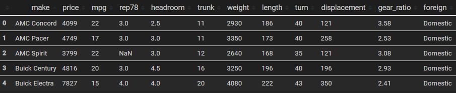
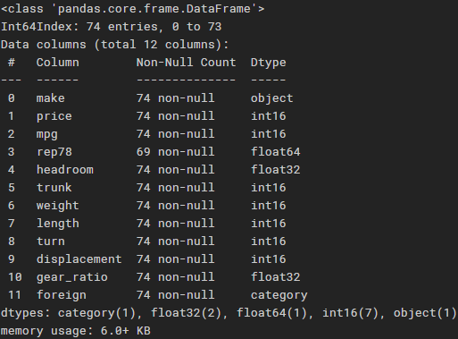
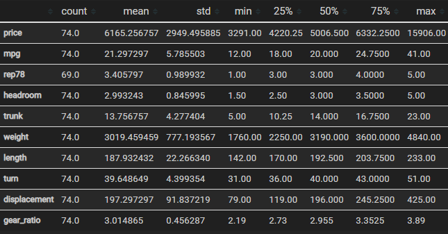
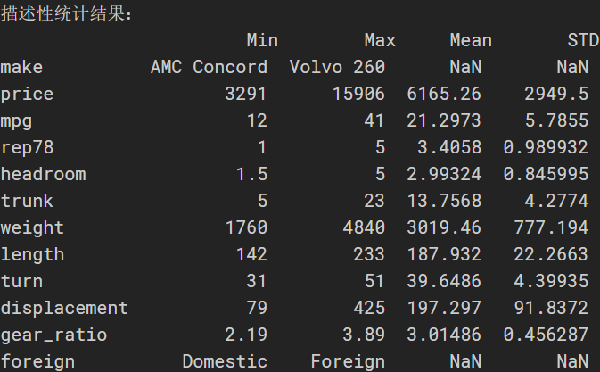
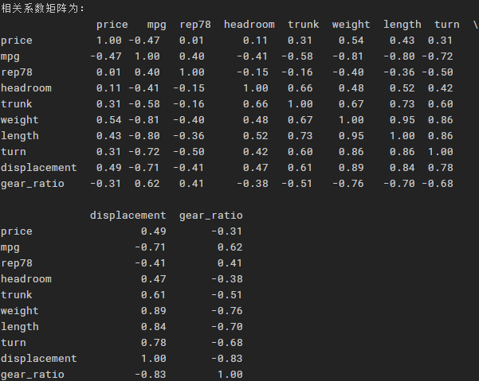
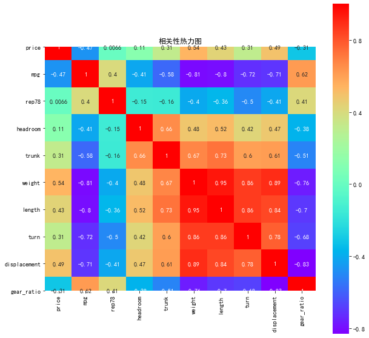
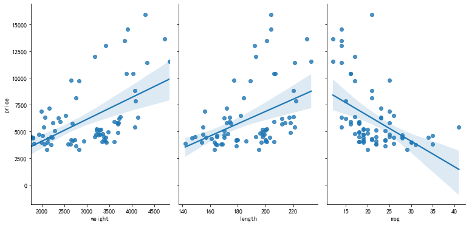
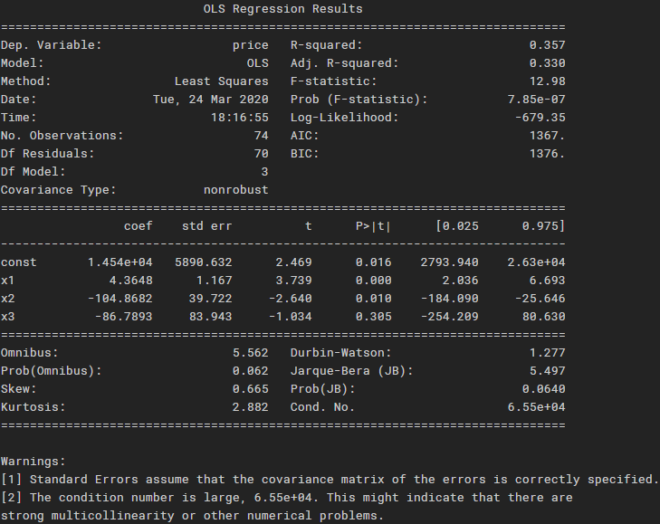

> ​人们总是倾向于寻求自己熟悉的东西。受其他语言的影响，你大概能猜到 Python 会支持正则表达式，然后就去查阅文档。但是如果你从来没有见过元组拆包（tuple unpacking），也从没有听过描述符（descriptor），那么估计你也不会去搜索它们，然后就永远失去了使用这些 Python 独有特性的机会。(《流畅的 Python 》）


读到这句话时，深有同感。迁移能力帮助我们快速了解陌生的语言，但受惯性思维的影响，容易忽视新事物的特性。所以，我的理解是：有其他语言的基础，学习新语言时，应该迁移和对比相结合。具体而言：对比着学，尽快找到感觉；注重工具之间的特性；问题导向，根据需求选择合适的工具。


经济学或者其他社科专业背景的读者，做实证可能对 Stata 比较熟悉。比如要做 OLS 回归，输入 `reg y x1 x2 x3` 就好。对比到 Python 中该如何做呢？本文以 Stata 自带 `auto.dta` （1978年美国汽车数据） 数据为例，对照着 Stata 的完成多元线性回归的过程，展示在 Python 中如何跑回归。一方面，熟悉 Python 的操作；另一方面，通过比较，观察二者的特性。

在开始实证分析之前，应该先建立这样一个框架，使得数据和文件的存放比较清晰。所以，可见熟悉路径操作比较重要，是组织和管理项目的基础。我在 [Windows 系统常用命令行命令（二）：路径与文件夹操作](https://mp.weixin.qq.com/s?__biz=MzI1MTg3MDMzMw==&mid=2247483677&idx=3&sn=7954dbf09dfaf35651ae65987e168c9d&chksm=e9ed2c0fde9aa5194d6140007382082bf148b1db8e76e075ea09a2c9cd983fb15a038f9316cb&scene=126&sessionid=1585314476&key=06a08b8428b497dccdf7995fd9edbaafd2c9a9118308c1418eed4f759e1934407e2b272e1c29a4d8be038414dc41d32c6cae09127da552d0adf25e26a4ab2560b0231d7b394941ad8593bfafea15fafe&ascene=1&uin=MTk2MzA0MTI3NA%3D%3D&devicetype=Windows+10&version=6208006f&lang=zh_CN&exportkey=A55ttvx2aqHJsRmrbsqgrS0%3D&pass_ticket=WtX7baLha5prx6LZMFvwUR1kPi9chWY30IhRHvNO%2FLHidvGtFAnJ15JjbPyR%2Fk1M) 讲过如何生成目录结构。本项目的目录结构如下：

```

C:.
│  README.md
│
├─code
│  │  Python_auto_OLS.ipynb
│  │  Stata_auto_OLS.do
│  │
│  └─.ipynb_checkpoints
├─data
│      auto.dta
│
├─doc
│      Stata&Python_实现多元线性回归对比.md
│
├─img
│      1-预览数据.png
│      2-数据概览.png
│      3-1-描述性统计.png
│      3-2-描述性统计.png
│      4-相关系数矩阵.png
│      5-相关性热力图.png
│      6-散点图.png
│      7-评估模型.png
│
├─refs
└─result
```


# 建立模型

先从熟悉的看起，调用 auto.dta 数据，探究汽车价格的影响因素。首先，建立如下回归模型：

$$
price = \beta_{0} +\beta_{1}*weight + \beta_{2}*length + \beta_{3}*mpg + \epsilon
$$

其中， $price$ 为汽车价格，$weight$ 为汽车重量，$length$ 为汽车长度，$mpg$ 为汽车每加仑汽油能够行驶的英里数。$\beta_{0}$ 为常数项，$\beta_{1}$，$\beta_{2}$，$\beta_{3}$为回归系数，$\epsilon$ 为残差。

# Stata 中运行回归

在 Stata 中，完成整个实证的过程大致如下：

```Stata

cd ..\data
use auto,clear

* 因变量 
global Xs "weight length mpg"

* 数据概览
describe
/*
 obs:            74                          1978 Automobile Data
 vars:            12                          13 Apr 2016 17:45
 size:         3,182                          (_dta has notes)
---------------------------------------------------------------------------------------------------------------------------------
              storage   display    value
variable name   type    format     label      variable label
---------------------------------------------------------------------------------------------------------------------------------
make            str18   %-18s                 Make and Model
price           int     %8.0gc                Price
mpg             int     %8.0g                 Mileage (mpg)
rep78           int     %8.0g                 Repair Record 1978
headroom        float   %6.1f                 Headroom (in.)
trunk           int     %8.0g                 Trunk space (cu. ft.)
weight          int     %8.0gc                Weight (lbs.)
length          int     %8.0g                 Length (in.)
turn            int     %8.0g                 Turn Circle (ft.)
displacement    int     %8.0g                 Displacement (cu. in.)
gear_ratio      float   %6.2f                 Gear Ratio
foreign         byte    %8.0g      origin     Car type
---------------------------------------------------------------------------------------------------------------------------------
Sorted by: foreign
*/

* 描述性统计
summarize price $Xs
/*

    Variable |        Obs        Mean    Std. Dev.       Min        Max
-------------+---------------------------------------------------------
       price |         74    6165.257    2949.496       3291      15906
      weight |         74    3019.459    777.1936       1760       4840
      length |         74    187.9324    22.26634        142        233
         mpg |         74     21.2973    5.785503         12         41

*/

* 相关系数
pwcorr price $Xs
/*

             |    price   weight   length      mpg
-------------+------------------------------------
       price |   1.0000 
      weight |   0.5386   1.0000 
      length |   0.4318   0.9460   1.0000 
         mpg |  -0.4686  -0.8072  -0.7958   1.0000 

*/

* 绘制散点图
tw (scatter price weight)(lfit price weight)

* 回归
regress price $Xs
/*

      Source |       SS           df       MS      Number of obs   =        74
-------------+----------------------------------   F(3, 70)        =     12.98
       Model |   226957412         3  75652470.6   Prob > F        =    0.0000
    Residual |   408107984        70  5830114.06   R-squared       =    0.3574
-------------+----------------------------------   Adj R-squared   =    0.3298
       Total |   635065396        73  8699525.97   Root MSE        =    2414.6

------------------------------------------------------------------------------
       price |      Coef.   Std. Err.      t    P>|t|     [95% Conf. Interval]
-------------+----------------------------------------------------------------
      weight |      4.365      1.167     3.74   0.000        2.036       6.693
      length |   -104.868     39.722    -2.64   0.010     -184.090     -25.646
         mpg |    -86.789     83.943    -1.03   0.305     -254.209      80.630
       _cons |  14542.434   5890.632     2.47   0.016     2793.940   26290.929
------------------------------------------------------------------------------

*/
```

最终的模型结果为：
$$
price = 14542.434 + 4.365*weight - 104.868*length - 86.789*mpg
$$

其中，$weight$ 的系数为 4.365 ，在 1% 的水平下显著，说明在其他条件不变的情况下，汽车重量每上升 1 单位，汽车价格平均增加 4.365 。$length$ 和 $mpg$ 的系数分别为 -104.868 和 -86.789 。模型的整体拟合优度为 0.357 。

抽象出来，实证过程大致为：导入数据、概览数据、描述性统计、相关系数、绘制散点图回归和模型评估与解释。接下来，将在 Python 中按照此流程重现。

# Python 中进行回归

## 定义路径和导入数据

```Python
import os
from os.path import join
import numpy as np
import pandas as pd

os.getcwd()
data_path = join(os.getcwd(), 'data') # data 文件夹的路径

data = pd.read_stata(join(data_path,'auto.dta'))
data.head() # 预览前 5 条数据
```



## 数据概览
```Python
data.info()
```



可以使用 `info()` 方法显示数据信息。上图结果显示，数据共有 74个观测值，12 列（ 12 个变量），columns 对应我们通常理解的 variables 。`rep78` 的 `non-null` 为 69 ，说明有 5 个缺失值。此外，还报告了数据的类型，需要注意的是，Pandas 中数据类型和 Python 中的普通的数据类型不同。

## 描述性统计

### 使用 DataFrame 的 `describe()` 方法
```Python
data.describe().T
```



上图为输出结果，`describe()` 对每一列进行统计，默认不报告非数值型列的结果。如果要报告所有列的结果，添加 `include=all` 参数，写成 `data.describe(include = all).T` 。`T` 表示转置，这里是为了方便看结果。

### 计算生成
```Python
description = [data.min(), data.max(), data.mean(),
               data.std()]  # 依次计算最小值、最大值、均值、标准差
description = pd.DataFrame(
    description, index=['Min', 'Max', 'Mean', 'STD']).T  # 将结果存入数据框
print('描述性统计结果：\n', np.round(description, 2))  # 保留两位小数
```



也可以自己计算描述性统计信息，将结果存入新的 DataFrame 。

## 相关系数

### 计算 pearson 相关系数
```Python
corr = data.corr(method='pearson')  # pearson 相关系数矩阵
print('相关系数矩阵为：\n', np.round(corr, 2))  # 保留两位小数
```


### 绘制相关性热力图
```Python 
import matplotlib.pyplot as plt
import seaborn as sns

plt.rcParams['font.sans-serif'] = ['SimHei']  # 用来正常显示中文标签
plt.rcParams['axes.unicode_minus'] = False  # 用来正常显示负号

plt.subplots(figsize=(10, 10))  # 设置画面大小
sns.heatmap(corr, annot=True, vmax=1, square=True, cmap="rainbow")
plt.title('相关性热力图')
plt.show()
plt.close
```


## 绘制散点图
```Python
sns.pairplot(data, x_vars=['weight', 'length', 'mpg'],
             y_vars='price', kind="reg", height=5, aspect=0.7)
plt.show()
plt.close
```



## 回归模型
```Python
from sklearn.linear_model import LinearRegression

Xs = data[['weight', 'length', 'rep78']] 
y = data['price'].values.reshape(-1, 1)
reg = LinearRegression()
reg.fit(Xs, y)
print("The linear model is: price = {:.5} + {:.5}*weight + {:.5}*length + {:.5}*mpg".format(
    reg.intercept_[0], reg.coef_[0][0], reg.coef_[0][1], reg.coef_[0][2]))
```
输出的结果为：
```Python
The linear model is: price = 1.4542e+04 + 4.3648*weight + -104.87*length + -86.789*mpg
```

## 评估模型
```Python
import statsmodels.api as sm

Xs = np.column_stack((data['weight'], data['length'], data['mpg']))
y = data['price']
X2 = sm.add_constant(X) # 添加常数项
est = sm.OLS(y, X2)
est2 = est.fit()
print(est2.summary())
```



上图为模型结果的评估，和前文 Stata 的回归结果对比，结果一致。

# 总结

经前文对比，是否感觉到 Stata 用来做计量的方便性？不管是数据清理还是运行模型，Stata 几条命令就可以搞定，而 Python 实现起来相对复杂。本文演示的还仅是最简单的多元线性回归，一些复杂和前沿的计量模型， Python 中可能还没有现成的包，需要自己编写代码。

对于完成实证论文，Stata 能够轻松的实现图表自动化，而 Python 似乎没有这么便捷的图表输出。不过使用 Jupyter Notebook ，Python 在数据探索性分析和可视化方面更加强大。简单总结，Stata 是用来做计量实证的利器，而 Python 更适合数据科学领域，完成数据分析与可视化、机器学习等任务。