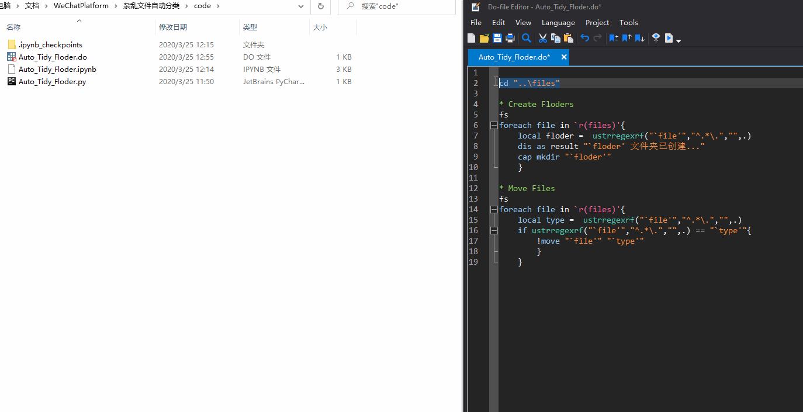

# 杂乱文件自动分类

在数据清理或者实证过程中，常常会有大量的文档、表格和图片等。疏于整理的话，文件夹中文件就会五花八门。下图是不是太过真实？


如果想按照文件类型将文件归类，你会怎么做呢？`Ctrl+X` 和 `Ctrl+V`？听起来好费眼睛啊。有没有一种快捷的方法让文件自动分类呢？ `Talk is cheap, show me your code` 。本文的内容如下：

- 先分别使用 Stata 和 Python 编程来解决问题；
- 之后，推荐一款 Windows 平台下的文件管理神器 DropIt 。

# 分析问题

在开始写代码之前，先来分析一下这个问题：如果以该文件后缀命令的文件夹存在，则移动进去；如果不存在，先新建该文件后缀的文件夹，再将文件移动进去。实现思路可以用如下流程图描述：

```flow
st=>start: 开始
exist?=>condition: 目标文件夹存在吗？
createfolder=>operation: 新建该后缀文件夹
move=>operation: 移动到目标文件夹
e=>end: 结束

st->exist?
exist?(no)->createfolder->move
exist?(yes)->move->e
```


## 实现过程

## Stata 实现

使用 Stata 的思路是，通过两次遍历，首先遍历文件名，提取后缀，创建文件夹；之后再通过文件后缀判断，将文件移动到相应的文件夹。实现代码如下：

```Stata
cd "..\files"

* Create folders
fs
foreach file in `r(files)'{
	local folder =  ustrregexrf("`file'","^.*\.","",.)
	cap mkdir "`folder'"
	}

* Move Files
fs
foreach file in `r(files)'{
	local type =  ustrregexrf("`file'","^.*\.","",.)
	if ustrregexrf("`file'","^.*\.","",.) == "`type'"{
		!move "`file'" "`type'"
		}
	}
```

## Python 实现

之前在 [鱼哥的文章](https://mp.weixin.qq.com/s?__biz=MzIwNDI1NjUxMg==&mid=2651261260&idx=2&sn=6ecf126e4075ab4b86a0e2a207d9d619&chksm=8d314d23ba46c435fa4b3fbc7869ae08354d728c5dc0dd383f9bf59b40577da3e16e8d76801c&mpshare=1&scene=1&srcid=0307FVe7w8zkyXXL66WhI7Oq&sharer_sharetime=1585116585127&sharer_shareid=9b31af13aac29b96ba0f395a0d519643&key=868c3c6d20df59e0404e7c086419b144650f40b4d15336f286b698f938948f037f169c9202637e38e0055141fb1212496115168a7e1f797355191225c5cc0d238baa619498bad0a7038aad0fbba74116&ascene=1&uin=MTk2MzA0MTI3NA%3D%3D&devicetype=Windows+10&version=6208006f&lang=zh_CN&exportkey=A6E7x7U5MxXO9Z596f6bGd0%3D&pass_ticket=27XIE6nb15rOpREfcS5Mq0JQftHj%2FDdhY691%2FAlsmBlcGCgOSlmMDtUTQBYDwuGp) 里面看到过类似需求的实现思路：使用 `os` 库读取后缀、判断文件夹是否存在，使用 `shutil` 库来操作文件。实现代码如下：

```Python
import os
import shutil

os.getcwd()
os.listdir()
os.chdir("../files")

for f in files:
    folder = f.split('.')[-1]
    if not os.path.exists(folder):
        os.mkdir(folder)
        shutil.move(f, folder)
    else:
        shutil.move(f, folder)
```


## 实现效果



以 Stata 运行过程为例，看看实现效果。怎么样？是不是看起来比较“酷炫”？

# DropIt：文件自动分类管理工具


 DropIt 是一款源于国外的开源、免费软件，目前仅支持 Window 系统。预先设定好协议（规则），轻松拖拽就可以将文件自动分类。可前往 [ DropIt 官网](http://www.dropitproject.com/) 下载体验，软件非常轻量，安装包只有 5.1 M 。我们来看看处理任务的效果：


 除了自动分类，它还支持批量压缩文件、给重要的文件加密、文件转格式和批量处理图片等功能。根据个人的使用习惯，可以打造个人全自动的文件管理系统，[这里](https://sspai.com/post/45532) 有一篇进阶使用说明，感兴趣的朋友可以看看。

# 小结

本文围绕杂乱文件自动分类的问题，分别使用 Stata 和 Python 编写代码来实现需求，然后安利了一款 Windows 系统的文件管理神器。通过这篇文章，是不是感觉在日益依赖电脑的学习和办公环境下，能够按照需求写代码，能够节约时间，提高效率。再者，“工欲善其事，必先利其器”，多关注和使用一些良心的神器，也可以极大的提高工作效率。

# 参考资料


[Crash Course: How to start with DropIt](http://www.dropitproject.com/dokuwiki/doku.php?id=howto:start_with_dropit)

[用 DropIt 打造全自动的 Windows 文件管理体系](https://sspai.com/post/45532)
