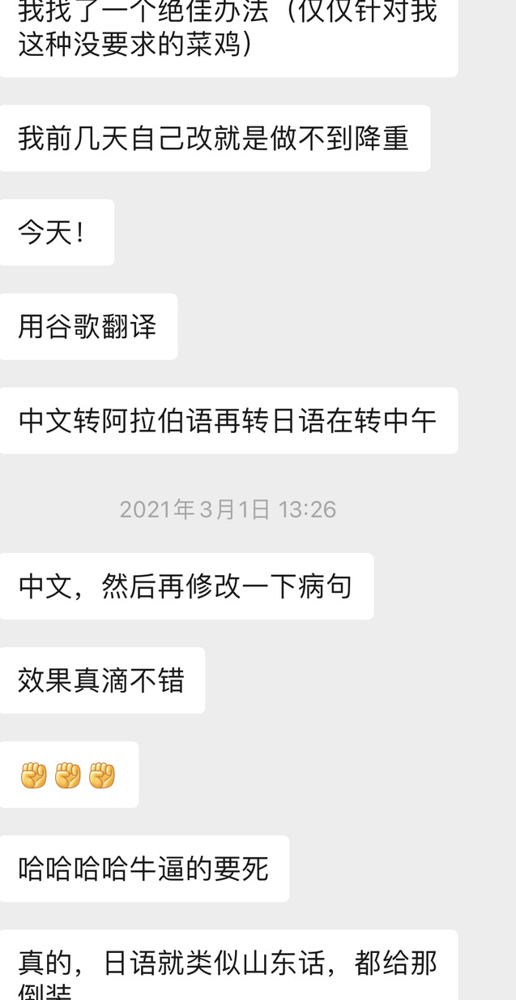
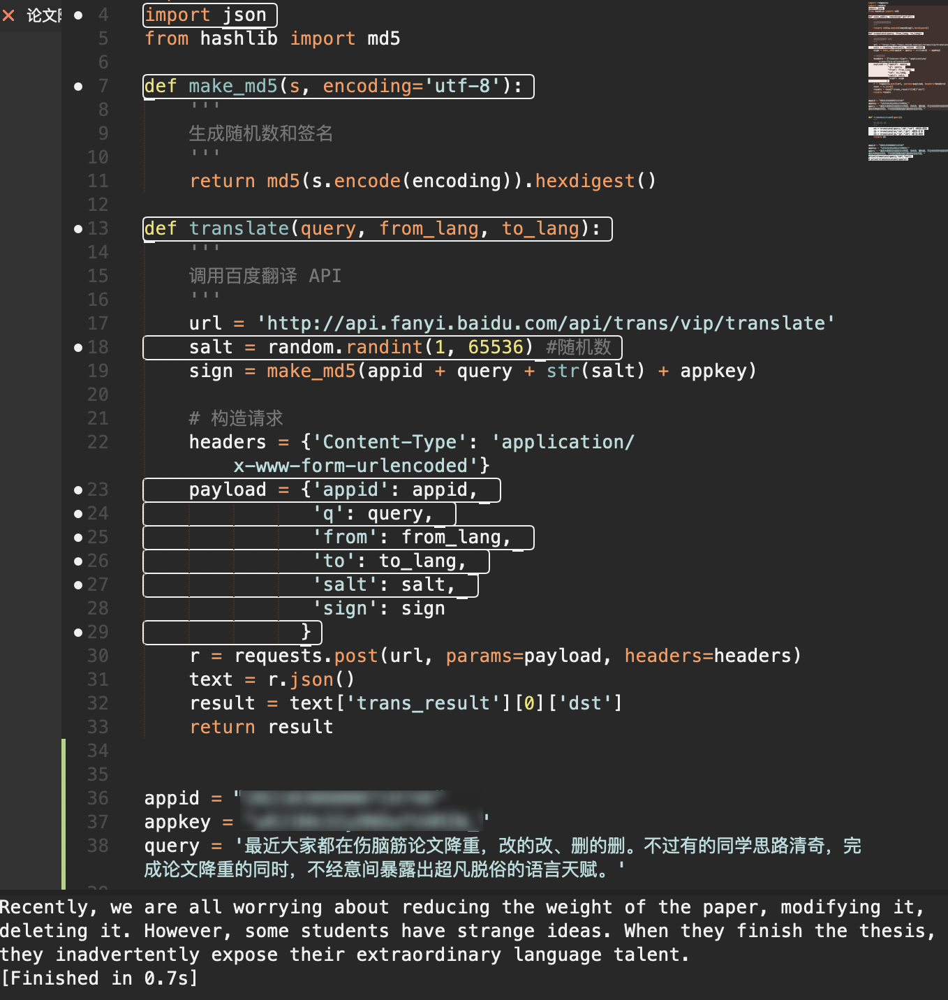
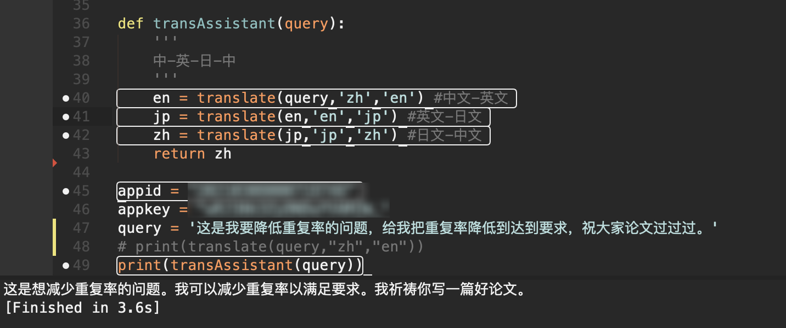

最近大家都在伤脑筋论文降重，改的改、删的删。不过有的同学思路清奇，完成论文降重的同时，不经意间暴露出超凡脱俗的语言天赋。



不过通过翻译的确是个不改变语义的情况下，给句子改头换面的好方法。那么今天就来探讨下怎么用翻译的方法给论文降重。

解决思路是通过百度翻译的 API 给要降重的文字批量转换，再修改病句。

### 实现方法

下面这段是百度翻译 API 给的使用示例，可以对照看看构造 API 需要哪些主要字段。

```Python
# -*- coding: utf-8 -*-

# This code shows an example of text translation from English to Simplified-Chinese.
# This code runs on Python 2.7.x and Python 3.x.
# You may install `requests` to run this code: pip install requests
# Please refer to `https://api.fanyi.baidu.com/doc/21` for complete api document

import requests
import random
import json
from hashlib import md5

# Set your own appid/appkey.
appid = 'INPUT_YOUR_APPID'
appkey = 'INPUT_YOUR_APPKEY'

# For list of language codes, please refer to `https://api.fanyi.baidu.com/doc/21`
from_lang = 'en'
to_lang =  'zh'

endpoint = 'http://api.fanyi.baidu.com'
path = '/api/trans/vip/translate'
url = endpoint + path

query = 'Hello World! This is 1st paragraph.\nThis is 2nd paragraph.'

# Generate salt and sign
def make_md5(s, encoding='utf-8'):
    return md5(s.encode(encoding)).hexdigest()

salt = random.randint(32768, 65536)
sign = make_md5(appid + query + str(salt) + appkey)

# Build request
headers = {'Content-Type': 'application/x-www-form-urlencoded'}
payload = {'appid': appid, 'q': query, 'from': from_lang, 'to': to_lang, 'salt': salt, 'sign': sign}

# Send request
r = requests.post(url, params=payload, headers=headers)
result = r.json()

# Show response
print(json.dumps(result, indent=4, ensure_ascii=False))
```

先去[百度翻译 API](https://fanyi-api.baidu.com/product/11) 申请个 `APP ID` 和密钥，对照示例可以写出这几个函数：

```Python
import requests
import random
import json
from hashlib import md5

def make_md5(s, encoding='utf-8'):
    '''
    生成随机数和签名
    '''
    return md5(s.encode(encoding)).hexdigest()
```

这个函数用于生成随机数和签名，签名是为了保证调用安全，使用 MD5 算法生成的一段字符串，生成的签名长度为 32 位，签名中的英文字符均为小写格式。

```Python
def translate(query, from_lang, to_lang):
    '''
    调用百度翻译 API
    '''
    url = 'http://api.fanyi.baidu.com/api/trans/vip/translate'
    salt = random.randint(1, 65536) #随机数
    sign = make_md5(appid + query + str(salt) + appkey)

    # 构造请求
    headers = {'Content-Type': 'application/x-www-form-urlencoded'}
    payload = {'appid': appid, 
               'q': query, 
               'from': from_lang, 
               'to': to_lang, 
               'salt': salt, 
               'sign': sign
              }
    r = requests.post(url, params=payload, headers=headers)
    text = r.json()
    result = text['trans_result'][0]['dst']
    return result
```

这个函数用于请求，函数需要传入的参数有需要转换的文本、初始语言、待转换的语言，运行的结果是：



```Python
def transAssistant(query):
    '''
    中-英-日-中
    '''
    en = translate(query,'zh','en') #中文-英文
    jp = translate(en,'en','jp') #英文-日文
    zh = translate(jp,'jp','zh') #日文-中文
    return zh
```

这个函数用来实现将中文转换成英文、从英文转换成日文，再重日文转换成中文，通过不同语言之间的翻译，在保证语义基本不变的情况下对句子结构和用词进行调整，达到降低重复率的目的。



这就是转换的效果了，将需要转换的文本放在一个文档中，批量转换之后再修改语句，能够提高使用这种“奇技淫巧”降重的目的。

### 全文代码

```Python

import requests
import random
import json
from hashlib import md5

def make_md5(s, encoding='utf-8'):
    '''
    生成随机数和签名
    '''
    return md5(s.encode(encoding)).hexdigest()

def translate(query, from_lang, to_lang):
    '''
    调用百度翻译 API
    '''
    url = 'http://api.fanyi.baidu.com/api/trans/vip/translate'
    salt = random.randint(1, 65536) #随机数
    sign = make_md5(appid + query + str(salt) + appkey)

    # 构造请求
    headers = {'Content-Type': 'application/x-www-form-urlencoded'}
    payload = {'appid': appid, 
               'q': query, 
               'from': from_lang, 
               'to': to_lang, 
               'salt': salt, 
               'sign': sign
              }
    r = requests.post(url, params=payload, headers=headers)
    text = r.json()
    result = text['trans_result'][0]['dst']
    return result


def transAssistant(query):
    '''
    中-英-日-中
    '''
    en = translate(query,'zh','en') #中文-英文
    jp = translate(en,'en','jp') #英文-日文
    zh = translate(jp,'jp','zh') #日文-中文
    return zh

appid = "XXXXX" #自己申请的 appid
appkey = "XXXXX" # 自己申请的 key
query = '这是我要降低重复率的问题，给我把重复率降低到达到要求，祝大家论文过过过。'
# print(translate(query,"zh","en"))
print(transAssistant(query))
```

