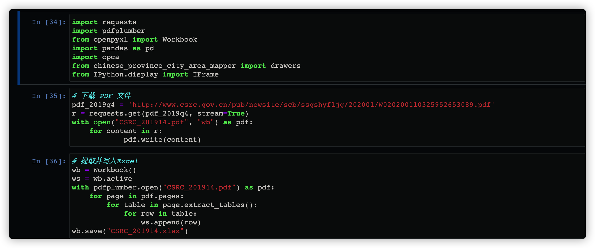
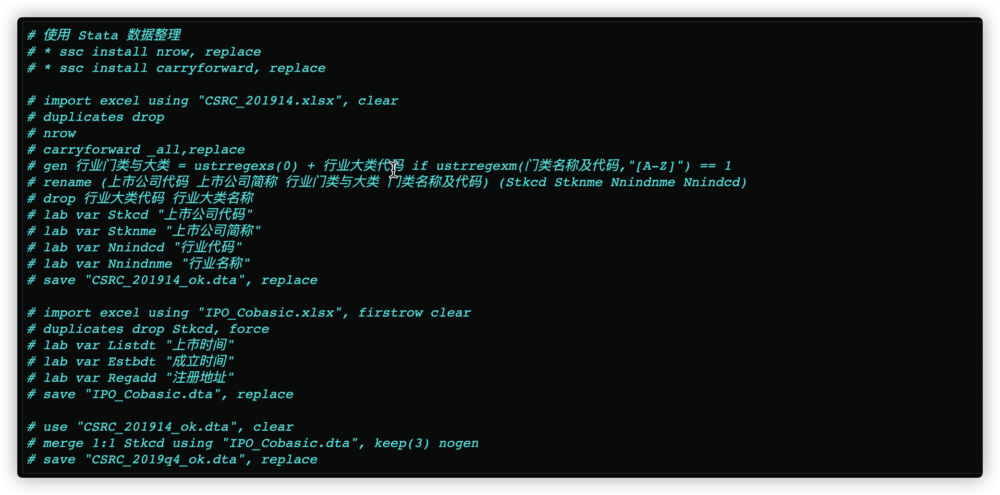
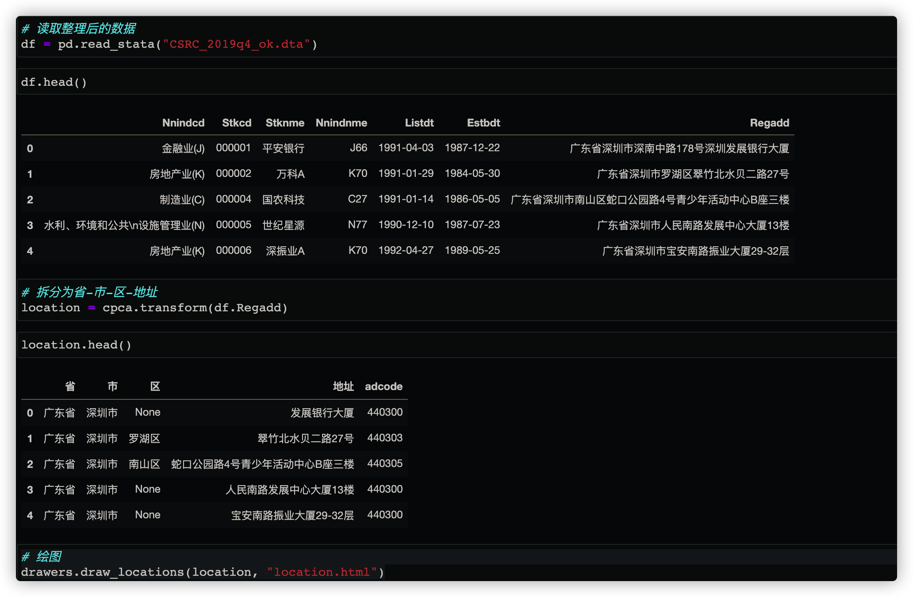

Stata + Python | 中国A股上市公司注册地可视化

## 1. 项目说明

使用 Python 和 Stata 相配合，对中国沪深A股上市公司注册地址进行可视化。

## 2.数据来源

上市公司样本：[证监会行业分类结果](http://www.csrc.gov.cn/pub/newsite/scb/ssgshyfljg/index_1.htm)

上市公司注册地址：[CSMAR上市公司基本情况表](https://cn.gtadata.com/sdownload.html?intro=792360543310614528&page=single#/)

## 3.处理思路

### 3.1 数据整理
- Python 部分：

  - 使用 Python 下载原始数据（为PDF格式），存储为`CSRS_2019q4.pdf`
  - 并转为`.xlsx`格式，存储为`CSRS_2019q4.xlsx`

- Stata 部分：

  - 导入`CSRS_2019q4.xlsx`进行整理，得到`CSRS_2019q4.dta`；

    导入CMSAR 上市公司基本情况`IPO_Cobasic.xlsx` ，整理得到`IPO_Cobasic.dta`；

  - 将两份数据按照上市公司代码`Stkcd`匹配，得到`CSRS_2019q4_ok.dta`。
  
### 3.2 数据可视化

  - 使用Python的`cpca`库，从注册详细地址中提取`省-市-区-详细地址`；
  - 使用`chinese_province_city_area_mapper`库进行可视化。

## 4. 实现过程

### 4.1 数据下载与转换

### 4.2 数据整理

### 4.3 绘图

### 4.4 结果

