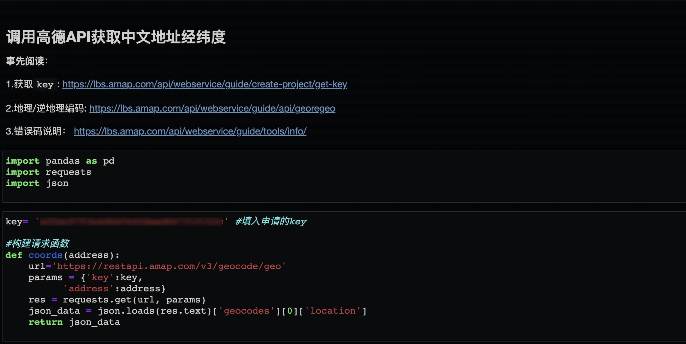
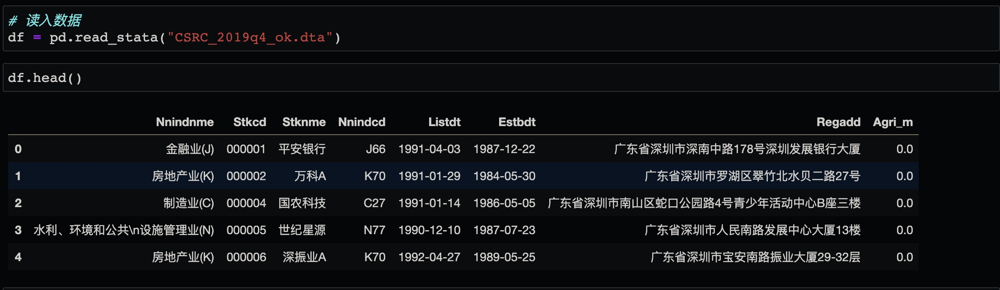
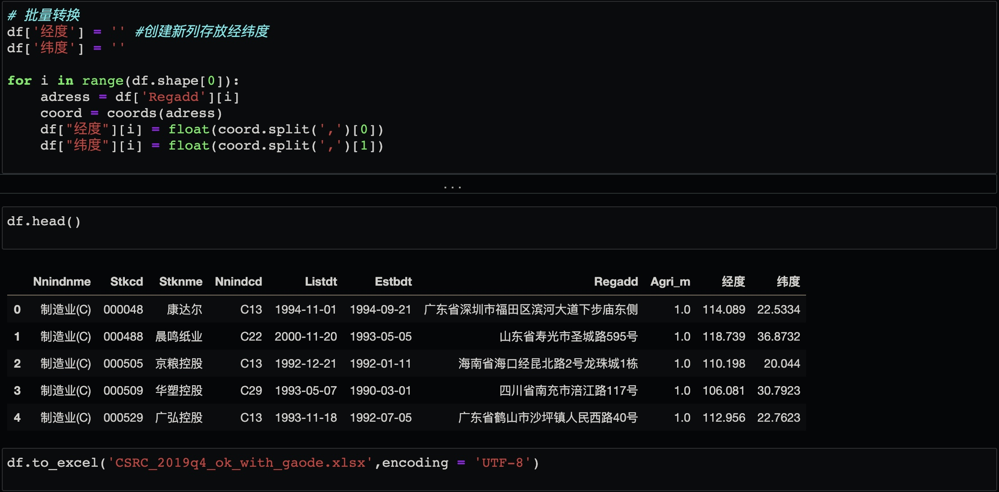

## 0.项目说明

本文以[中国A股上市公司注册地址](https://mp.weixin.qq.com/s/63mtA4qhoiIBQ5B5AK-3_A)为例，介绍使用高德地图API，实现**中文地址**经纬度转换（如果是地址名是英文，可以先转换为中文）。

## 1.实现思路

- 前往[高德开放平台](https://lbs.amap.com/api/webservice/guide/create-project/get-key)：
  - 1.申请`key`:先注册高德账号，之后申请`key`。操作流程为：
    - 左侧选项卡：应用管理—我的应用—右侧上方选项卡点击`添加`—服务平台选择`Web服务`。
  - 2.阅读文档：查看[地理/逆地理编码](https://lbs.amap.com/api/webservice/guide/api/georegeo)说明文档，查看所需请求和返回参数。其中：
    - `key`和`adress`为必填项，`key`为第一步创建；`adress`为需要查询的地址，规则遵循：国家、省份、城市、区县、城镇、乡村、街道、门牌号码、屋邨、大厦，如：北京市朝阳区阜通东大街6号。
  - **提醒：高德免费API调用量上限为 300000 次/日（一次请求为1次），并发上限为200次/秒。**
  
- Python：

  - 1.导入待分析的数据，要包括中文地址变量；
  - 2.根据调用API所需参数构造请求函数；
  - 3. 批量请求，获取经纬度信息，并将返回数据写入数据。

## 2. 实现过程

### 2.1 构造请求函数

### 2.2 读取数据

### 2.3 批量转换并导出

