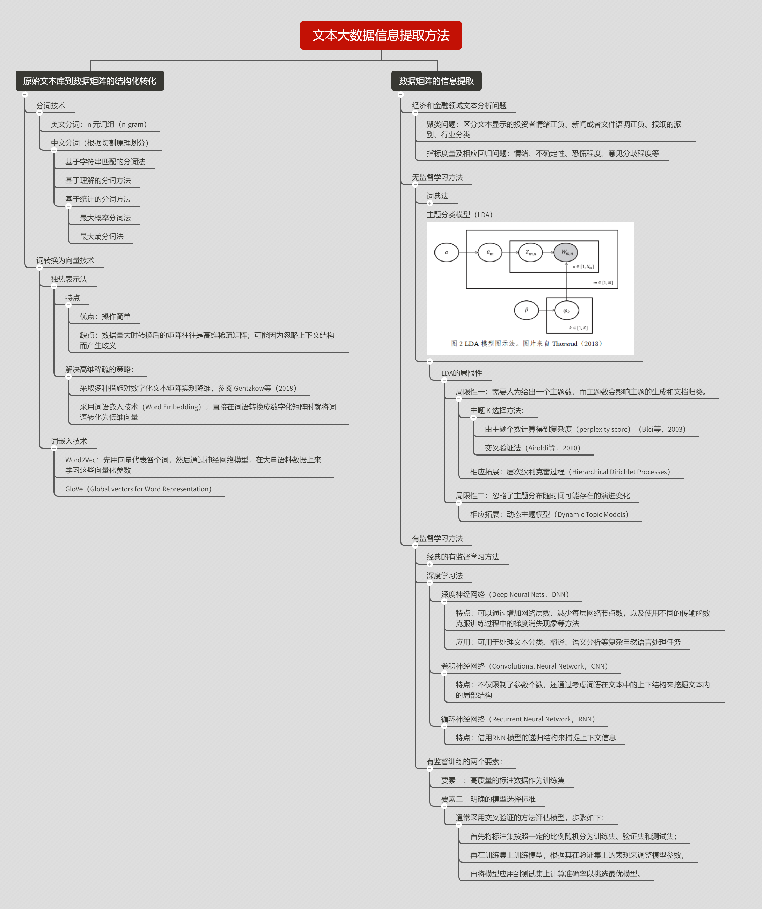
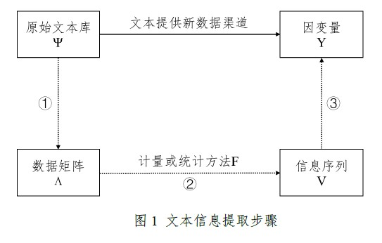
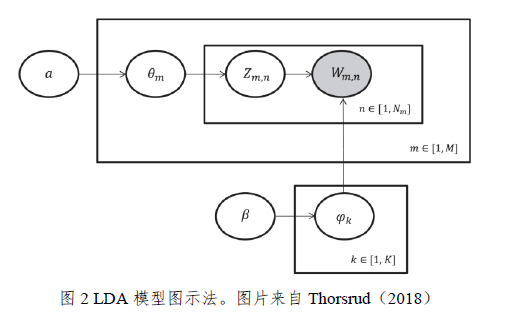

# 前言

本文为刊载于《经济学（季刊）》2019 年第 4 期上[《文本大数据分析在经济学和金融学中的应用：一个文献综述》](https://kns.cnki.net/KCMS/detail/detail.aspx?dbcode=CJFQ&dbname=CJFDLAST2020&filename=JJXU201904001&v=MjkxMDF5ZlRlN0c0SDlqTXE0OUZaWVI4ZVgxTHV4WVM3RGgxVDNxVHJXTTFGckNVUjdxZlpPVnVGeTNsVTcvTUw=)的阅读笔记。原论文详细综述了文本大数据信息提取方法、文本分析方法在经济学和金融学中的应用，是了解文本分析方法在经济学研究中应用的好材料。本篇笔记聚焦论文的第二部分，即文本大数据信息提取方法，旨在为文本分析方法的学习和日后研究运用提供基本认识。

**下图是我阅读时记录的思维导图，原文和高清大图可在公众号后台回复【文本信息】获取。**



# 文本信息提取步骤

> 将文本大数据应用于经济学和金融学研究的核心挑战在于如何准确、有效率地从文本中提取需要的信息，并考察其对相应问题的解释或预测能力。

这其实表达两层含义：一是操作层面，需要准确的选取文本来源和正确的提取方法，以便技术上准确提取需要的信息；二是应用层面，即提取的信息能否度量预期的现实含义。因此，使用文本大数据用于经济学研究时，一方面要有好的 idea ，选择合适的文本来源和具有操作性的提取方式，另一方面，提取的信息要能较好度量经济含义。



上图展示了信息提取的过程，$\Psi$ 表示原始文本库，$Y$ 表示要解释或者预测的经济或者金融现象（可以理解为被解释变量），要考察 $\Psi$ 对 $Y$ 的解释能力，需要经过三个步骤：

- 将文本库 $\Psi$ 内所有的文本转化为数据矩阵 $\Lambda$ ；
- 通过计量或者统计方法 $F$ ，将 $\Lambda$ 转换成目标信息序列 $V$ ，比如关注度、情绪和不确定性指数等；
- 用提取出的 $V$ 来解释或者预测 $Y$ 。

其实第一步和第二步是如何将数据结构化，即从文本大数据提取信息。而第三步（利用结构化的数据来完成解释和预测工作）是计量经济学和统计学的研究重点。接下来，我们一起来梳理从原始文本中提取信息的方法。

# 文本大数据信息提取方法

## 原始文本库到数据矩阵的结构化转换

自然语言理解面临的主要障碍：一是同一字（词）的含义在不容场景或语境下有变化，这里有一些经典的笑话（更多例子可以去看 [hardNLU](https://github.com/fighting41love/hardNLU "hardNLU") 乐呵乐呵）：

- “南京市长江大桥”（你好，江大桥市长）
- 他快抱不起儿子了，因为他太胖了（他是谁？）
- 书《无线电法国别研究》（法国别研究了）
- 我背有点驼，麻麻说“你的背得背背背背佳”

二是由于文字的多样性，在转换为数据矩阵后往往需要处理高维稀疏矩阵相关的问题。

### 分词技术

英文单词由空格隔开，单词就实现了分词。实证中会将单个词语扩展成长度为 n 的词组，即 n 元词组（n-gram）。n-gram 是大词汇连续文本或语音识别中常用的一种语言模型，它是利用上下文相邻词的搭配信息来进行文本大数据转换。其中， n 代表一个整型数值，当 n 为 2 的时候，模型称为 bi-gram ，意思是模型会对相邻的两个词进行匹配；当 n 为 3 时，模型称为 tri-gram ，也就是会对相邻 3 个单词进行匹配。而中文汉字为连续序列，所以需要分词。 Python 中常用的分词库有 [jieba](https://github.com/fxsjy/jieba "jieba") 和北大的 [pkuseg](https://github.com/lancopku/PKUSeg-python "pkuseg") 。

```Python
# jieba 库
import jieba

jieba.enable_paddle() # 启动paddle模式。 0.40版之后开始支持，早期版本不支持
strs=["我来到北京清华大学","乒乓球拍卖完了","中国科学技术大学"]
for str in strs:
    seg_list = jieba.cut(str,use_paddle=True) # 使用paddle模式
    print("Paddle Mode: " + '/'.join(list(seg_list)))

seg_list = jieba.cut("我来到北京清华大学", cut_all=True)
print("Full Mode: " + "/ ".join(seg_list))  # 全模式

seg_list = jieba.cut("我来到北京清华大学", cut_all=False)
print("Default Mode: " + "/ ".join(seg_list))  # 精确模式

seg_list = jieba.cut("他来到了网易杭研大厦")  # 默认是精确模式
print(", ".join(seg_list))

seg_list = jieba.cut_for_search("小明硕士毕业于中国科学院计算所，后在日本京都大学深造")  # 搜索引擎模式
print(", ".join(seg_list))

# 输出：
# Paddle Mode: 我/来到/北京清华大学
# Paddle Mode: 乒乓球/拍卖/完/了
# Paddle Mode: 中国科学技术大学
# Full Mode: 我/ 来到/ 北京/ 清华/ 清华大学/ 华大/ 大学
# Default Mode: 我/ 来到/ 北京/ 清华大学
# 他, 来到, 了, 网易, 杭研, 大厦
# 小明, 硕士, 毕业, 于, 中国, 科学, 学院, 科学院, 中国科学院, 计算, 计算所, ，, 后, 在, 日本, 京都, 大学, 日本京都大学, 深造
```

```Python
# pkuseg 库
import pkuseg

seg = pkuseg.pkuseg()           # 以默认配置加载模型
text = seg.cut('我爱北京天安门')  # 进行分词
print(text)

seg = pkuseg.pkuseg(model_name='medicine')  # 程序会自动下载所对应的细领域模型
text = seg.cut('我爱北京天安门')              # 进行分词
print(text)

seg = pkuseg.pkuseg(postag=True)  # 开启词性标注功能
text = seg.cut('我爱北京天安门')    # 进行分词和词性标注
print(text)
```

关于各分词工具的性能，在 pkuseg 主页有其和 jieba、THULAC 等国内代表分词工具包的比较，详情可参见 [comparison](https://github.com/lancopku/pkuseg-python/blob/master/readme/comparison.md "comparison") 。

根据分割原理，可将现有分词方法归纳为**基于字符串匹配**、**基于理解**和**基于统计**三类。

|      方法      |                                                             描述                                                             |
| :------------: | :--------------------------------------------------------------------------------------------------------------------------: |
| 基于字符串匹配 | 将待分析的字符串与前定的词典词条匹配，若某个字符串可在词典中找到，则记为识别出一个词。该方法的好处是简便快速，但忽略歧义问题 |
|    基于理解    |                                     在分词的同时进行句法、语义分析，以改进对歧义词的处理                                     |
|    基于统计    |   先用机器学习模型学习已经切分好的词语的规律，进而实现对未知文本的切分，常用方法包括**最大概率分词法**和**最大熵分词法**等   |

目前文献中用到的分词方法常将三种方法结合。需要注意的是，由于一些特定领域的文本包含一些对信息提取比较重要的专有词语（如上市公司名称、金融术语等），因此常常需要根据研究问题拓展现有词典，以提高软件识别和分割词语的准确度。

## 词转换为向量的技术

完成分词之后需要考虑如何将文本进一步转化为数字化矩阵。**如果将一篇文本视作从所有词语库中挑选若干词形成的组合，这一转换的主要挑战往往是如何对由词语构成的高维矩阵实现降维的问题。要理解这一点首先需要了解独热表示法（One-hot representation）**。

### 独热表示法

独热法的特点是忽略语法和语序等要素，将文本数据看作是若干独立词汇的集合。首先，根据文本中出现的全部词语构成一个词表（通常是去掉“的、地、得、和”等停用词和标点符号后得到的全部词语），并将每个词按顺序编号 $1,2,3...,N$ 。然后，将词语 $j$ 用一个 $N$ 维向量 $w_j$ 来表示，该向量的第 $j$ 个位置的元素为 1 ，其余为 0 。在每一个词都转换为一个向量后，通过加总所有词的向量，文本 $t$ 就可以转化为 $1\times N$ 的向量 $W_t$ ，其中 $w_j (j = 1,2,...,N)$ 是第 $j$ 个词语在文本 $t$ 中出现的频率。若一共有 $t=1,...T$ 个文本，采用独热表示法之后，原始文本库 $\Psi$ 就可以转化为 $T\times N$ 的数字矩阵。


例如，原始文本库 $\Psi$ 由两条帖子组成。第一条的内容是“明天涨停。后天涨停没戏。”，第二条是“玛丽有个小绵羊。”分词后得 “明天、涨停、后天、没戏、玛丽、有、个、小、绵羊”九个不同词语，即 $N = 9$ 。用独热法则“明天”用向量 $[1,0,0,0,0,0,0,0,0]$ 表示，“涨停”为 $[0,1,0,0, 0,0,0,0,0]$ ，以此类推。于是第一个帖子可用向量 $[1,2,1,1,0,0,0,0,0]$ 表示,第二个帖子即 $[0,0,0,0,1,1,1,1,1]$ 。

> One-Hot 编码是分类变量作为二进制向量的表示。这首先要求将分类值映射到整数值。然后，每个整数值被表示为二进制向量，除了整数的索引之外，它都是零值，被标记为 1 。

在实际操作时，数值型类别变量可以直接调用 sklearn 库中的 `OneHotEncoder` 进行编码，但是 `OneHotEncoder` 无法直接对字符型变量编码，也就是说 `OneHotEncoder().fit_transform(str_ls)` 会报错。所以一般采用如下两种方法：

- 先用 `LabelEncoder()` 转换成连续的数值型变量，再用 `OneHotEncoder()` 二值化。
- 直接用 `LabelBinarizer()` 进行二值化，这种方法只支持一维数组，也就是每次只能传入一个变量。

```Python
# 独热表示法
import jieba
from sklearn.preprocessing import LabelEncoder
from sklearn.preprocessing import OneHotEncoder
from sklearn.preprocessing import LabelBinarizer

# 分词
text = "玛丽有一个小绵羊。"
text_str = jieba.cut(text)
stopwords = ['，', '。']     # 停用词
text_ls = [x for x in text_str
           if len(x) > 1
           and x not in stopwords]
print(text_ls)

# 方法一：先转为数值型变量，再进行二值化
# 转为数值型编码
label_encoder = LabelEncoder()
integer_encoded = label_encoder.fit_transform(text_ls)
print(integer_encoded)
# 二值编码
onehot_encoder = OneHotEncoder(sparse=False)
integer_encoded = integer_encoded.reshape(len(integer_encoded), 1)
onehot_encoded = onehot_encoder.fit_transform(integer_encoded)
print(onehot_encoded)

# 方法二：直接二值化
LabelBinarizer().fit_transform(text_ls) # 传入变量

# 输出结果
'''
['玛丽', '一个', '小绵羊']
[2 0 1]
[[0. 0. 1.]
 [1. 0. 0.]
 [0. 1. 0.]]

array([[0, 0, 1],
       [1, 0, 0],
       [0, 1, 0]])
'''
```

上述步骤显示，独热法操作简单；但数据量大时转换后的矩阵往往是高维稀疏数据矩阵。这是由词向量维数由词语数量决定、并且大部分词语出现频率低，因此文本对应的向量中绝大部分值为零的特征决定的。**另外，独热法可能因忽略上下文结构而会产生歧义**。例如上例中第一个帖子转换成的向量也可以是 “明天涨停没戏。后天涨停。”的转换结果，这和原文的含义产生了偏差。

**解决高维稀疏矩阵的问题：一是采取多种措施对数字化文本实现降维；二是采用词语嵌入技术（Word Embedding），直接在词语转换为数字化矩阵时就将词语转化为低维向量**。

## 词嵌入技术

词嵌入技术是指把一个维数为所有词的数量的高维空间“嵌入”到一个维数低得多的连
续向量空间中涉及的模型和技术。即 $e_j = E \times W_j$ ，其中 $e_j$ 表示第 $j$ 个词通过嵌入矩阵 $E$ （embedding matrix）映射到实数域上的词向量，$W_j$ 为第 $j$ 个词的独热向量表示。由于该向量的每个元素值可以是连续值而不只是 0 或者 1 ，$e_j$ 的维度 $N_e$ 可以远低于 $N$ 。

独热表示法可以看成最简单的词嵌入方法，即 $e_j = E \times W_j = w_j$ 。常用词嵌入算法：

- Word2Vec：先用向量代表各个词，然后通过神经网络模型, 在大量的文本语料数据上来学习这些向量的参数。训练后的模型不仅可以将每个词语映射到一个低维的空间上（通常为 100-1000 维），每个维数上的取值为连续值；并且根据不同词语的向量距离可以度量词语间的相似程度，也解决了独热法下不同词语相互独立的问题。
- GloVe（Global vector for Word Representation）。

## 数据矩阵的信息提取

现有经济和金融领域文本相关分析的问题大致可分为两类：

1. 区分文本显示的投资者情绪正负、新闻或者文件语调正负、报纸属于左派还是右派、以及行业分类等聚类问题。
2. 对情绪、不确定性、恐慌程度、意见分歧程度的度量以及相应的回归问题。

### 无监督学习方法

#### 词典法

**该方法从预先设定的词典出发，通过统计文本数据中不同类别词语出现的次数，结合不同的加权方法来提取文本信息**。使用词典法的一个关键环节是选择或构建合适的词典，这里词典包括了特定词典，也包括作者构造的特定词语或词组的集合。

英文常见词典如下：
|词典|特点|文献|
|:--:|:--:|:--:|
|Harvard IV-4 |包含心理和社会学常涉及的 1045 个正面词语和 1160 个负面词语，并非为金融领域文本专门创建|Tetlock(2007)；Tetlock et al.(2008)；Jegadeesh and Wu(2013)|
|Henry|专门为金融文本构建的词典|Henry(2008)；Price et al.(2012)|
|Diction|包含 686 个正面词汇和 920 个负面词汇，主要应用于会计领域|Rogers et al.(2011)；Davis et al.(2012)|
|Loughran and McDonald（简称：LM）|从上市公司的 10-K 文件中人工收集并整理构造出来，他们的实证结果表明 LM 词典在度量文本情绪方面比 Harvard IV-4 词典和 Diction 词典的效果更好，因此目前用词典法分析金融、会计领域文本情绪时多采用 LM 词典|Garcia(2013)； Huang et al. (2014)； Loughran and McDonald(2014)；Solomon et al.(2014)|

中文词典：
|词典|特点|文献|
|:--:|:--:|:--:|
|适用于中国股吧论坛的金融情绪词典|随机抽取 2008 到 2018 年间某股票论坛四万条帖子，人工挑取其中正、负面词语|Chen et al.（2018）|
|中国财经媒体领域的正负面词库|手动整理新闻报道，结合《现代汉语词典》、《最新汉英经济金融常用术语使用手册》、LM 词典中文版以及知网-中文信息结构库等词库|汪昌云和武佳薇（2015）|
|适用于金融科技领域的情感词词典|根据和讯网上的新闻|王靖一和黄益平（2018）|

除了确定词典，另一个重要的问题是如何确定词语权重。常见的加权方法有**等权重**、**词频-逆文档（TF-IDF）加权**和**对应变量加权**三种。
|加权方法|特点|
|:---|:---|
|等权重法|假定文本中每个词语的重要程度相同|
|TF-IDF 加权方法|**同时考虑词语在文本中出现的次数（频率）和多少文档包含该词语这两个维度**，对在文本中频繁出现但并没有实际含义的词语赋予较少的权重、而给予有重要含义但出现次数较少的词语较大权重|
|对应变量加权|是指借用文本中词语与对应变量（市场收益率、波动率指数等）的关系来确定词语的权重|

TF-IDF ( Term Frequency-Inverse Document Frequency ) ，一般翻译为“词频-逆向文件频率”。其计算公式为：

首先，计算 tf 的值：

$$
tf = \frac{n_{i,j}}{\sum_k{n_{kj}}}
$$

其中，$n_{i,j}$ 表示某个词在语料库中出现的次数；$\sum_k{n_{k,j}}$ 表示是该文件中所有单词出现的次数之和。

而在 scikit-learn 中，idf 的计算公式为:

$$
idf = log(\frac{N+1}{N_{w}+1})+1
$$

其中，$N$ 表示语料库中的文件总数；$N_w$ 代表语料库中包含上述单词的文件数量。

那么，tf-idf 的计算公式为：

$$
tf-idf = tf*idf
$$

注：tf-idf 的计算公式有多种变体。

在 jieba 库中使用 tf-idf 进行关键词提取的操作如下：

```Python
import jieba.analyse as analyse

f = open('../data/2020年中央一号文件.txt', "r", encoding="utf-8")
t = f.read()
f.close()

print(" ".join(analyse.extract_tags(t,topK=20,withWeight=False,allowPOS=())))

# 输出：
# 农村 脱贫 乡村 建设 农业 加强 推进 扶贫 三农 工作 用地 全面 服务 治理 支持 攻坚 落实 开展 农产品 强化
```

上方基于 TF-IDF 算法的关键词抽取代码的参数解释：

- `sentence` 为待提取的文本
- `topK` 为返回几个 TF/IDF 权重最大的关键词，默认值为 20
- `withWeight` 为是否一并返回关键词权重值，默认值为 False
- `allowPOS` 仅包括指定词性的词，默认值为空，即不筛选

#### 主题分类模型

在经济和金融领域的一个应用需求是在没有事先标注集的情况下，对文本按主题做分类。由于一篇文本的主题可能有多个，这类分类问题不同于按照事先标注集、将一篇文本仅归入一类的应用。主题分类问题的代表模型是由 Blei et al.（2003）提出的隐含狄利克雷分配（Latent Dirichlet Allocation，LDA）模型，它是一种概率主题模型。

LDA 模型假定全部文档 $M$ 中存在 $K$ 个主题，每个文档 $m$ 包含 $N_m$ 个词语，并且每个词都是由其中一个主题生成。主题服从一个多项式分布 $\theta_m$ ，而每个主题 $k$ 与词汇表中的 $V$ 个单词的一个多项式分布 $\varphi_{k}$ 相对应，并且假定分布 $\theta_m$ 和分布 $\varphi_k$ 具有共轭的狄利克雷分布。该共轭的狄利克雷分布的超参数为 $\alpha$ 和 $\beta$ 。**这样，通过预设文档中的主题个数，LDA 模型可以将每篇文档的主题以概率分布的形式给出，其中每个主题对应一类词语的分布，根据词语分布可以挑选出一些关键词对该主题进行描述**。



LDA 模型假定文档的生成过程如上图所示：（1）从狄利克雷分布 $\alpha$ 中抽样得到文档 $m$ 的主题多项式分布 $\theta_m$ ，从狄利克雷分布 $\beta$ 抽样得到主题 $k$ 的词语多项式分布 $\varphi_k$，其中 $k = 1,2,...,k$；（2）从主题多项式分布 $\theta_m$ 中抽样得到文档 $m$ 的第 $n$ 个词的主题 $Z_{m,n}$ ；（3）从主题 $Z_{m,n}$ 对应的词语分布 $\varphi_{m,n}$ 抽取 $W_{m,n}$ ；（4）重复上述步骤 $N_{m}$ 次。因此，所有已知和隐藏的变量联合分布可以表示为：

$$
P(W_{m},Z_{m},\theta_{m},\Phi;\alpha,\beta) = \prod_{n=1}^{N_{m}}P(\theta_m;\alpha)P(Z_{m,n}|\theta_m)P(\Phi;\beta)P(W_{m,n}|\varphi_{Z_{m,n}})
$$

其中，$\Phi = \{\theta_{k}\}_{k=1}^{K}$，模型中唯一可观测的变量是词语 $W_{m,n}$ 。实际应用中，可以通过 Gibss 抽样方法来估计 LDA 模型的参数，从而得到每篇文档的主题分布 $\theta_m$ 和每个主题对应的词语分布 $\varphi_{k}$ 。

LDA 的一个局限性是需要人为地给出一个主题数量，而主题数量的选择会影响主题的生成和文档的归类。

### 有监督学习方法

#### 经典的有监督机器学习方法

经典机器学习方法包括朴素贝叶斯、支持向量机、决策树、K 近邻算法、AdaBoost、最大熵法等。在金融领域的文本分析中，较为常用的传统机器学习方法包括朴素贝叶斯（Naive Bayes）和支持向量机（Support Vector Machine，SVM）。

朴素贝叶斯算法假定文本中的特征互相独立，即不同词语不存在相互依赖关系。在处理文本分类问题时常见步骤如下：

- 根据训练集学习文本中词语与所属类别的关系，得到朴素贝叶斯分类器的先验分布（即本文属于不同类别的先验概率），以及条件概率分布（即给定分类类别下某词语出现的频率）；
- 使用前一步得到的概率，根据文本中的词语特征，结合贝叶斯条件概率公式，计算文档属于不用类别的条件概率；
- 按照最大后验概率假设将文本分类为具有最大后验概率的一类。

支持向量机（Vapnik，1996）是一种容许词语间存在相互依赖的有监督学习算法，既可以用于分类也可以用于回归分析。其基本原理是：首先将每个文本投射为高维空间的一个点，通过寻找到一个超平面，将这些点按照其对应的标签（如正、负情绪等）进行分割，使得每个类别的点到这个超平面的最近距离最大化。使用支持向量机进行分类和回归分析前的步骤：

- 采用独热表示法或者 Word2Vec 等方法将文本转化为向量；
- 根据训练集学习文本向量与所属类别的关系；
- 对将根据训练集得到的模型做交叉验证（cross-validation）；
- 将训练出的最优模型用于预测所有文本分类。

#### 深度学习法

文本分析中，SVM 等分类器虽然可以处理一定的非线性，但作为线性分类器，这类方法往往只能将输入数据切分为非常简单的区域，也容易导致过拟合等问题（Gentzkow et al.，2018）。作为机器学习的分支，深度学习试图通过模仿人脑的神经网络，使用多重非线性变换构成的多个处理层对数据进行高层抽象，以实现分类等目标。

深度学习常用模型包括深度神经网络（Deep neural nets，DNN）、卷积神经网络（Convolutional Neural Network，CNN），和循环神经网络（Recurrent Neural Network，RNN）等。

# 小结
无论是采用经典机器学习方法还是新兴的深度学习法，有监督训练都需要两个要素：**高质量的标注数据作为训练集和明确的模型选择标准**。由于训练集质量会直接影响最终信息提取效果，做相关研究应事先评估构建标注数据需要耗费的成本。在模型选择标准方面，理想模型不仅要能避免样本内过拟合，也要有较好的样本外表现。通常需要采用交叉验证的方法来评估模型：

- 首先将标注集按照一定的比例随机分为训练集、验证集和测试集；
- 再在训练集上训练模型，根据其在验证集上的表现来调整模型参数；
- 最后将模型应用到测试集上计算准确率，作为评估模型样本外表现的标准。

综上所述，**选择文本数据信息提取方法需综合考虑文本数据的来源、语言环境、内容长短以及需提取信息的特征等因素，同时评估各类方法的成本和收益**。在条件允许的情况下，可同时考虑简单方法和复杂方法，通过分析比较两类方法的差异来提高信息提取的准确性。当然，使用复杂方法时需要保证这些方法的透明性和可复制性（Loughran and McDonald，2016）。最后还要注意的是，数据的结构化转换和文本数据信息提取这两步的执行顺序需要依靠具体问题来决定，有时需要反复尝试才能找到最佳方案。

# 参考资料

[scikit-learn- 特征二值化](https://www.cnblogs.com/Mrwan/p/7411447.html "scikit-learn- 特征二值化")

[Jason Brownlee-How to One Hot Encode Sequence Data in Python](https://machinelearningmastery.com/how-to-one-hot-encode-sequence-data-in-python/ "Jason Brownlee-How to One Hot Encode Sequence Data in Python")
