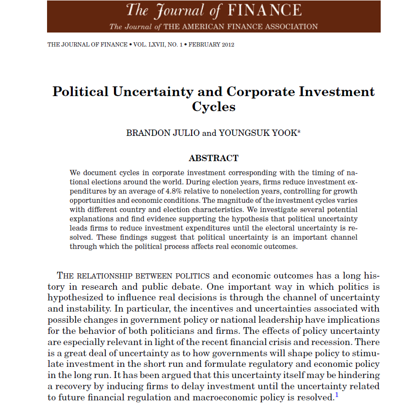
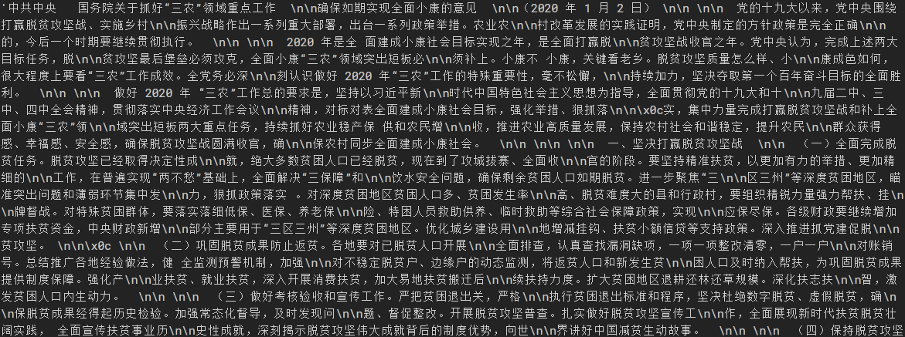
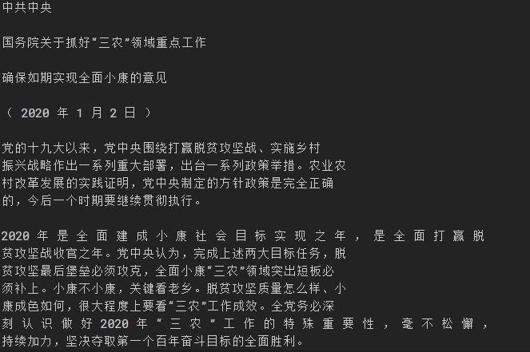
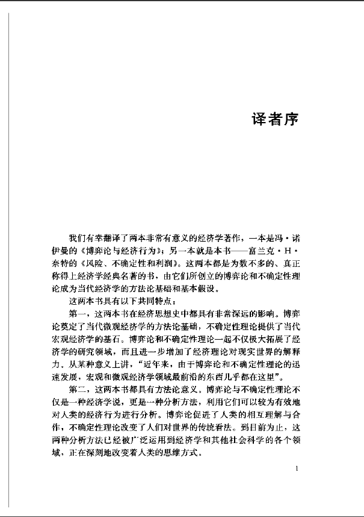
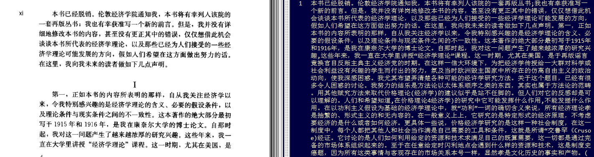

## 前言

常见的 PDF 文件可以分为两类：一种是文本转化而成（Text-Based），通常可以直接复制和粘贴；另一种是扫描文件而成（Scanned），比如影印书籍、插入图片制成的文件。依据此分类，将 Python 中处理 PDF 文件的第三方库可以简单归类：

 - 文本转化：`PyPDF2`,`pdfminer`,`textract`,`slate` 等库可用于提取文本；`pdfplumber`,`camelot` 等库可用来提取表格。
 - 扫描文件：先将文档转为图片，再利用 OCR（光学字符识别）提取内容，如 `pytesseract` 库；或者采用 `OpenCV` 进行图像处理。

上述大部分是第三方库，所以需要先进行安装：

 ```shell
 $pip install PyPDF2
 $pip install pdfminer
 $pip install pdfminer.six
 $pip install textract
 $pip install slate
 $pip install pdfplumber
 $pip install camelot
 $pip install pdf2image
 $pip install pillow
 $pip install pytesseract
 ```

 接下来，我们就分别使用上面提到的方法，分别对两类文档的处理。


 # 实现过程

 ## Text-Based PDF

 ### PyPDF2 库

 `PyPDF2`拥有`PdfFileReader`, `PdfFileMerger`,`PageObject`和`PdfFileWriter` 四个类，能够完成 PDF 读取、拆分、裁剪和合并等工作。

测试文档：



测试代码和输出结果如下：

```Python
import PyPDF2

#获取 PDF 信息
pdfFile = open('./input/Political Uncertainty and Corporate Investment Cycles.pdf', 'rb')
pdfObj = PyPDF2.PdfFileReader(pdfFile)
page_count = pdfObj.getNumPages()
print(page_count)

#提取文本
for p in range(0, page_count):
    text = pdfObj.getPage(p)
    print(text.extractText())
	
'''
# 部分输出：
39
THEJOURNALOFFINANCE
•
VOL.LXVII,NO.1
•
FEBRUARY2012
PoliticalUncertaintyandCorporateInvestment
Cycles
BRANDONJULIOandYOUNGSUKYOOK

ABSTRACT
Wedocumentcyclesincorporateinvestmentcorrespondingwiththetimingofna-
tionalelectionsaroundtheworld.Duringelectionyears,Þrmsreduceinvestmentex-
pendituresbyanaverageof4.8%relativetononelectionyears,controllingforgrowth
opportunitiesandeconomicconditions.Themagnitudeoftheinvestmentcyclesvaries
withdifferentcountryandelectioncharacteristics.Weinvestigateseveralpotential
explanationsandÞndevidencesupportingthehypothesisthatpoliticaluncertainty
leadsÞrmstoreduceinvestmentexpendituresuntiltheelectoraluncertaintyisre-
solved.TheseÞndingssuggestthatpoliticaluncertaintyisanimportantchannel
throughwhichthepoliticalprocessaffectsrealeconomicoutcomes.
'''
```

### pdfminer 库

`pdfminer` 库主要用于解析 PDF ，因为版本更新的原因，这个库的配置略麻烦，可以参阅 [How do I use pdfminer as a library](https://stackoverflow.com/questions/5725278/how-do-i-use-pdfminer-as-a-library#) 的回答，提供了一些解决方案。

```Python
import io

from pdfminer.pdfinterp import PDFResourceManager, PDFPageInterpreter
from pdfminer.converter import TextConverter
from pdfminer.layout import LAParams
from pdfminer.pdfpage import PDFPage


def convert_pdf_to_txt(path):
    rsrcmgr = PDFResourceManager()  # 存储共享资源，例如字体或图片
    retstr = io.StringIO()
    codec = 'utf-8'
    laparams = LAParams()
    device = TextConverter(rsrcmgr, retstr, codec=codec, laparams=laparams)
    fp = open(path, 'rb')
    interpreter = PDFPageInterpreter(rsrcmgr, device)  # 解析 page内容
    password = ""  # 密码，若无则初始化为空
    maxpages = 0
    caching = True
    pagenos = set()

    for page in PDFPage.get_pages(fp, pagenos, maxpages=maxpages,
                                  password=password,
                                  caching=caching,
                                  check_extractable=True):
        interpreter.process_page(page)

    text = retstr.getvalue()

    fp.close()
    device.close()
    retstr.close()
    return text


convert_pdf_to_txt("./input/一号文件.pdf")
```

输出效果如下：




### textract 库

这个库用起来也比较方便，但配置需要注意两点：

1. 安装 `textract` 的时候并不会自动安装 `pdfminer`，需要手动安装 `pdfminer`；
2. 报错 `local variable 'pipe' referenced before assignment`，需要对源码进行细微修改。如果配置报错，可以参考这篇文章： [python使用textract解析pdf时遇到UnboundLocalError: local variable 'pipe' referenced before assignment](https://blog.csdn.net/FannLann/article/details/80238889)，总结的比较全面。

```Python
import textract
text = textract.process("./input/一号文件.pdf", 'utf-8')
print(text.decode())
```
处理效果如下：



## Scanned PDF

 > Python-tesseract is an optical character recognition (OCR) tool for python. That is, it will recognize and "read" the text embedded in images. Python-tesseract is a wrapper for Google’s Tesseract-OCR Engine. It is also useful as a stand-alone invocation script to tesseract, as it can read all image types supported by the Pillow and Leptonica imaging libraries, including jpeg, png, gif, bmp, tiff, and others. Additionally, if used as a script, Python-tesseract will print the recognized text instead of writing it to a file.(from pytesseract project description)

 上段引用来自 `pytesseract` 项目的官方描述。说的是：Python-tesseract 是 Google Tesseract-OCR 引擎的包装。它也可以用作 tesseract 的独立调用脚本，因为可以读取 `Pillow` 和 `Leptonica` 库支持的所有图像类型，包括 jpeg，png，gif，bmp，tiff 等。**此外，如果用作脚本，Python-tesseract 将打印可识别的文本，而不是将其写入文件**。以一本电子书进行演示，文档的清晰度如下：

 


对于这种扫描的文件，处理方法前言中已经提及。具体来说：先将 PDF 转换为图片，再利用 OCR 提取文本内容。另外，因为全书有 320 页，处理起来太费时间，我就先提取其中的 15-30 页（正好是作者序言）进行演示。

```Python
import PyPDF2
from pdf2image import convert_from_path
from PIL import Image
import pytesseract


# 切割、提取15-30页
pdfFile = open('./input/风险、不确定性和利润.pdf', 'rb')
pdf_input = PyPDF2.PdfFileReader(pdfFile)

pdf_output = PyPDF2.PdfFileWriter()
for i in range(15, 30):
    pdf_output.addPage(pdf_input.getPage(i))
pdf_output.write(open('./output/风险、不确定性和利润_15_30.pdf', 'wb'))

# PDF 转为图片
PDF_file = './output/风险、不确定性和利润_15_30.pdf'
pages = convert_from_path(PDF_file, 500)
image_counter = 1
for page in pages:
    filename = "page_"+str(image_counter)+".jpg"
    page.save(filename, 'JPEG')
    image_counter += 1

# 图片中提取文本
filelimit = image_counter-1
outfile = "out_text.txt"
f = open(outfile, "a")
for i in range(1, filelimit + 1):
    filename = "page_"+str(i)+".jpg"
    text = str(
        ((pytesseract.image_to_string(Image.open(filename), lang='chi_sim')))) // chi_sim 表示简体中文
    text = text.replace('\n', '')
    text = text.replace(' ', '')
    f.write(text)
f.close()
```
处理结果如下：



# 小结

本文对 Python 中从 PDF 提取信息的方法进行了介绍，并将主要第三方库进行了对比。可以看出，PDF的转换是一个比较麻烦的事，转换效果很大程度取决于文档本身的质量。如果文件量比较小，还不如复制粘贴，或者使用 APP 和网站处理来得快。任务量比较大，实在需要程序处理时，一方面，在着手写程序之前先可以使用不同的方法对比，选择最好的实现效果；另一方面，使用程序批量处理并非一劳永逸，往往需要和人工校验相配合。

# 推荐阅读

[Working with PDF files in Python](https://www.geeksforgeeks.org/working-with-pdf-files-in-python/)

 [PDF提取文本](https://zhuanlan.zhihu.com/p/136888486)

[Exporting Data from PDFs with Python](https://www.blog.pythonlibrary.org/2018/05/03/exporting-data-from-pdfs-with-python/)

[使用pdfminer3k模块读取PDF](https://blog.csdn.net/qq_42415326/article/details/89432839?utm_medium=distribute.pc_relevant.none-task-blog-baidujs-8)

[How do I use pdfminer as a library
](https://stackoverflow.com/questions/5725278/how-do-i-use-pdfminer-as-a-library#)