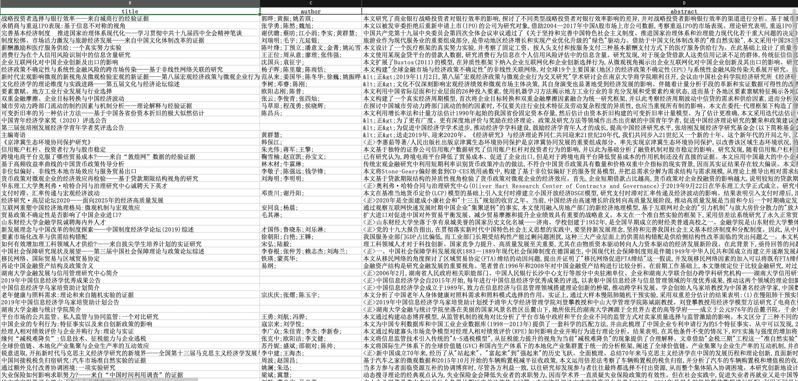

用 Python 操作 Zotero


## 0.准备工作

1. 安装 `pyzotero` 库

```shell
!pip install pyzotero
```

2. 前往 [Zotero 官网](https://www.zotero.org/settings/keys) 获取 `library_id` 和 `api_key`。

`library_id`:


`api_key`:

点击上图中的`Create new private key`，随后出现如下界面：


点击保存之后，会弹出窗口，即为`api_key`。**注意：`api_key`只会在这个界面出现一次，所以生成后要注意保存**。

## 1.用法介绍

### 1.1 实例对象
`Pyzotero`是将 Zotero API进行封装的包，通过 `PyZotero`库可以获取 Zotero 的集合、条目和附件信息。

在开始前，要先准备三个参数（`library_id, library_type, api_key`），实例化一个对象。其中，`library_id`和 `api_key` 的获取方式见准备工作；`library_type`可以选择`user`或者`group`，分别对应用户和群组。

```Python
from pyzotero import zotero

library_id = '20201230'
library_type = 'user' # 'user' or 'group'
api_key = 'ABCDEFG123' 

# 实例对象
zot = zotero.Zotero(library_id, library_type, api_key)

zot.key_info() # 查看用户信息
```
输出结果为：


### 1.2 检索条目

```Python
zot.count_items() # 返回库/组中所有项的计数
zot.top(limit=10) # 返回顶级Zotero库项目
zot.trash() # 回收站
zot.publications() # 我的出版物
```
### 1.3 检索文件

```Python
Zotero.file(itemID[, search/request parameters])
```
上面的方法返回条目中的原始文件。可以通过如下复制文件：

```Python
with open('article.pdf', 'wb') as f:
  f.write(zot.file('BM8MZJBB'))
```

去重：

```Python
# write a file to the current working directory using the stored filename
zot.dump('BM8MZJBB')
# write the same file to a different path, with a new name
zot.dump('BM8MZJBB', 'article_1.pdf', '/home/beckett/pdfs')
```

### 1.3 检索集合

```Python
zot.collections()
zot.collections_top()
```

### 1.4 其他

```Python
zot.tags() # 检索标签
zot.item_versions() # 版本信息
```

除了这些基本的检索意外，`Pyzotero`库可以对集合、集合中条目和附件进行增删改，以及上传文件。[官方文档](https://pyzotero.readthedocs.io/en/latest/)对用法进行了列举，感兴趣的朋友可以查阅学习。

下面，将通过一个综合的例子来展示`Pyzotero`库的使用。

## 2. 使用案例

### 2.1 项目用途

提取2020年《经济研究》的文章标题、作者和摘要。

### 2.2 项目思路

- 将《经济研究》对应的内容添加到 Zotero 相应的集合；
- 通过`Pyzotero`库对集合所有的文章进行遍历，提取信息存为列表；
- 将列表存为`DataFrame`，导出为 Excel。

### 2.3 实现过程

#### 2.3.1 建立集合

首先在知网选中相应的文献，选择`RefWorks`格式，再选择复制到剪贴板。操作如下：


复制文献记录后，在 Zotero 新建立的集合中选择从剪贴板导入。


文献导入集合中后，就可以使用 `Pyzotero` 库进行分析了。分析代码如下：

```Python
from pyzotero import zotero
import pandas as pd

library_id = '123456' # 填入自己的id
library_type = 'user' # 'user' or 'group'
api_key = 'XXXXX' #  填入自己的api_key

zot = zotero.Zotero(library_id, library_type, api_key)

colls = zot.collections() # 所有集合名称

# 选择待分析的集合
for coll in colls:
    if coll['data']['name'] == '经济研究':
        print(coll)


pyz = zot.collection_items('H3UGRKRB') # 待分析集合的key

# 存储标题、摘要和作者
tittle = []
abstract = []
author = []
for p in pyz:
    tittle.append(p['data']['title'])
    abstract.append(p['data']['abstractNote'])
    # 期刊中的公告无作者
    try:
        author.append(p['data']['creators'][0]['lastName'])
    except:
        author.append("")

# 写入DataFrame
paper_info = {
    "title": title,
    "author": author,
    "abstract": abstract
}
df = pd.DataFrame(paper_info)

# 导出为Excel
df.to_excel("经济研究_2020.xlsx")
```

### 2.4 实现结果



