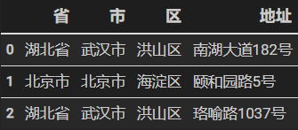

# 前言

实证研究过程中，少不了地址数据的清理。比如为数据匹配省市信息、从大段文本中提取地址、从电话号码、身份证等信息中提取地址。面对这些清理工作，你有什么思路吗？其实在 Python 中有一些库可以很方便的来解决这些问题，今天为大家介绍一些用于地址数据清理的库。**全篇分为两部分：第一部分为地址提取，介绍如何从大段文本、手机号和身份证号中提取地址；第二部分为地址匹配，介绍如何匹配省市区**。

后文用到的外部库主要有 `cocoNLP`、`id_validator` 和 `cpca` (Chinese Province City Area) ，可以在命令行窗口输入如下进行安装：

```
!pip install cocoNLP
!pip install id_validator
!pip install cpca
```

# 实现示例

## 地址提取

 `cocoNLP` 是一个中文 NLP 库，主要用于从文本中提取信息。它不仅可以提取地址，还可以提取信姓名、邮箱和手机号等其他信息，更多的用法可以去项目主页查看。`id_validator` 库主要用于验证和解析身份证号，可以用它从身份证号中提取地址。

### 文本中提取地址

```Python
from cocoNLP.extractor import extractor
ex = extractor()
text = '中南财经政法大学，地址：湖北省武汉市东湖新技术开发区南湖大道182号，邮编：430073，电话：027-88386114'

# 提取地址
locations = ex.extract_locations(text)
locations

'''
输出:
['湖北省武汉市东湖新技术开发区南湖大道', '武汉市东湖新技术开发区南湖大道', '南湖大道', '大道']
'''
```

### 手机号归属地

```Python
cellphones = ['18100065143', '13261562938']
# 抽取手机归属地、运营商
cell_locs = [ex.extract_cellphone_location(cell,'CHN') for cell in cellphones]
print(cell_locs)

'''
输出：
[{'phone': '18100065143', 'province': '上海', 'city': '上海', 'zip_code': '200000', 'area_code': '021', 'phone_type': '电信'},
{'phone': '13261562938', 'province': '北京', 'city': '北京', 'zip_code': '100000', 'area_code': '010', 'phone_type': '联通'}]
'''
```

### 身份证对应地址

````Python
# 抽取身份证号的正则
​```Python
from id_validator import validator
validator.is_valid('440308199901101512') # 验证真实性
validator.get_info('440308199901101512') # 提取信息

'''
输出：
True
{'address_code': '440308',
 'abandoned': 0,
 'address': '广东省深圳市盐田区',
 'address_tree': ['广东省', '深圳市', '盐田区'],
 'birthday_code': '1999-01-10',
 'constellation': '摩羯座',
 'chinese_zodiac': '卯兔',
 'sex': 1,
 'length': 18,
 'check_bit': '2'}
 '''
````

## 地址匹配

`chinese_province_city_area_mapper` 是用于提取简体中文字符串中省，市和区并能够进行映射，检验和简单绘图的库，数据源为**爬取自中华人民共和国民政局全国行政区划查询平台-中国三级行政区划**。本库最主要的方法是`cpca.transform`，该方法可以输入任意的可迭代类型（如 list，pandas 的 Series 类型等），然后将其转换为一个 DataFrame ，通过它可以实现匹配省市信息。

# 匹配省市区

```
location_str = ["洪山区南湖大道182号",'海淀区颐和园路5号','洪山区珞喻路1037号']
import cpca #chinese province city area
df = cpca.transform(location_str)
df
```

上述代码的输出结果为：



# 参考资料

chinese_province_city_area_mapper: https://github.com/DQinYuan/chinese_province_city_area_mapper

cocoNLP: https://github.com/fighting41love/cocoNLP

id_validator: https://github.com/jxlwqq/id-validator
