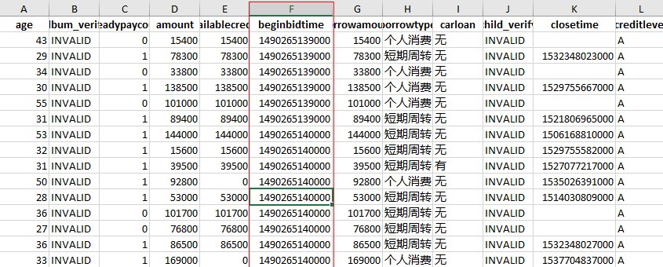
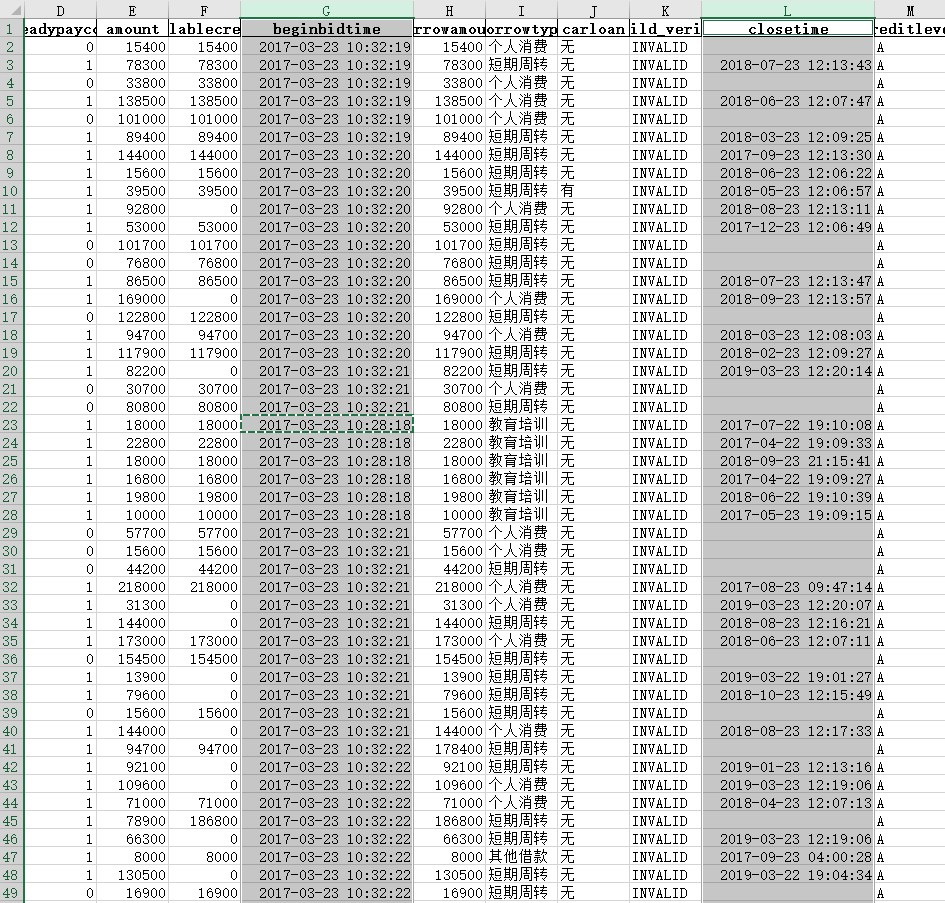

## 1. 提出问题



爬数据的时候，有没有遇见过爬下来的数据日期显示为一大串数字？像上图中的`beginbidtime`变量，这是时间戳。时间戳是啥？是指格林威治时间自1970年1月1日（00:00:00 GMT）(一般把这个时点称为 `unix` 纪元或 `POSIX` 时间)至当前时间的总秒数。时间戳的好处是能够唯一地表示某一刻的时间，但这显然不利于肉眼观察和分析数据，所以下面我们将时间戳转化为常见的时间格式。

## 2. 方法介绍

可以使用`Pandas`库中的`to_datetime()`函数实现，`to_datetime()`函数用于转换字符串、时间戳等各种形式的日期数据，转换`Series`时，返回具有相同索引的`Series`，日期时间列表则会被转换为`DtetimeIndex`。鉴于 `Timestamp` 对象内部存储方式，这种转换的默认单位是纳秒。不过，一般都会用指定其它时间单位 `unit` 来存储纪元数据。

```Python
pd.to_datetime([1349720105, 1349806505, 1349892905,1349979305, 1350065705], unit='s')

'''
DatetimeIndex(['2012-10-08 18:15:05', '2012-10-09 18:15:05',
               '2012-10-10 18:15:05', '2012-10-11 18:15:05',
               '2012-10-12 18:15:05'],
              dtype='datetime64[ns]', freq=None)
'''

pd.to_datetime([1349720105100, 1349720105200, 1349720105300,1349720105400, 1349720105500], unit='ms')
'''
DatetimeIndex(['2012-10-08 18:15:05.100000', '2012-10-08 18:15:05.200000',
               '2012-10-08 18:15:05.300000', '2012-10-08 18:15:05.400000',
               '2012-10-08 18:15:05.500000'],
              dtype='datetime64[ns]', freq=None)
'''
```

## 3. 实现过程

```Python
import pandas as pd

df = pd.read_excel('RRD_User_Info.xlsx',prase_date=True)
df.head()

df.beginbidtime = pd.to_datetime(df.beginbidtime,unit='ms')
df.closetime = pd.to_datetime(df.closetime,unit='ms')
df.to_excel('RRD_User_Transformed.xlsx')
```

## 4. 实现结果

经过上面的操作，就将时间戳转换转换为我们熟悉的时间格式了。结果如下：


