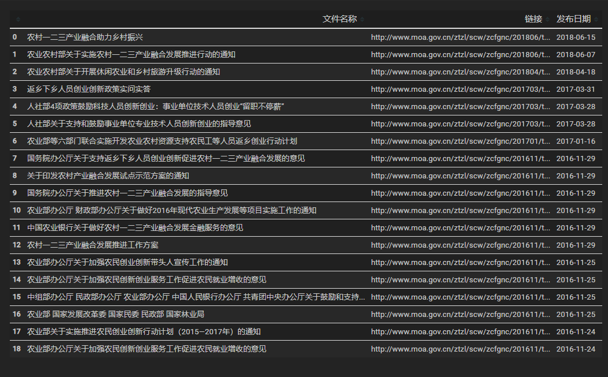
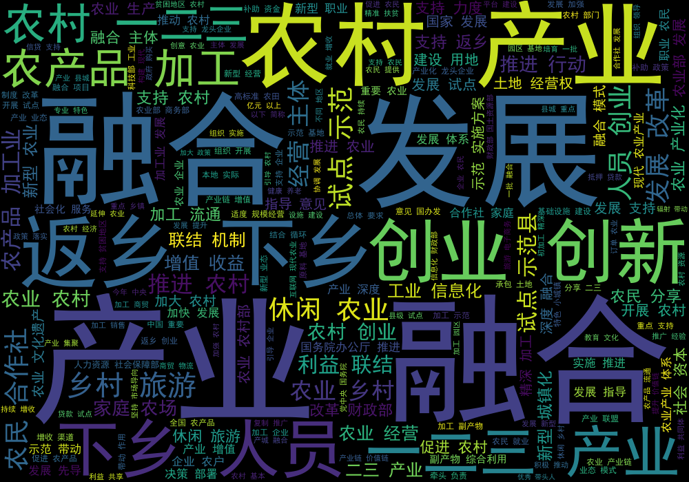
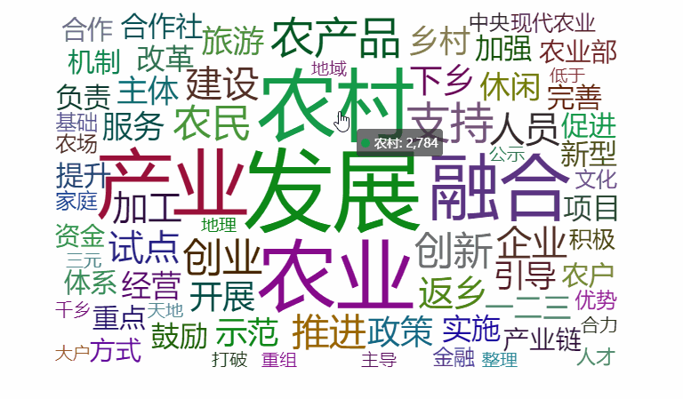

# 前言

本文用作准备课堂分享，我们小组选的主题是产业融合，我负责第一部分背景。因为产业融合的政策性较强，为了更生动地展示政策文件内容，就爬取了[农业农村部专题网站](http://www.moa.gov.cn/ztzl/scw/)上的政策法规，并基于 TF-IDF 算法提取关键词、统计词频和绘制词云图，以便丰富展示素材。

# 爬取政策法规

## 爬取政策列表

```Python
import requests
from bs4 import BeautifulSoup
import re
import numpy as np
import pandas as pd
import os

url = "http://www.moa.gov.cn/ztzl/scw/zcfgnc/"
html = requests.get(url)
html.encoding = 'utf-8'
soup = BeautifulSoup(html.text, 'lxml')

# 存储获取政策名称、链接和发布日期
policies = soup.find_all('li', 'li_cir')
title = [policies[i].find('a')['title'] for i in range(len(policies))]
links = [url + policies[i].find('a')['href'][2:] for i in range(len(policies))]
date = [re.sub("\n|\s", "", policies[i].find('span', 'date fr dc_3').text)
        for i in range(len(policies))]

# 结果导出为 CSV	
info = pd.DataFrame([title, links, date]).T
info.columns = ['文件名称', '链接', '发布日期']
info.to_csv("01_产业融合政策列表.csv", index=None, encoding='utf-8-sig')
info
```


## 爬取政策文本

细心的读者会发现，上图政策法规列表中还包括**创业创新**的内容，如果一并抓取会影响分析结果的准确性。因此，仅选取产业融合相关的政策文件，并爬取政策文本。

```Python
for i in range(len(policies)):
    link = links[i]
    file_name = title[i].strip() + ".txt"
    if "产业融合" in file_name:
        print("爬取：", file_name)
        r = requests.get(link)
        r.encoding = 'utf8'
        soup = BeautifulSoup(r.text, 'lxml')
        contents = soup.find(
            'div', attrs={'class': 'arc_body mg_auto w_855 pd_b_35'}).find_all('p')
        with open(file_name, 'wb') as f:
            for content in contents:
                f.write(content.get_text().strip().encode())

'''
爬取： 农村一二三产业融合助力乡村振兴.txt
爬取： 农业农村部关于实施农村一二三产业融合发展推进行动的通知.txt
爬取： 国务院办公厅关于支持返乡下乡人员创业创新促进农村一二三产业融合发展的意见.txt
爬取： 关于印发农村产业融合发展试点示范方案的通知.txt
爬取： 国务院办公厅关于推进农村一二三产业融合发展的指导意见.txt
爬取： 中国农业银行关于做好农村一二三产业融合发展金融服务的意见.txt
爬取： 农村一二三产业融合发展推进工作方案.txt
'''
```

经过前一步，已经完成单个政策文件的爬取，接下来，将其合并为一个 txt 文件。

```Python
filenames = os.listdir()
txt_files = [f for f in filenames if f.split('.')[-1] == "txt"]

txt_content = []
for txt_file in txt_files:
    with open(txt_file, encoding='utf8') as f:
        txt_content = txt_content + f.readlines()

with open("所有政策文件.txt", 'w', encoding="utf8") as result:
    result.writelines(txt_content)
```

# 分词与统计

## 文本预处理

```Python
# 去除多余字符
f = open('所有政策文件.txt', "r", encoding="utf-8")
t = f.read()
f.close()
t = re.sub(r'\d+', "", t)  # 去除所有数字
```
## 分词
```Python
import jieba
import jieba.analyse as analyse

# 分词和去除停用词
ls = jieba.lcut(t)
stopwords = [line.strip() for line in open(
    './requirement/user_dict.txt', 'r', encoding='utf-8').readlines()]
words = [word for word in ls
         if len(word) > 1
         and word not in stopwords
         and not re.match('^[a-z|A-Z|0-9|.]*$', word)]
txt = " ".join(words)
```

## 提取关键词
```Python
# 基于TF-IDF算法提取关键词
kw = " ".join(analyse.extract_tags(t, topK=20, withWeight=False, allowPOS=()))
print("三产融合相关政策中前20个关键词：\n", kw)

'''
三产融合相关政策中前20个关键词：
融合 农村 农业 产业 发展 农产品 返乡 创业 试点 支持 \
一二三 下乡 创新 农民 推进 休闲 示范 加工 乡村 人员
'''
```

## 词频统计
```Python
counts = {}
for word in words:
    if len(word) == 1:
        continue
    else:
        counts[word] = counts.get(word, 0) + 1
items = list(counts.items())
items.sort(key=lambda x: x[1], reverse=True)

# 导出词频结果
df = pd.DataFrame(items, columns=['关键词', '频次'])
df.to_csv("02_词频统计结果.csv", index=None, encoding='utf_8_sig')
```
# 绘制词云图

## 静态词云图
```Python
import wordcloud
import matplotlib.pyplot as plt

# 绘制词云图
w = wordcloud.WordCloud(font_path="./requirement/simhei.ttf",
                        width=1000, height=700, background_color="black")
w.generate(txt)
w.to_file("03_政策法规词云图.png")

# 展示结果
fig = plt.figure(figsize=(20, 100))
plt.imshow(w, interpolation='bilinear')
plt.axis("off")
plt.show()
```


## 动态词云图
```Python
from pyecharts import options as opts
from pyecharts.charts import Page, WordCloud
from pyecharts.globals import SymbolType

def wordcloud_diamond() -> WordCloud:
    words = items
    c = (
        WordCloud()
        .add("", words, word_size_range=[20, 100], shape=SymbolType.DIAMOND)
        .set_global_opts(title_opts=opts.TitleOpts(title="农村产业融合政策法规词云图"))
    )
    return c

wordcloud_diamond().render('04_农村产业融合政策法规词云图.html')
wordcloud_diamond().render_notebook()
```


# 小结

从分析结果可以看出农村产业融合主要围绕“三农”问题。强调以农业为基本依托，通过产业间交叉、渗透和重组，推进一二三产业前后联动、要素集聚和跨界配置，从而解决农民就业问题、人才问题和农业创新等问题。需要说明的是，专题网站提供与产业融合相关的政策法规并不完全，这会影响结论的准确性。


