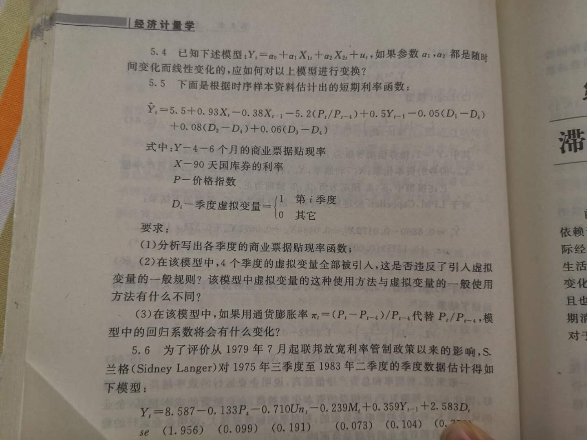

$$
\hat Y_t = 5.5 + 0.93X_t -9.38X_{t-1} - 5.2(P_t/P_{t-1}) + 0.5Y_{t-1} -0.05(D1-D4) + 0.08(D2-D4) + 0.06(D3-D4)
$$

(1)

第一季度：
$$
\hat Y_t = 5.5 + 0.93X_t -9.38X_{t-1} - 5.2(P_t/P_{t-1}) + 0.5Y_{t-1} -0.05
$$

第二季度:
$$
\hat Y_t = 5.5 + 0.93X_t -9.38X_{t-1} - 5.2(P_t/P_{t-1}) + 0.5Y_{t-1} + 0.08
$$

第三季度：
$$
\hat Y_t = 5.5 + 0.93X_t -9.38X_{t-1} - 5.2(P_t/P_{t-1}) + 0.5Y_{t-1} + 0.06
$$

第四季度：
$$
\hat Y_t = 5.5 + 0.93X_t -9.38X_{t-1} - 5.2(P_t/P_{t-1}) + 0.5Y_{t-1} -0.09
$$
（2）没有

（3）