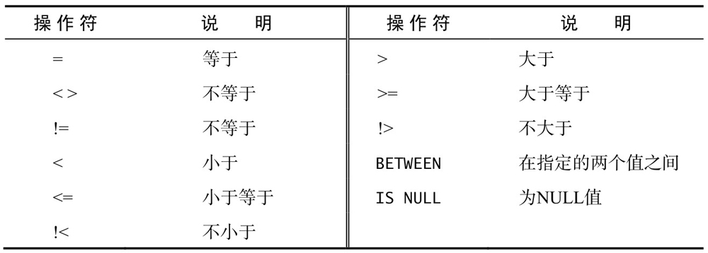

# 基本概念

|概念|含义|
|:---:|:---:|
|数据库(database)|保存有组织的数据的容器（通常是一个文件或一组文件）|
|数据库软件管理系统(DBMS)|数据库软件用于创建和操作数据库|
|表(table)|某种特定类型数据的结构化清单|
|列(column)|表中的一个字段，所有表都是有一个和 多个列组成|
|行(row)|表中的一个记录(record)|
|主键(primary key)|一列（或一组列），其值能够唯一标识表中每一行|
|关键字(keyword)|作为 SQL 组成部分的保留字。关键字不能用作表或者列的名字|
|子句(clause)| SQL 语句由子句构成，有些子句是必需的，有些则是可选的|

# 一些规则
1. 多条 SQL 语句必须以分号分隔。
2. SQL 不区分大小写，但一般习惯关键字用大写，列名和表名使用小写。
3. 处理 SQL 语句时，所有空格都会被忽略。一般认为写成多行更容易维护。
4. 选择多个列时，一定要在列名之间加上逗号，但最后一个列名不加。如果在最后一个列名加了逗号，会出现错误。
5. SQL 一般返回原始的、无格式的数据。
6. 第一个检索的行是第0行，而不是第1行。
7. 并非所有 SQL 实现方式 都一样。虽然基本的语句容易移植，但是较复杂的语句会有区别。
8. 检索出来的数据默认是不排序，会以其在底层表中出现的顺序显示。


# 检索数据

SQL 语句是由简单的英语单词构成的。这些单词称为
关键字，每个 SQL 语句都是由一个或多个关键字构成的。使用 `SELECT` 关键字检索表数据，必须给出想选择什么（`SELECT`）和从什么地方选择两条信息（`FROM`）。

## 选择单个列
```SQL
SELECT prod_name
FROM Products;
```

处理 SQL 语句时，所有空格都会被忽略。下面三个例子可以实现同样的效果，一般认为写成多行更容易维护。

```SQL
# 语法1
SELECT prod_name
FROM Products;

# 语法2
SELECT prod_name FROM Products;

# 语法3
SELECT
prod_name
FROM
Products;
```

## 检索多个列

```SQL
SELECT prod_id, prod_name, prod_price
FROM Products;
```
## 检索所有列

```SQL 
SELECT *
FROM Products;
```
实际列名的位置使用星号(*)通配符可以选择所有列。除非实际需要检索所有的列，不然检索不需要的列或降低检索和应用程序的性能。

## 检索不同的值

```SQL
SELECT vend_id
FROM Products;
```
使用 `DISTINCT` 关键字只返回不同的（唯一的）值。
```SQL
SELECT DISTINCT vend_id
FROM Products;
```

`DISTINCT` 关键字作用于所有列，不仅仅是跟在其后那一列。比如 `SELECT DISTINCT vend_id, prod_id, prod_price` 因为指定的两列不完全相同，所以所有的行都会被检索出来。

## 限制结果

默认显示所有满足条件的行，可以只显示指定的行吗？**可以，但是在不同数据库实现方式不同。

在 SQL Server 和 Access 中使用 `SELECT` 时，可以使用 `TOP` 关键字来限制最多返回的行。
```SQL
SELECT TOP 5 prod_name
FROM Products;
```

如果使用 DB2 :
```SQL
SELECT prod_name
FROM Products
FETCH FIRST 5 ROWS ONLY;
```
如果使用 Oracle ，需要基于 ROWNUM（行计数器）来计算行：
```SQL
SELECT prod_name
FROM Products
WHERE ROWNUM > 5;
```

如果使用 MySQL、MariaDB、PostgreSQL 或者 SQLite，则需要使用 `LIMIT` 子句：
```SQL
SELECT prod_name
FROM Products
LIMIT 5;
```
返回第5行起的第5行数据。第一个数字是检索的行数，第二个数字是指从哪儿开始。
```SQL
SELECT prod_name
FROM Products
LIMIT 5 OFFSET 5;
```

MySQL、MariaDB 和 SQLite 支持简化版的 `LIMIT 4 OFFSET 3` 语句，即 `LIMIT 3,4` 。 


## 使用注释


### 行注释
行内注释1：注释使用 `--`（两个连字符）嵌在行内。
```SQL
SELECT prod_name --这是一条注释 
FROM Products;
```


行内注释2：使用 `#` 号

```SQL
# 这是一条注释
SELECT prod_name
FROM Products;
```
块注释 ：使用 `/*` 和 `*/` 
```SQL
/* SELECT prod_name, vend_id
FROM Products; */
SELECT prod_name
FROM Products;
```


# 排序检索数据

本节讲授如何使用 `SELECT` 的 `ORDER BY` 子句，根据需要排序检索数据。

## 排序数据

```SQL
SELECT prod_name
FROM Products
ORDER BY prod_name;

/* ORDER BY prod_id;
也可以是非检索行排序*/
```

在指定一条 `ORDER BY` 子句时，应该保证它是 `SELECT` 语句中的最后一条子句。

## 按多列排序

```SQL
SELECT prod_id, prod_name, prod_price
FROM Products;
ORDER BY prod_price, prod_name;
```

上面的语句，首先按照价格，然后按名称排序。

## 按列位置排序

除了能用列名排序顺序外，`ORDER BY` 还支持按相对列位置进行排序。

```SQL
SELECT prod_id, prod_name, prod_name
FROM Products
ORDER BY 2,3; --，2,3表示清单中的列；表示先按prod_price，再按prod_name排序
```

## 指定排序方向

默认使用升序排序（从A到Z），通过指定 `DESC` （DESCENDING） 关键字实现降序排序。可以通过 `AESC` （AESCENDING）升序排序，但实际没有多大用处，因为默认就是使用升序排序。

```SQL
SELECT prod_id, prod_name, prod_price
FROM Products
ORDER BY prod_price DESC;
```

`DESC` 只应用到直接位于其前面的列名。如果想在多个列上降序排序，必须对每一列指定 `DESC` 关键字。

```SQL
SELECT prod_id, prod_name, prod_price
FROM Products
ORDER BY prod_price DESC, prod_name;
```


区分大小写和排序数据？
在对文本数据排序的时候，A 和 a 是一样的吗？这不是理论问题，取决于数据库的设置。

# 过滤数据

本节讲授使用 `WHERE` 关键字指定搜索条件。

## 使用 WHERE 句子

只检索所需数据指定搜索条件（search criteria)，搜索条件也被称为过滤条件（fliter condition）。

```SQL
SELECT prod_name, prod_price
FROM Products
#检索 prod_price 为 3.49 的行
WHRER prod_price = 3.49; 
```

注意：在同时使用 `ORDER BY` 和 `WHERE` 子句时，应该让 `ORDER BY` 位于 `WHERE` 之后。

## WHERE 子句操作符



注意：`<>`和`!=`通常可以互换。但是并非所有DBMS都支持这两种不等于操作符。比如，Microsoft Access 支持 `<>` 而不支持 `!=`。

### 检查单个值与不匹配检查

```SQL
SELECT prod_name, prod_price
FROM Products
WHERE prod_price <= 10;
# WHERE vend_id != 'DLL01';
```
### 范围值检查

```SQL
SELECT prod_name, prod_price
FROM Products;
WHERE prod_price BEtween 5 AND 10;
```

### 空值检查

`NULL` 表示空值，确定是否空值，不能简单的 `= NULL`，`SELECT` 语句有一个特殊的 `WHERE` 子句 `IS NULL` ，可用来检查具有 NULL 值的列。

```SQL
SELECT prod_name
FROM Products
WHERE prod_price IS NULL;
```


