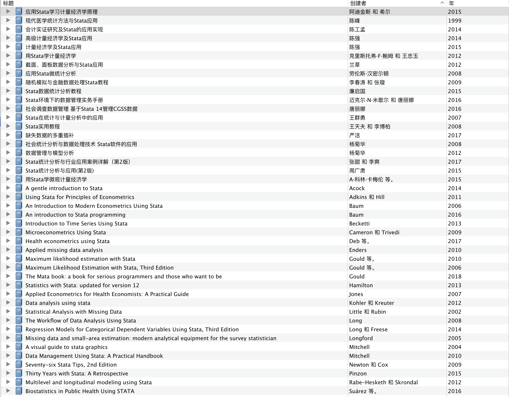

这几天将自己看过和收藏的与 Stata 有关书籍整理了一下，基本上涵盖市面上能找到的讲 Stata 的书。把手头的书目信息出来放上来，给想在寒假自学的朋友教材选择提供参考。

但是考虑到：

- 版权原因
- 整理不易
- 避免囤书

所以不打算直接将书分享出来，大家可以自行查找感兴趣书籍的PDF或者购买纸质版。

**但是，如果有某本想看的书找不到，或者自己懒得找，可以在后台给我留言（~~如果有打赏，可能回复的更快哦~~），我可以分享给你。**

- ## 应用Stata学习计量经济学原理

  | 类型     | 书籍                                                         |
  | -------- | ------------------------------------------------------------ |
  | 作者     | 阿迪金斯                                                     |
  | 作者     | 希尔                                                         |
  | 摘要     | 本书主要介绍经济学理论研究中STATA软件的运用。全书分为16章，依次从易到难地介绍了STATA软件、简单线性回归模型、模型拟合、多重线性回归模型以及面板数据模型等。每章均精心选择案例进行示范，对于经济学专业的教师和学生具有很好的学习和参考价值。 |
  | 日期     | 2015.12                                                      |
  | 语言     | cn                                                           |
  | 馆藏目录 | SuperLib                                                     |
  | URL      | http://book.ucdrs.superlib.net/views/specific/2929/bookDetail.jsp?dxNumber=000015824284&d=3DEC1822508E545D65DF74C64B2A1E3A&fenlei=0603030402 |
  | 访问时间 | 2021/1/19 上午10:15:55                                       |
  | 出版社   | 重庆：重庆大学出版社                                         |
  | ISBN     | 978-7-5624-9441-6                                            |
  | 系列     | 万卷方法                                                     |
  | 总页数   | 502                                                          |
  | 添加日期 | 2021/1/19 上午10:15:55                                       |
  | 修改日期 | 2021/1/21 下午12:06:41                                       |

  ### 附件

  - 阿迪金斯\_希\_2015\_应用Stata学习计量经济学原理.pdf					

- ## 现代医学统计方法与Stata应用

  | 类型     | 书籍                                                         |
  | -------- | ------------------------------------------------------------ |
  | 作者     | 陈峰                                                         |
  | 摘要     | 本书以介绍Stata软件之应用为主线，而按医学统计学方法体系设计章节，再依照统计分析的任务和要求编排并讲解计算机指令。通过Stata统计软件的应用介绍现代医学统计方法，使实际工作者在轻松愉快的上机操作中理解掌握现代统计学方法，既提高了学习效率，又增强了分析问题和解决问题的能力，收到事半功倍之效。 |
  | 日期     | 1999-6-1                                                     |
  | 馆藏目录 | Douban                                                       |
  | URL      | https://book.douban.com/subject/1217996/                     |
  | 访问时间 | 2021/1/19 上午10:43:07                                       |
  | 出版社   | 中国统计                                                     |
  | ISBN     | 978-7-5037-2941-6                                            |
  | 总页数   | 234                                                          |
  | 添加日期 | 2021/1/19 上午10:43:07                                       |
  | 修改日期 | 2021/1/21 下午12:06:38                                       |

  ### 附件

  - 现代医学统计方法与Stata应用(数据）.zip					

  - 陈峰\_1999\_现代医学统计方法与Stata应用.pdf						

- ## 会计实证研究及Stata的应用实现

  | 类型     | 书籍                                                         |
  | -------- | ------------------------------------------------------------ |
  | 编辑     | 陈工孟                                                       |
  | 摘要     | 这是一本会计实证研究的入门教材。主要分为三大部分，第一部分简要介绍会计实证研究的概念、方法和研究热点；第二部分利用Stata12.0这款统计计量软件对会计实证研究的问题进行操作演示。第三部分对会计实证研究的各个研究专题进行分类讲述，为读者补充理论基础，梳理研究脉络。本书内容详实、可读性强、操作性强，适合会计、统计、数学等专业的本科生、研究生及相关专业的研究人员使用。 |
  | 日期     | 2014.10                                                      |
  | 语言     | cn                                                           |
  | 馆藏目录 | SuperLib                                                     |
  | URL      | http://book.ucdrs.superlib.net/views/specific/2929/bookDetail.jsp?dxNumber=000015271230&d=03C4F8BC80E1015C7B907D0CDF5FADE4&fenlei=06030401 |
  | 访问时间 | 2021/1/19 上午10:18:14                                       |
  | 出版社   | 北京：经济管理出版社                                         |
  | ISBN     | 978-7-5096-3378-6                                            |
  | 系列     | 国泰安实证研究系列丛书                                       |
  | 总页数   | 271                                                          |
  | 添加日期 | 2021/1/19 上午10:18:14                                       |
  | 修改日期 | 2021/1/21 下午12:05:58                                       |

  ### 附件

  - 陈工孟\_2014\_会计实证研究及Stata的应用实现.pdf						

- ## 高级计量经济学及Stata应用

  | 类型     | 书籍                                                         |
  | -------- | ------------------------------------------------------------ |
  | 作者     | 陈强                                                         |
  | 摘要     | 《经济学、管理学类研究生教学用书:高级计量经济学及Stata应用(第二版)》较多地借鉴了现代计量经济学的最新发展，内容全面，除了介绍传统的横截面数据外，对面板数据（含长面板、动态面板、非线性面板）、时间序列（含VAR、单位根、协整）、自然实验、重复截面数据、GMM、自助法、蒙特卡罗法、分位数回归、门限回归、非参数估计、处理效应、空间计量、久期分析、贝叶斯估计等均做了较深入的分析。此书力图以生动的语言、较多的插图与经济意义来直观地解释计量方法，而又不失数学的严谨性。同时，结合目前欧美最为流行的Stata计量软件，及时地介绍相应的Stata命令与实例，为读者提供“一站式”服务。此书适合普通高等学校经济学、管理学类或社科类硕士生、博士生与研究人员使用。 |
  | 日期     | 2014-4-1                                                     |
  | 馆藏目录 | Douban                                                       |
  | URL      | https://book.douban.com/subject/25930690//                   |
  | 访问时间 | 2021/1/17 下午12:36:33                                       |
  | 出版社   | 高等教育出版社                                               |
  | ISBN     | 978-7-04-032983-4                                            |
  | 总页数   | 669                                                          |
  | 添加日期 | 2021/1/17 下午12:36:33                                       |
  | 修改日期 | 2021/1/21 下午12:05:47                                       |

  ### 附件

  - 陈强\_2014\_高级计量经济学及Stata应用.pdf					

- ## 计量经济学及Stata应用

  | 类型     | 书籍                                                         |
  | -------- | ------------------------------------------------------------ |
  | 作者     | 陈强                                                         |
  | 摘要     | 《计量经济学及Stata应用》为既接轨现代计量经济学，又适合中国国情的本科计量经济学教材。在理论体系上，《计量经济学及Stata应用》充分借鉴*新国际主流教材，以大样本理论为主线，并针对中国学生的知识体系进行编写。《计量经济学及Stata应用》内容全面，包括横截面数据（多元回归、工具变量法、离散选择）、时间序列（平稳时间序列、单位根、协整），以及面板数据（随机效应、固定效应）等。,  《计量经济学及Stata应用》力图以清晰而生动的语言、较多的插图与经济意义，来直观地解释计量方法。同时结合目前欧美最为流行的stata计量软件，及时地介绍相应的计算机操作与经典实例，为读者提供“一站式”服务。《计量经济学及Stata应用》还较多地使用计算机模拟（蒙特卡罗法），作为强有力的学习工具，《计量经济学及Stata应用》适合高等学校经济管理类及社科类的本科生使用。 |
  | 日期     | 2015-7-1                                                     |
  | 馆藏目录 | Douban                                                       |
  | URL      | https://book.douban.com/subject/26883522/                    |
  | 访问时间 | 2021/1/18 下午9:34:13                                        |
  | 出版社   | 高等教育出版社                                               |
  | ISBN     | 978-7-04-042751-6                                            |
  | 总页数   | 349                                                          |
  | 添加日期 | 2021/1/18 下午9:34:13                                        |
  | 修改日期 | 2021/1/21 下午12:06:04                                       |

  ### 附件

  - 计量经济学及Stata应用 - 网易云课堂					

  - 陈强\_2015_计量经济学及Stata应用.pdf						

- ## 用Stata学计量经济学

  | 类型     | 书籍                                                         |
  | -------- | ------------------------------------------------------------ |
  | 作者     | 克里斯托弗·F·鲍姆                                            |
  | 作者     | 王忠玉                                                       |
  | 摘要     | 《用Stata学计量经济学》介绍了现代实证研究的许多经济计量方法，以及如何用Stata来具体实施实证研究。本书阐述的内容有：利用经济和金融数据进行研究的基本要素，包括横截面、时间序列、面板数据结构；命令merge、append、reshape工具；检测数据有效性，等等。书中内容涉及诸如线性回归、广义最小二乘法、带指示变量的回归、工具变量法、面板数据模型以及受限因变量模型。作者运用应用领域的文献例子，详细阐明了这些方法，并且所用数据集均可从网站下载。此外，附录提供了编写Stata的do文件基础知识。 |
  | 日期     | 2012.12                                                      |
  | 其它     | Pages: 310                                                   |
  | 出版社   | 北京：中国人民大学出版社                                     |
  | ISBN     | 978-7-300-16293-5                                            |
  | 添加日期 | 2021/1/19 上午10:21:57                                       |
  | 修改日期 | 2021/1/19 上午10:24:22                                       |

  ### 附件

  - 克里斯托弗·F·鲍姆\_王忠玉\_2012\_用Stata学计量经济学.pdf					

- ## 截面、面板数据分析与Stata应用

  | 类型     | 书籍                                      |
  | -------- | ----------------------------------------- |
  | 作者     | 兰草                                      |
  | 日期     | 2012-6                                    |
  | 馆藏目录 | Douban                                    |
  | URL      | https://book.douban.com/subject/11525378/ |
  | 访问时间 | 2021/1/19 上午11:34:31                    |
  | ISBN     | 978-7-307-09727-8                         |
  | 总页数   | 324                                       |
  | 添加日期 | 2021/1/19 上午11:34:31                    |
  | 修改日期 | 2021/1/21 下午12:13:48                    |

  ### 附件

  - 兰草 - 2012 - 截面、面板数据分析与STATA应用.pdf					

- ## 应用Stata做统计分析

  | 类型     | 书籍                                                         |
  | -------- | ------------------------------------------------------------ |
  | 作者     | 劳伦斯·汉密尔顿                                              |
  | 译者     | 郭志刚                                                       |
  | 摘要     | 劳伦斯·汉米尔顿编著的《应用STATA做统计分析(更新至STATA10.0版)》从STATA软件与STATA的资源，数据管理，制图，概要统计及交互表，方差分析和其他比较方法，线性回归分析，回归诊断，拟合曲线，稳健回归，LOGISTlC回归，生存模型与事件计数模型，主成分、因子和聚类分析，时间序列分析，编程入门，等等，完整而精练地介绍了STATA软件或软件包的各项基本功能和在统计分析中的应用。《应用STATA做统计分析》以列举实例的方式编写，并穿插了上百幅图片，广泛引证各种相关资料中的数据，简明地介绍了常用的各种命令的分析运行情况，便于学习掌握。此外，在最后一章拓展性地介绍了常用的编程知识和技能，以便于能更加灵活地运用STATA软件做更多的统计分析。, 《应用STATA做统计分析(更新至STATA10.0版)》突出了程序性、实用性、完整性，本书兼具教材和..., (展开全部) |
  | 日期     | 2008-8                                                       |
  | 馆藏目录 | Douban                                                       |
  | URL      | https://book.douban.com/subject/3234797/                     |
  | 访问时间 | 2021/1/19 上午10:40:22                                       |
  | 出版社   | 重庆大学出版社                                               |
  | ISBN     | 978-7-5624-4483-1                                            |
  | 系列     | &nbsp;万卷方法                          ISBN: 9787562444831  |
  | 总页数   | 357                                                          |
  | 添加日期 | 2021/1/19 上午10:40:22                                       |
  | 修改日期 | 2021/1/21 下午12:13:38                                       |

  ### 附件

  - 应用stata做统计分析 汉密尔顿着 郭志刚译 数据.zip					
  - 劳伦斯·汉密尔顿_2008_应用STATA做统计分析.pdf					

- ## 随机模拟与金融数据处理Stata教程

  | 类型     | 书籍                                                         |
  | -------- | ------------------------------------------------------------ |
  | 作者     | 李春涛                                                       |
  | 作者     | 张璇                                                         |
  | 摘要     | 本书第一部分介绍Stata软件的安装、帮助、基本命令和Stata的日期编码。第二部分是蒙特卡洛模拟的入门，首先介绍伪随机数的产生机理，然后介绍常用的不同分布随机样本的Stata仿真方式。第三部分我们从蒙特卡洛模拟转入具体数据的处理方法，我们的重点是中国金融数据的处理，在介绍过程中我们也会使用了蒙特卡洛模拟生成某些不易得到的数据作为统计处理的对象。第四部分介绍具体模型的估计和计算结果的输出方法。第五部分通过几个具体的实证案例介绍几个常用的金融实证分析方法，涉及期权定价的蒙特卡洛模拟、事件研究方法和对照组研究方法等非常实用的知识。 |
  | 日期     | 2009.12                                                      |
  | 语言     | cn                                                           |
  | 馆藏目录 | SuperLib                                                     |
  | URL      | http://book.ucdrs.superlib.net/views/specific/2929/bookDetail.jsp?dxNumber=000006836144&d=04F0316DFF15BFF50288D82D3830A732&fenlei=061103010408 |
  | 访问时间 | 2021/1/19 上午10:16:20                                       |
  | 出版社   | 北京：中国金融出版社                                         |
  | ISBN     | 978-7-5049-5299-8                                            |
  | 系列     | 高等院校现代金融系列教材                                     |
  | 总页数   | 356                                                          |
  | 添加日期 | 2021/1/19 上午10:16:20                                       |
  | 修改日期 | 2021/1/21 下午12:06:35                                       |

  ### 附件

  - 李春涛 和 张璇 - 2009 - 随机模拟与金融数据处理Stata教程.pdf					

- ## Stata数据统计分析教程

  | 类型     | 书籍                                                         |
  | -------- | ------------------------------------------------------------ |
  | 作者     | 廉启国                                                       |
  | 摘要     | 本书分为软件入门、数据访问、数据管理、数据呈现、数据分析、科研必备等几部分。主要内容包括：Stata入门；数据访问；数据清理；变量加工；数据集加工；统计描述等。 |
  | 日期     | 2015.05                                                      |
  | 语言     | cn                                                           |
  | 馆藏目录 | SuperLib                                                     |
  | URL      | http://book.ucdrs.superlib.net/views/specific/2929/bookDetail.jsp?dxNumber=000015460932&d=E7D0F71F574113C6E38C361EF9C0F5EC&fenlei=03090107 |
  | 访问时间 | 2021/1/19 上午10:17:47                                       |
  | 出版社   | 北京：机械工业出版社                                         |
  | ISBN     | 978-7-111-50028-5                                            |
  | 系列     | 大数据技术丛书                                               |
  | 总页数   | 366                                                          |
  | 添加日期 | 2021/1/19 上午10:17:47                                       |
  | 修改日期 | 2021/1/19 上午10:20:03                                       |

  ### 附件

  - 廉启国《Stata数据统计分析教程》学习笔记.do					

- ## Stata环境下的数据管理实务手册

  | 类型     | 书籍                                                         |
  | -------- | ------------------------------------------------------------ |
  | 作者     | 迈克尔·N·米歇尔                                              |
  | 作者     | 唐丽娜                                                       |
  | 摘要     | 本书共11章, 第一章是简介, 第二至五章讨论数据管理的基本问题 ;  读入和录入数据、数据清理、给数据加标签以及创建变量。第六至八章讨论的是数据管理项目中较为常见的问题:  合并数据、处理分组的观测值以及改变数据形状。第九章讨论的是有关数据管理编程的问题。第十章主要为扩展内容, 介绍了怎样获取与本书相关的在线资源,  如何寻找和安装其他Stata用户编写的程序等。最后的附录列出了Stata操作中的一些基本要素。 |
  | 日期     | 2016.05                                                      |
  | 语言     | cn                                                           |
  | 馆藏目录 | SuperLib                                                     |
  | URL      | http://book.ucdrs.superlib.net/views/specific/2929/bookDetail.jsp?dxNumber=000030169048&d=17921848AE409B0945FDBCB5177478C4&fenlei=1817030504 |
  | 访问时间 | 2021/1/19 上午10:17:04                                       |
  | 出版社   | 北京：中国人民大学出版社                                     |
  | 系列     | 数据管理实务译丛                                             |
  | 总页数   | 421                                                          |
  | 添加日期 | 2021/1/19 上午10:17:04                                       |
  | 修改日期 | 2021/1/19 上午10:26:10                                       |

  ### 附件

  - 迈克尔·N·米歇尔\_唐丽娜\_2016\_Stata环境下的数据管理实务手册.pdf						

- ## 社会调查数据管理 基于Stata 14管理CGSS数据

  | 类型     | 书籍                                                         |
  | -------- | ------------------------------------------------------------ |
  | 作者     | 唐丽娜                                                       |
  | 摘要     | 这样一本关于社会调查数据管理的实务操作手册……                 |
  | 日期     | 2016.06                                                      |
  | 语言     | cn                                                           |
  | 馆藏目录 | SuperLib                                                     |
  | URL      | http://book.ucdrs.superlib.net/views/specific/2929/bookDetail.jsp?dxNumber=000030166040&d=82FFE2EDCABFC318DDFC7837FFEEA949&fenlei=031006 |
  | 访问时间 | 2021/1/19 上午10:17:20                                       |
  | 出版社   | 北京：人民邮电出版社                                         |
  | 总页数   | 322                                                          |
  | 添加日期 | 2021/1/19 上午10:17:20                                       |
  | 修改日期 | 2021/1/21 下午12:06:20                                       |

  ### 附件

  - 唐丽娜 - 2016 - 社会调查数据管理 基于Stata 14管理CGSS数据.pdf					

- ## Stata在统计与计量分析中的应用

  | 类型     | 书籍                                     |
  | -------- | ---------------------------------------- |
  | 作者     | 王群勇                                   |
  | 日期     | 2007-11                                  |
  | 馆藏目录 | Douban                                   |
  | URL      | https://book.douban.com/subject/2359077/ |
  | 访问时间 | 2021/1/19 上午10:51:12                   |
  | 出版社   | 南开大学出版社                           |
  | ISBN     | 978-7-310-02789-7                        |
  | 总页数   | 292                                      |
  | 添加日期 | 2021/1/19 上午10:51:12                   |
  | 修改日期 | 2021/1/21 下午12:13:19                   |

  ### 附件

  - 王群勇\_2007\_STATA在统计与计量分析中的应用.pdf						

- ## Stata实用教程

  | 类型     | 书籍                     |
  | -------- | ------------------------ |
  | 作者     | 王天夫                   |
  | 作者     | 李博柏                   |
  | 摘要     | 03090102                 |
  | 日期     | 2008.09                  |
  | 其它     | Pages: 436               |
  | 出版社   | 北京：中国人民大学出版社 |
  | ISBN     | 978-7-300-09639-1        |
  | 添加日期 | 2021/1/19 上午10:21:57   |
  | 修改日期 | 2021/1/19 上午10:26:17   |

  ### 附件

  - 王天夫\_李博柏\_2008\_Stata实用教程.pdf					
  - OC0433STATA实用教程-学习用数据.rar					

- ## 缺失数据的多重插补

  | 类型     | 书籍                                                         |
  | -------- | ------------------------------------------------------------ |
  | 作者     | 严洁                                                         |
  | 日期     | 2017-2-1                                                     |
  | 馆藏目录 | Douban                                                       |
  | URL      | https://book.douban.com/subject/27192903/                    |
  | 访问时间 | 2021/1/19 下午6:14:18                                        |
  | 出版社   | 重庆大学出版社                                               |
  | ISBN     | 978-7-5624-9635-9                                            |
  | 系列     | &nbsp;社会科学研究方法·前沿与应用丛书                          ISBN: 9787562496359 |
  | 总页数   | 263                                                          |
  | 添加日期 | 2021/1/19 下午6:14:18                                        |
  | 修改日期 | 2021/1/21 下午12:06:17                                       |

  ### 附件

  - 严洁\_2017\_缺失数据的多重插补.pdf					

- ## 社会统计分析与数据处理技术 Stata软件的应用

  | 类型     | 书籍                                                         |
  | -------- | ------------------------------------------------------------ |
  | 作者     | 杨菊华                                                       |
  | 摘要     | 本书以Stata的第9版为例，详细介绍该软件在社会科学研究领域的应用。本书采取循序渐进的原则，由浅入深，由易到难，在遵循国外相关教材的体例的基础上，也考虑到国内学习者目前定量研究的数据处理能力，重点放在数据的处理上。 |
  | 日期     | 2008.03                                                      |
  | 语言     | cn                                                           |
  | 馆藏目录 | SuperLib                                                     |
  | URL      | http://book.ucdrs.superlib.net/views/specific/2929/bookDetail.jsp?dxNumber=000006551712&d=42F7FC828DF057828C77E7C44EF6CD0F&fenlei=03100101 |
  | 访问时间 | 2021/1/19 上午10:23:45                                       |
  | 出版社   | 北京：中国人民大学出版社                                     |
  | ISBN     | 978-7-300-08997-3                                            |
  | 系列     | 21世纪人口学系列教材/翟振武主编                              |
  | 总页数   | 451                                                          |
  | 添加日期 | 2021/1/19 上午10:23:45                                       |
  | 修改日期 | 2021/1/21 下午12:06:24                                       |

  ### 附件

  - 杨菊花—社会统计分析与数据处理技术.rar					

- ## 数据管理与模型分析

  | 类型     | 书籍                                      |
  | -------- | ----------------------------------------- |
  | 作者     | 杨菊华                                    |
  | 日期     | 2012-8                                    |
  | 馆藏目录 | Douban                                    |
  | URL      | https://book.douban.com/subject/11615577/ |
  | 访问时间 | 2021/1/19 上午11:24:15                    |
  | ISBN     | 978-7-300-16163-1                         |
  | 总页数   | 411                                       |
  | 添加日期 | 2021/1/19 上午11:24:15                    |
  | 修改日期 | 2021/1/21 下午12:06:30                    |

  ### 附件

  - 杨菊花—数据管理与模型分析\_数据资料与ppt.rar					

- ## Stata统计分析与行业应用案例详解（第2版）

  | 类型     | 书籍                                                         |
  | -------- | ------------------------------------------------------------ |
  | 作者     | 张甜                                                         |
  | 作者     | 李爽                                                         |
  | 摘要     | Sata是公认的应用最广泛的专业数据分析软件之一。               |
  | 日期     | 2017.09                                                      |
  | 语言     | cn                                                           |
  | 馆藏目录 | SuperLib                                                     |
  | URL      | http://book.ucdrs.superlib.net/views/specific/2929/bookDetail.jsp?dxNumber=000016826187&d=17B2A3350D513AB455BEA9F3D222C6C8&fenlei=03090107 |
  | 访问时间 | 2021/1/19 上午10:17:32                                       |
  | 出版社   | 北京：清华大学出版社                                         |
  | ISBN     | 978-7-302-48163-8                                            |
  | 总页数   | 571                                                          |
  | 添加日期 | 2021/1/19 上午10:17:32                                       |
  | 修改日期 | 2021/1/19 上午11:08:58                                       |

  ### 附件

  - 张甜 和 李爽 - 2017 - Stata统计分析与行业应用案例详解（第2版）.pdf					

- ## Stata统计分析与应用(第2版)

  | 类型     | 书籍                                                         |
  | -------- | ------------------------------------------------------------ |
  | 作者     | 周广肃                                                       |
  | 摘要     | 《赢在职场:Stata统计分析与应用(第2版)》以通俗的语言讲解数据的基本处理、图形绘制、统计分析、回归与建模分析、编程等方面的内容，讲解力求细致全面，从而使读者熟悉和掌握Stata10.0的各种功能操作。另外，《赢在职场:Stata统计分析与应用(第2版)》在每章的后面附有习题，目的是培养读者的动手能力，使读者在实际练习的过程中快速提高应用水平。《赢在职场:Stata统计分析与应用(第2版)》作为实验教程，十分注重内容的实用性，不仅立足于典型案例进行教学安排，还补充了所有案例背后对应的模型和原理，方便读者巩固理论知识。 |
  | 日期     | 2015年1月1日                                                 |
  | 短标题   | 赢在职场                                                     |
  | 馆藏目录 | Amazon                                                       |
  | 地点     | 北京                                                         |
  | 出版社   | 机械工业出版社                                               |
  | ISBN     | 978-7-111-48157-7                                            |
  | 添加日期 | 2021/1/19 上午10:48:33                                       |
  | 修改日期 | 2021/1/19 上午10:50:02                                       |

  ### 附件

  - 周广肃_2015_Stata统计分析与应用(第2版).pdf					

- ## 用Stata学微观计量经济学

  | 类型     | 书籍                                                         |
  | -------- | ------------------------------------------------------------ |
  | 作者     | A·科林·卡梅伦                                                |
  | 作者     | 普拉温·K.特里维迪                                            |
  | 作者     | 肖光恩                                                       |
  | 作者     | 杨洋                                                         |
  | 作者     | 王保双等译                                                   |
  | 摘要     | 《用Stata学微观计量经济学》一书对主题的选择完全反映了当代微观计量经济学实证分析的操作，在向读者介绍了Stata之后，作者就介绍了线性回归、模拟和广义最小二乘法；有横截面技术的部分则介绍了对线性模型工具变量和分位数回归模型的最新处理方法。  《用Stata学微观计量经济学》的后面部分包括了对线性面板数据模型参数的估计方法，作者的选择是独具匠心的：在介绍了标准的随机效应和固定效应之后，然后介绍了混合线性模型，它在计量经济学之外的很多领域被广泛地应用。  《用Stata学微观计量经济学》一书不仅介绍了非线性回归模型，还说明了如何使用Stata对新的非线性估计量进行编程。此外，还详细地介绍了非线性的方法，这是很多传统计量经济学教材省略的内容，这一部分向学生和研究者说明了如何更简单地执行这些新的非线性估计的方法。  《用Stata学微观计量经济学》一书使用经验的近似方法来说明统计推断，同时使用自抽样的近似方法来说明检验统计量的分布。这一部分强调了Stata在获取自抽样近似法方面的强大优势，同时也介绍了统计推断的基本知识。  最后，本书在扩展部分中介绍了不同的非线性模型：二值因变量模型、多项选择模型、tobit和选择模型、计数模型，以及非线性面板数据模型。最后用两个有关编程的附录结束了本书的写作。  《用Stata学微观计量经济学》对不同计量经济学主题的独特组合，对不同计量实证分析方法的直觉介绍，以及对Stata实例的深入解说，对使用微观计量经济学实证分析方法的人来说，它是最有价值的手边工具书。 |
  | 日期     | 2015.05                                                      |
  | 语言     | cn                                                           |
  | 馆藏目录 | SuperLib                                                     |
  | URL      | http://book.ucdrs.superlib.net/views/specific/2929/bookDetail.jsp?dxNumber=000015466880&d=5A235214D505332A2445F5458F139A17&fenlei=0603030402 |
  | 访问时间 | 2021/1/19 上午10:15:41                                       |
  | 出版社   | 重庆：重庆大学出版社                                         |
  | ISBN     | 978-7-5624-8536-0                                            |
  | 总页数   | 584                                                          |
  | 添加日期 | 2021/1/19 上午10:15:41                                       |
  | 修改日期 | 2021/1/21 下午12:06:51                                       |

  ### 附件

  - A·科林·卡梅伦 等。 - 2015 - 用Stata学微观计量经济学.pdf					

- ## A gentle introduction to Stata

  | 类型     | 书籍                                    |
  | -------- | --------------------------------------- |
  | 作者     | Alan C. Acock                           |
  | 日期     | 2014                                    |
  | 语言     | en                                      |
  | 馆藏目录 | Library of Congress ISBN                |
  | 引用次数 | QA276.45.S73 A26 2014                   |
  | 其它     | OCLC: ocn880910527                      |
  | 地点     | College Station, Texas                  |
  | 出版社   | A Stata Press Publication, StataCorp LP |
  | ISBN     | 978-1-59718-142-6                       |
  | 图书版本 | 4th edition                             |
  | 总页数   | 468                                     |
  | 添加日期 | 2021/1/19 上午10:59:03                  |
  | 修改日期 | 2021/1/19 上午10:59:03                  |

  ### 标签：

  - Computer programs
  - Stata
  - Social sciences
  - Statistical methods Computer programs
  - Statistics
  - Mathematical statistics
  - Graphic methods Computer programs
  - Statistics Computer programs

  ### 附件

  - Acock_2014_A gentle introduction to Stata.pdf						

- ## Using Stata for Principles of Econometrics

  | 类型     | 书籍                                                         |
  | -------- | ------------------------------------------------------------ |
  | 作者     | Lee C. Adkins                                                |
  | 作者     | R. Carter Hill                                               |
  | 摘要     | This is the Using Stata text for Principles of Econometrics,  4th Edition.Principles of Econometrics is an introductory book for  undergraduate students in economics and finance, and can be used for MBA and first-year graduate students in many fields. The 4th Edition  provides students with an understanding of why econometrics is necessary and a working knowledge of basic econometric tools.  This text  emphasizes motivation, understanding and implementation by introducing  very simple economic models and asking economic questions that students  can answer. |
  | 日期     | 2011年10月18日                                               |
  | 馆藏目录 | Amazon                                                       |
  | 地点     | New York Chichester Weinheim Brisbane Singapore Toronto      |
  | 出版社   | Wiley                                                        |
  | ISBN     | 978-1-118-03208-4                                            |
  | 图书版本 | 第 第 4  版                                                  |
  | 总页数   | 624                                                          |
  | 添加日期 | 2021/1/19 下午1:07:58                                        |
  | 修改日期 | 2021/1/19 下午1:08:03                                        |

  ### 附件

  - Adkins_Hill_2011_Using Stata for Principles of Econometrics.pdf						

- ## An introduction to Stata programming

  | 类型     | 书籍                                                         |
  | -------- | ------------------------------------------------------------ |
  | 作者     | Christopher F. Baum                                          |
  | 摘要     | "The second edition of this book contains several new recipes  illustrating how do-files, ado-files, and Mata functions can be used to  solve programming problems. Several recipes have also been updated to  reflect new features in Stata added between versions 10 and 14. The  discussion of maximum-likelihood function evaluators has been  significantly expanded in this edition. The new topics covered in this  edition include factor variables and operatores; use of margins,  marginsplot, and suest; Mata-based likelihood function evaluators; and  associative arrays."--Preface |
  | 日期     | 2016                                                         |
  | 语言     | en                                                           |
  | 馆藏目录 | Library of Congress ISBN                                     |
  | 引用次数 | HA32 .B39 2016                                               |
  | 其它     | OCLC: ocn944156376                                           |
  | 地点     | College Station, Texas                                       |
  | 出版社   | StataCorp LP                                                 |
  | ISBN     | 978-1-59718-150-1                                            |
  | 图书版本 | Second edition                                               |
  | 总页数   | 412                                                          |
  | 添加日期 | 2021/1/19 上午10:59:16                                       |
  | 修改日期 | 2021/1/19 上午10:59:16                                       |

  ### 附件

  - An Introduction to Stata Programming(清晰版)（notes）.pdf					

  - Baum_2016_An introduction to Stata programming.pdf						

- ## An Introduction to Modern Econometrics Using Stata

  | 类型     | 书籍                                                         |
  | -------- | ------------------------------------------------------------ |
  | 作者     | Christopher F. Baum                                          |
  | 摘要     | Integrating a contemporary approach to econometrics with the  powerful computational tools offered by Stata, An Introduction to Modern Econometrics Using Stata focuses on the role of method-of-moments  estimators, hypothesis testing, and specification analysis and provides  practical examples that show how the theories are applied to real data  sets using Stata. As an expert in Stata, the author successfully guides  readers from the basic elements of Stata to the core econometric topics. He first describes the fundamental components needed to effectively use Stata. The book then covers the multiple linear regression model,  linear and nonlinear Wald tests, constrained least-squares estimation,  Lagrange multiplier tests, and hypothesis testing of nonnested models.  Subsequent chapters center on the consequences of failures of the linear regression model's assumptions. The book also examines indicator  variables, interaction effects, weak instruments, underidentification,  and generalized method-of-moments estimation. The final chapters  introduce panel-data analysis and discrete- and limited-dependent  variables and the two appendices discuss how to import data into Stata  and Stata programming. Presenting many of the econometric theories used  in modern empirical research, this introduction illustrates how to apply these concepts using Stata. The book serves both as a supplementary  text for undergraduate and graduate students and as a clear guide for  economists and financial analysts. |
  | 日期     | 2006年8月17日                                                |
  | 馆藏目录 | Amazon                                                       |
  | 地点     | College Station, Tex                                         |
  | 出版社   | Stata Press                                                  |
  | ISBN     | 978-1-59718-013-9                                            |
  | 图书版本 | 第 1st 版                                                    |
  | 总页数   | 341                                                          |
  | 添加日期 | 2021/1/19 下午7:22:48                                        |
  | 修改日期 | 2021/1/19 下午7:22:48                                        |

  ### 附件

  - An Introduction to Modern Econometrics Using Stata.pdf					

- ## Introduction to Time Series Using Stata

  | 类型     | 书籍                                                         |
  | -------- | ------------------------------------------------------------ |
  | 作者     | Sean Becketti                                                |
  | 摘要     | Introduction to Time Series Using Stata, Revised Edition  provides a step-by-step guide to essential time-series techniques–from  the incredibly simple to the quite complex– and, at the same time,  demonstrates how these techniques can be applied in the Stata  statistical package. The emphasis is on an understanding of the  intuition underlying theoretical innovations and an ability to apply  them. Real-world examples illustrate the application of each concept as  it is introduced, and care is taken to highlight the pitfalls, as well  as the power, of each new tool. The Revised Edition has been updated for Stata 16. |
  | 日期     | 2013年1月2日                                                 |
  | 馆藏目录 | Amazon                                                       |
  | 地点     | College Station, Tex                                         |
  | 出版社   | Stata Press                                                  |
  | ISBN     | 978-1-59718-132-7                                            |
  | 图书版本 | 第 1st 版                                                    |
  | 总页数   | 446                                                          |
  | 添加日期 | 2021/1/19 上午11:05:12                                       |
  | 修改日期 | 2021/1/19 上午11:05:12                                       |

  ### 附件

  - Becketti_2013_Introduction to Time Series Using Stata.pdf						

- ## Microeconometrics Using Stata

  | 类型     | 书籍                                                         |
  | -------- | ------------------------------------------------------------ |
  | 作者     | A. Colin Cameron                                             |
  | 作者     | Pravin K. Trivedi                                            |
  | 摘要     | An outstanding introduction to microeconometrics and how to do microeconometric research using Stata, this book covers topics often  left out of microeconometrics textbooks and omitted from basic  introductions to Stata. Cameron and Trivedi provide the most complete  and up-to-date survey of microeconometric methods available in Stata.  They begin by introducing simulation methods and then use them to  illustrate features of the estimators and tests described in the rest of the book. They address each topic with an in-depth Stata example and  demonstrate how to use Stata’s programming features to implement methods for which Stata does not have a specific command. |
  | 日期     | 2009年1月1日                                                 |
  | 馆藏目录 | Amazon                                                       |
  | 地点     | College Station, Tex                                         |
  | 出版社   | Stata Press                                                  |
  | ISBN     | 978-1-59718-048-1                                            |
  | 图书版本 | 第 1st 版                                                    |
  | 总页数   | 692                                                          |
  | 添加日期 | 2021/1/19 上午11:04:39                                       |
  | 修改日期 | 2021/1/19 上午11:04:39                                       |

  ### 附件

  - Microeconometrics Using Stata(原书 数据 命令）.rar					
  - Cameron_Trivedi_2009_Microeconometrics Using Stata.pdf					

- ## Health econometrics using Stata

  | 类型     | 书籍                     |
  | -------- | ------------------------ |
  | 作者     | Partha Deb               |
  | 作者     | Edward C. Norton         |
  | 作者     | Willard G. Manning       |
  | 日期     | 2017                     |
  | 语言     | en                       |
  | 馆藏目录 | Library of Congress ISBN |
  | 引用次数 | RA410.5 .D43 2017        |
  | 其它     | OCLC: on1000385500       |
  | 地点     | College Station, Texas   |
  | 出版社   | Stata Press              |
  | ISBN     | 978-1-59718-228-7        |
  | 总页数   | 264                      |
  | 添加日期 | 2021/1/19 下午1:02:59    |
  | 修改日期 | 2021/1/19 下午1:02:59    |

  ### 附件

  - Deb 等。 - 2017 - Health econometrics using Stata.pdf					

- ## Applied missing data analysis

  | 类型     | 书籍                               |
  | -------- | ---------------------------------- |
  | 作者     | Craig K. Enders                    |
  | 日期     | 2010                               |
  | 语言     | en                                 |
  | 馆藏目录 | Library of Congress ISBN           |
  | 引用次数 | HA29 .E497 2010                    |
  | 其它     | OCLC: ocn456171131                 |
  | 地点     | New York                           |
  | 出版社   | Guilford Press                     |
  | ISBN     | 978-1-60623-639-0                  |
  | 系列     | Methodology in the social sciences |
  | 总页数   | 377                                |
  | 添加日期 | 2021/1/19 下午6:15:05              |
  | 修改日期 | 2021/1/19 下午6:15:05              |

  ### 附件

  - Enders - 2010 - Applied missing data analysis.pdf					
  
- ## The Mata book: a book for serious programmers and those who want to be

  | 类型     | 书籍                                                         |
  | -------- | ------------------------------------------------------------ |
  | 作者     | William W. Gould                                             |
  | 摘要     | "The Mata Book: A Book for Serious Programmers and Those Who  Want to Be is the book that Stata programmers have been waiting for.  Mata is a serious programming language for developing small- and  large-scale projects and for adding features to Stata. What makes Mata  serious is that it provides structures, classes, and pointers along with matrix capabilities. The book is serious in that it covers those  advanced features, and teaches them. The reader is assumed to have  programming experience, but only some programming experience. That  experience could be with Stata's ado-language, or with Python, Java,  C++, Fortran, or other similar languages. The book covers Mata,  programming, workflow, verification, and certification. As the book  says, 'being serious is a matter of attitude, not current skill level or knowledge'"-- |
  | 日期     | 2018                                                         |
  | 语言     | en                                                           |
  | 短标题   | The Mata book                                                |
  | 馆藏目录 | Library of Congress ISBN                                     |
  | 引用次数 | QA276.45.M38 G68 2018                                        |
  | 其它     | OCLC: on1023080164                                           |
  | 地点     | College Station, Texas                                       |
  | 出版社   | Stata Press                                                  |
  | ISBN     | 978-1-59718-263-8                                            |
  | 总页数   | 428                                                          |
  | 添加日期 | 2021/1/19 上午10:59:01                                       |
  | 修改日期 | 2021/1/19 上午10:59:01                                       |

  ### 附件

  - Gould_2018_The Mata book.pdf						

- ## Maximum likelihood estimation with Stata

  | 类型     | 书籍                     |
  | -------- | ------------------------ |
  | 作者     | William Gould            |
  | 作者     | Jeffrey S. Pitblado      |
  | 作者     | Brian Poi                |
  | 日期     | 2010                     |
  | 语言     | en                       |
  | 馆藏目录 | Library of Congress ISBN |
  | 引用次数 | QA276.4 .G68 2010        |
  | 其它     | OCLC: ocn654317078       |
  | 地点     | College Station, Tex     |
  | 出版社   | Stata Press              |
  | ISBN     | 978-1-59718-078-8        |
  | 图书版本 | 4th ed                   |
  | 总页数   | 352                      |
  | 添加日期 | 2021/1/19 上午10:59:22   |
  | 修改日期 | 2021/1/19 上午10:59:22   |

  ### 标签：

  - Stata
  - Maximum-Likelihood-Schätzung
  - Social sciences
  - Statistical methods Computer programs
  - Statistische Analyse

  ### 附件

  - Gould et al_2010_Maximum likelihood estimation with Stata.pdf						

- ## Maximum Likelihood Estimation with Stata, Third Edition

  | 类型     | 书籍                                                         |
  | -------- | ------------------------------------------------------------ |
  | 作者     | William Gould                                                |
  | 作者     | Jeffrey Pitblado                                             |
  | 作者     | William Sribney                                              |
  | 摘要     | Written by the creators of Stata's likelihood maximization  features, Maximum Likelihood Estimation with Stata, Third Edition  continues the pioneering work of the previous editions. Emphasizing  practical implications for applied work, the first chapter provides an  overview of maximum likelihood estimation theory and numerical  optimization methods. With step-by-step instructions, the next several  chapters detail the use of Stata to maximize user-written likelihood  functions. Various examples include logit, probit, linear, Weibull, and  random-effects linear regression as well as the Cox proportional hazards model. The final chapters describe how to add a new estimation command  to Stata. Assuming a familiarity with Stata, this reference is ideal for researchers who need to maximize their own likelihood functions.New ml  commands and their functions:constraint: fits a model with linear  constraints on the coefficient by defining your constraints; accepts a  constraint matrixml model: picks up survey characteristics; accepts the  subpop option for analyzing survey dataoptimization algorithms:  Berndt-Hall-Hall-Hausman (BHHH), Davidon-Fletcher-Powell (DFP),  Broyden-Fletcher-Goldfarb-Shanno (BFGS)ml: switches between optimization algorithms; computes variance estimates using the outer product of  gradients (OPG) |
  | 日期     | 2006年1月1日                                                 |
  | 馆藏目录 | Amazon                                                       |
  | 地点     | College Station, Tex                                         |
  | 出版社   | Stata Press                                                  |
  | ISBN     | 978-1-59718-012-2                                            |
  | 图书版本 | 第 3rd 版                                                    |
  | 总页数   | 290                                                          |
  | 添加日期 | 2021/1/19 上午11:03:53                                       |
  | 修改日期 | 2021/1/19 上午11:03:53                                       |

  ### 附件

  - Gould et al_2006_Maximum Likelihood Estimation with Stata, Third Edition.pdf					

- ## Statistics with Stata: updated for version 12

  | 类型     | 书籍                          |
  | -------- | ----------------------------- |
  | 作者     | Lawrence C. Hamilton          |
  | 日期     | 2013                          |
  | 语言     | en                            |
  | 短标题   | Statistics with Stata         |
  | 馆藏目录 | Library of Congress ISBN      |
  | 引用次数 | QA276.4 .H357 2013            |
  | 地点     | Boston, MA                    |
  | 出版社   | Brooks/Cole, Cengage Learning |
  | ISBN     | 978-0-8400-6463-9             |
  | 图书版本 | Eighth edition                |
  | 总页数   | 473                           |
  | 添加日期 | 2021/1/19 下午6:19:21         |
  | 修改日期 | 2021/1/19 下午6:19:21         |

  ### 标签：

  - Stata
  - Data processing
  - Mathematical statistics

  ### 附件

  - Hamilton - 2013 - Statistics with Stata updated for version 12.pdf					

- ## Applied Econometrics for Health Economists: A Practical Guide

  | 类型     | 书籍                                              |
  | -------- | ------------------------------------------------- |
  | 作者     | Andrew Jones                                      |
  | 日期     | 2007-1-20                                         |
  | 语言     | en                                                |
  | 短标题   | Applied Econometrics for Health Economists        |
  | 馆藏目录 | DOI.org (Crossref)                                |
  | URL      | https://www.taylorfrancis.com/books/9781785230141 |
  | 访问时间 | 2021/1/19 上午10:59:10                            |
  | 其它     | DOI: 10.1201/9781785230141                        |
  | 出版社   | CRC Press                                         |
  | ISBN     | 978-0-429-09219-0                                 |
  | 图书版本 | 0                                                 |
  | 添加日期 | 2021/1/19 上午10:59:10                            |
  | 修改日期 | 2021/1/19 上午10:59:11                            |

  ### 附件

  - Jones_2007_Applied Econometrics for Health Economists.pdf					

- ## Data analysis using stata

  | 类型     | 书籍                     |
  | -------- | ------------------------ |
  | 作者     | Ulrich Kohler            |
  | 作者     | Frauke Kreuter           |
  | 日期     | 2012                     |
  | 语言     | en                       |
  | 馆藏目录 | Library of Congress ISBN |
  | 引用次数 | QA276.4 .K63 2012        |
  | 地点     | College Station, Tex     |
  | 出版社   | Stata Press              |
  | ISBN     | 978-1-59718-110-5        |
  | 图书版本 | 3rd ed                   |
  | 总页数   | 497                      |
  | 添加日期 | 2021/1/19 上午10:59:13   |
  | 修改日期 | 2021/1/19 上午10:59:13   |

  ### 附件

  - Kohler_Kreuter_2012_Data analysis using stata.pdf						

- ## Statistical Analysis with Missing Data

  | 类型     | 书籍                                                         |
  | -------- | ------------------------------------------------------------ |
  | 作者     | Roderick J. A. Little                                        |
  | 作者     | Donald B. Rubin                                              |
  | 摘要     | Emphasizes the latest trends in the field.  Includes a new  chapter on evolving methods.  Provides updated or revised material in  most of the chapters. |
  | 日期     | 2002年9月9日                                                 |
  | 馆藏目录 | Amazon                                                       |
  | 地点     | Hoboken, N.J                                                 |
  | 出版社   | Wiley-Interscience                                           |
  | ISBN     | 978-0-471-18386-0                                            |
  | 图书版本 | 第 2nd 版                                                    |
  | 总页数   | 408                                                          |
  | 添加日期 | 2021/1/19 下午7:23:46                                        |
  | 修改日期 | 2021/1/19 下午7:23:46                                        |

  ### 附件

  - 经典教材-statistical analysis with missing data -(Roderick J.A. Little)-1987.pdf					

- ## The Workflow of Data Analysis Using Stata

  | 类型     | 书籍                                                         |
  | -------- | ------------------------------------------------------------ |
  | 作者     | J. Scott Long                                                |
  | 摘要     | The Workflow of Data Analysis Using Stata, by J. Scott Long,  is an essential productivity tool for data analysts. Long presents  lessons gained from his experience and demonstrates how to design and  implement efficient workflows for both one-person projects and team  projects. After introducing workflows and explaining how a better  workflow can make it easier to work with data, Long describes planning,  organizing, and documenting your work. He then introduces how to write  and debug Stata do-files and how to use local and global macros. After a discussion of conventions that greatly simplify data analysis the  author covers cleaning, analyzing, and protecting data. |
  | 日期     | 2008年12月10日                                               |
  | 馆藏目录 | Amazon                                                       |
  | 地点     | College Station, Tex                                         |
  | 出版社   | Stata Press                                                  |
  | ISBN     | 978-1-59718-047-4                                            |
  | 图书版本 | 第 1st 版                                                    |
  | 总页数   | 379                                                          |
  | 添加日期 | 2021/1/19 上午11:01:57                                       |
  | 修改日期 | 2021/1/19 上午11:01:57                                       |

  ### 附件

  - Long_2008_The Workflow of Data Analysis Using Stata.pdf						

- ## Regression Models for Categorical Dependent Variables Using Stata, Third Edition

  | 类型     | 书籍                                                         |
  | -------- | ------------------------------------------------------------ |
  | 作者     | J. Scott Long                                                |
  | 作者     | Jeremy Freese                                                |
  | 摘要     | Regression Models for Categorical Dependent Variables Using  Stata, Third Edition shows how to use Stata to fit and interpret  regression models for categorical data. The third edition is a complete  rewrite of the book. Factor variables and the margins command changed  how the effects of variables can be estimated and interpreted. In  addition, the authors' views on interpretation have evolved. The changes to Stata and to the authors' views inspired the authors to completely  rewrite their popular SPost commands to take advantage of the power of  the margins command and the flexibility of factor-variable notation. The new edition will interest readers of a previous edition as well as new  readers. Even though about 150 pages of appendixes were removed, the  third edition is about 60 pages longer than the second.  Although  regression models for categorical dependent variables are common, few  texts explain how to interpret such models; this text fills the void.  With the book, Long and Freese provide a suite of commands for model  interpretation, hypothesis testing, and model diagnostics. The new  commands that accompany the third edition make it easy to include powers or interactions of covariates in regression models and work seamlessly  with models estimated with complex survey data.  The authors' new  commands greatly simplify the use of margins, in the same way that the  marginsplot command harnesses the power of margins for plotting  predictions. The authors discuss how to use margins and their new  mchange, mtable, and mgen commands to compute tables and to plot  predictions. They also discuss how to use these commands to estimate  marginal effects, averaged either over the sample or at fixed values of  the regressors. The authors introduce and advocate a variety of new  methods that use predictions to interpret the effect of variables in  regression models. The third edition begins with an excellent  introduction to Stata and follows with general treatments of the  estimation, testing, fit, and interpretation of this class of models.  New to the third edition is an entire chapter about how to interpret  regression models using predictions―a chapter that is expanded upon in  later chapters that focus on models for binary, ordinal, nominal, and  count outcomes.  Long and Freese use many concrete examples in their  third edition. All the examples, datasets, and author-written commands  are available on the authors' website, so readers can easily replicate  the examples with Stata. This book is ideal for students or applied  researchers who want to learn how to fit and interpret models for  categorical data. |
  | 日期     | 2014年9月10日                                                |
  | 馆藏目录 | Amazon                                                       |
  | 地点     | College Station, Texas                                       |
  | 出版社   | Stata Press                                                  |
  | ISBN     | 978-1-59718-111-2                                            |
  | 图书版本 | 第 3rd 版                                                    |
  | 总页数   | 589                                                          |
  | 添加日期 | 2021/1/19 上午11:05:43                                       |
  | 修改日期 | 2021/1/19 上午11:05:43                                       |

  ### 附件

  - Long_Freese_2014_Regression Models for Categorical Dependent Variables Using Stata, Third Edition.pdf						

- ## Missing data and small-area estimation: modern analytical equipment for the survey statistician

  | 类型     | 书籍                                            |
  | -------- | ----------------------------------------------- |
  | 作者     | Nicholas T. Longford                            |
  | 日期     | 2005                                            |
  | 语言     | en                                              |
  | 短标题   | Missing data and small-area estimation          |
  | 馆藏目录 | Library of Congress ISBN                        |
  | 引用次数 | HA31.2 .L66 2005                                |
  | 其它     | OCLC: ocm57579160                               |
  | 地点     | New York                                        |
  | 出版社   | Springer                                        |
  | ISBN     | 978-1-85233-760-5                               |
  | 系列     | Statistics for social science and public policy |
  | 总页数   | 357                                             |
  | 添加日期 | 2021/1/19 下午6:15:07                           |
  | 修改日期 | 2021/1/19 下午6:15:07                           |

  ### 附件

  - Longford - 2005 - Missing data and small-area estimation modern ana.pdf					

- ## A visual guide to stata graphics

  | 类型     | 书籍                                |
  | -------- | ----------------------------------- |
  | 作者     | Michael N. Mitchell                 |
  | 日期     | 2004                                |
  | 语言     | en                                  |
  | 馆藏目录 | Gemeinsamer Bibliotheksverbund ISBN |
  | 其它     | OCLC: 249567158                     |
  | 地点     | College Station, Tex                |
  | 出版社   | Stata Press                         |
  | ISBN     | 978-1-881228-85-1                   |
  | 总页数   | 395                                 |
  | 添加日期 | 2021/1/19 上午10:41:43              |
  | 修改日期 | 2021/1/19 上午10:41:43              |

  ### 附件

  - DATA.zip					

  - Mitchell_2004_A visual guide to stata graphics.pdf						

- ## Data Management Using Stata: A Practical Handbook

  | 类型     | 书籍                                                         |
  | -------- | ------------------------------------------------------------ |
  | 作者     | Michael N. Mitchell                                          |
  | 摘要     | Using simple language and illustrative examples, this book  comprehensively covers data management tasks that bridge the gap between raw data and statistical analysis. Rather than focus on clusters of  commands, the author takes a modular approach that enables readers to  quickly identify and implement the necessary task without having to  access background information first. Each section in the chapters  presents a self-contained lesson that illustrates a particular data  management task via examples, such as creating data variables and  automating error checking. The text also discusses common pitfalls and  how to avoid them and provides strategic data management advice. Ideal  for both beginning statisticians and experienced users, this handy book  helps readers solve problems and learn comprehensive data management  skills. |
  | 日期     | 2010年5月24日                                                |
  | 短标题   | Data Management Using Stata                                  |
  | 馆藏目录 | Amazon                                                       |
  | 地点     | College Station, Tex                                         |
  | 出版社   | Stata Press                                                  |
  | ISBN     | 978-1-59718-076-4                                            |
  | 图书版本 | 第 1st 版                                                    |
  | 总页数   | 387                                                          |
  | 添加日期 | 2021/1/19 上午11:06:14                                       |
  | 修改日期 | 2021/1/19 上午11:06:14                                       |

  ### 附件

  - Mitchell_2010_Data Management Using Stata.pdf						

- ## Seventy-six Stata Tips, 2nd Edition

  | 类型     | 书籍                                                         |
  | -------- | ------------------------------------------------------------ |
  | 编辑     | H. Joseph Newton                                             |
  | 编辑     | Nicholas J. Cox                                              |
  | 摘要     | Since 2003, the Stata Journal has included Stata Tips on  special issues in data analysis with Stata. Seventy-six Stata Tips, 2nd  Edition compiles these useful guides into a compact tome for ease of  reference. In keeping with the Stata spirit, Tips are from Stata users  and StataCorp employees alike and will serve as guideposts for both new  and experienced users. Seventy-six Stata Tips includes the first 33 tips of the series, previously published in the book Thirty-three Stata  Tips. |
  | 日期     | 2009年10月29日                                               |
  | 馆藏目录 | Amazon                                                       |
  | 地点     | College Station, Texas                                       |
  | 出版社   | Stata Press                                                  |
  | ISBN     | 978-1-59718-071-9                                            |
  | 图书版本 | 第 2nd 版                                                    |
  | 总页数   | 177                                                          |
  | 添加日期 | 2021/1/19 上午11:04:10                                       |
  | 修改日期 | 2021/1/19 上午11:04:10                                       |

  ### 附件

  - Newton_Cox_2009_Seventy-six Stata Tips, 2nd Edition.pdf						

- ## Thirty Years with Stata: A Retrospective

  | 类型     | 书籍                                                         |
  | -------- | ------------------------------------------------------------ |
  | 编辑     | Enrique Pinzon                                               |
  | 摘要     | This volume is a sometimes serious and sometimes  whimsical retrospective of Stata, its development, and its use over  the last 30 years. The view from the inside opens with an essay by Bill  Gould, Stata's president and cofounder, that discusses the  challenges and concepts that guided the design and implementation of  Stata. This is followed by an interview of Bill by Joe Newton  that discusses Bill's early interest in computing, his early work on a  program for matching prom dates in the days when you had to purchase  time on computers, and further exploration of the guiding principles  behind Stata. Finally, Sean Becketti, Stata's first employee, delves  into the not-to-be-missed culture of Stata in its infancy. The view from the outside comprises 14 essays by prominent researchers and members of the Stata community. Most discuss Stata's use and evolution in  disciplines such as behavioral sciences, business, economics,  epidemiology, time series, political science, public health, public  policy, veterinary epidemiology, and statistics. Some take a sweeping  overview. Others are more intimate personal recollections. Mostly, we  simply wanted to celebrate the relationship between Stata users and  Stata software. We hope that this volume holds something interesting for everyone. |
  | 日期     | 2015年7月9日                                                 |
  | 短标题   | Thirty Years with Stata                                      |
  | 馆藏目录 | Amazon                                                       |
  | 地点     | College Station, Texas                                       |
  | 出版社   | Stata Press                                                  |
  | ISBN     | 978-1-59718-172-3                                            |
  | 图书版本 | 第 1st 版                                                    |
  | 总页数   | 148                                                          |
  | 添加日期 | 2021/1/19 上午11:13:49                                       |
  | 修改日期 | 2021/1/19 上午11:13:49                                       |

  ### 附件

  - Pinzon_2015_Thirty Years with Stata.pdf						

- ## Multilevel and longitudinal modeling using Stata

  | 类型     | 书籍                                                  |
  | -------- | ----------------------------------------------------- |
  | 作者     | S. Rabe-Hesketh                                       |
  | 作者     | Anders Skrondal                                       |
  | 日期     | 2012                                                  |
  | 语言     | en                                                    |
  | 馆藏目录 | Library of Congress ISBN                              |
  | 引用次数 | QA278.6 .S57 2012                                     |
  | 其它     | OCLC: ocn787853271                                    |
  | 地点     | College Station, Tex                                  |
  | 出版社   | Stata Press Publication                               |
  | ISBN     | 978-1-59718-108-2 978-1-59718-103-7 978-1-59718-104-4 |
  | 图书版本 | 3rd ed                                                |
  | 总页数   | 2                                                     |
  | 添加日期 | 2021/1/19 下午12:05:31                                |
  | 修改日期 | 2021/1/19 下午12:05:31                                |

  ### 标签：

  - Stata
  - Data processing
  - Mathematical statistics
  - Latent structure analysis
  - Latent variables
  - Linear models (Statistics)
  - Multilevel models (Statistics)

  ### 附件

  - Rabe-Hesketh 和 Skrondal - 2012 - Multilevel and longitudinal modeling using Stata.pdf					

- ## Biostatistics in Public Health Using STATA

  | 类型     | 书籍                                              |
  | -------- | ------------------------------------------------- |
  | 作者     | Erick L. Suárez                                   |
  | 作者     | Cynthia M. Pérez                                  |
  | 作者     | Graciela M. Nogueras                              |
  | 作者     | Camille Moreno-Gorrín                             |
  | 日期     | 2016-3-24                                         |
  | 语言     | en                                                |
  | 馆藏目录 | DOI.org (Crossref)                                |
  | URL      | https://www.taylorfrancis.com/books/9781498722025 |
  | 访问时间 | 2021/1/19 下午1:06:09                             |
  | 其它     | DOI: 10.1201/b19547                               |
  | 出版社   | CRC Press                                         |
  | ISBN     | 978-0-429-25785-8                                 |
  | 图书版本 | 0                                                 |
  | 添加日期 | 2021/1/19 下午1:06:09                             |
  | 修改日期 | 2021/1/19 下午1:06:09                             |

  ### 附件

  - Suárez 等。 - 2016 - Biostatistics in Public Health Using STATA.pdf					

