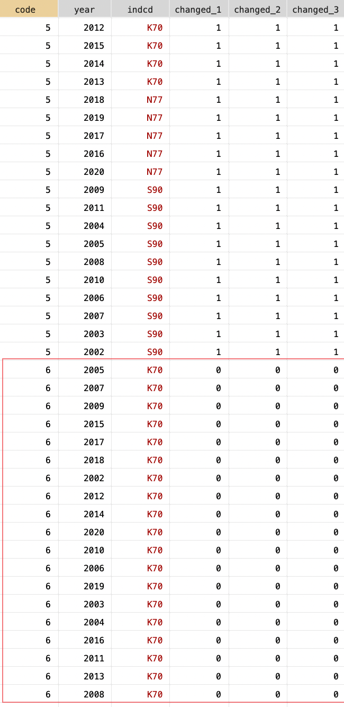
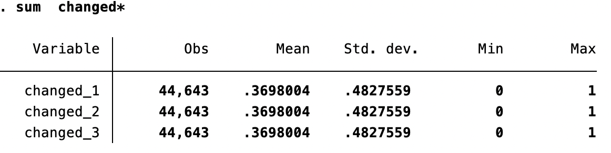

## 提出问题


在一份非平衡面板数据中，生成虚拟变量`changed`，表示企业（`code`）在样本期间行业类型（`indcd`）是否发生变化。若发生变化取值为 1 ，否则为 0 。如下图所示，$changed_{code=5} = 1$，而$changed_{code=6} = 0$ 。



## 分析问题

想了想，一共有三种处理方法：

- 方法一：**简单粗暴但麻烦**。保留企业和行业分类，去重，提取某个企业某一年的行业分类，再和原数据集匹配；此时，行业发生变化的`_merge == 1`，再在组内计算有多少个不为 1 的，再分组生成虚拟变量。
- 方法二：**巧妙、实用**。利用`code indcd`和 `code`分别分组生成 `_N` 进行比对，两个值对不上说明有变化，生成虚拟变量。
- 方法三：**奇技淫巧**。利用外部命令 `egenmore` 的 `nvals()` 函数，可以用于计算组内非重复值的数量。

此外，关于 Stata 如何处理非重复值可以阅读 [Cox N J, Longton G M. Speaking Stata: Distinct Observations[J]. The Stata Journal, 2008, 8(4): 557–568. ](https://journals.sagepub.com/doi/pdf/10.1177/1536867X0800800408)

## 实现代码

```Stata
use "try.dta", clear

* 法一：数据集匹配
preserve
sort code year
keep code indcd
duplicates drop code,force
save "try_indcd_temp.dta", replace
restore
merge m:1 code indcd using "try_indcd_temp.dta"
gen diff = 1 if _merge != 3
egen total_diff = count(diff), by(code)
gen changed_1 = (total_diff != 0)
drop _merge diff total_diff
count if changed_1 == 1

* 法二：利用 _N 
bysort code indcd:gen numa=_N
bysort code :gen numb=_N
gen changed_2 = (numa!=numb)
count if changed_2 == 1
drop numa numb

* 法三：nvals() 函数
egen group_dup = nvals(indcd), by(code)
gen changed_3 = (group_dup != 1)
drop group_dup
count if changed_3 == 1

sum  changed*
```

最终的得到的三个变量描述性统计如下：



