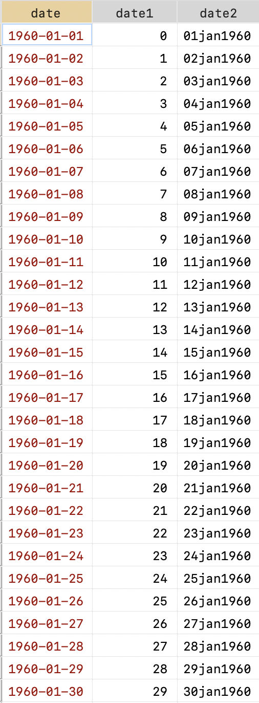
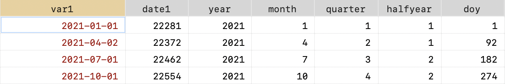
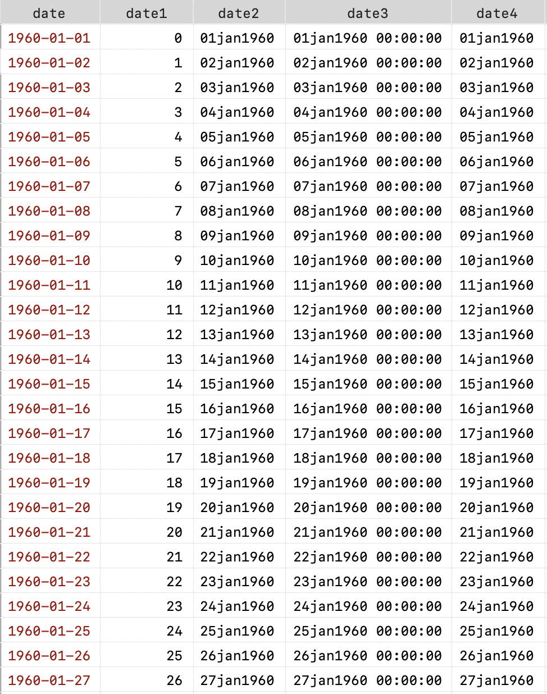

### 转换逻辑

Stata 将日期、时间以及日期和时间以 `1960-01-01 00:00:00.000` 为开始时间的整数形式存储。比如`1960-01-01` 为 0，`1959-12-31` 为 -1 , `1960-01-02` 为 1 。

字符串数据转换为日期数据的逻辑为：

- 将原始字符串（如`1960-01-01`）数据通过日期函数转换为 Stata 能够理解的整数并储存在新变量中；
- 为新变量设置**显示格式**，注意这里只是修改成便于阅读的显示格式，Stata 储存的仍是整数。

```Stata
* 生成示例数据
clear
set obs 30
gen date = ""
forvalues i = 1/30{
	dis `i'
	if `i' < 10{
		replace date = "1960-01-" + "0" + "`i'" in `i'
	}
	else{
		replace date = "1960-01-" + "`i'" in `i'
	}
}

* 转换为日期格式
generate date1 = date(date, "YMD")
gen date2 = date1
format date2 %td
```


几种日期显示格式（`%t formats`）：

| 格式 | 基准 | 单位 | 备注 |转换函数|
| :--: | :--: | :--: | :--: | ---- |
|`%tc`|01jan1960|milliseconds|忽略闰秒|`clock(string, mask)`|
|`%tC`|01jan1960|milliseconds|算闰秒|`Clock(string,mask)`|
|`%td`|01jan1960|days|日历日期格式|`date(string,mask)`|
|`%tw`|1960-w1|weeks|第52周可能超过7天|`weekly(string, mask)`|
|`%tm`|jan1960|months|日历月格式|`monthly(string,mask)`|
|`%tq`|1960-q1|quarters|财务季度|`quarterly(string, mask)`|
|`%th`|1960-h1|half-years|1个半年= 2个季度|`halfyearly(string, mask)`|
|`%ty`|0 A.D|year|1960年是1960年|`yearly(string,mask)`|
|`%tb`|-|days|用户自定义|-|

上表的转换函数中，`string` 表示待转换的字符串，`mask` 指定日期（和｜或）时间的组成部分在字符串中出现的顺序。例如，`％td`函数`date()`中的掩码由字母M ，D 和 Y 组成，`date("2021-03-03","YMD")` 表示将按照年月日显示。

### 提取日期元素

当把字符变量转换成 Stata 可以识别的整数后，有一系列函数可以在此返回日期信息，比如提取年份、月份、日期、季度，还可以返回日期是一周内的第几天、一年内的第几天等。这类函数有：

| 函数             | 用途                                      |
| ---------------- | ----------------------------------------- |
| `year(date)`     | 年份；如： 1980, 2002                     |
| `month(date)`    | 月份；如1, 2, . . . , 12                  |
| `day(date)`      | 日期；1, 2, . . . , 31                    |
| `halfyear(date)` | 前半年还是后半年; 1 or 2                  |
| `quarter(date)`  | 提取季度；1, 2, 3, or 4                   |
| `week(date)`     | 一年为第几周； 1, 2, . . . , 52           |
| `dow(date)`      | 一周内第几天; 0, 1, . . . , 6; 0 = Sunday |
| `doy(date)`      | 一年内第几天; 1, 2, . . . , 366           |

  ```Stata
clear
input str20 var1
"2021-01-01"
"2021-04-02"
"2021-07-01"
"2021-10-01"
end

generate date1 = date(var1, "YMD")
gen year = year(date1) // 年份
gen month = month(date1) //月份
gen quarter = quarter(date1) //季度
gen halfyear = halfyear(date1) //半年
gen doy = doy(date1) // 一年内第几天
  ```



### 筛选日期

```Stata\
* 生成示例数据
clear
set obs 30
gen date = ""
forvalues i = 1/30{
	dis `i'
	if `i' < 10{
		replace date = "1960-01-" + "0" + "`i'" in `i'
	}
	else{
		replace date = "1960-01-" + "`i'" in `i'
	}
}

generate date1 = date(date, "YMD")
format date1 %td

* 保留 1960-01-15 前
keep if date1 > date("1960-01-15","YMD")
```

### 日期和时间的转换

```Stata
gen date3 = cofd(date2) //cofd() 日期转时间
format date3 %tc
gen date4 = dofc(date3) //时间转日期
format date4 %td
```

