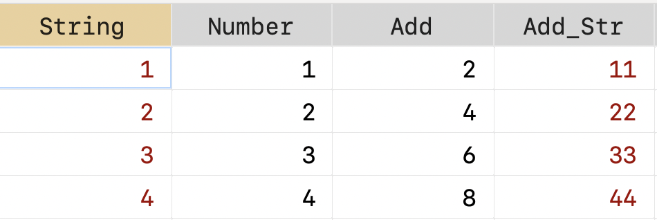

## 前言

刚接触 Stata 不久的朋友都容易把数值型和字符型弄混，导致在条件筛选和运算过程中报错。数值型和字符型是什么意思呢？可以把它们理解为 Excel 中的单元格格式，字符型相当于文本类型，数值型相当于数值类型。


### 变量类型的判断

在 Stata 中怎么判断数值型和文本型呢？

- 方法一：打开数据窗口，在常见的主题颜色下，红色的列就是字符型；黑色的是数值型变量；蓝色的是为数值型添加了值标签（可以理解为披了“马甲”），点击马甲就可以看到数据本身的值。


- 方法二：`describe` 查看变量类型。


### 混淆类型导致的问题

如果混淆字符型和数值型，常导致两种问题：

- 在条件筛选时，报错`type mismatch` ；
- 变量运算时报错。

```Stata
clear
input str10 String Number
"1" 1
"2" 2
"3" 3
"4" 4
end

* 导致问题
** 1.条件筛选
drop if String == "1" //字符型
drop if Number == 1  //数值型
/*
字符型数据要加上引号
*/

** 2.运算
gen Add = String + Number
/*
type mismatch
r(109);
*/

gen Number_2 = Number 
gen Add = Number + Number_2 //数值运算

gen String_2 = String
gen Add_Str = String + String_2 // 字符拼接
```



**总结成两句话：字符型的要带引号；类型相同才能运算。**

## 类型转换

字符型和数值型的转换记住一组命令即可：

字符转数值：`help destring`

数值转字符：`help tostring`

```Stata
destring String, gen(Str2Num)
tostring Number, gen(Num2Str)
```

初学者总是容易将 `destring` 和 `encode` 混淆，其实两者的用途是有区别的：

- `destring`: Convert string variables to numeric variables and vice versa.
- `encode`: Encode string into numeric and vice versa.

`encode` **主要用于将数据进行编码、分组，将连续性变量转换成分组变量。**

它可以和另外一组命令一起记忆：`encode`, `decode`, `recode`和 `autocode()`函数 。

```Stata
encode String, gen(StrEncode)
decode StrEncode, gen(NumDecode)
recode Number (1 2 = 1 low) (3 = 2 medium) (4 = 3 high), gen(NumRecode)
gen group = autocode(Number,3,1,4)
```


