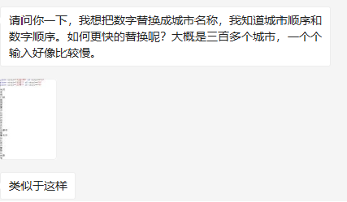
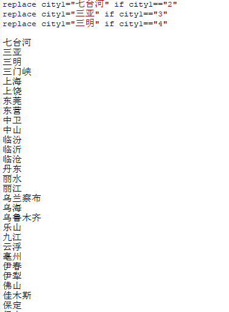
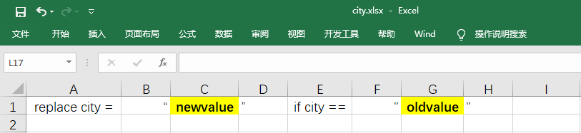
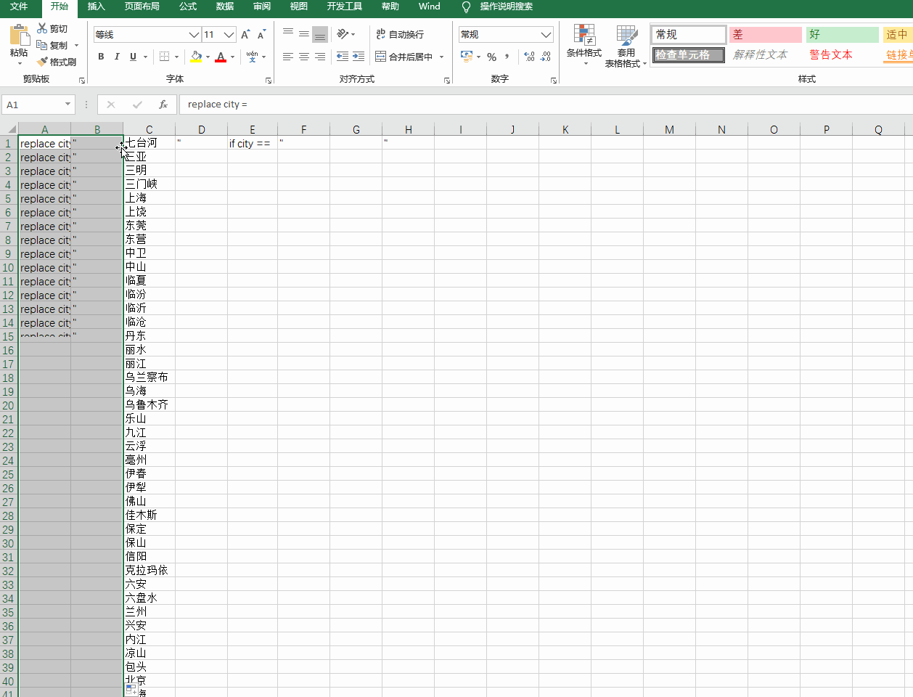
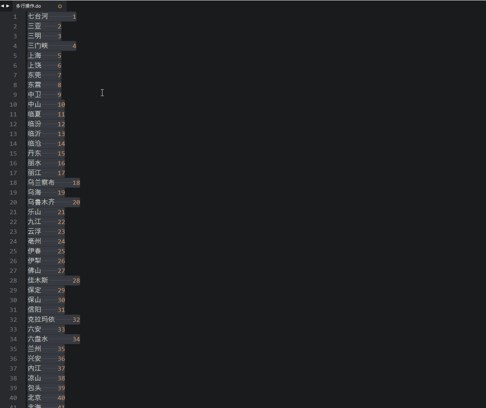

# 提出问题





刚有朋友问我怎么批量 `replace` 变量取值，想着这是比较常见的问题，就写篇文章介绍个小技巧。这种**批量化**、**格式化**的编辑，可以使用 Excel 或者编辑器的批量编辑构造出命令来实现。

# 实现过程

## Excel格式化命令

首先回忆一下 Stata `replace` 命令的语法：

```Stata
replace var = "vewvalue" if var == "oldvalue"
```

接着，可以借用 Excel 批量填充功能构造出语句：



动图演示如下：




## Sublime Text 批量编辑

如果配置过 Sublime Text 或者其他编辑器，一般都有多行编辑功能（不确定 Stata 的 Do Editor 有没有），使用多行编辑构造出语句就行。
Sublime Text 多行编辑的方式是：鼠标选中多行，Windows  系统按下 `Ctrl+Shift+L` ，Mac 系统按 `Command+Shift+L` 。动图演示如下：




