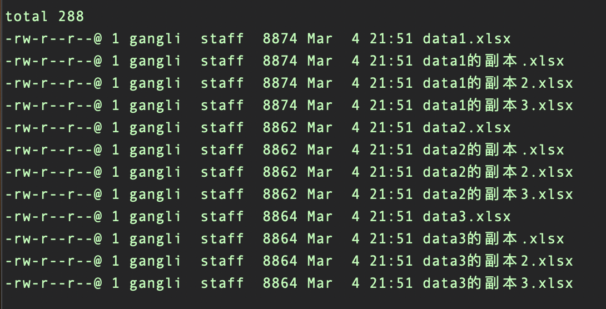
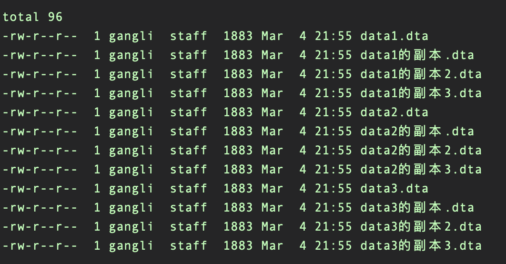

## 提出问题

如果有一批其他格式的数据，如 Excel，CSV 等，如何批量转为 Stata 的 `.dta` 格式数据？

## 分析问题

先来看单一问题的处理思路，先 `import` 到 Stata，经过变量名类型转换、重命名变量名等系列数据清理工作，再 `save` 为 dta 数据。

如果有许多数据，无非是套用循环，对待转换的数据文件进行批量操作。那么待解决的问题有：

- 如何获取待转换的数据文件名？
  - 方法1: 使用外部命令 `fs` 可将指定类型文件名存为返回值，调用即可；
  - 方法2: 定义 `local` 。
- 如何获取待转换文件的文件名？
  - 方法：对字符串进行处理，并存为暂元。需要了解下 `subinstr()` 和 `substr()` 函数的使用。`substr()` 用于截取指定长度的字符串，这里用于选中文件的后缀，即截取内容为后缀；`subinstr()` 用于将指定字符串替换，此处用于将后缀替换为空白，即可得文件名。

下面以几个 `.xlsx` 数据为例，进行演示。




## 代码实现

```
* 使用 -fs- 命令
* ssc install fs, replace
fs *.xlsx
foreach file in `r(files)'{
 local filename = subinstr("`file'",substr("`file'",-5,.),"",.)
 import excel using "`file'", clear
 save "../output/`filename'.dta", replace
}
```

```
* 定义暂元
local files: dir "`c(pwd)'" files "*.xlsx"
foreach file in `files'{
 local filename = subinstr("`file'",substr("`file'",-5,.),"",.)
 import excel using "`file'", clear
 save "../output/`filename'.dta", replace
}
```

