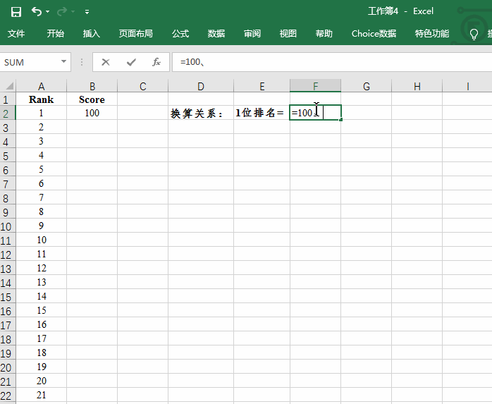
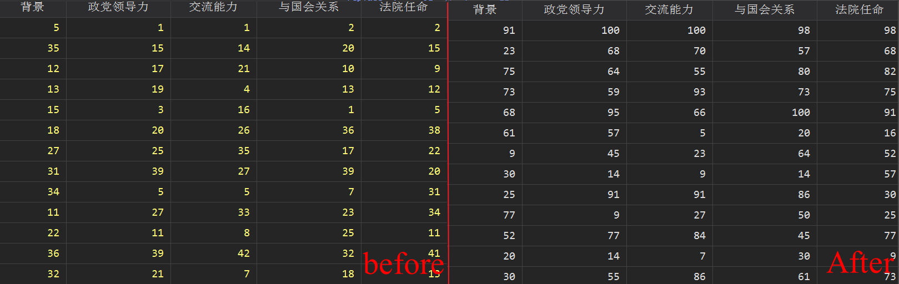

## 提出问题

手头有一份美国历届总统的排名，排名从1~44，需要将他们转化为对应的得分。换言之,将1位排名等价换算成$100/44=2.2727273分$。比如第一名为$100$分，第二名为$100-(100/44)$分，依次类推。动图来演示如下：



## 实现思路
实现思路大致可以分为如下四步：
- 首先生成排名与得分之间的换算关系；
- 借用 Excel 整理成相应的转换语句，参阅 [批量替换变量值的小技巧](https://mp.weixin.qq.com/s/AmLOLcEEXEH8tcS9u0N9xw)；
- 将原始数据读入为文本型，通过`import excel`命令的`allstring`选项实现；
- 将变量按照对应关系依次替换。

## 实现过程

### 对应关系

```Stata
clear
set obs 44
gen i = _n
egen score = fill(2.2727273(2.2727273)100)
gsort -i
gen rank = _n
keep rank score
save "对应关系.dta", replace
export excel using "对应关系.xlsx", firstrow(variable) replace

shellout  "对应关系.xlsx"
```

### 批量替换
```Stata
* 导入数据
import excel using "美国历届总统支持率.xlsx", firstrow clear  allstring

foreach v of varlist 背景-综合{
	replace `v' = "100" if `v' == "1"
	replace `v' = "98" if `v' == "2"
	replace `v' = "95" if `v' == "3"
	replace `v' = "93" if `v' == "4"
	replace `v' = "91" if `v' == "5"
	replace `v' = "89" if `v' == "6"
	replace `v' = "86" if `v' == "7"
	replace `v' = "84" if `v' == "8"
	replace `v' = "82" if `v' == "9"
	replace `v' = "80" if `v' == "10"
	replace `v' = "77" if `v' == "11"
	replace `v' = "75" if `v' == "12"
	replace `v' = "73" if `v' == "13"
	replace `v' = "70" if `v' == "14"
	replace `v' = "68" if `v' == "15"
	replace `v' = "66" if `v' == "16"
	replace `v' = "64" if `v' == "17"
	replace `v' = "61" if `v' == "18"
	replace `v' = "59" if `v' == "19"
	replace `v' = "57" if `v' == "20"
	replace `v' = "55" if `v' == "21"
	replace `v' = "52" if `v' == "22"
	replace `v' = "50" if `v' == "23"
	replace `v' = "48" if `v' == "24"
	replace `v' = "45" if `v' == "25"
	replace `v' = "43" if `v' == "26"
	replace `v' = "41" if `v' == "27"
	replace `v' = "39" if `v' == "28"
	replace `v' = "36" if `v' == "29"
	replace `v' = "34" if `v' == "30"
	replace `v' = "32" if `v' == "31"
	replace `v' = "30" if `v' == "32"
	replace `v' = "27" if `v' == "33"
	replace `v' = "25" if `v' == "34"
	replace `v' = "23" if `v' == "35"
	replace `v' = "20" if `v' == "36"
	replace `v' = "18" if `v' == "37"
	replace `v' = "16" if `v' == "38"
	replace `v' = "14" if `v' == "39"
	replace `v' = "11" if `v' == "40"
	replace `v' = "9" if `v' == "41"
	replace `v' = "7" if `v' == "42"
	replace `v' = "5" if `v' == "43"
	replace `v' = "2" if `v' == "44"
}

destring 出生年份-综合, replace
drop if 出生年份 == .
export excel using "美国历届总统排名_得分.xlsx", firstrow(variable) replace
```
## 实现结果
经过上述转换之后，就完成了由排名到得分的转化，结果如下：



