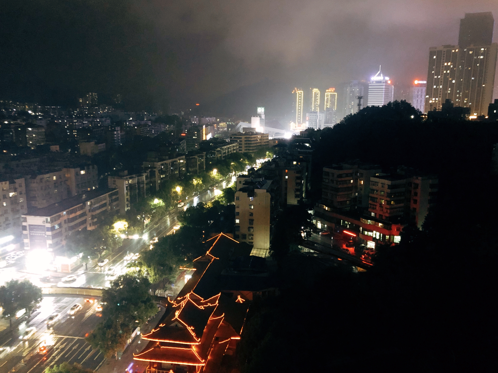
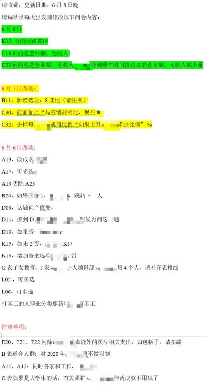
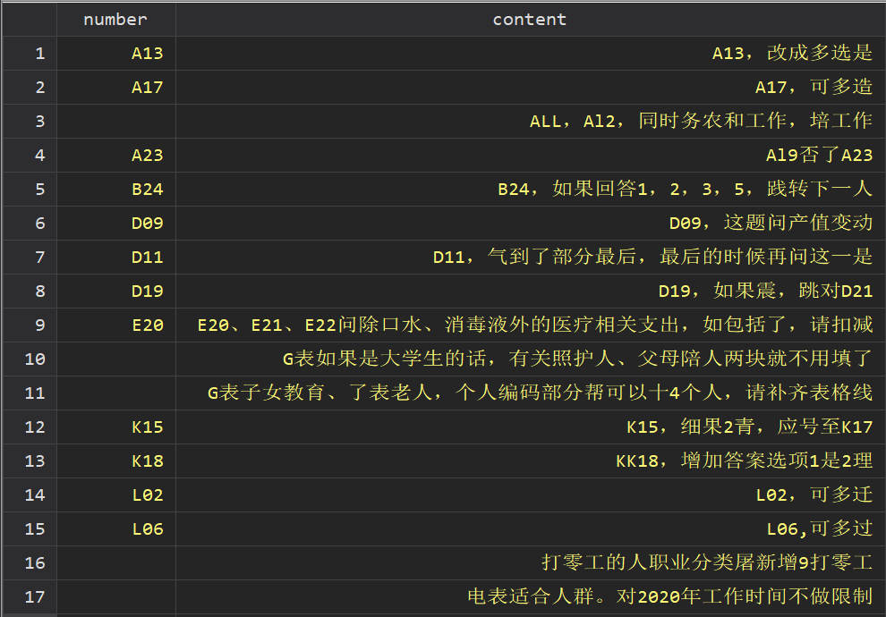

前言



小伙伴们好久不见呀！最近出来调研（猜猜上图是哪里），好几天没更新推文。但是今天鼓捣了调研中遇到的问题，觉得有必要记录一下。

问题是这样的：入户过程中发调查问卷中的一些问题，项目组出发前每天更新修改清单，让我们出发前先修改问卷。每天公布的修改内容如上图（出于内容保密加了马赛克）。



显而易见，累加要修改的内容越来越多。**而且有个麻烦的问题，那边给的清单没有按照题号先后顺序排，手动修改起来要前后翻页（问卷有18页...）**。直到今早我花了半小时前后翻着改问卷，我有点坐不住，所以决定写点什么。

# 实现思路
实现思路很简单，先调用 Python 从图片中提取文本，之后在 Stata 中对文本进行清理，最后提取出题号，按题号字母排序。

# 实现过程
```Stata
******************Python*****************
python:
import pytesseract
from PIL import Image

# 从图片识别文本
image = "问卷修改清单.jpg"
f = open("问卷修改内容.txt", "a")
text = str(((pytesseract.image_to_string(Image.open(image), lang='chi_sim'))))
text = text.replace(' ', '')
f.write(text)
f.close()
end
********************End******************

* 文本清理
import delimited "问卷修改内容.txt", clear encoding("gb18030")
gen content = v1 + v2
drop if ustrregexm(content, "(.*)月(.*)日") == 1 | ///
ustrregexm(content, "修改|改动|注意事项") == 1
keep content
duplicates drop

replace content = usubinstr(content, "I","1",1) ///
if ustrregexm(content,"[A-Z]I|[A-Z]L\d+") == 1
gen number = ustrregexs(0) if ustrregexm(content,"[A-Z]\d+") == 1
sort content
order number content
```

最后整理出来的效果是这样的：



虽然没做到百分之百的准确和整洁，但是大致按照题号前后顺序排列，对照修改的时候会省去前后来回翻页的时间。

