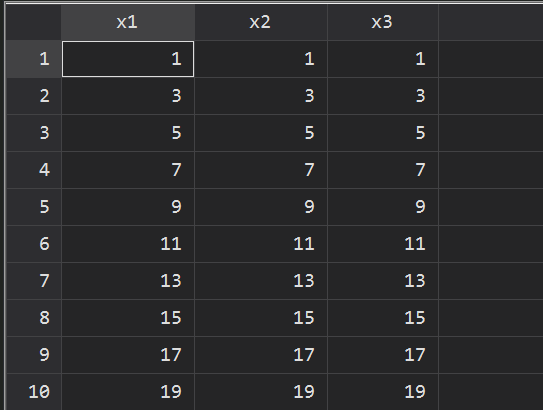

## 提出问题

> 怎么用 Stata 生成 1~100，公差为 2 的等差数列？

解答一个朋友的提问，介绍使用 Stata 生成等差数列的三种方法，分别是：`egen`命令的 `fill()` 函数、`forvalues`循环和调用 Python 。

## 实现过程

### 方法一：`egen`的`fill()`函数

```Stata
clear
set obs 50
egen x1 =  fill(1(2)100)
```

`fill(numlist)`函数可以用来升序、降序或者复杂重复样式的变量，不能和`by`、`if`和`in` 联合使用。其中，`numlist`参数至少包含两个数字，也可以使用标准 _numist_ 表示法。

### 方法二： 循环

```Stata
gen x2 = .
local i = 1
forvalues j = 1(2)100{
	qui replace x2 = `j' in `i'
	local i = `i' + 1
}
```

使用 `forvalues` 循环可以生成步长为 2 的序列，其中 `i` 用来控制 `replace` 值的行数，`j` 表示要替换成的值，即`1(2)100`。

### 方法三：调用 Python

```Python
clear
python:
from sfi import Data

# create list
x3 = []
for i in range(1, 100, 2):
    x3.append(i)

Data.addObs(len(x3))
Data.addVarInt('x3')
Data.store('x3',None,x3)
end
```

使用 Stata16 也可以调用 Python 来完成，首先使用 `range()` 生成列表，再使用`sfi`模块写入 Stata。其中：

- `Data.addObs(len(x3))` 表示将与`x3`长度相同个数的观测值添加到当前的 Stata 数据集中；
- `Data.addVarInt('x3')` 表示将类型为 int 的变量`x3`添加到当前的 Stata 数据集中；
- `Data.store('x3',None,x3)` 表示将数据存到 Stata 数据集。填入的参数为`store(var, obs, val[, selectvar])`，其中`var`表示变量名；`obs`可以指定为单个观察索引、可重复的观察索引或`None`，如果为`None`，则指定所有观测值。


## 实现结果

