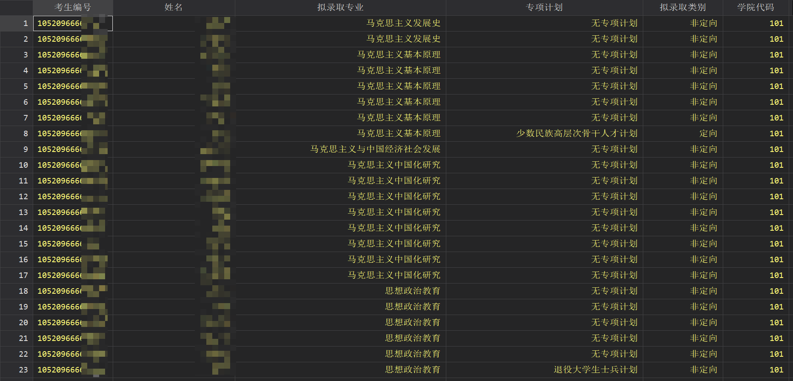
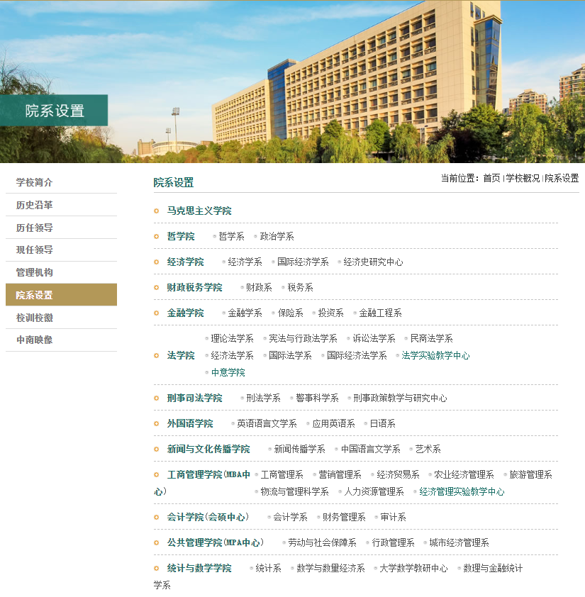
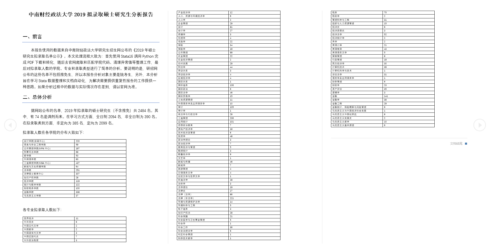

# 前言

又是一年考研季，今天有朋友问我去年的学校录取情况，因为一直没咋关注过这个，一下还真不知道是啥情况，就去官网找了下名单。但是官网给的名单是 PDF 格式，不方便拿来做统计分析，所以就用 Stata 顺手做了一些简单的分析工作，觉得这也为需要提供重复性报告的工作提供一种思路。具体来说，主要包括如下技术要点：

- 使用 Stata16 调用 Python 下载PDF，转化为 Excel 表格；
- 使用 Stata 爬取学校官网的学院名单，整理和生成学院代码；
- 使用 Stata 中的 `putdocx` 命令制作自动化分析报告。

在开始之前，要注意使用的是 Stata 16，而且需要先安装 Python 的 `pdfplumber` 库；Stata 的 `tbl2putdocx.ado` 文件，这是来自 [statalist](https://www.statalist.org/forums/forum/general-stata-discussion/general/1398211-putdocx-command) 解决 `putdocx` 命令中输出 `tab` 结果的一个解决方案。在公众号后台回复【zuledocx】可以获取我整理好的 `ado` 文件，之后放入 Stata 所在路径的 `./ado/plus/t` 文件夹中即可。

# 实现过程

## 下载和转换 PDF 文件

```Stata
python:
import requests
import pdfplumber
from openpyxl import Workbook

# 下载 PDF 文件
pdf_2019q4 = 'http://yzb.zuel.edu.cn/_upload/article/files/70/72/9a65178a4aacb5ae64daa5950b83/cf27a493-b596-4059-9c7c-ba76ba73237f.pdf'
r = requests.get(pdf_2019q4, stream=True)
with open("2019年硕士研究生拟录取名单公示.pdf", "wb") as pdf:
    for content in r:
            pdf.write(content)

# 提取并写入 Excel
wb = Workbook()
ws = wb.active
with pdfplumber.open("2019年硕士研究生拟录取名单公示.pdf") as pdf:
    for page in pdf.pages:
        for table in page.extract_tables():
            for row in table:
                ws.append(row)
wb.save("./data/2019年硕士研究生拟录取名单公示.xlsx")
end
```
下载和转换之后的数据如下：



## 爬取官网学院名称



因为公布的名单中学院是用三位数的代码，所以需要去官网弄到学院名称进行匹配，这样才能知道拟录取学生所对应的学院。在制作学院代码过程中，一是需要剔除不招硕士的学院，二是要和名单中的专业进行比照，确保拟录取专业和学院相对应。

```Stata
copy "http://www.zuel.edu.cn/schools/" "./data/schools.txt", replace
infix strL v 1-200000 using "./data/schools.txt",clear
keep if index(v,"学院")
gen 学院 = ustrregexs(2) if ustrregexm(v,`"<option value="(.*?)" >(.*?)</option>"')
keep 学院
drop if 学院 == "" 
drop if _n >= 15 & _n != 16 & _n != 17
gen 学院代码 = 100 + _n
tostring 学院代码, replace
replace 学院 = "" if 学院 == "继续教育学院"
replace 学院 = "法律硕士教育中心" if 学院 == ""
replace 学院代码 = "117" if 学院代码 == "116"
save "./data/学院代码.dta", replace
```

## 数据清理

```Stata
import excel using "./data/2019年硕士研究生拟录取名单公示.xlsx",firstrow clear

* 异常值
destring 政治-总成绩, replace
misstable summarize _all // 3条异常
replace 专项计划 = "少数民族高层次骨干人才计划" if 专项计划 == "少数民族高层次骨"
replace 拟录取专业 = "金融统计、保险精算与风险管理" if 拟录取专业 == "金融统计、保险精算与风险"
drop if 考生编号 == ""

* 去除换行符
replace 拟录取专业 = usubinstr(拟录取专业," ","",.)
replace 拟录取专业 = ustrregexrf(拟录取专业,"\n","")

* 匹配学院代码
merge m:1 学院代码 using "./data/学院代码.dta", nogen
order 学院* 拟录取专业
compress
save "./data/2019拟录取_不含推免_清理后.dta", replace
```

## 生成报告
```Stata
use "./data/2019拟录取_不含推免_清理后.dta", clear

/* 创建文档 */
capture putdocx clear
putdocx begin

/* 标题  */
putdocx paragraph, style(Title) halign(center)
putdocx text ("中南财经政法大学2019拟录硕士取研究生分析报告"), ///
    font("宋体",16,black) bold linebreak

/* 小标题 */
putdocx paragraph, style(Title)
putdocx text ("一、前言"), ///
    font("黑体",14,black)

/* 文本块 */
putdocx textblock begin
        本报告使用的数据来自中南财经政法大学研究生招生网公布的《2019年硕士研究生拟录取名单公示》。本文处理流程大致为：首先使用Stata16调用Python完成PDF下载和转化，随后去官网爬取和匹配学院代码、清理异常值等整理工作，
最后对拟录取人数的学院、专业和录取类型进行了简单的分析。要说明的是，研招网公布的这份名单不包括推免生，所以本报告分析对象主要是统考生，另外，本分析旨在学习Stata数据整理和文档自动化，为解决需要提供重复性报告的工作提供一种思路。
如果分析过程中的数据与实际情况存在差别，请以官网为准。
putdocx textblock end

putdocx paragraph, style(Title)
putdocx text ("二、总体分析"), ///
    font("黑体",14,black)

**********************************
des,s
local N = r(N)
count if 学习方式 == "全日制"
local allday = r(N)

count if 备注 == "调剂"
local change = r(N)

count if 拟录取类别 == "定向"
local fixed = r(N)
************************************

putdocx textblock begin
        据网站公布的名单，2019年拟录取的硕士研究生（不含推免）共 <<dd_docx_display:`N'>> 名。其中，有 <<dd_docx_display:`change'>> 名是调剂而来。在学习方式方面，全日制 <<dd_docx_display:`allday'>> 名，非全日制为 <<dd_docx_display:`N'-`allday'>> 名。在拟录取类别
方面，非定向为 <<dd_docx_display:`fixed'>> 名，定向为 <<dd_docx_display:`N'-`fixed'>> 名。
putdocx textblock end

putdocx paragraph
putdocx text ("拟录取人数在各学院的分布大致如下：")
tbl2putdocx 学院

putdocx paragraph
putdocx text ("各专业拟录取人数如下：")
tbl2putdocx 拟录取专业

putdocx save "./result/中南财经政法大学2019硕士拟录取研究生分析报告.docx", replace
```

最终的效果如下：


