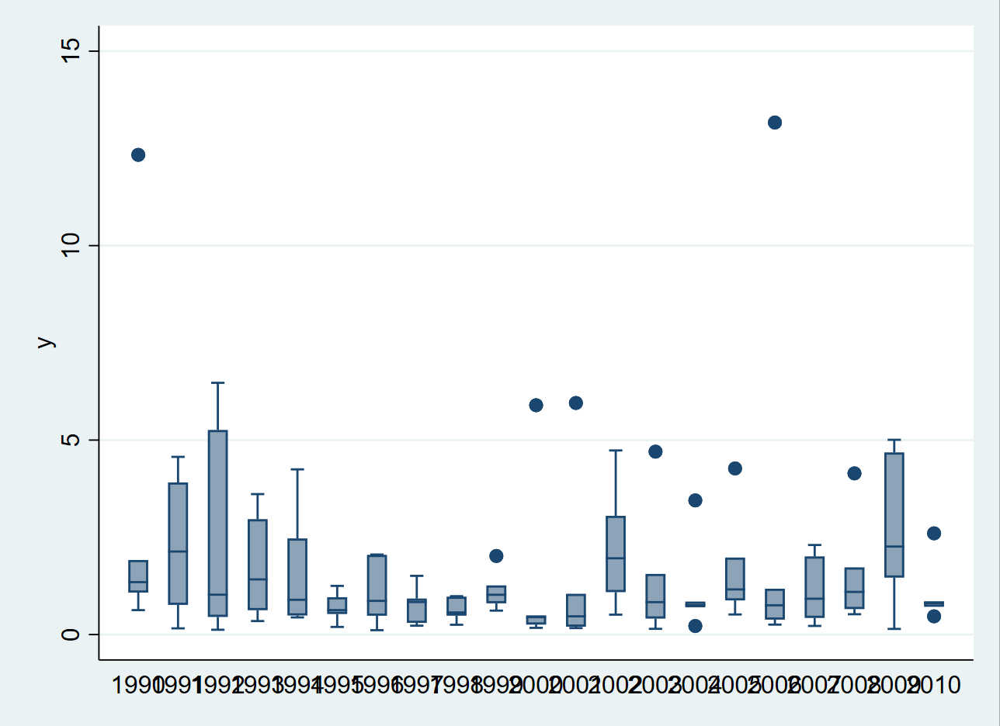
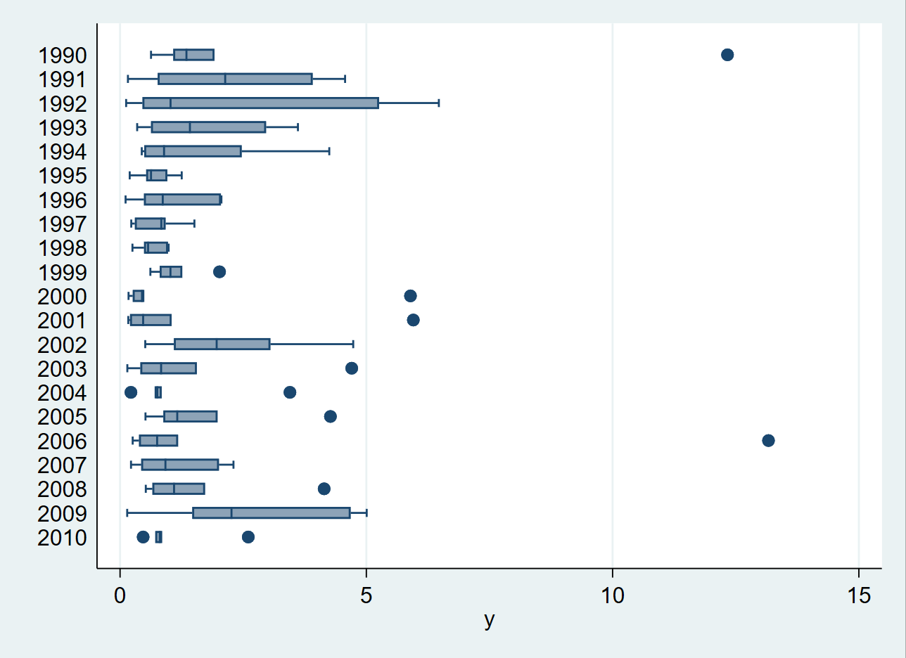
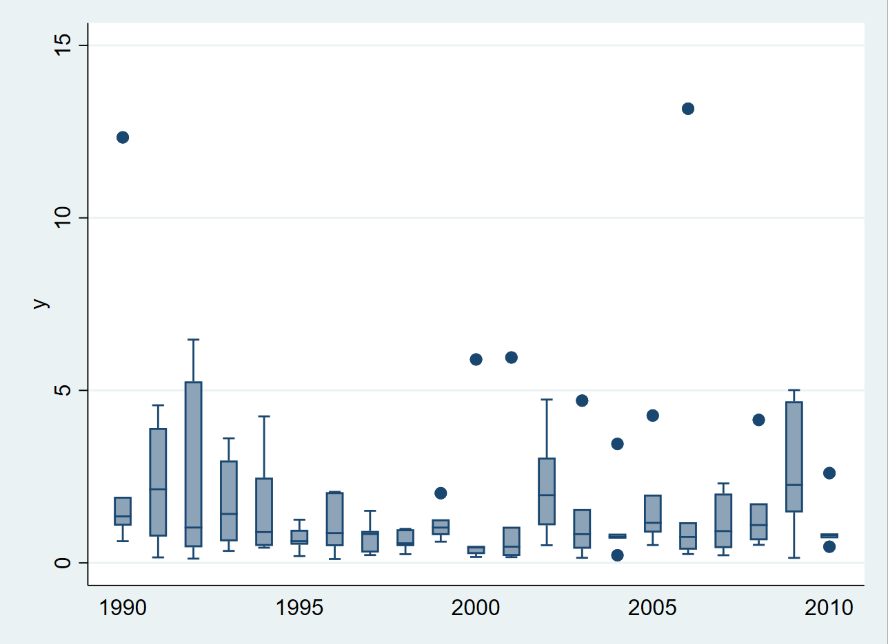

# 提出问题


刚有朋友问我怎么调整 boxplot 中 x 轴标签，用上图复现了他的问题。换句话说，问题是如何解决 graph 中 x 轴重叠的问题。

# 分析思路

1. 把图调整成水平（horizontal）；
2. 将 x 轴刻度倾斜，避免重叠；
3. 更改 x 轴的刻度显示区间，这可以通过定义 x 轴值的label实现。

# 解决过程

## 方法一：调整为水平图
```Stata
graph hbox y, over(year)
```


## 方法二：将 x 轴标签倾斜
```Stata
graph box y, over(year, label(angle(45)))
```


## 方法三：调整刻度间距
```Stata
forval y = 1990/2010 {
    if mod(`y', 5) {
        label def ylbl `y' `"{char 0xa0}"', add // 0xa0:NO-BREAK SPACE
    }
}
label val year ylbl 
label li ylbl 
graph box y, over(year)
```


# 附录：演示数据生成代码
```Stata
clear 
set obs 126 
egen year = seq(), block(6) from(1990) to(2010)
set seed 2803
gen y = exp(rnormal())
```

# 参考资料
https://www.statalist.org/forums/forum/general-stata-discussion/general/1297758-axis-options-for-box-plot-how-can-i-reduce-number-of-labels-on-the-x-axis
