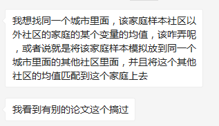
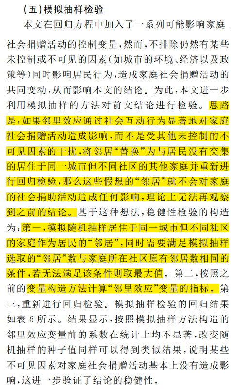

# 模拟抽样检验

## 提出问题



来自朋友的提问，上面提到的论文是《经济学动态》2017年2期中《邻里效应对家庭社会捐赠活动的影响——来自中国家庭追踪调查（CFPS）数据的证据》一文，原文研究设计思路如下：



## 分析问题

文章的研究思路是：随机抽取居住同一城市邻居的社会捐助，用来代替该户的捐助，达到随机的目的，以此来排除其他因素对家庭社会捐赠活动的影响。


```Stata
* generate family number of each community
bys city community: gen family_number = _N

* calculate new value(except the faimly itself)
gen new_value = .
levelsof family_number, local(fn)
local j = 1
forvalues i = 1/`fn'{
	bys city community: replace new_value = (sum(value)-value[i])/(_N-1) in `j'
	local j = `j' + 1
}

foreach n in `fn'{
	if family_number == `n'{
	
	}

}

if：family_number equal 
r = random(4|7)
if: family_number != all, r = family_max(N)

1_1：= r_1
```