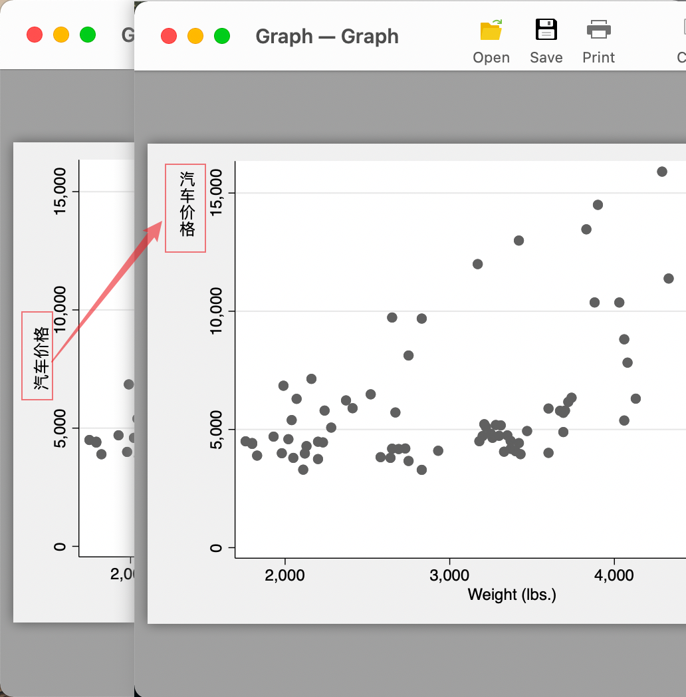
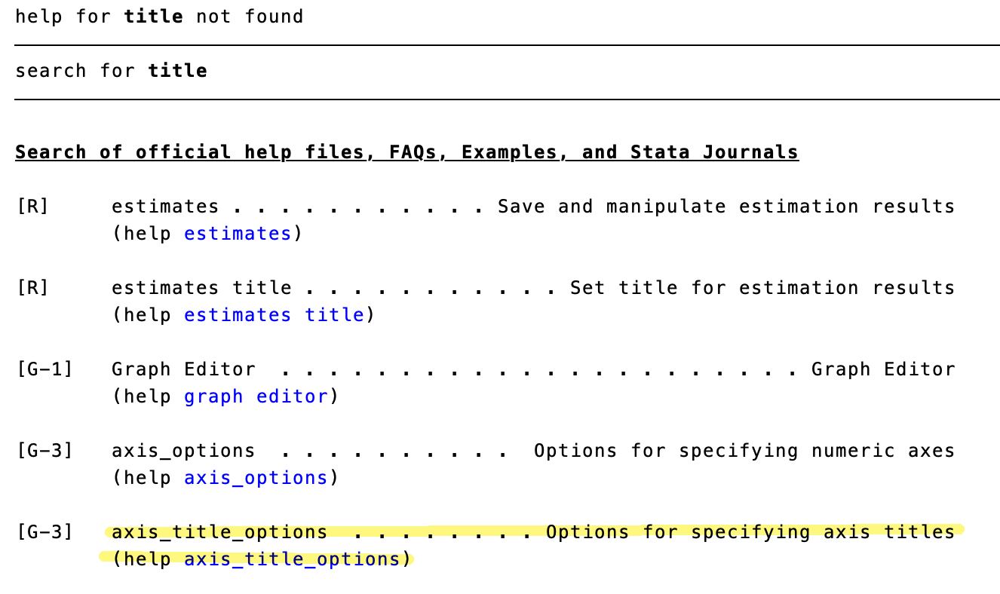
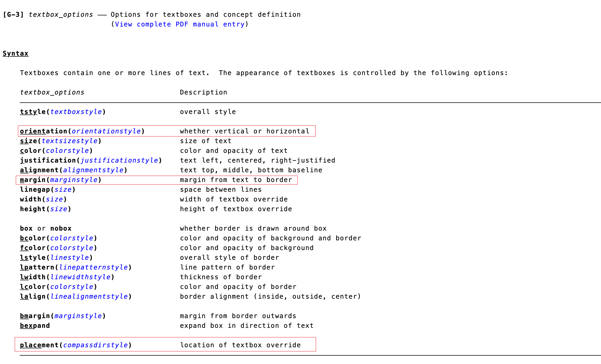
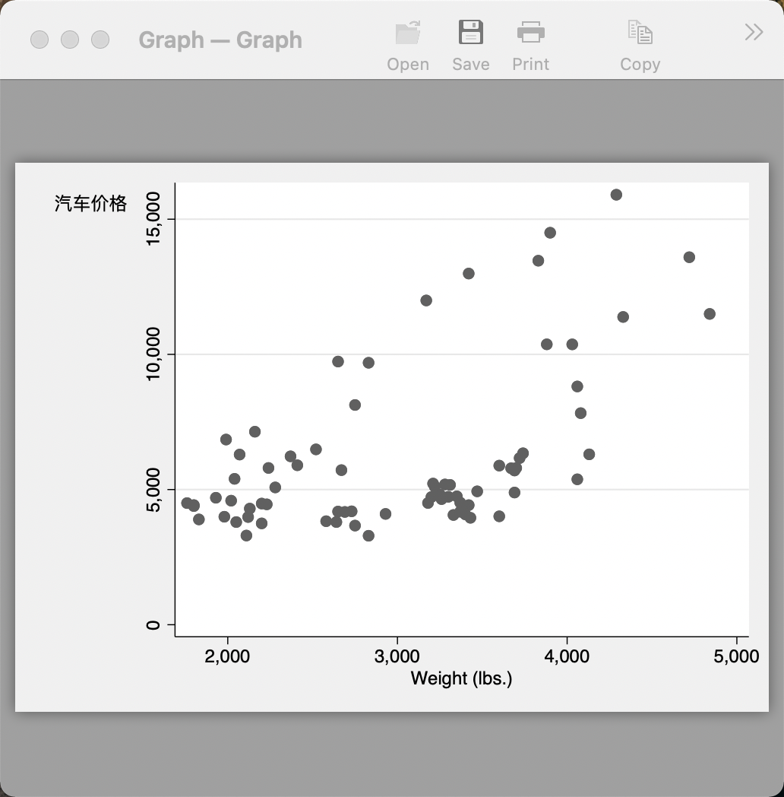
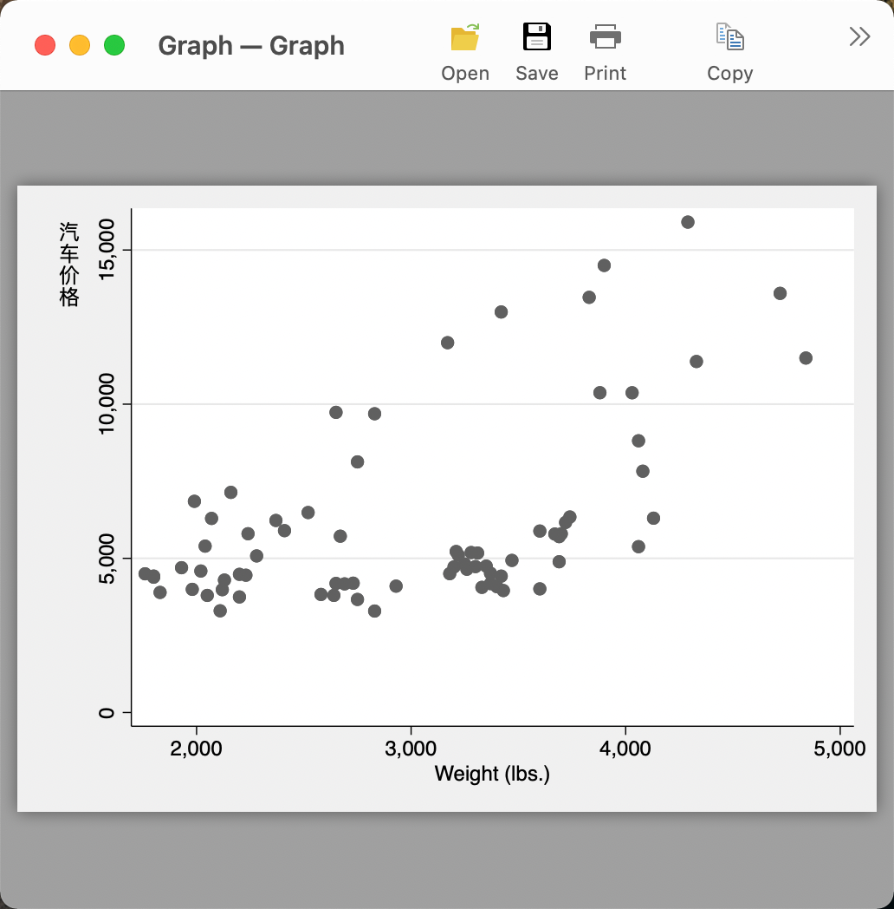

## 提出问题

鸽了一个暑假，最近试着渐渐更新起来。今天分享一个被好多强迫症伙伴问到的小问题，用 Stata 画图怎么更改 Y 轴文本的顺序。如下图所示，默认绘图的文字为每个字从左到右，但是一般论文在 Y 轴顶端的由上至下的排列。



## 分析问题

对比要实现的效果，可以发现主要修改的地方在于 Y 轴的文本，**需要修改文本方向、文字排列顺序**。于是，先 `help title` ，因为我们需要调整的是坐标轴（axis）的标题，因此点击  `axis_title_options` 看是否有我们需要的信息。



阅读 `axis_title_options` 的帮助页面，可以发现 `textbox_options` 子选项主要用于控制标签文本的显示内容，因此在此处有我们需要的内容。



通过上面的介绍，我们用到的选项主要有：

- `orientation`：调整文本方向；
- `margin`：用于调整文本与坐标轴的边距；
- `placement`：用于调整坐标轴文本的排放位置。

还有剩余其他的选项，可供坐标轴文本的美化。

## 代码实现

有了上面的知识铺垫，接下来我们添加这三个选项试试：

```Stata
sysuse auto,clear
ytitle("汽车价格", place(12) orientation(horizontal) margin(medsmall))
```



可以发现，Stata 将 “汽车价格” 四个字当成一个完整的字符串，水平的放置于坐标轴上方，但是这不是我们想要的将四个字依次排列的效果。因此，尝试在 `ytitle()` 中将四个字分开写。效果如下：

```Stata
sysuse auto,clear
scatter pr wei, ///
ytitle("汽" "车" "价" "格", place(12) orientation(horizontal) margin(medsmall))
```



## 总结

Stata 默认做出来的图不尽如人意，需要耐心调整美化，不过好在官方的文档提供了详细的示例和解释。如果没有调整的头绪，先聚焦到需要调整图的某个方位，之后搜索关键词，再逐步的缩小查看帮助文档的范围。比如今天这个小问题，就是先从 `title` 开始，到最后确定需要调整的是 `textbox_options` 。