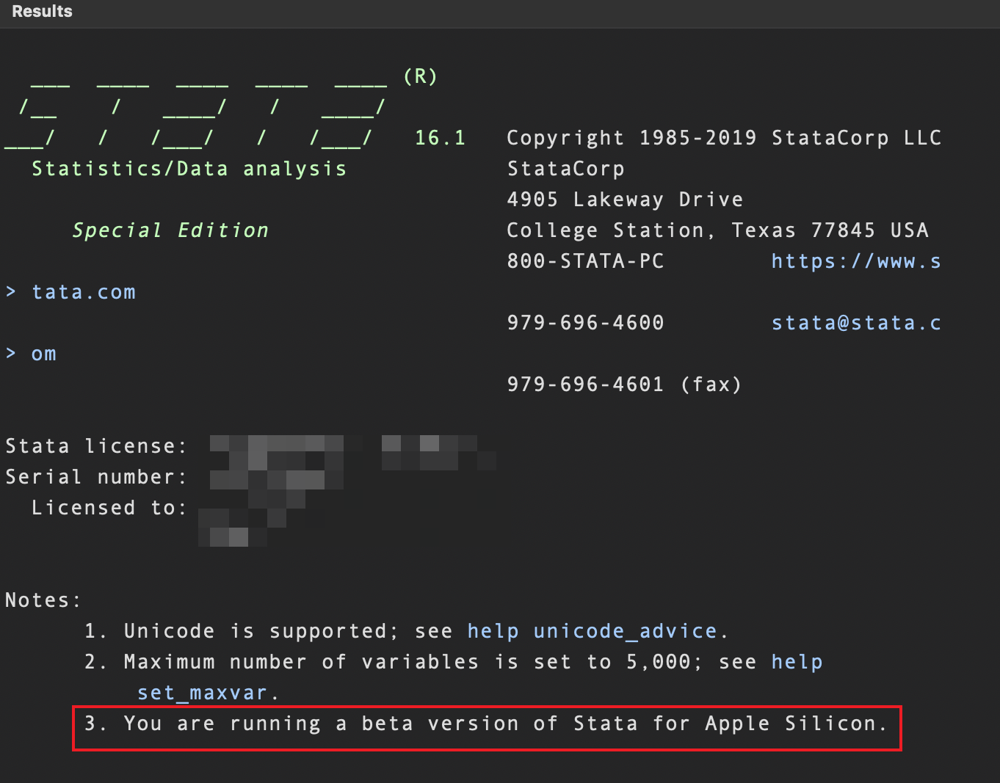
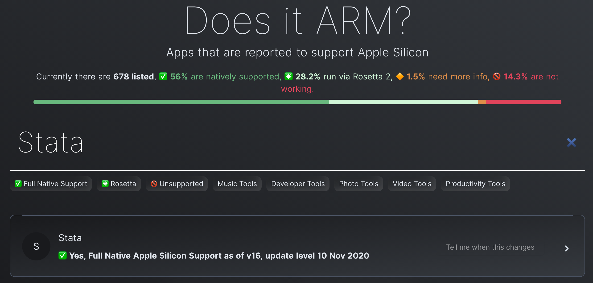
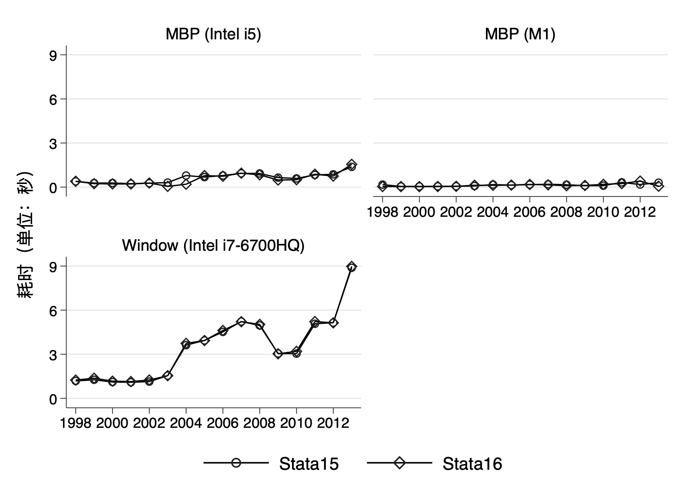

## M1芯片的Macbook运行Stata如何？



新买的M1芯片的Macbook Pro到手了，之前还担心Stata兼容问题，体验三天后发现没遇见兼容性的问题。今天特意对比几台设备运行Stata情况，以导入工业企业数据库为例进行了简单对比，不得不说新版电脑真是丝滑。

## Stata兼容问题

> Stata 16 has been updated to run natively on Apple Silicon and will be available as a free update.

最新的Stata16已经本地支持Apple Silicon，只需要运行`update all`将软件升级；或者在[官网](https://www.stata.com/support/updates/)下载安装包之后输入`db update`进行离线升级。如前图所示，更新完成之后的Stata16的结果窗口有`You are running a beta version of Stata for Apple Silicon.`的提示。

> Stata 15 and earlier releases of Stata for Mac will run on Macs with Apple Silicon, but they’ll run much slower under emulation. We recommend that you upgrade to Stata 16 if you wish to run Stata on a Mac with Apple Silicon.

根据官网的介绍，Stata 15及之前的版本也可以在新Mac上运行，但在模拟下运行速度会慢得多。如果希望在具有Apple Silicon的Mac上运行Stata，建议您升级到Stata 16。



另外，Github上有个M1芯片兼容性测试的项目[Does it ARM?](https://doesitarm.com/)，可以搜索关心的软件是否支持M1芯片，以及是本地支持还是通过`Rosetta 2`转换运行。从目前的测试结果来看，有56%的软件本地支持，28.2%的通过`Rosetta 2`进行转换后运行。

## 运行对比

### 运行环境

为了直观的感受几台设备运行的差异，使用手边的电脑进行测试和对比。
- 任务：导入1998-2013年工业企业数据库所耗时间
- 设备参数：
  - MacBook Pro (M1, 2020) ：M1芯片，16g内存+512g储存空间；
  - Macbook Pro (Intel Core i5, 2017)：8g内存+128g储存空间；
  - Windows(Win10-64位, i7-6700HZ )：8g内存。
- 测试软件：
  - Mac: Stata15-SE, Stata16-SE
  - Windows: Stata15-SE, Stata16-MP


```Stata
*************
* 0. 准备工作
*************
* 安装外部命令
net install benchmark,   ///
from(https://raw.githubusercontent.com/mcaceresb/stata-benchmark/master/)

*************
* 1. 测试
*************
* 导入数据
forvalues year = 1998/2013{
	benchmark: ///
	use "FIRM`year'_raw.dta", clear
}
```

### 运行结果




上图是导入1998-2013年数据的耗时结果，可以看出：

- 不同版本：Stata15和Stata16之间的耗时不存在明显的差别；
- 不同设备：M1芯片的MBP耗时明显快于17款的MBP和Windows。

为有更直观的对比，列举出2010-2013年的详细数据如下：

| 数据年份 | 数据大小（MB） |           设备           | Stata15（Seconds） | Stata16 (Seconds) |
| :------: | :------------: | :----------------------: | :----------------: | :---------------: |
| **2010** |    **296**     |       **MBP (M1)**       |     **0.101**      |     **0.189**     |
|   2010   |      296       |      MBP (Intel i5)      |       0.591        |       0.506       |
|   2010   |      296       | Window (Intel i7-6700HQ) |       3.045        |        3.2        |
| **2011** |   **477.2**    |       **MBP (M1)**       |     **0.322**      |     **0.241**     |
|   2011   |     477.2      |      MBP (Intel i5)      |       0.831        |       0.879       |
|   2011   |     477.2      | Window (Intel i7-6700HQ) |       5.076        |       5.227       |
| **2012** |   **484.8**    |       **MBP (M1)**       |     **0.175**      |     **0.41**      |
|   2012   |     484.8      |      MBP (Intel i5)      |        0.87        |       0.75        |
|   2012   |     484.8      | Window (Intel i7-6700HQ) |       5.153        |       5.138       |
| **2013** |   **842.6**    |       **MBP (M1)**       |     **0.301**      |     **0.062**     |
|   2013   |     842.6      |      MBP (Intel i5)      |        1.38        |       1.551       |
|   2013   |     842.6      | Window (Intel i7-6700HQ) |       8.885        |       8.977       |

数据整理和绘图的代码如下：

```Stata
*****************
* 2. 数据整理与绘图
* ***************
* 2.1 数据整理
import excel using "运行时间.xlsx", firstrow clear
split Stata15, p(" ")
split Stata16, p(" ")
encode 设备, gen("Device")
keep 数据年份 数据大小 Device Stata151 Stata161
rename (数据年份 数据大小 Stata151 Stata161) (Year Size Stata15 Stata16)
destring Stata15 Stata16, replace

* 2.2 画图
tw connect Stata15 Stata16 Year, by(Device, note("")) ///
scheme(tufte) legend(row(1)) ///
xtitle("") ytitle("耗时（单位：秒）") ///
ylabel(0(3)9) xlabel(1998(2)2013)
graph export "Spend_Time_By_Devices.jpg", replace
```

## 小结

本文简单地对比了三台设备使用Stata导入数据耗时情况，但未考虑设备后台程序内存占用等因素，因此，结果只能作为粗略参考。但是总体而言，可以观察出两方面的结论：

- 一方面，M1芯片的MBP运行耗时要快于其他两台设备，而且多次的导入显示运行较稳定；
- 另一方面，Stata15和Stata16在新版电脑上都可使用，没有不兼容的问题。但在使用过程中，可以明显感受到能本地支持的Stata16运行更顺畅。


参考资料：

https://blog.stata.com/2020/11/10/stata-for-mac-with-apple-silicon/

