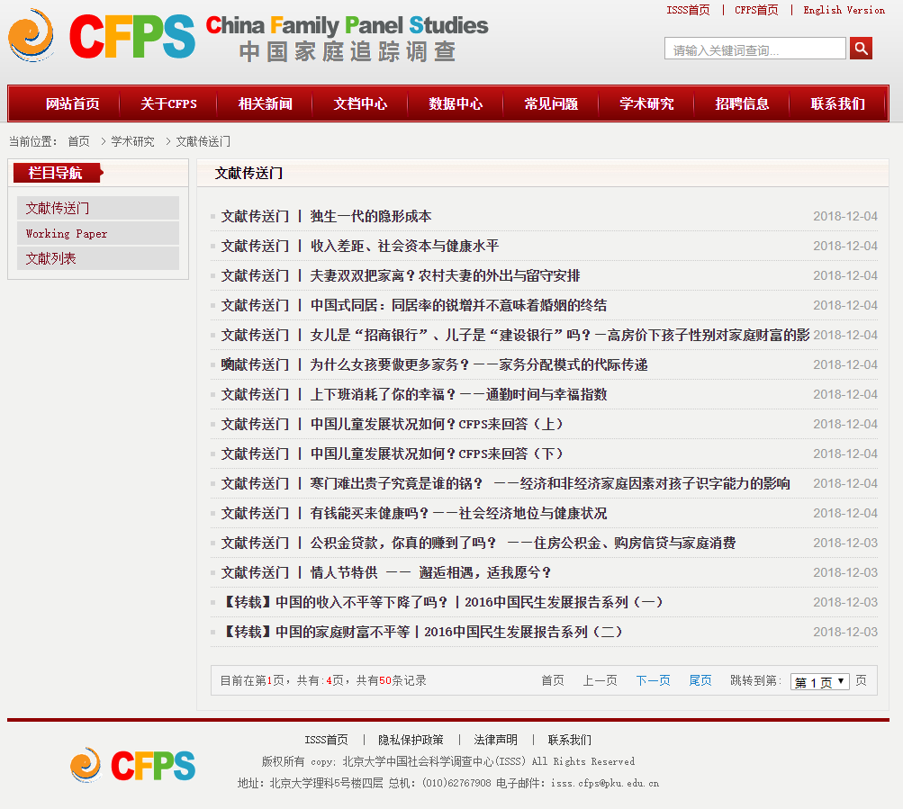
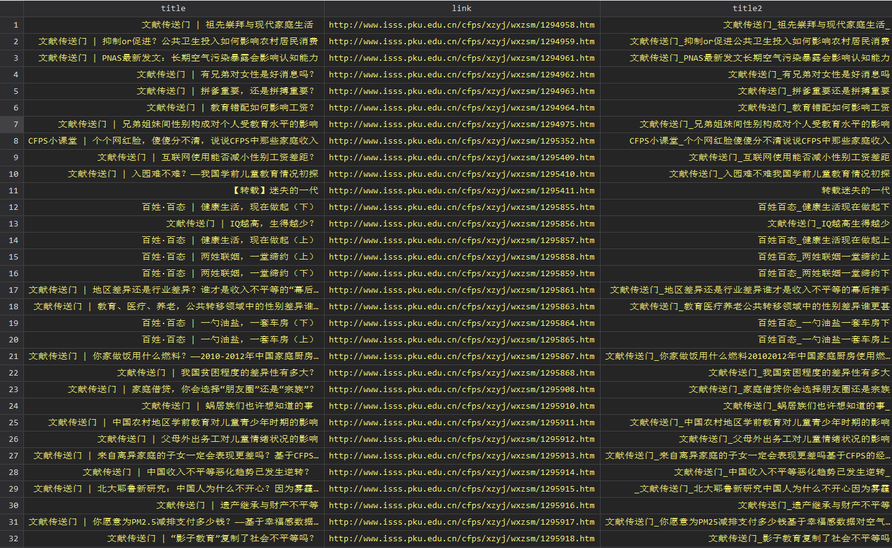
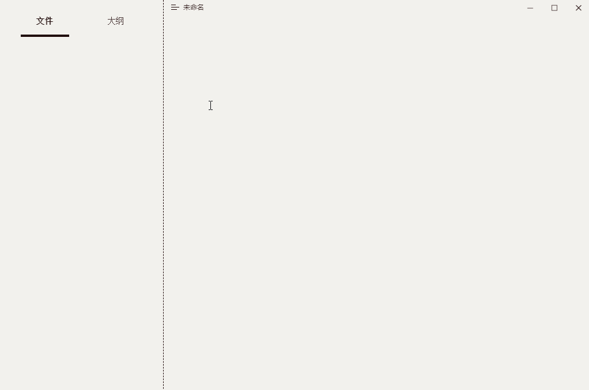

Stata | 爬取CFPS文献传送门并制作成 Markdown


# 前言



今天去 CFPS 官网下载文档时，发现官网【学术研究-文献传送门】栏目整理了一些使用 CFPS 完成的文献，而且还带有项目组的解读，是不错的学习资料。但是我觉得在网站上逐篇看起来不太方便，所以就动手将内容爬取并制作成 Markdown 文档。项目思路大致如下：

- 首先爬取文献的标题和链接；
- 之后对标题的字符串进行清洗（因为文件名不能包含特殊字符）；
- 随后调用 Python 的第三方库 `html2text` (使用前先 `pip install html2text` 安装)，将内容保存为 Markdown；
- 最后在 Typora 软件打开文件夹，左侧可显示所有文件的名称，便于索引。

# 实现过程

## 爬取标题和链接

```Stata
* 查询截止页码
copy "http://www.isss.pku.edu.cn/cfps/xzyj/wxzsm/index.htm" cfpsClass.txt, replace
infix strL v 1-20000 using cfpsClass.txt, clear
keep if index(v, "共有:")
if ustrregexm(v,`"共有:<font color="#ff0000">(\d+)</font>页"'){
local a = ustrregexs(1)
dis "共有：`a' 页！"
}

* 爬取文献标题和链接
forvalues p =1/`a'{
	if `p' == 1{
		local p = `""'
	}
	else{
		local p = `p' - 1
	}
	
	copy "http://www.isss.pku.edu.cn/cfps/xzyj/wxzsm/index`p'.htm" cfpsClass.txt, replace
	
	infix strL v 1-20000 using cfpsClass.txt, clear
	keep if index(v,`"<a href="') & index(v,`"title"') & index(v, `"arget="_blank">"') 
	gen title = ustrregexs(1) if ustrregexm(v,`"title="(.*?)""') == 1
	gen link = "http://www.isss.pku.edu.cn/cfps/xzyj/wxzsm/" + ustrregexs(1) ///
	if ustrregexm(v,`"<a href="(.*?)""') == 1
	keep title link
	
	save "./temp/temp`p'.dta", replace
}

* 保存数据
openall, directory("./temp/")
sort link
compress
save "./result/allPaperList.dta",replace
```

## 标题字符串清洗

```Stata
cd result
use "allPaperList.dta", clear

* 清洗文献标题 -> 合规文件名
gen title2 = usubinstr( ///
		usubinstr(ustrregexra(title,"[[:punct:]]","")," ","_",.) ///
		,"$","_",.)	
replace title2 = usubinstr(usubinstr(title2,"_|_","_",.),"_","",-1)
save "allPaperList.dta", replace
```

经过上述两步，获取的结果如下：



## 调用 Python 下载并保存为Markdown

```Python
python:
import requests
import html2text as ht

title = Data.get(var='title')
title2 = Data.get(var='title2')
links = Data.get(var='link')

for i in range(len(links)):
    html = requests.get(links[i])
    html.encoding = 'utf8'
    md = ht.html2text(html.text)
    md = md.split("##")
    filepath = title2[i] + ".md"

    with open(filepath, "w", encoding='utf8') as f:
        for row in range(3, len(md)):
            f.write(md[row])	
end
```
最后的效果如下:




这样就可以专注在 Typora 里面查看了，而且 Markdown 中也可以很方便的添加自己的笔记。**需要声明的是，本文内容仅供于个人学习，版权归原网站所有**。


