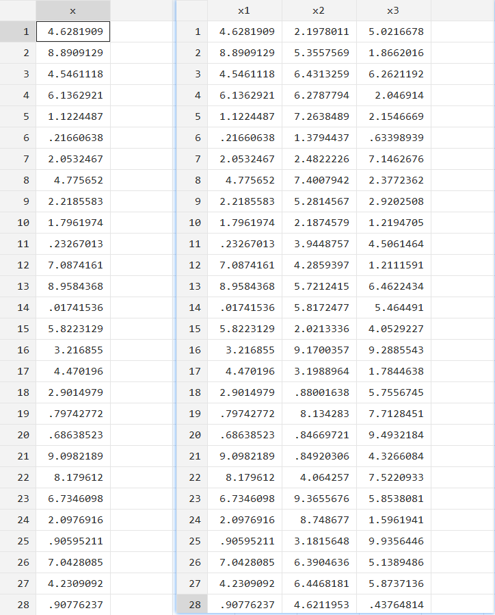

Stata | 用 frames 来“分蛋糕”

# 提出问题


话还要从这张滑稽的 Excel 表格说起，如果我有一批蛋糕，要平均的分给张三、李四和王五。而且我的蛋糕还很多，多到复制粘贴会下拉到眼花；朋友也不只他仨，还会有更多的朋友。该咋做？

换句话说，问题其实是：如何将 1 列数据平均拆分成 n 列？

# 思路分析

想了想，可能最直观的解决方法是使用 `perserve` 和 `restroe` 先拆分为 3 份子文件，再将数据合并。但这涉及数据导进导出，比较麻烦。尝试使用 Stata 16.0 的 Data Frame 功能解决，对比二者谁更优雅。

# 实现过程

## 生成数据

演示需要，生成包含 `x` 变量，15 个观测值的数据。其中，暂元 `group` 表示需要分成的列数，下方都设置为 3 列。

```Stata
version 16.0
clear
set obs 100
set seed 2020
gen x = 10*runiform()
```

## 使用 preserve 和 restore

```Stata
local group = 3  // 分成 3 组

* 组别识别变量
gen n = _n
gen temp = int(autocode(n,`group',0,_N))

* 拆分成子集
levelsof temp
local a = 1
qui{
	foreach i in `r(levels)'{
	preserve
	gen x`a' = x if temp == `i'
	drop if x`a' == .
	gen temp2 = _n
	keep temp2 x`a'
	save "temp_x_`a'.dta", replace
	local a = `a' + 1
	restore
	}
}

* 合并子集
use "temp_x_1.dta", clear
forvalues i = 2/`group'{
	qui merge 1:1 temp2 using "temp_x_`i'.dta", nogen
}
drop temp*
save "result.dta", replace

* 清除临时文件
qui{
	fs "temp_x*.dta"
	foreach i in `r(files)'{
		erase `i'
	}
}
```

细节：先采用 `autocode()` 函数自动进行分组，然后使用 `keep...if...` 分别保存为 `x1`、`x2` 和 `x3` 三份数据，最后再匹配成 3 列数据。最后的结果如下：



## 使用 Data Frames

```Stata
frame reset
set obs 200
set seed 2020
gen x = 10*runiform()
local g = 3

gen n = _n
gen temp = int(autocode(n,`g',0,_N))

local a = 1
levelsof temp
foreach i in `r(levels)'{
	cap frame drop group`a'
	frame copy default group`a'
	frame change group`a'
	keep if temp == `i'
	gen x`a' = x
	gen temp2 = _n
	keep x`a' temp2
	local a = `a' + 1
	frame change default
}

frame copy default result
gen temp2 = _n
keep temp2
forvalues i = 1/`g'{
	frlink 1:1 temp2, frame(group`i')
	frget x`i' = x`i', from(group`i')
}
egen m = rowmiss(_all)
drop if m
keep x*
```

采用 Data Frames 实现思路上面的整体思路相似，最后的结果前面一样，就不贴图了。在涉及多份数据处理导出和调用时，Data Frames 没有生成中间的过程数据，显得更加简洁。上面代码涉及的主要命令的功能如下：

- `frame reset`: 重置 frame，即删除当前所有的 frame，创建一个名为 default 的新 frame 。
- `frame copy`:复制当前 frame 。
- `frame change`: 更改到指定的 frame 。
- `frlink`: 链接 frame 。
- `frget`: 复制合要求的值和变量。

# 小结

> Frames make doing lots of tasks more convenient, and you will find your own uses for them. ( Stata Manual )

对比发现，二者都可以达到目的，但 frame 显得更简洁和优雅。

其实 `preserve` 和 `restore` 是将数据复制到了内存中隐藏的 frame ，多份数据操作时，需要进行导入和导出。而 frame 可以创建和管理 frame ，免去来回导入和修改内存中的数据的麻烦，所以在多任务和需要频繁导入导出数据的情境下显得更加便捷。
