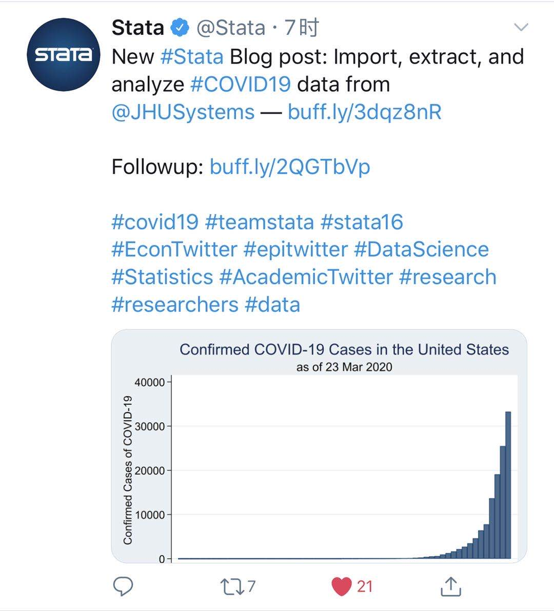
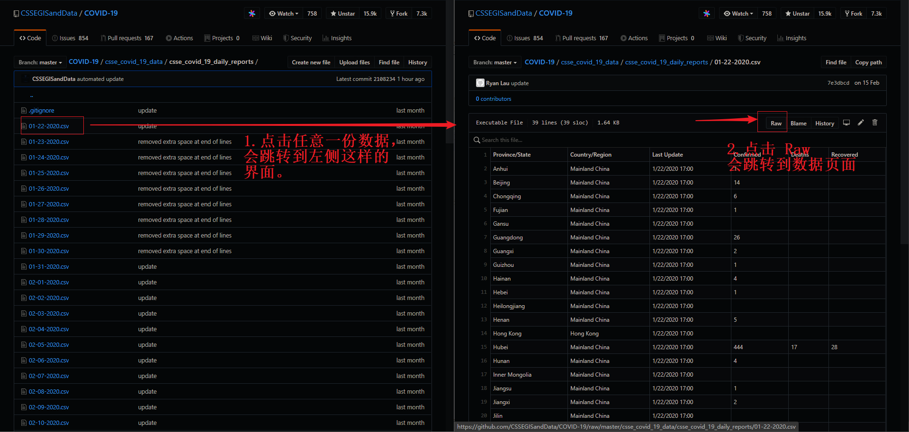

Stata | covid19 命令下载疫情实时数据



> 原文地址：
> [The Stata Blog: Import COVID-19 data from Johns Hopkins University](https://blog.stata.com/2020/03/24/import-covid-19-data-from-johns-hopkins-university/ "The Stata Blog: Import COVID-19 data from Johns Hopkins University")
> [Update to Import COVID-19 post](https://blog.stata.com/2020/03/24/update-to-import-covid-19-post/ "Update to Import COVID-19 post")
>
> 如果网络不方便：
> 在公众号后台聊天窗口回复 【covid19】，我将网页打印成了 PDF ，备索。

作者 Chuck Huber （Associate Director of Statistical Outreach of StataCorp ）看到网上铺天盖地的疫情数据和可视化，但是他想用自己方式关注疫情的消息。所以，他找到 Johns Hopkins CSSE （约翰霍普金斯·怀廷工程学院系统科学与工程中心）的数据源编写了 `covid19` 命令用来下载数据。从博客的介绍来看，该命令目前支持实时下载、合并数据和绘图。不过有两点需要强调：

- 命令可能会随取 Johns Hopkins 数据源变动失效，所以作者并不打算发布命令。而是在博客介绍了下载和处理数据的步骤，供读者自己改编（~~所以我真的没有标题党啊，摔...~~）。
- 数据下载下来之后，并不能拿来即用，还需要经过整理时间序列等工作。作者随后也会在博客上更新如何将数据处理成时间序列（ I will show you how to convert the raw data to time-series data in my next post ），有兴趣的去 [作者主页](https://blog.stata.com/author/chuber/ "作者主页") follow 吧。**另外，作者声明数据仅供教学使用**。

如果你看到这里还有耐心，那和我一起看看实现过程。其实思路不复杂，就像写一个简单的小爬虫。

# 思路分析

老规矩，动手写代码之前，先梳理思路。**完成一个简单的爬虫需要哪些步骤？首先，分析网页请求过程，下载单页数据，清理源数据；其次，找到翻页信息，构造循环进行请求；最后，多页数据合并。**`covid19` 命令也是这个思路，过程中一些关键的要素如下：

|   步骤   |                                            关键要素                                             |
| :------: | :---------------------------------------------------------------------------------------------: |
| 数据来源 | [CSSEGISandData/COVID-19](https://github.com/CSSEGISandData/COVID-19 "CSSEGISandData/COVID-19") |
| 数据清洗 |                                           统一变量名                                            |
| 数据下载 |                                        通过日期构造循环                                         |
| 数据合并 |                 `append`，作者留了个彩蛋，可以使用 Stata16 的 `frames` 功能完成                 |

# 实现过程

# 单份数据下载

## 数据下载

数据源：[Johns Hopkins University GitHub data](https://github.com/CSSEGISandData/COVID-19/tree/master/csse_covid_19_data/csse_covid_19_daily_reports "Johns Hopkins University GitHub data")

### 手动下载

前往 GitHub 项目主页，你会发现数据是按照日频存储的，文件名就是当天的日期（如，03-24-2020.csv），如果理解了前文提及的爬虫思路，你应该会为这种结构化的命名方式感到惊喜，没有 get 到的话，继续往下看吧。点击你需要数据的日期，之后再页面左上角有个 `Raw` ，点击它会跳转到一个逗号分隔的数据页面。操作如下图。如果你想要把数据全部下载下来，该怎么办？当然，你可以像点读机，一份份数据下载。但还是建议了解下用命令下载。



### 自动下载

也可以通过 Stata 的 `import delimited` 命令自动下载，注意数据地址的链接。写法如下：

```Stata
import delimited "https://raw.githubusercontent.com/CSSEGISandData/COVID-19/master/csse_covid_19_data/csse_covid_19_daily_reports/01-29-2020.csv"
```

我写成这样可能看的更清楚：

```Stata
* URL 为数据储存页面
global URL "https://raw.githubusercontent.com/CSSEGISandData/COVID-19/master/csse_covid_19_data/csse_covid_19_daily_reports"

import delimited "$URL/01-29-2020.csv"
```

定义的 `global` 就是数据存放仓库地址，下载的方法就是去该仓库下载对应日期（如，`01-29-2020.csv`）的数据。机智的你，有没有发现什么？对！日期就是我们前面提到的构造循环需要用到的关键信息。如果我通过日期去构造循环，岂不是就能批量下载了？实际上，这就是我们后文批量下载的关键。

## 数据清理

### 统一变量名

作者将数据下载下来之后，发现某些数据的日期变量名有问题，比如本应该为 `provincestate` ，但是有的数据为 `ïprovincestate` 。作者次日更新又发现了几处问题，并且将更新后的命令贴出来了（是不是体会到了作者不提供封装程序的良苦用心）。我就只贴重命名部分的代码，相信你只要知道 `rename` 什么意思就能看得懂。代码如下：

```Stata
capture confirm variable ïprovincestate
if _rc == 0 {
 rename ïprovincestate provincestate
 label variable provincestate "Province/State"
}
capture rename province_state provincestate
capture rename country_region countryregion
capture rename last_update lastupdate
capture rename lat latitude
capture rename long longitude
}
```

在文章的留言处有下面这样一条评论：

> As a matter of fact, this character "ï" in the first variable name comes from the byte order mark (here it's "EF BB FF" in hexadecimal). To deal with this, add the option "encoding(utf-8)" to -import delim-. See https://en.wikipedia.org/wiki/Byte_order_mark .(from Jean-Claude Arbaut)

说是之所以会出现 `ïprovincestate` 的乱码，是因为编码原因，`import delimited` 的时候添加 `encoding(utf-8)` 选项就好了。我没有亲自去测试是否可行，因为我觉得原作者的写法更加容易维护，将需要 `rename` 的变量名放在一起，便于后续添加。但是我觉得这条评论给我们处理这种奇怪乱码问题提供了一个思路，就是关注数据的编码问题。

# 批量下载

有了我前面的铺垫，如何批量下载是不是胸有成竹了？其实关键就两点：一是如何构造文件名，`month-day-year` ；二是怎么把日期套进循环中。这部分的代码如下：

```Stata
local URL = "https://raw.githubusercontent.com/CSSEGISandData/COVID-19/master/csse_covid_19_data/csse_covid_19_daily_reports/"
forvalues month = 1/12 {
   forvalues day = 1/31 {
      local month = string(`month', "%02.0f")
      local day = string(`day', "%02.0f")
      local year = "2020"
      local today = "`month'-`day'-`year'"
      local FileName = "`URL'`today'.csv"
      clear
      capture import delimited "`FileName'"
      capture save "`today'", replace
	  }
	}
```

# 合并数据

看到这里，合并数据就显得很简单了，将数据 `append` 起来就好了。实现代码如下：

```Stata
clear
forvalues month = 1/12 {
   forvalues day = 1/31 {
      local month = string(`month', "%02.0f")
      local day = string(`day', "%02.0f")
      local year = "2020"
      local today = "`month'-`day'-`year'"
      capture append using "`today'"
   }
}
```

其实，如果你要保存中间每日的数据，可以将下载的每日数据 `save` 在一个单独的文件夹，之后使用外部命令 `openall` 就可以将数据合并起来。

# 其他

下载之后的数据并不完全干净，日期格式还不太一致，还需要经过处理才能得到可用于分析的数据。不过，作者在博客中提到会在后面的更新中介绍怎么处理成时间序列，感兴趣的去博客中 follow 吧。

# 完整代码（Update: 24 March 2020）

```Stata
local URL = "https://raw.githubusercontent.com/CSSEGISandData/COVID-19/master/csse_covid_19_data/csse_covid_19_daily_reports/"

forvalues month = 1/12 {
   forvalues day = 1/31 {
      local month = string(`month', "%02.0f")
      local day = string(`day', "%02.0f")
      local year = "2020"
      local today = "`month'-`day'-`year'"
      local FileName = "`URL'`today'.csv"
      clear
      capture import delimited "`FileName'"
      capture confirm variable ïprovincestate
      if _rc == 0 {
         rename ïprovincestate provincestate
         label variable provincestate "Province/State"
      }
      capture rename province_state provincestate
      capture rename country_region countryregion
      capture rename last_update lastupdate
      capture rename lat latitude
      capture rename long longitude
      capture save "`today'", replace
      }
}
clear
forvalues month = 1/12 {
   forvalues day = 1/31 {
      local month = string(`month', "%02.0f")
      local day = string(`day', "%02.0f")
      local year = "2020"
      local today = "`month'-`day'-`year'"
      capture append using "`today'"
   }
}
```

# 小结

如果你正需要使用 Stata 分析疫情相关的任务，相信这个推文会对你有帮助。不过 Github 还有其他与疫情相关的项目，也提供了数据的下载。如果你有一点 Python 基础的话，有一些包提供了疫情数据的接口，也可以比较方便的获得数据。

本文主旨并不在对比疫情获取方式或者应用，网上也已经有人整理相关的主题文章，感兴趣可以自行搜索学习。刚好看到有用 Stata 实现这个功能，而且能够穿插介绍写一个简单爬虫的思路，所以就简单的写写。说实话，处在疫情中心，我内心是不太想碰与疫情有关的数据整理和分析的（主要还是水平不行，分析不出个啥来...）。“时代的一粒灰层，落到每个人头上都是一座大山”，冰冷的数字背后可能是一个家庭所需要背负的重担，陡峭的折线图显得有点沉重。最近和朋友聊天，都感触疫情带给我们这代人的成长，希望疫情能快点过去，生活早日回归正轨。

公众号后台回复【covid19】可以获取本文的代码、数据和其他资料。欢迎批评指正，祝学习愉快。
