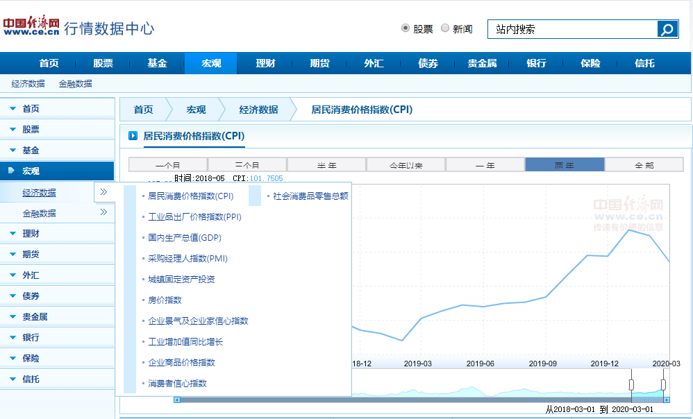

# 前言

之前看见有文章在稳健性检验部分，用企业景气指数和企业家信心指数代替 GDP 增长率作为宏观经济层面投资机会的替代变量（李凤羽和杨墨竹，2015）。所以想收集来看看，在网上找到[中国经济网行情数据中心](http://data.ce.cn/)公布了数据，所以用 Stata 爬了下，好久没有用 Stata 干这种活儿，也当是练练手。

# 思路分析
网页是 POST 请求，所以调用 `curl` 进行爬取。爬虫的思路也不难，找到翻页信息后批量请求，然后对字符串进行清理，最终整理成规范的数据。注意，如果想复刻我的代码，注意先下载 `curl`，安装`nrow`, `openall` 两个外部命令。 

# 实现过程

## 爬取数据

```Stata
* 获取页面截止页码
!curl -H "User-Agent: Mozilla/5.0 (Windows NT 10.0; Win64; x64) AppleWebKit/537.36 (KHTML, like Gecko) Chrome/67.0.3396.99 Safari/537.36" -d "curPage=1&numPerPage=15&rand=1587711227852" -o confidenceIndex.txt "http://data.ce.cn/servlet/macrography/MacrographyAction?function=Condition"
infix strL v 1-20000 using confidenceIndex.txt,clear
keep if index(v, "pagecount")
if ustrregexm(v,"(\d+)") local a = ustrregexs(1)

* 爬取并存储单页数据
forvalues p = 1/`a'{ 
	qui{
	!curl -H "User-Agent: Mozilla/5.0 (Windows NT 10.0; Win64; x64) AppleWebKit/537.36 (KHTML, like Gecko) Chrome/67.0.3396.99 Safari/537.36" -d "curPage=`p'&numPerPage=15&rand=1530620756348" -o confidenceIndex.txt "http://data.ce.cn/servlet/macrography/MacrographyAction?function=Condition"

	* 处理字符串
	infix strL v 1-200000 using confidenceIndex.txt,clear
	keep if index(v,`"<td >"') | ///
        index(v,`"<td style="border-left:none;">"') | ///
        index(v,`"<td class="tsblue" style="border-left:0 none;">"') 
		
	replace v = ustrregexra(v,"<(.*?)td(.*?)>","") 

	* 调整数据格式
		forvalues i = 0/7{
			gen temp`i' = v if mod(_n, 7) == `i'
			preserve
			keep temp`i'
			drop if temp`i' == ""
			save ".\temp\temp`i'.dta", replace
			restore
		}	

	use ".\temp\temp0.dta", clear
	forvalues i = 1/6{
		merge 1:1 _n using ".\temp\temp`i'.dta", nogen	
	}

	nrow
	save ".\result\result`p'.dta", replace
}
	dis in result "第 -`p'- 页爬取完毕!"
}
```

## 数据整理
```Stata

openall, directory("./result/")

* 日期变量
gen q = usubstr(月份,1,4) + "q" + usubstr(月份,6,1)
g 季度=quarterly(q,"YQ")
format 季度 %tq
drop q

* 数据类型
order 月份 数据类型 总体 工业 建筑业 房地产业 住宿和餐饮业
destring 总体-住宿和餐饮业, replace
encode 数据类型, gen(类型)

* 定义panel
xtset 季度 类型
save "企业景气指数与企业家信心指数.dta", replace
```

# 绘图

```Stata
use "企业景气指数与企业家信心指数.dta", clear
tw (line 工业 季度 if 类型 == 1) ///
   (line 工业 季度 if 类型 == 2), ///
   scheme(qleanmono) ///
   legend(pos(8) label(1 "企业家信心指数") label(2 "企业景气指数")) ///
   title("中国企业景气指数与企业家信心指数：工业") ///
   subtitle("（时间：1999年第1季度-2019年第4季度）") ///
   ytitle("总体指数") ///
   note("数据来源：中国经济网（http://data.ce.cn）")
graph export "中国企业景气指数与企业家信心指数_工业.png", replace
```


# 小结

中国经济网行情数据中心还有一些其他股票、基金、宏观经济和金融等数据，数据源质量还比较好。



其实有点想以这个网站数据源为基础，写个命令方便的获取上面的数据，但是一是现在还有其他的事情要忙活，做这件事的激励似乎不太够；二是写出来之后还需要精力维护，就先搁置吧。有兴趣的朋友可以尝试一下，我在上面这里也爬过房价指数和其他的数据，数据页面的网页结构是差不多的，实现起来应该也还好。


