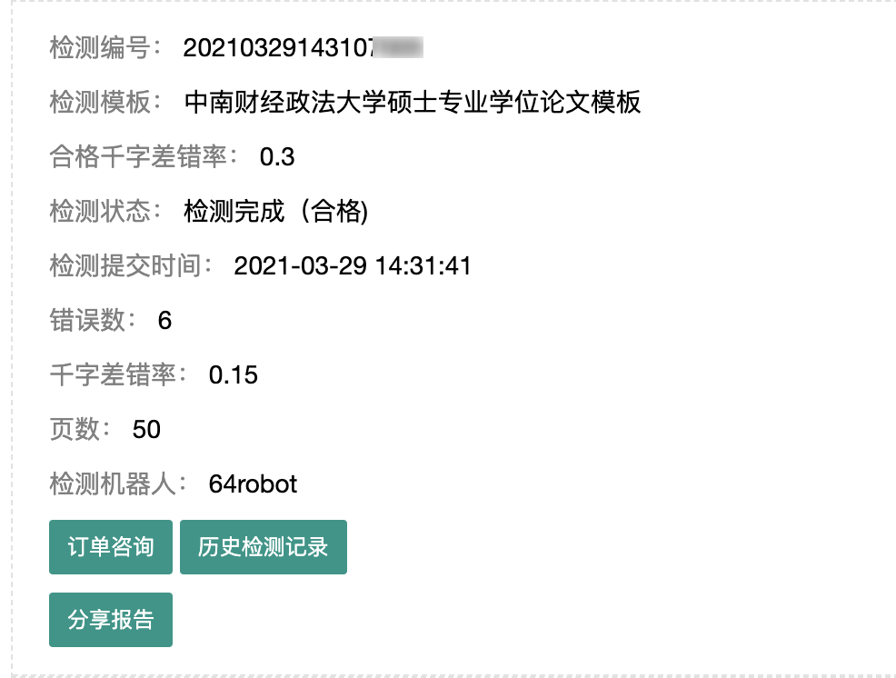
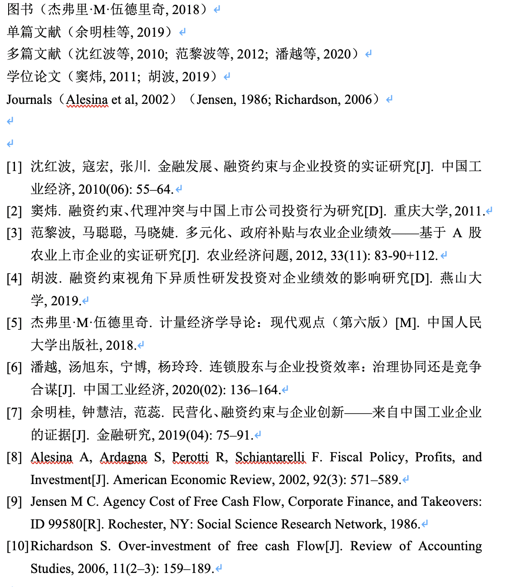
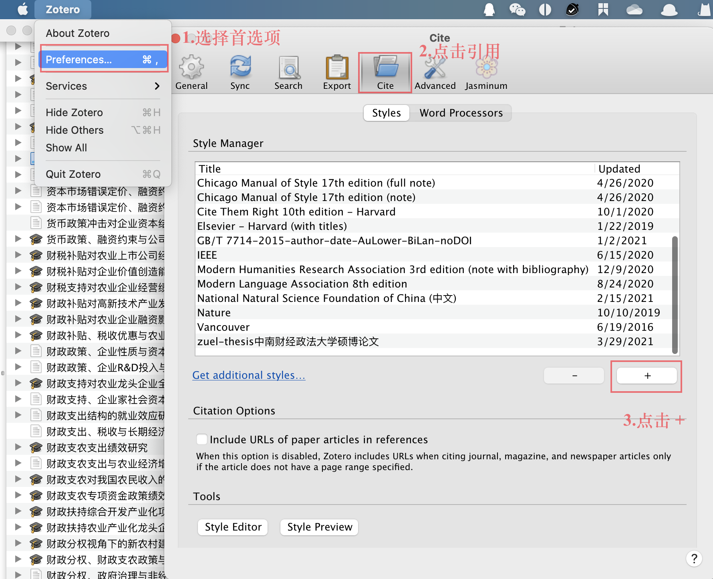
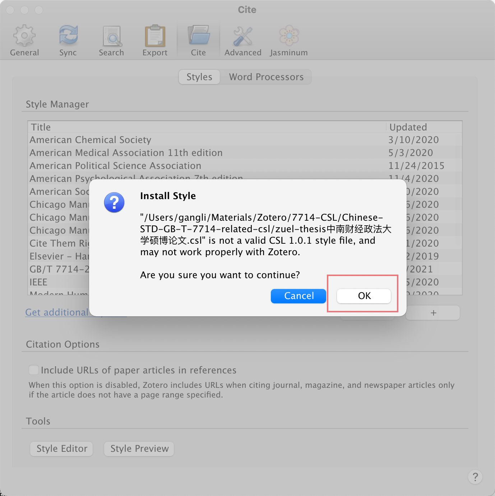
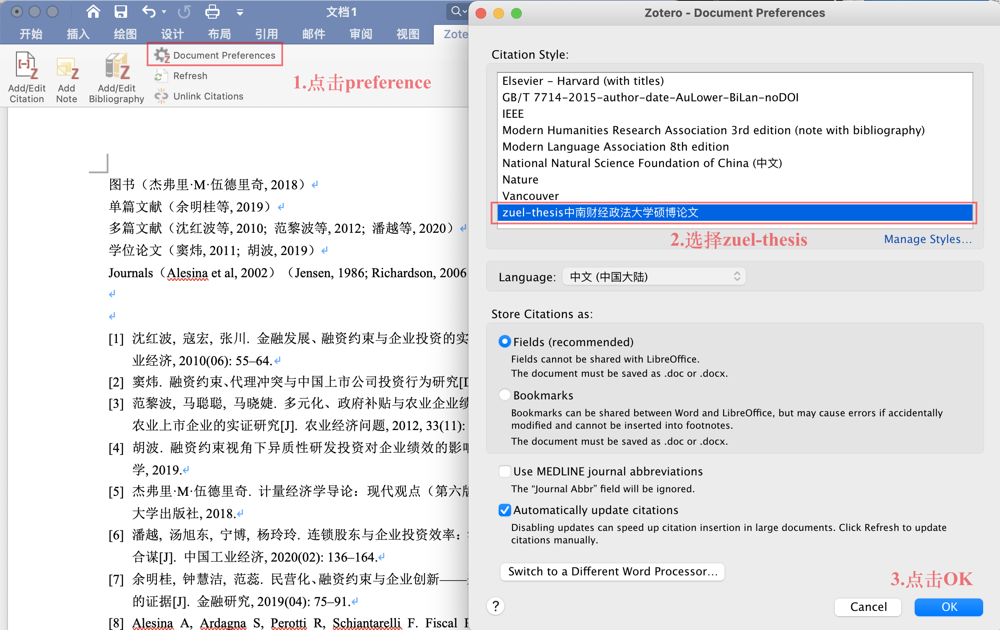

写毕业论文的时候，是不是觉得管理参考文献比较折磨人？即使用了文献管理软件，但是在引用文献的时候还是会有引用格式的问题。尤其是今年弄了个论文检测系统，参考文献带来的报错简直成了重灾区。为了解决参考文献引用格式的麻烦，花了半天的时间修改出中南财大硕博论文的 Zotero 参考文献样式，经过测试，排版出来的文献能够通过机器的检测。

<!-- more -->



（上图还剩的6处错误来自页眉页脚，愣是没调好就弃疗了......）


### 排版要求
按照今年研究生院的通知[关于印发《中南财经政法大学研究生论文撰写规范》（修订）的通知](http://yjsy.zuel.edu.cn/2018/0103/c3486a184426/page.htm)，今年的论文排版要求还是按照 2017 年 12 月修订版的要求，所以对 CSL 文件的修改也是主要参照这个文件。

#### 总体要求
主要的排版要求有：
- 博士学位论文参考文献文不少于 80 个，硕士学位论文参考文献文不少于 50 个，其中外文文献占十分之一；专业学位论文的外文参考文献数量可根据情况有所减少。
- 参考文献无论是著作类，还是论文类，其顺序均为先中文，后外文。其中，中文文献以作者姓氏拼音顺序排序；英文类外文著作以作者字母顺序排列，其他类参照以上惯例。

#### 著录格式与示例
在撰写社科类的论文，引用最常见的还是图书、学位论文和期刊文献，我们主要来看看这几种著录项目的著录格式以及示例。

1. 普通图书
著录格式：[序号] 主要责任者.题名:其他题名信息[M].其他责任者.版本项.出 版地:出版者，出版年:引文页码.
示例：[1] 罗杰斯.西方文明史:问题与源头[M].潘惠霞，魏婧，杨艳，等译.大连:东北财经大学出版社，2011:15-16.

2. 学位论文
著录格式：[序号] 主要责任者.题名[D].大学所在城市:大学名称，出版年.
示 例：[1] 马欢.人类活动影响下海河流域典型区水循环变化分析[D].北京:北 京大学，2011.

3. 标准文献
著录格式：[序号] 主要责任者.标准名称:标准号[S].出版地:出版者，出版年: 引文页码.
示 例：[1] 全国信息与文献标准化技术委员会.文献著录:第 4 部分 非书资料: GB/T3792.4-2009[S].北京:中国标准出版社，2010:3.

4. 期刊文献中的析出文献
著录格式：[序号] 主要责任者.题名:其他题名信息[J].期刊名，年，卷(期): 页码.
示 例：[1] 袁训来，陈哲，肖书海，等.蓝田生物群:一个认识多细胞生物起源 和早期演化的新窗口 [J].科学通报， 2012，55(34):3219.

其他的还有论文集、报告、专利文献、报纸和电子资源等可以参阅2017 年 12 月修订版排版要求的第三章第六节。

### Zotero 排版效果

按照这些排版规范，在 `GB/T 7714-2015` 的基础上进行了修改，目前的 `zuel-thesis中南财经政法大学硕博论文.csl` 排版效果如下：




```
图书（杰弗里·M·伍德里奇, 2018）
单篇文献（余明桂等, 2019）
多篇文献（沈红波等, 2010; 范黎波等, 2012; 潘越等, 2020）
学位论文（窦炜, 2011; 胡波, 2019）
Journals（Alesina et al, 2002）（Jensen, 1986; Richardson, 2006）


[1]	沈红波, 寇宏, 张川. 金融发展、融资约束与企业投资的实证研究[J]. 中国工业经济, 2010(06): 55–64.	
[2]	窦炜. 融资约束、代理冲突与中国上市公司投资行为研究[D]. 重庆大学, 2011.
[3]	范黎波, 马聪聪, 马晓婕. 多元化、政府补贴与农业企业绩效——基于A股农业上市企业的实证研究[J]. 农业经济问题, 2012, 33(11): 83-90+112.	
[4]	胡波. 融资约束视角下异质性研发投资对企业绩效的影响研究[D]. 燕山大学, 2019.
[5]	杰弗里·M·伍德里奇. 计量经济学导论：现代观点（第六版）[M]. 中国人民大学出版社, 2018.
[6]	潘越, 汤旭东, 宁博, 杨玲玲. 连锁股东与企业投资效率：治理协同还是竞争合谋[J]. 中国工业经济, 2020(02): 136–164.
[7]	余明桂, 钟慧洁, 范蕊. 民营化、融资约束与企业创新——来自中国工业企业的证据[J]. 金融研究, 2019(04): 75–91.
[8]	Alesina A, Ardagna S, Perotti R, Schiantarelli F. Fiscal Policy, Profits, and Investment[J]. American Economic Review, 2002, 92(3): 571–589.
[9]	Jensen M C. Agency Cost of Free Cash Flow, Corporate Finance, and Takeovers: ID 99580[R]. Rochester, NY: Social Science Research Network, 1986.
[10]	Richardson S. Over-investment of free cash Flow[J]. Review of Accounting Studies, 2006, 11(2–3): 159–189.
```

可以看出：

- 文献的排列顺序为先中文后英文，中英文内部按照字母；
- 文中的引用三个及以上省略，基本解决中英文混排"`等`" 和 "`et al.`"；
- 文末参考文献不包括 DOI 和 URL。

### 使用



1. 在公众号后台回复 【zuel-thesis】，获取 `zuel-thesis中南财经政法大学硕博论文.csl` 文件；
2. 打开 Zotero，点击【首选项】-选择【引用】-点击【+】将下载好的 csl 文件添加；
3. 这时会弹出来一个报错，这是因为 csl 没有提交到 Zotero 官方，直接点击【OK】 即可。



安装完成之后，就可以进行样式更换和使用了。



### 后记

- `Learning by Doinng.`之前就想要学着修改 CSL ，一直觉得很麻烦就没动手，今天试着修改了下发现学到不少；

- 在调试过程中，非常感谢 [johnmy](https://www.zhihu.com/people/johnmy-89) 老师的帮助，在韩老师的github上 [Chinese-STD-GB-T-7714-related-csl](https://github.com/redleafnew/Chinese-STD-GB-T-7714-related-csl) 还有一些其他的 csl，也可以参阅；

- **现在这个版本肯定还有一些 bug ，比如`（张三和李四, 2021）` 可能会显示为 `(张三, 李四, 2021)`，可能是因为使用了两种 layout 的原因，目前还没想道好的解决方法。可以在文章定稿时再仔细审阅，检查调整。**

