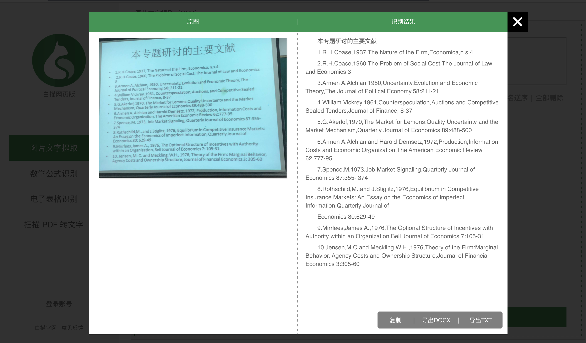
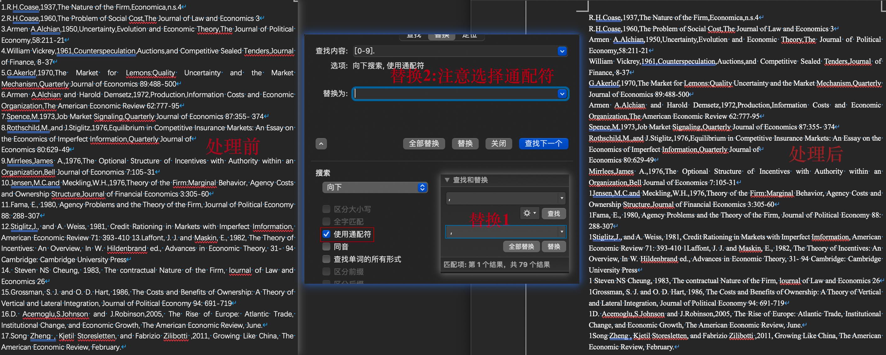
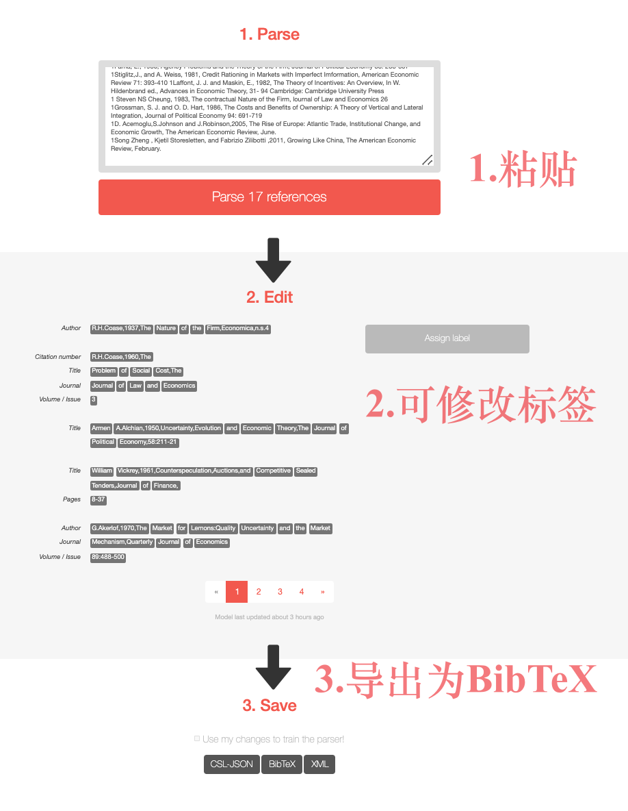
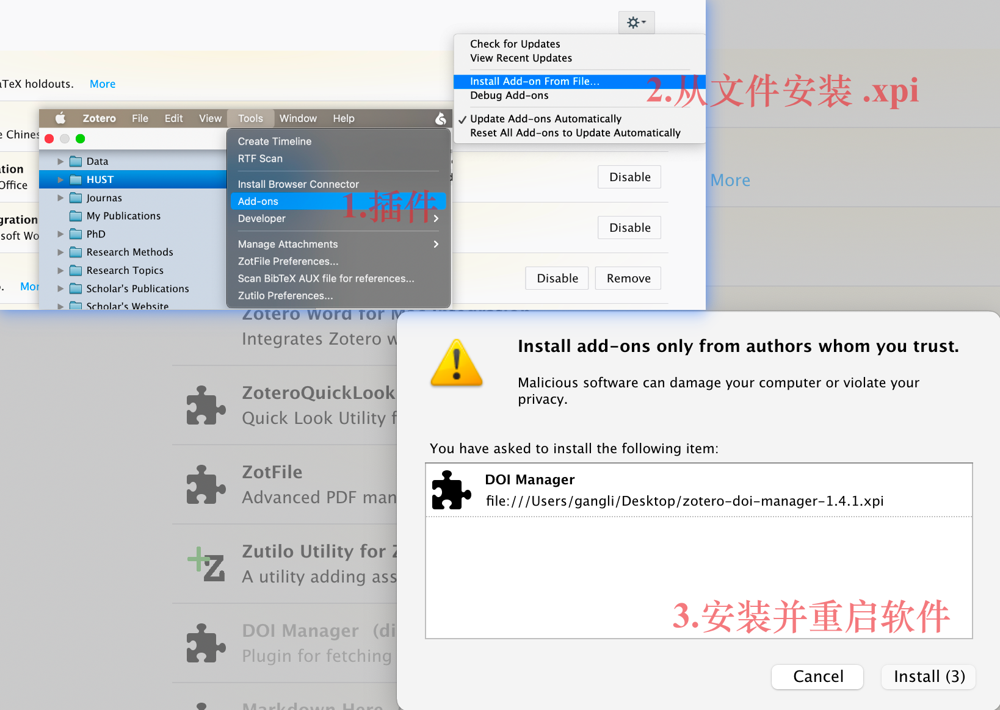
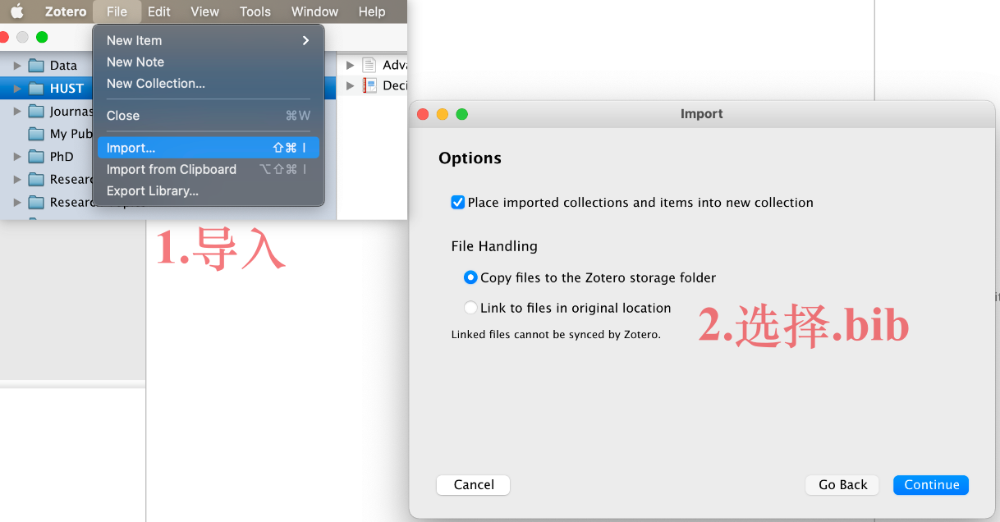
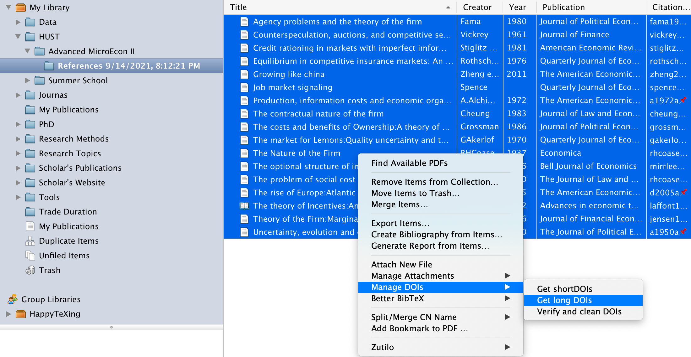
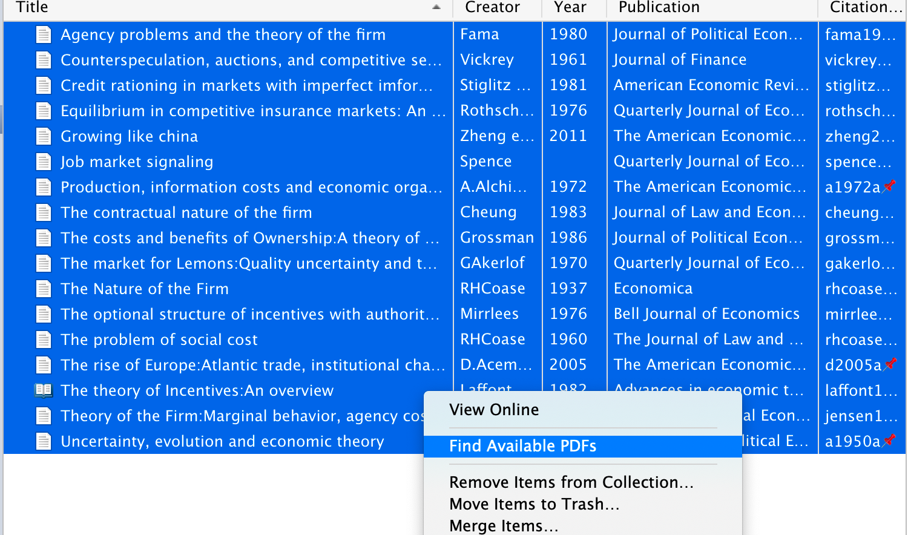
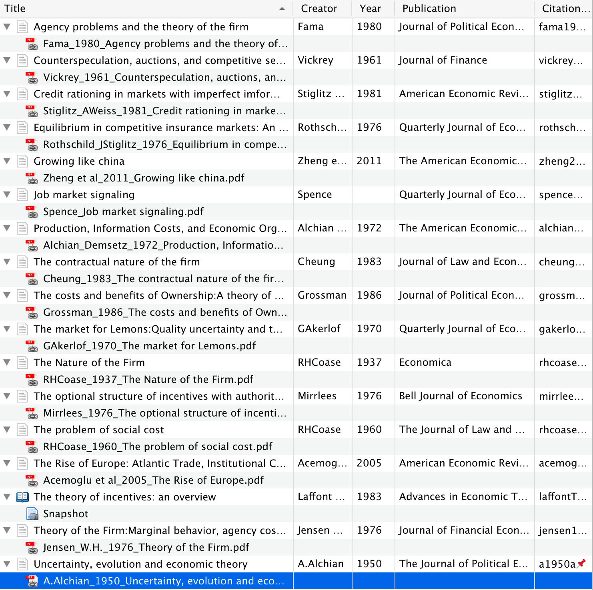

## 1.提出问题

今天上课，老师给出了这学期高微课程需要读的文献，但是只让我们拍了PPT，要我们自己下载 PDF 。

一共 17 篇文献，搜索、筛选和整理，似乎是一项还比较耗时的任务，有没有办法快速下载并添加到 Zotero 文献库？

## 2.准备工作

1. OCR图片识别文字工具，可以使用在线工具，或者【白描】APP，白描网页版（`https://web.baimiaoapp.com/`）；

2. Zotero 安装 ` zotero-shortdoi` 插件，在 github 主页（`https://github.com/bwiernik/zotero-shortdoi/releases/tag/v1.4.1`）可以下载；

3. 在线的参考文献解析网站：`https://anystyle.io/`

## 3.处理步骤

1. 先识别图片中的文字，复制粘贴到 Word 中；

2. 对 Word 中的文献进行简单整理，**注意：`,`之间需要添加空格；利用正则表达式去除前面的编号（如`1.`）。**
3. 将解析的内容保存为`bib`，随后导入进Zotero；
4. 使用 `Find available PDF` 需要文献的 DOI，注意 sci-hub 只识别long DOI，因此先使用` zotero-shortdoi` 插件获取文献的  long DOI；
5. 最后，选中文献条目，右键`Find available PDF` 即可。

## 4.步骤演示

前往白描网页版，识别图片中的文字：

并复制粘贴到word中，规整格式，主要是注意英文逗号间的空格、去掉文献数字编号，处理过程如图：

随后，前往 AnyStyle 在线识别、导出为`bib`：

先安装 `shortdoi` 插件；然后将上一步的 `bib` 文件导入进Zotero，之后使用 `shortdoi` 插件获取 `long doi`:

之后，就可以将所有的文献条目导入进Zotero，获取 doi 之后查找PDF即可完成批量自动下载并重命名。

最后，等待下载，即可大功告成！

