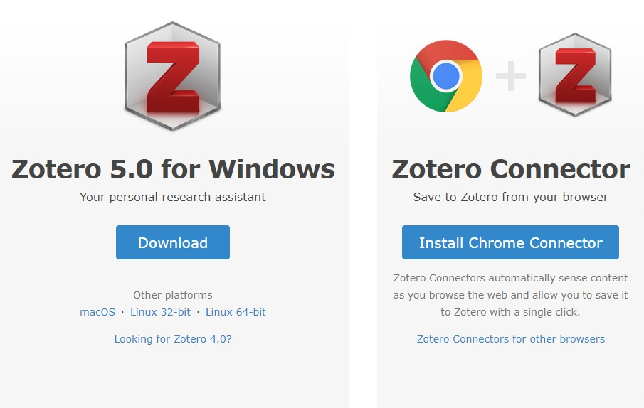
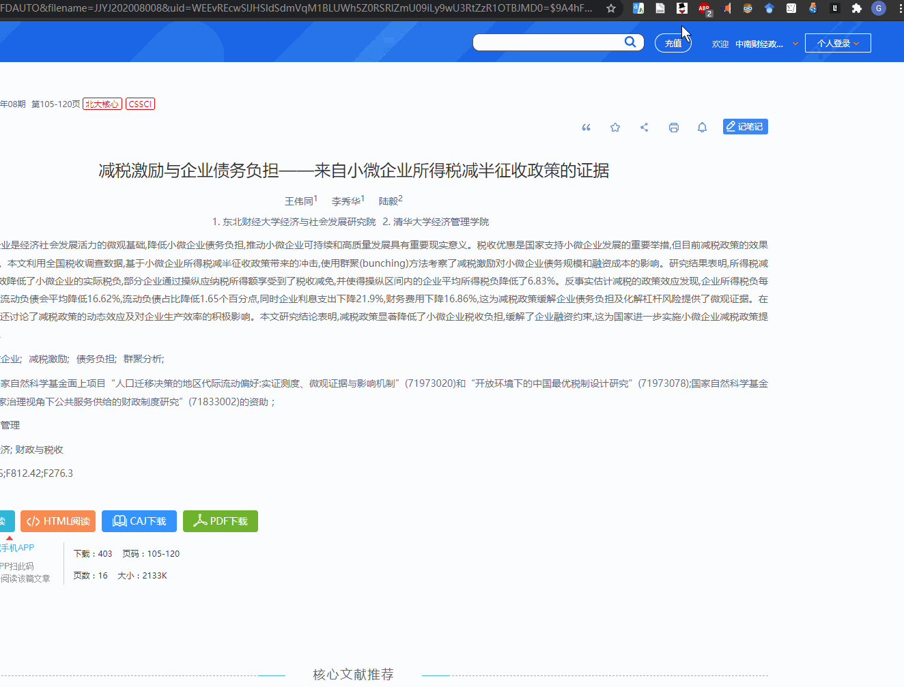

## 0.Zotero 简介

Zotero 是一款**开源免费**的文献管理软件，作为 Firefox 浏览器插件起家，在浏览器文献智能导入、PDF 元数据抓取方面具有优势。使用一段时间之后，发现用起来还很顺手，这篇文章整理下 Zotero 基本用法，包括安装、英文和中文文献的导入等。文末附三种主要文献管理工具的对比。

## 1. 下载与安装

下载地址：https://www.zotero.org/download/

分别下载**客户端**和安装**Chrome 插件**，从浏览器导入文件时，要保持客户端打开。

## 2.新建分类

步骤：

我的文库 → 右键 → 新建分类 → 输入名称 → 鼠标右键我的文库 → 出现新建文件夹

## 3.英文文献信息导入

步骤（非常简单）：

在新建目录下 → 鼠标拖入英文文献 → 右键重新抓取 PDF 文件的元数据 → 获取文献基本信息

备注：

一些时间久远的英文论文也不能直接抓取数据，具体信息抓取方法参照第四部分中文文献的信息导入。

## 4.中文文献信息导入

### 4.1 知网自动导入

步骤：

1. 点击想要下载文献的详情页面
2. 点击浏览器 Zotero 插件
3. 将文献归入相应的分类 → 完成中文文献的信息抓取

### 4.2 手动导入

步骤（稍复杂）：

1. 鼠标拖入中文文献
2. 在百度学术搜索文献 → 点击批量引用 → 导出到 BibTex→ 下载
3. 用记事本打开下载好的.bib 文件 → 复制全部内容
4. Zotero 界面文件一栏 → 选择从剪贴板导入
5. 以上 2-4 可输出格式为`endnote` or `RefMan`，直接放入库中
6. 将 PDF 文件鼠标拖至刚导入文件成为其子文件 → 完成中文文献的信息抓取

## 5.插入文献

步骤：

1. Word 中点击菜单栏中的“Zotero”工具栏 → 选择要引用的方式（默认选项没有的引用方式参见第六部分）
2. 鼠标光标置于要插入上角标处，依次操作
3. 其他文献可依次插入。**Zotero 有个特别强大的功能，如果中间一部分引文被删除，点击工具栏的 Refresh，上角标以及参考文献会自动更新**。

## 6.寻找非默认引文格式

步骤：

在 Wrod 菜单栏找到"Zotero"工具栏 → 点击左上角 Add/Edit
Citation 工具 → 选择右下角管理样式 → 在 Zotero Style Repository 对话框寻找想要的引文格式

## 7.把 Endnote 的条目导入 Zotero

Endnote--输出--output style: Bib Tex Export , save as type: .txt

Zotero 导到 EndNote 并保留 PDF 链接，参考：https://www.jianshu.com/p/8c8e0ac166db

## 8.Endnote 批量导出 pdf

如果在 EndNote 数据库中已建立大量的参考文献，且每条文献都有 PDF 文件对应，怎样将需要的某十几条甚至几十条参考文献对应的 PDF 文件从数据库导出另存在新建的文件夹里呢？

1. 按住“Ctrl”键，逐条选中所有需要导出 pdf 的文献。
2. 右键，“Cope Reference To”—“New Library...” 选中路径保存在电脑桌面，这样就生成了一个文件“My EndNote Library”和一个文件夹“My EndNote Library.Data”
3. 打开文件夹“My EndNote Library.Data”，打开里面的文件夹“PDF”。按“Ctrl+F”，输入“pdf”，按回车键搜索，搜索完毕，会出现所有 pdf 类型的文件，剪切，粘贴到其他一个新的文件夹里。
4. 删除桌面的文件“My EndNote Library”和文件夹“My EndNote Library.Data”。

## 附：工具对比

| Criteria                                  | Zotero                                                                                                                                    | Mendeley                                                                                                                                  | EndNote                                                      |
| :---------------------------------------- | :---------------------------------------------------------------------------------------------------------------------------------------- | :---------------------------------------------------------------------------------------------------------------------------------------- | :----------------------------------------------------------- |
| Website                                   | http://www.zotero.org/                                                                                                                    | http://www.mendeley.com/                                                                                                                  | http://endnote.com/                                          |
| **Web based?**                            | Yes, works with Firefox browser and can sync(同步) with online account; connectors for Chrome and Safari available                        | Not primarily, but can sync with an online account which is editable                                                                      | No, but can transfer library to EndNote Online               |
| Operating System                          | Windows, Mac, Linux                                                                                                                       | Windows, Mac, Linux                                                                                                                       | Windows or MAC                                               |
| **Cost**                                  | Free for basic account, some cost for more online storage space                                                                           | Free for basic account, some cost for more online storage space                                                                           | \$\$, AU community may download for free through portal      |
| Word-processor compatibility              | MS Word, Open Office, Google Docs                                                                                                         | MS Word, Open Office, LaTex                                                                                                               | MS Office, Open Office, iWork Pages                          |
| Mobile Device Application                 | 3rd party iOS and Android apps, web interface                                                                                             | iPad, iPhone, 3rd party Android apps, web interface                                                                                       | iPad, web interface                                          |
| Number of citation styles                 | About 16 pre-loaded, "thousands" available for download from Zotero                                                                       | Over 1180                                                                                                                                 | Top 100 downloaded, over 4000 more available                 |
| Number of import filters                  | 247 "translators;" other sources captured as web page                                                                                     | About 50, + COinS, + integrates with Zotero's "translators"                                                                               | 700+                                                         |
| **Import from databases**                 | Yes                                                                                                                                       | Yes                                                                                                                                       | Direct export from specific databases                        |
| Import citation info from web pages       | Yes, also archives the page and you can add annotations                                                                                   | Yes, with a bookmark for a limited number of sites (mostly publishers or databases)                                                       | only with EndNote Online bookmarklet                         |
| **Storage capacity**                      | Unlimited local storage and data syncing; 100MB free Zotero file syncing (larger syncing plans available for purchase); or can use WebDav | Unlimited local storage and data syncing; 1GB personal and 100MB shared online space (larger online storage plans available for purchase) | Unlimited local storage                                      |
| Attach associated files (PDFs, etc.)      | Yes, with option to attach automatically                                                                                                  | Yes, and can highlight and annotate PDFs                                                                                                  | Yes, and can highlight and annotate PDFs                     |
| Search full text of PDFs                  | Yes                                                                                                                                       | Yes                                                                                                                                       | Yes                                                          |
| Duplicate detection                       | Yes                                                                                                                                       | Limited                                                                                                                                   | Yes; fully customizable                                      |
| Create group or shared libraries          | Yes                                                                                                                                       | Yes, free for up to 3 group members (larger group plans available for purchase)                                                           | Yes, with up to 100 people and includes attachments and PDFs |
| Create bibliography with different styles | Yes                                                                                                                                       | Yes                                                                                                                                       | Yes                                                          |
| Automatic citation extraction from PDFs   | Yes                                                                                                                                       | Yes                                                                                                                                       | Yes                                                          |
| Other features                            | Sync library with multiple computers Use tags to organize/search                                                                          | Sync library with multiple computers Sync with Zotero library                                                                             | Insert figures and charts using word processor integration   |

## 参考资料

https://subjectguides.library.american.edu/c.php?g=479020&p=3323781

https://www.cnblogs.com/icodeworld/p/11324185.html

https://www.jianshu.com/p/6b559dbcf745

https://www.yangzhiping.com/tech/zotero1.html

https://www.yangzhiping.com/tech/zotero5.html

https://blog.csdn.net/liangyihuai/article/details/90146220

https://blog.csdn.net/edward_zcl/article/details/87866016

https://www.ravenxrz.ink/archives/research-monk-reading-literature-on-ipad-and-synchronizing-with-zotero-literature-library.html
