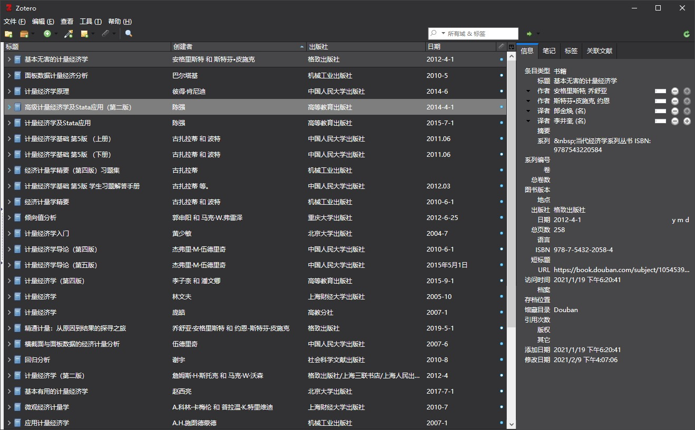
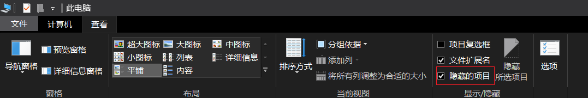

## Zotero 暗黑主题

## 配置方式

**注意：当前仅适配 Windows 10 系统，其他系统需要自己调试。** 

### Windows 系统

1.找到 `AppData` 文件夹，`C:\Users\<User Name>\AppData\Roaming\Zotero\Zotero\Profiles\<randomstring>`。

如果没看到，需要打开隐藏文件夹：此电脑-查看-勾选【隐藏的项目】。

2.在`<randomstring>.default`下创建 `chrome` 文件夹，将 `userChrome.css` 文件放置在 `chrome ` 文件夹中。前往 [Rosmaninho
/Zotero-Dark-Theme](https://github.com/Rosmaninho/Zotero-Dark-Theme) 或在公众号后台回复【**Zotero暗黑主题**】获取文件。

3.重启 Zotero 软件，即可看到效果。

## 当前主题存在的问题

### 主题失效

设置之后仅能更改主要界面为暗黑模式，有些细节的地方还需要改进。比如：

- 无法更改软件最上方的关闭、最小化选择栏的颜色；

- 无法为滚动条设置主题；

- 无法改变菜单颜色；
- “文件”下拉菜单中的“新建项目”子菜单；
- “首选项”对话框中的子类别。 

简单尝试了下，发现通过更换 windows 主题颜色可以修改上方条目颜色：鼠标右键-个性化-主题-自定义颜色 `RGB(50, 50, 52)` 。

## 进一步修改的办法

其他细节地方还有待改进，有好的办法可以去原项目提交 issue 。或者自行测试修改 css 文件，方法如下：

1.前往Zotero 的安装路径 `C:\Programs(x86)\Zotero`；

2.将 `zotero.jar` 复制到其他文件夹；

3.使用 7zip 软件将 `zotero.jar` 解压；

4.前往 `D:\X\zotero\chrome\skin\default\zotero` 文件夹；

5.找到文件夹中的 `ALL.css` 文件；

6.开始测试不同的代码段以更改 `userchrome.css` 文件中的默认值。

## 参考资料

https://github.com/Rosmaninho/Zotero-Dark-Theme

https://www.zotero.org/support/kb/profile_directory

