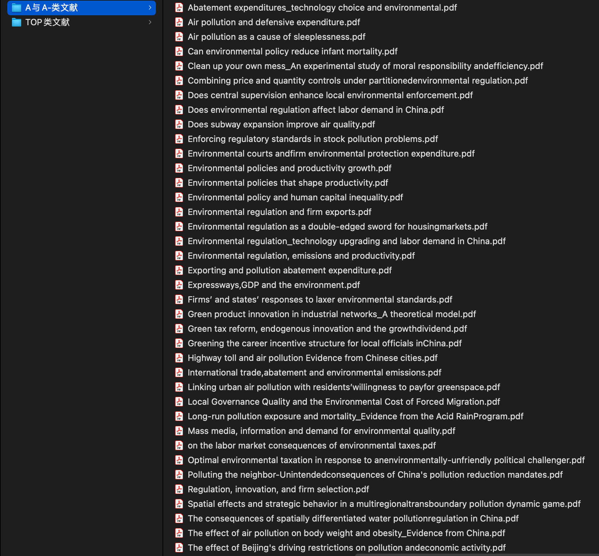
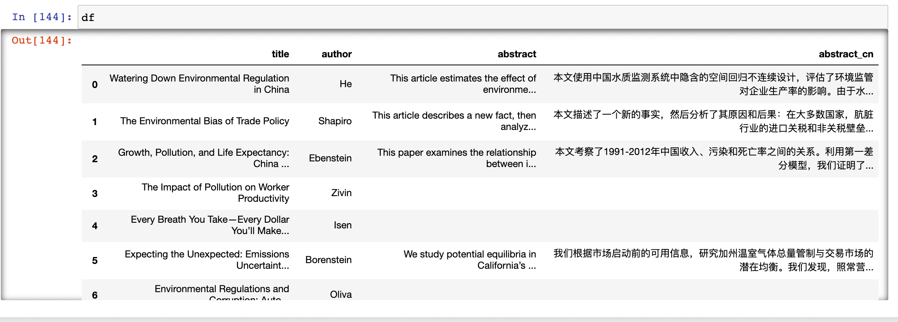

## 提出问题

获取到合作者或者他人分享的一大批英文文献，怎么快速的获取摘要，并翻译成中文？



## 分析问题

1. 文献入库：将文献导入进 Zotero，并获取元数据；
2. Zotero 和 Python 联动：使用 `pyzotero` 调用 Zotero API，获取英文文献摘要；
3. 百度翻译 API：Python 调用百度翻译 API 进行翻译。

关于用 Python 操作 Zotero ，可以阅读这篇文章：[Python|用 Pyzotero 库操作 Zotero](https://mp.weixin.qq.com/s/ncB5lgIR5TZlp-yNW3qy9w)；

关于调用百度翻译 API，可以阅读这篇文章：[Python|论文降重助手](https://mp.weixin.qq.com/s/TJmGeBPg8iC1YMRWFMxpvw)

这两篇推文对配置步骤 2 和步骤 3 进行了详细说明。


## 实现过程

### 需要用到的包

```
from pyzotero import zotero
import pandas as pd
import requests
import random
import json
from hashlib import md5
```

### 百度翻译API

```Python
# 百度翻译参数
appid = "2021..." #自己申请的 appid
appkey = "......" # 自己申请的 key

# 调用百度翻译 API
def make_md5(s, encoding='utf-8'):
    '''
    生成随机数和签名
    '''
    return md5(s.encode(encoding)).hexdigest()

def translate(query, from_lang, to_lang):
    '''
    调用百度翻译 API
    '''
    url = 'http://api.fanyi.baidu.com/api/trans/vip/translate'
    salt = random.randint(1, 65536) #随机数
    sign = make_md5(appid + query + str(salt) + appkey)

    # 构造请求
    headers = {'Content-Type': 'application/x-www-form-urlencoded'}
    payload = {'appid': appid,
               'q': query,
               'from': from_lang,
               'to': to_lang,
               'salt': salt,
               'sign': sign
              }
    r = requests.post(url, params=payload, headers=headers)
    text = r.json()
    result = text['trans_result'][0]['dst']
    return result
```

### Zotero 获取摘要

```Python
# Zotero账户
library_id = '' # https://www.zotero.org/settings/keys
library_type = 'user' # 'user' or 'group'
api_key = '' #  not be accessible again after created.

zot = zotero.Zotero(library_id, library_type, api_key)
colls = zot.collections() # 所有集合名称

# 查找待分析的集合
for coll in colls:
    if coll['data']['name'] == 'Environment':
        print(coll)
        
pyz = zot.collection_items('9FLNCCHU') # 待分析集合的key
```

```Python
# 存储标题、摘要和作者
title = []
abstract = []
author = []   
for p in pyz:
    if p['data']['itemType'] == "journalArticle":
        title.append(p['data']['title'])
        abstract.append(p['data']['abstractNote'])
        author.append(p['data']['creators'][0]['lastName'])
```

```Python
# 摘要翻译成中文
abstract_cn = []
for ab in abstract:
    if ab != "":
        abstract_cn.append(translate(ab,"en","zh"))
    else:
        abstract_cn.append("")
```

```Python
# 写入DataFrame
paper_info = {
    "title": title,
    "author": author,
    "abstract": abstract,
    "abstract_cn":abstract_cn
}
df = pd.DataFrame(paper_info)

# 导出为Excel
df.to_excel("Environment_References_Abstract_CN.xlsx", index=None)
```

最终，大功告成：

